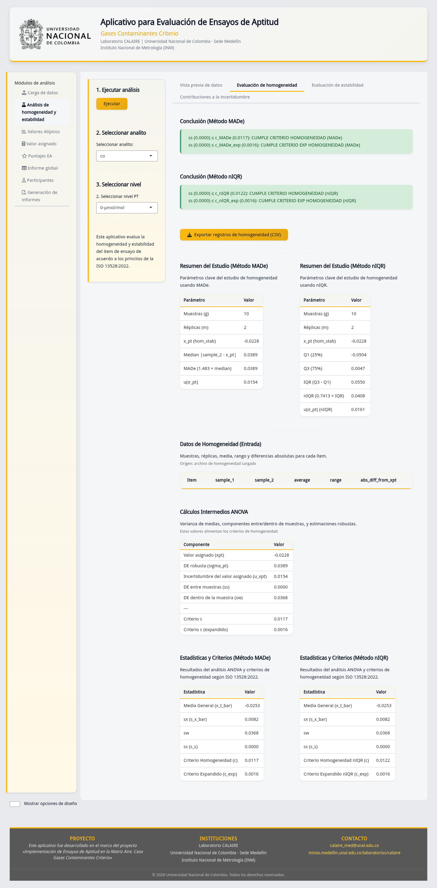

# Entregable 03 — Ejemplo reproducible de cálculos PT

| Campo | Valor |
|---|---|
| Código | E03 |
| Versión documental | 2.0 |
| Fecha | 2026-07-14 |
| Estado | Vigente contra `ptcalc` |
| Audiencia principal | Usuario que necesita comprender el resultado |
| Anexo técnico | Código reproducible incluido en este documento |
| Aprobación externa | Pendiente |

## Qué demuestra el ejemplo

El ejemplo recorre homogeneidad, estabilidad, estimadores robustos y valor
asignado con datos sintéticos sin información sensible. Las cifras se calculan
con el código vigente; no son transcripciones manuales de una versión anterior.
La unidad ilustrativa es `µmol/mol`, pero todas las entradas de una operación
real deben compartir la misma unidad.

## Datos de demostración

```r
devtools::load_all("ptcalc")

hom <- matrix(c(
  9.98, 10.02, 10.01, 10.03, 9.99, 10.00, 10.04, 10.02,
  9.97, 10.01, 10.00, 10.02, 10.03, 10.01, 9.98, 9.99,
  10.02, 10.00, 10.01, 10.04
), ncol = 2, byrow = TRUE)

stab <- matrix(c(
  10.00, 10.01, 10.02, 10.00,
  9.99, 10.01, 10.03, 10.02
), ncol = 2, byrow = TRUE)

participants <- c(9.91, 9.96, 9.99, 10.00, 10.02, 10.04, 10.08, 10.60)
```

Cada fila de `hom` o `stab` es un ítem y cada columna es una réplica. Antes de
usar datos reales se debe verificar que haya al menos dos ítems y dos réplicas.

## 1. Homogeneidad

```r
h <- calculate_homogeneity_stats(hom)
c_base <- calculate_homogeneity_criterion(h$MADe)
c_exp_sq <- calculate_homogeneity_criterion_expanded(
  sigma_pt = h$MADe,
  sw = h$sw,
  g = h$g
)
evaluation_h <- evaluate_homogeneity(h$ss, c_base, c_exp_sq)
```

| Magnitud | Resultado | Unidad | Lectura |
|---|---:|---|---|
| Media general | 10.008500 | `µmol/mol` | Centro de todos los resultados |
| `s_w` | 0.017748 | `µmol/mol` | Variación dentro de los ítems |
| `s_s` | 0.009037 | `µmol/mol` | Variación estimada entre ítems |
| MADe usado como `σ_pt` | 0.022245 | `µmol/mol` | Dispersión robusta para este ejemplo |
| Criterio básico `0.3 σ_pt` | 0.006674 | `µmol/mol` | Límite básico |
| Término expandido retornado | 0.000402 | `(µmol/mol)²` | Valor cuadrático calculado por tabla |

Aquí `s_s` supera tanto el criterio básico como el valor expandido retornado.
La conclusión no significa automáticamente que una ronda sea aceptada o
rechazada: el proveedor debe justificar el criterio aplicable y conservar los
datos y la decisión.

Nota técnica: con argumentos nombrados `sw` y `g`, la función de `ptcalc`
retorna el término cuadrático y la comparación vigente no aplica raíz. Además,
`app.R` llama actualmente la función con tres argumentos posicionales, pero la
firma de `ptcalc` tiene cuatro; esa ruta puede terminar con `Invalid arguments`.
Se registra como defecto pendiente porque mezcla unidades y puede impedir la
evaluación expandida. Este ejemplo reproduce el retorno comprobable de
`ptcalc`, no presenta ese defecto como una conclusión normativa válida.

## 2. Estabilidad

```r
s <- calculate_stability_stats(
  stab_sample_data = stab,
  hom_general_mean_homog = h$general_mean_homog,
  hom_stab_x_pt = h$x_pt,
  hom_stab_sigma_pt = h$MADe
)
c_stab <- calculate_stability_criterion(h$MADe)
evaluation_s <- evaluate_stability(s$diff_hom_stab, c_stab)
```

| Magnitud | Resultado (`µmol/mol`) |
|---|---:|
| Media de estabilidad | 10.010000 |
| Diferencia absoluta frente a homogeneidad | 0.001500 |
| Criterio `0.3 σ_pt` | 0.006674 |

Como `0.001500 ≤ 0.006674`, el conjunto ilustrativo cumple el criterio básico
de estabilidad implementado. La comparación usa valores sin redondear; el
redondeo de la tabla es solo de presentación.

## 3. Valor asignado y dispersión robusta

```r
median_x <- median(participants)
made <- calculate_mad_e(participants)
niqr <- calculate_niqr(participants)
algorithm_a <- run_algorithm_a(participants)
```

| Método | Valor asignado | Dispersión | Uso |
|---|---:|---:|---|
| Mediana + MADe | 10.010000 | 0.059320 | Resumen robusto simple |
| Mediana + nIQR | 10.010000 | 0.074130 | Alternativa robusta por cuartiles |
| Algoritmo A | 10.017017 | 0.079528 | Estimación iterativa winsorizada |

El Algoritmo A converge por estabilidad en tres cifras significativas y
winsoriza una observación. El valor de `10.60` no se borra: su influencia se
limita durante la iteración y queda registrada en `algorithm_a$weights`.

## 4. Incertidumbres que continúan hacia los puntajes

La app puede combinar la incertidumbre del valor asignado con contribuciones de
homogeneidad y estabilidad. `calculate_u_hom(ss)` toma `s_s`; y
`calculate_u_stab(diff_hom_stab, c_criterion)` devuelve cero cuando la diferencia
no rebasa el criterio; si lo rebasa, devuelve `diff_hom_stab / sqrt(3)`. La
elección completa del método y de las contribuciones debe quedar registrada
antes de calcular E04.

## Cómo interpretar y reproducir

1. Ejecute el código desde la raíz con `devtools::load_all("ptcalc")`.
2. Compare con precisión completa (`all.equal` o tolerancia explícita).
3. Redondee únicamente al presentar y conserve la unidad en cada tabla.
4. Si una entrada es insuficiente o un denominador no es válido, no fuerce un
   número: las funciones retornan un error estructurado o `NA` según el caso.

## Evidencia y referencias



**Figura CAP-05.** Resultado en la interfaz vigente. CAP-06 a CAP-11 documentan
estabilidad, incertidumbre, atípicos, Algoritmo A, consenso y compatibilidad;
véase `../../00_evidencia_visual/indice_capturas.md`.

- Código: `ptcalc/R/pt_homogeneity.R` y `ptcalc/R/pt_robust_stats.R`.
- Estado exacto del repositorio anidado usado para calcular:
  `../../00_linea_base/estado_ptcalc_fase4.md`.
- Prueba documental: `tests/testthat/test-entregables-fase-4.R`.
- Referencia declarada por el código: ISO 13528:2022, secciones 9.2–9.4 y anexo C.
- Este documento evidencia coincidencia con la implementación; no sustituye una
  revisión normativa independiente ni certifica conformidad por sí solo.

## Historial de cambios

| Versión | Fecha | Cambio |
|---|---|---|
| 1.0 | 2026-01-24 | Ejemplo inicial |
| 2.0 | 2026-07-14 | Datos sintéticos reproducibles, código vigente, precisión y límites explícitos |
