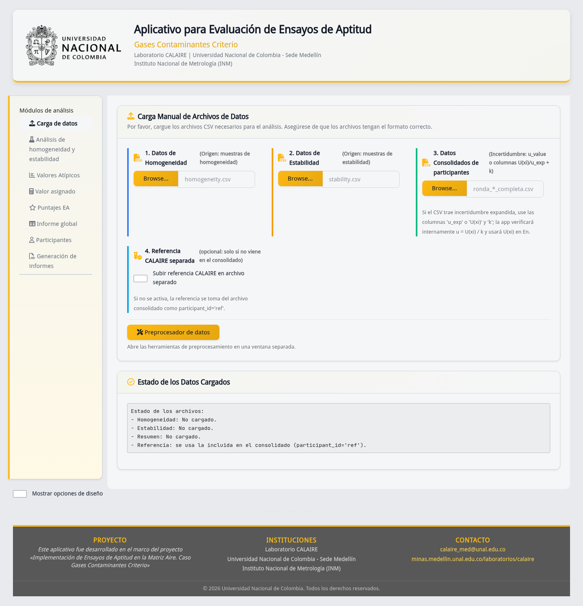
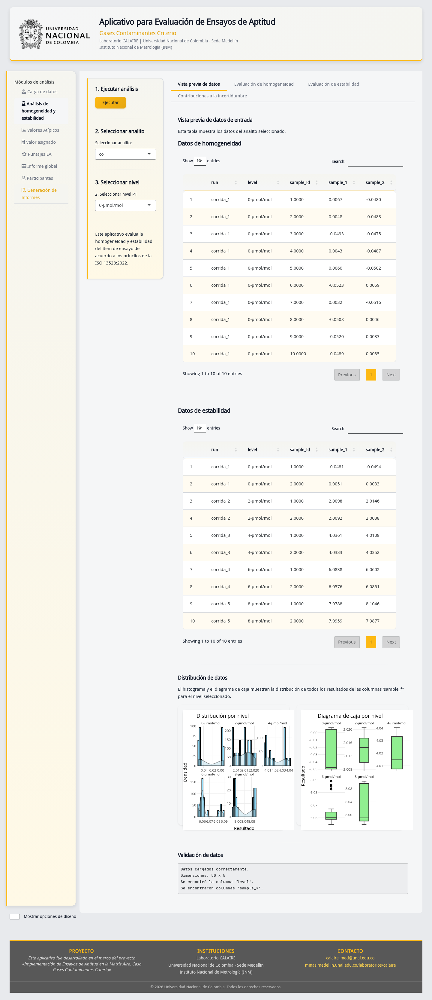
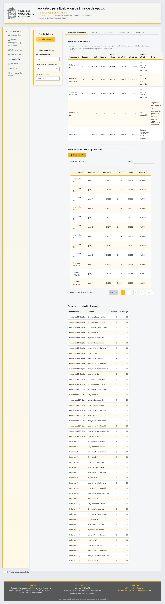
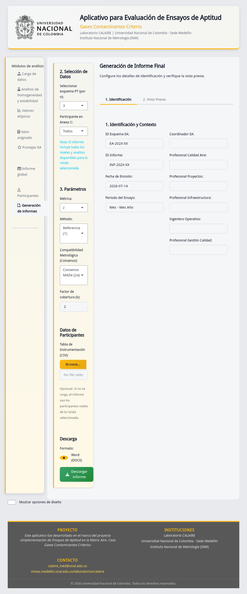

# Ficha de control documental

| Campo | Valor |
|---|---|
| Código | DOC-E05-USR-01 |
| Fuente controlada | `05_prototipo_ui/md/wireframes.md` |
| Autoridad funcional | `app.R` del repositorio raíz |
| Derivados | `05_prototipo_ui/wireframes.docx` y `html/recorrido_interfaz.html` |
| Elaboración | Equipo documental |
| Revisión técnica | Completada; aprobación contractual pendiente |

# Resumen y ruta rápida

La aplicación organiza el trabajo en ocho módulos laterales. La ruta mínima es:
cargar tres grupos de CSV, ejecutar homogeneidad y estabilidad, revisar valores
atípicos, calcular el valor asignado, calcular puntajes y consultar o descargar
resultados. La interfaz no reemplaza la revisión metrológica del responsable.

# Mapa de navegación vigente

| Orden | Módulo | Acción principal | Resultado observable |
|---:|---|---|---|
| 1 | Carga de datos | Cargar homogeneidad, estabilidad y consolidados | Estado de los datos |
| 2 | Análisis de homogeneidad y estabilidad | Elegir analito/nivel y ejecutar | Conclusiones, tablas e incertidumbres |
| 3 | Valores atípicos | Elegir contaminante y nivel | Resumen Grubbs, histograma y caja |
| 4 | Valor asignado | Ejecutar Algoritmo A, consenso o compatibilidad | Tablas, iteraciones y comparación |
| 5 | Puntajes EA | Elegir esquema y calcular | z, z', zeta, En y clasificaciones |
| 6 | Informe global | Seleccionar combinación | Tablas y mapas de calor por método |
| 7 | Participantes | Elegir analito y nivel | Resumen individual |
| 8 | Generación de informes | Identificar ronda y participante | Vista previa y DOCX descargable |

**Figura CAP-01.** Observe los tres grupos obligatorios, la referencia CALAIRE
opcional y el acceso al preprocesador. El cuarto archivo que describía el
prototipo de 2026-01-24 ya no corresponde a la carga vigente.

**Figura CAP-04.** El panel izquierdo concentra ejecución y selectores; las
subpestañas derechas separan vista previa, homogeneidad, estabilidad e
incertidumbres.

**Figura CAP-12.** Antes de interpretar una clasificación, confirme analito,
esquema, nivel, método y parámetros mostrados en el resumen.

**Figura CAP-19.** La navegación y acciones críticas permanecen disponibles en
una resolución menor; puede ser necesario desplazarse verticalmente.

# Del prototipo al aplicativo vigente

`html/prototipo.html`, `mmd/diagrama_navegacion.mmd`, `app_v06.R`, `app_v07.R`
y `app_final.R` se conservan como antecedentes. No deben usarse para afirmar el
comportamiento actual. El prototipo proponía datos precargados, varios métodos
de atípicos, exportación a PDF/PowerPoint y comparación histórica; esas
acciones no forman parte de la navegación vigente salvo que `app.R` las muestre
expresamente. La autoridad funcional es `app.R` y el núcleo `ptcalc/` que carga.

# Accesibilidad y uso

- Los controles tienen etiquetas visibles y las tablas permiten búsqueda y
  paginación. El color complementa texto y valores, pero no debe ser el único
  criterio de interpretación.
- Use una pantalla de al menos 1024×768 y zoom del navegador al 100 %.
- Espere a que termine cada cálculo antes de cambiar de módulo.
- Si una tabla oculta emite el diagnóstico técnico DT `adjustWidth`, cambie de
  pestaña o redimensione la ventana; no se ha observado cambio en los cálculos.

# Evidencia y trazabilidad

Las CAP-01 a CAP-19 se generaron con datos no sensibles y Playwright. Acción,
viewport, commit y SHA-256 están en
`../../00_evidencia_visual/indice_capturas.md`. Este documento demuestra la
interfaz observada; no certifica conformidad normativa ni aprobación contractual.

# Historial de cambios

| Versión | Fecha | Cambio | Aprobación |
|---|---|---|---|
| 1.0 | 2026-01-24 | Wireframe conceptual | Histórico |
| 2.0 | 2026-07-14 | Recorrido contrastado con `app.R` y capturas | Pendiente |
