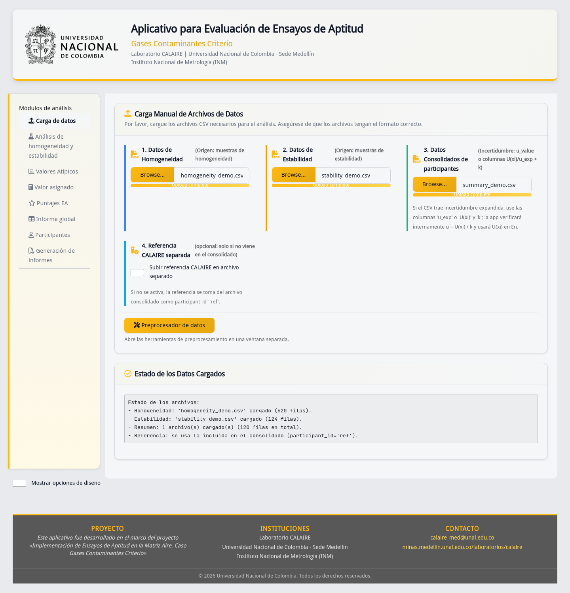

# Ficha de control documental

| Campo | Valor |
|---|---|
| Código | DOC-E06-USR-01 |
| Fuente controlada | `06_app_logica/md/manual_usuario.md` |
| Autoridad funcional | `app.R`; cálculos en `ptcalc/` |
| Derivado | `06_app_logica/manual_usuario.docx` |
| Revisión técnica | Completada; aprobación contractual pendiente |

# Antes de empezar

Este manual permite completar una ronda sin conocer R. Necesita CSV de
homogeneidad, estabilidad y uno o más consolidados de participantes. La
referencia CALAIRE puede venir como fila `participant_id='ref'` del consolidado
o en un archivo separado. Conserve una copia inalterada de los originales y no
incluya información personal innecesaria.

## Preparación de archivos

- CSV de homogeneidad y estabilidad: deben contener analito, nivel y columnas
  de réplicas `sample_*` compatibles con el aplicativo.
- Consolidado: debe identificar participante, analito, nivel, esquema y
  resultado. Para zeta se requiere incertidumbre estándar `u_value`; para En,
  incertidumbre expandida `u_exp` o `U(xi)` y factor `k`.
- Use punto decimal y encabezados sin alterar. El preprocesador puede generar
  los archivos cuando se parte de datos crudos.

# Procedimiento completo

1. Ejecute `Rscript app.R` desde la raíz o solicite al administrador la URL.
2. En **Carga de datos**, seleccione los tres grupos de CSV. Active la referencia
   separada solo si no viene en el consolidado. El estado debe confirmar carga
   válida (CAP-02).
3. Si parte de crudos, abra **Preprocesador de datos**, configure fuentes,
   guarde crudos, ejecute y exporte referencia/participantes (CAP-03). Revise los
   archivos antes de volver a cargarlos.
4. En **Análisis de Homogeneidad y estabilidad**, pulse **Ejecutar**, elija
   analito y nivel, y revise vista previa/validación. Lea por separado las
   conclusiones MADe y nIQR (CAP-05 y CAP-06) y las contribuciones `u_hom` y
   `u_stab` (CAP-07). Exporte los registros si necesita evidencia.
5. En **Valores Atípicos**, seleccione combinación y examine Grubbs, histograma
   y caja (CAP-08). Una señal amerita revisión; no autoriza borrar un resultado
   automáticamente.
6. En **Valor asignado**, seleccione analito, esquema y nivel. Ejecute el método
   requerido: Algoritmo A (CAP-09), consenso (CAP-10) o compatibilidad (CAP-11).
   Confirme convergencia y cantidad de datos antes de usar el resultado.
7. En **Puntajes EA**, pulse **Calcular puntajes**. Confirme parámetros y método,
   después lea resumen y pestañas z, z', zeta y En (CAP-12 a CAP-14). `N/A`
   indica que faltó un denominador válido o una incertidumbre necesaria.
8. En **Informe global**, elija la combinación y compare métodos en tablas y
   mapas de calor (CAP-15). No compare magnitudes de analitos/unidades distintas
   como si fueran equivalentes.
9. En **Participantes**, filtre analito y nivel para revisar el detalle individual
   (CAP-16). Verifique siempre el identificador antes de comunicar resultados.
10. En **Generación de informes**, seleccione ronda/participante, método,
    métrica, compatibilidad y `k`; complete identificación, genere vista previa y
    descargue DOCX (CAP-17). Abra el archivo y revise contenido antes de emitirlo.

**Figura CAP-02.** No continúe hasta que los tres grupos aparezcan cargados y
la referencia corresponda a la modalidad elegida.

**Figura CAP-15.** Los colores resumen desempeño; confirme el valor numérico,
método y métrica antes de concluir.

**Figura CAP-17.** Complete identificación y parámetros; la descarga disponible
es Word (DOCX).

# Interpretación mínima

| Resultado | Lectura | Acción |
|---|---|---|
| Homogéneo/estable | Cumple el criterio implementado para esa combinación | Registrar método y evidencia |
| Atípico Grubbs | Resultado estadísticamente señalado | Investigar; no excluir sin regla aprobada |
| z, z', zeta con `|puntaje| ≤ 2` | Satisfactorio | Conservar trazabilidad |
| `2 < |puntaje| < 3` | Cuestionable | Revisar método y datos |
| `|puntaje| ≥ 3` | No satisfactorio | Investigar y documentar acción |
| En con `|En| ≤ 1` | Satisfactorio | Confirmar incertidumbres y `k` |
| `N/A` | No calculable con entradas actuales | Corregir datos; no tratar como cero |

# Problemas frecuentes

| Situación | Causa probable | Acción recomendada |
|---|---|---|
| Error al cargar (CAP-18) | CSV vacío, columnas o tipos incompatibles | Comparar con datos demo y corregir origen |
| No aparecen selectores | Falta un archivo o combinación común | Revisar estado y claves analito/nivel/esquema |
| zeta o En es `N/A` | Incertidumbre o `k` ausente/no válido | Completar `u_value`, `u_exp`/`U(xi)` y `k` |
| Informe no se habilita | Puntajes no calculados o parámetros incompletos | Ejecutar puntajes y completar identificación |
| Tabla se ajusta mal | Diagnóstico DT en pestaña oculta | Mostrar pestaña o redimensionar; revalidar tabla |

# Alcance y trazabilidad

Los cálculos se ejecutan con `app.R` y `ptcalc/`; `app_v06.R` es histórico. Las
capturas y sus hashes están en `../../00_evidencia_visual/indice_capturas.md`.
La aplicación apoya la evaluación, pero no sustituye aprobación técnica,
control de datos ni revisión normativa. Fórmulas detalladas: E03 y E04.

# Historial de cambios

| Versión | Fecha | Cambio | Aprobación |
|---|---|---|---|
| 1.0 | 2026-01-24 | Manual de `app_v06.R` | Histórico |
| 2.0 | 2026-07-14 | Flujo ciudadano completo de `app.R` | Pendiente |
