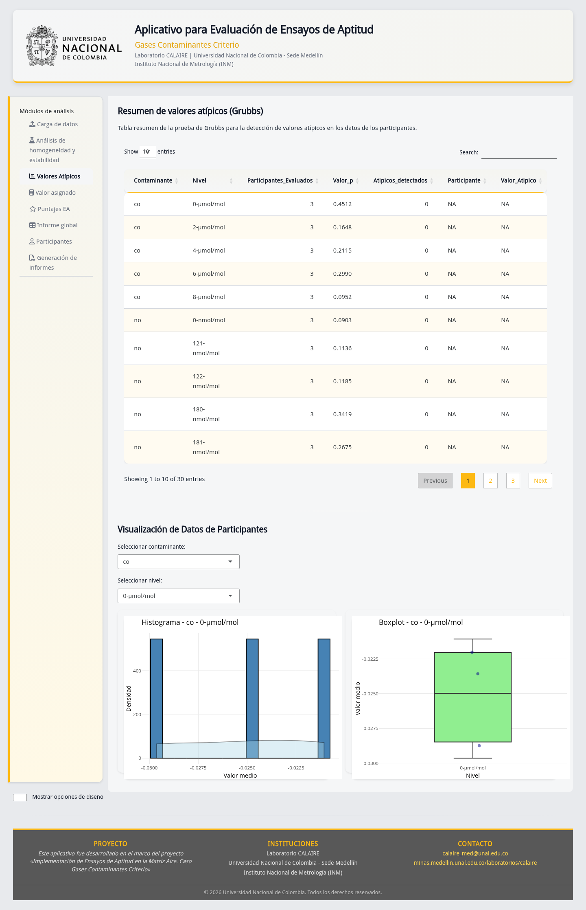
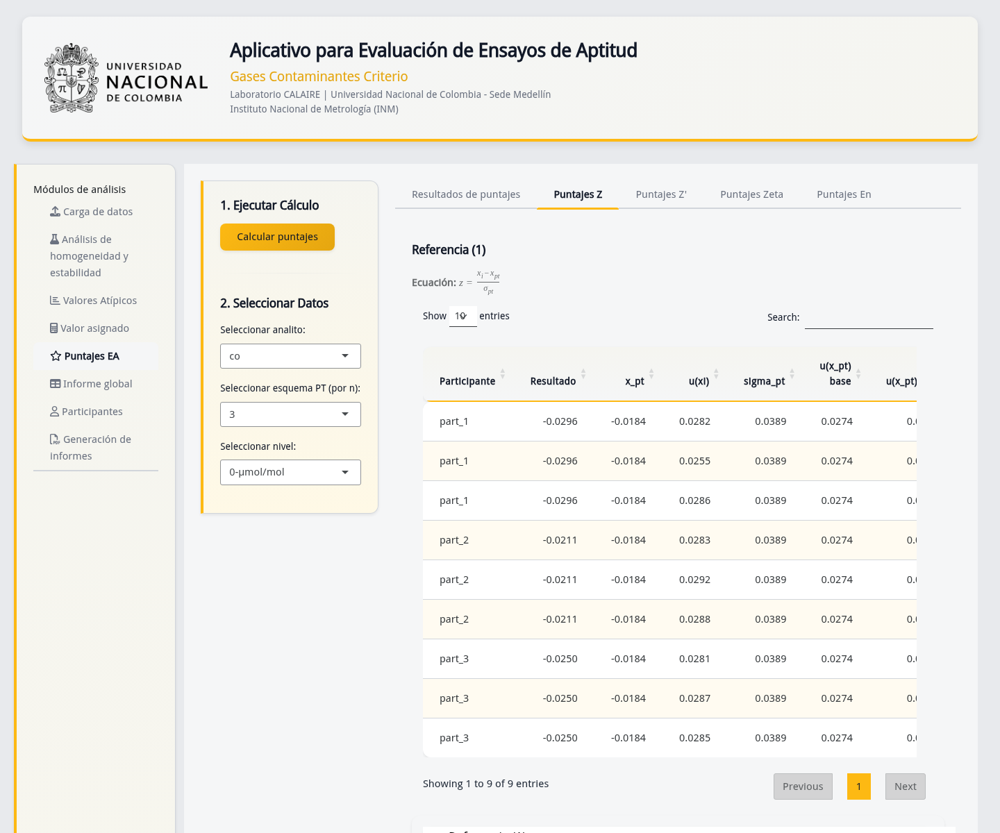

# Ficha de control documental

| Campo | Valor |
|---|---|
| Código | DOC-E07-USR-01 |
| Fuente controlada | `07_dashboards/md/documentacion_dashboards.md` |
| Autoridad funcional | `app.R` |
| Derivado | `07_dashboards/documentacion_dashboards.docx` |
| Revisión técnica | Completada; aprobación contractual pendiente |

# Cómo leer un tablero

Primero confirme analito, nivel, esquema, método y métrica. Después lea el valor
numérico y finalmente el color o clasificación. Una tabla puede ordenarse,
filtrarse o paginarse; una gráfica Plotly permite mostrar valores al pasar el
cursor. Un filtro cambia la vista, no los datos originales.

# Vistas vigentes

| Vista | Qué muestra | Qué comprobar | Advertencia |
|---|---|---|---|
| Homogeneidad | Conclusiones MADe/nIQR, ANOVA y datos | `ss`, `sw`, criterio, unidades | No generalizar a otros niveles |
| Estabilidad | Diferencias, criterios y datos | Fecha/grupo y signo/magnitud | Diferencia pequeña no prueba estabilidad por sí sola |
| Incertidumbre H/E | `u_hom`, `Dmax`, `u_stab` | Misma unidad que el mensurando | No confundir estándar y expandida |
| Atípicos | Grubbs, histograma y caja | Identidad y valor señalado | Señal no equivale a exclusión automática |
| Algoritmo A | Entrada, histograma, iteraciones y winsorización | Convergencia y número de resultados | Winsorizar no modifica el archivo fuente |
| Consenso/compatibilidad | Valor asignado y diferencias con referencia | Método 2a/2b/3/4 e incertidumbre | Métodos distintos no son intercambiables |
| Puntajes | Parámetros, tabla, conteos y gráficos | Fórmula, denominador y fronteras | `N/A` no es satisfactorio ni cero |
| Informe global | Resultados y mapas de calor por método | Leyenda, métrica y participante | El color es un resumen, lea el valor |
| Participantes | Detalle individual por combinación | Identificador correcto | Evite divulgar otros participantes |

**Figura CAP-05.** Compare la conclusión con las estadísticas y el criterio del
mismo método; no mezcle columnas MADe y nIQR.

**Figura CAP-08.** Use tabla y gráficos como señal para investigación. Preserve
el dato original y documente cualquier decisión posterior.

**Figura CAP-13.** Las líneas/fronteras apoyan la clasificación; los valores en
los límites se evalúan según E04.

**Figura CAP-15.** Seleccione una combinación y método antes de comparar filas o
participantes. Los mapas de calor no sustituyen la tabla descargable.

# Uso responsable

- Registre filtros y método cuando exporte o tome una decisión.
- No compare puntajes de métodos o incertidumbres diferentes sin explicitarlo.
- Revise `N/A`, celdas vacías y tamaños de muestra antes de calcular porcentajes.
- Confirme que las unidades sean homogéneas y no use el color como única prueba.
- En las vistas que ofrecen descarga, exporte el CSV cuando se requiera una
  evidencia numérica auditable; en las demás, registre filtros y conserve el
  informe autorizado.

# Evidencia y límites

CAP-05, 06, 08 y 10 a 16 demuestran las vistas con datos demo. Metadatos y
SHA-256: `../../00_evidencia_visual/indice_capturas.md`. `app_v07.R` y el
diagrama original son antecedentes, no autoridad. Esta guía explica lectura;
no declara validación normativa ni aprobación de resultados.

# Historial de cambios

| Versión | Fecha | Cambio | Aprobación |
|---|---|---|---|
| 0.1 | 2026-07-14 | Enlace provisional de evidencia | Reemplazado |
| 1.0 | 2026-07-14 | Guía narrativa completa de vistas vigentes | Pendiente |
