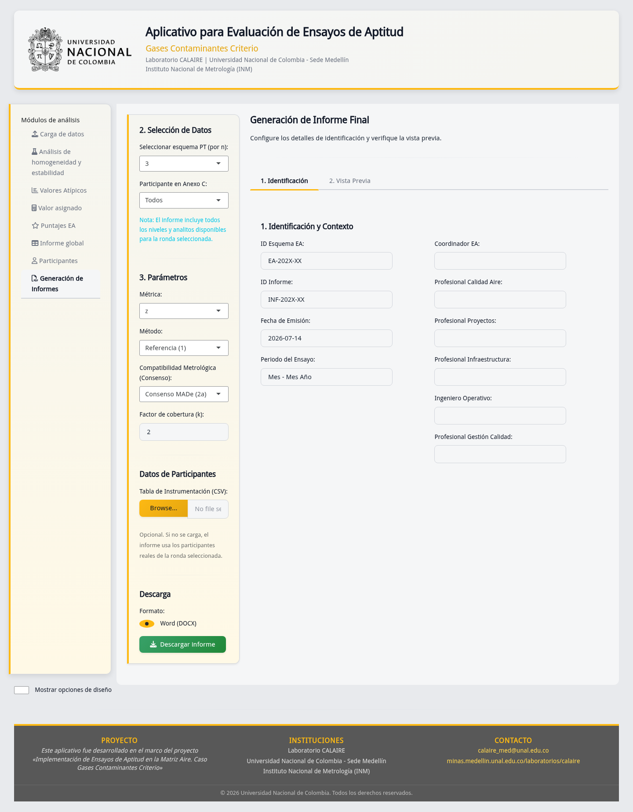

# Ficha de control documental

| Campo | Valor |
|---|---|
| Código | DOC-E08-TEC-01 |
| Fuente controlada | `08_beta/md/manual_desarrollador.md` |
| Autoridad funcional | `/app.R`, `/R`, `/ptcalc`, `/reports`, `/www` |
| Derivado | `08_beta/manual_desarrollador.docx` |
| Revisión técnica | Completada; aprobación contractual pendiente |

# Resumen operativo

La versión vigente se ejecuta desde la raíz del repositorio. `app_final.R` y
`R/funciones_finales.R` dentro de E08 son copias históricas conservadas como
antecedente y no deben desplegarse como versión actual.

# Arquitectura y dependencias

| Capa | Ubicación | Responsabilidad |
|---|---|---|
| Interfaz/orquestación | `app.R` | UI Shiny, reactivos, validación, descargas |
| Ayudantes | `R/` | Funciones auxiliares conscientes de la app |
| Cálculo puro | `ptcalc/R/` | Homogeneidad, robustos y puntajes sin Shiny |
| Informes | `reports/` | Plantillas R Markdown y recursos |
| Presentación | `www/` | CSS e imágenes |
| Datos | `data/` o carga del usuario | CSV de entrada/demostración |

R carga `shiny`, `tidyverse`, `vroom`, `DT`, `rhandsontable`, `shinythemes`,
`outliers`, `patchwork`, `bsplus`, `plotly`, `rmarkdown` y `bslib`. Para
desarrollo use `devtools::load_all("ptcalc")`. El repositorio no contiene un
lockfile R que congele todas las versiones; registre `sessionInfo()` en cada
despliegue. `ptcalc/` es un repositorio anidado y su commit/cambios deben
registrarse por separado del commit raíz.

# Instalación y ejecución

```r
install.packages(c(
  "shiny", "tidyverse", "vroom", "DT", "rhandsontable",
  "shinythemes", "outliers", "patchwork", "bsplus", "plotly",
  "rmarkdown", "bslib", "devtools"
))
devtools::load_all("ptcalc")
shiny::runApp()
```

Desde terminal, en la raíz: `Rscript app.R`. No ejecute desde E08. Verifique
que la consola anuncie una URL local, abra CAP-01, cargue datos demo y complete
el humo CAP-02 → CAP-05 → CAP-12 → CAP-17.

# Despliegue y configuración

1. Fije el commit raíz y el estado/commit real de `ptcalc`.
2. Instale dependencias en un usuario sin privilegios y registre R, SO y
   `sessionInfo()`; no asuma versiones mínimas no comprobadas.
3. Configure directorios temporales y permisos de escritura para R Markdown.
4. Publique detrás de HTTPS y control de acceso cuando existan datos reales.
5. Limite tamaño de carga, tiempo de sesión y recursos en la plataforma.
6. Ejecute pruebas y recorrido visual antes de promover a producción.

El repositorio contiene metadatos `rsconnect/`, pero credenciales, URL y
política del servidor no forman parte del paquete documental. Deben gestionarse
fuera de Git mediante secretos de la plataforma.

# Seguridad y datos

- Trate CSV, informes y temporales como información potencialmente reservada.
- No registre datos de participantes, nombres, rutas locales ni secretos en logs.
- Valide extensión, columnas y tipos; la extensión `.csv` no garantiza contenido
  seguro o correcto.
- Use identificadores seudonimizados, mínimo privilegio, HTTPS, expiración de
  sesiones y limpieza periódica de temporales.
- Haga copia de seguridad de fuentes y configuración, no de sesiones efímeras.

# Mantenimiento, respaldo y recuperación

Antes de actualizar: etiquete commits raíz/`ptcalc`, copie configuración externa,
ejecute tests y conserve el artefacto anterior. Después: reinicie proceso,
revise consola, cargue datos demo, calcule y descargue un informe. Para volver
atrás, restaure ambos commits y dependencias registradas; no mezcle un `app.R`
nuevo con un `ptcalc` histórico.

```bash
Rscript -e 'testthat::test_dir("tests/testthat")'
npm ci
scripts/documentacion/ejecutar_capturas.sh
```

# Diagnóstico

| Síntoma | Comprobación | Recuperación |
|---|---|---|
| App no inicia | Consola, paquetes y directorio actual | Instalar faltantes; ejecutar desde raíz |
| Carga rechazada (CAP-18) | Encabezados, tipos, separador, tamaño | Corregir copia; preservar original |
| Selector vacío | Intersección analito/nivel/esquema | Corregir claves o cargar conjunto completo |
| Puntaje `N/A` | Denominadores, incertidumbre y `k` | Completar entrada válida; no imputar cero |
| Informe falla | Pandoc, plantilla, permisos y temporales | Corregir dependencia/permisos y repetir |
| DT `adjustWidth` | Ocurre al redimensionar tabla oculta | Reabrir pestaña; diagnóstico residual conocido |

# Límites y riesgos conocidos

- No hay `renv.lock`; la reproducción total de dependencias R queda pendiente.
- El estado `ptcalc` puede no quedar representado por el commit raíz.
- La ruta expandida de homogeneidad conserva un defecto documentado en E03; no
  certificar esa variante hasta corregirla y validarla.
- La evidencia Playwright acepta únicamente un 404 de favicon y el diagnóstico
  DT señalado; cualquier otro error debe investigarse.
- La revisión normativa y aprobación contractual son externas y pendientes.



**Figura CAP-17.** Prueba operativa final: selección, vista previa y descarga
DOCX. CAP-02, CAP-18 y CAP-19 complementan carga, error y resolución menor.

# Evidencia y trazabilidad

Índice visual: `../../00_evidencia_visual/indice_capturas.md`. Línea base y
estado anidado: `../../00_linea_base/linea_base_version.md` y
`../../00_linea_base/estado_ptcalc_fase4.md`. Este manual describe operación;
no convierte una prueba de humo en certificación normativa.

# Historial de cambios

| Versión | Fecha | Cambio | Aprobación |
|---|---|---|---|
| 1.0 | 2026-01-24 | Manual de copia `app_final.R` | Histórico |
| 2.0 | 2026-07-14 | Arquitectura, despliegue, seguridad y recuperación vigentes | Pendiente |
