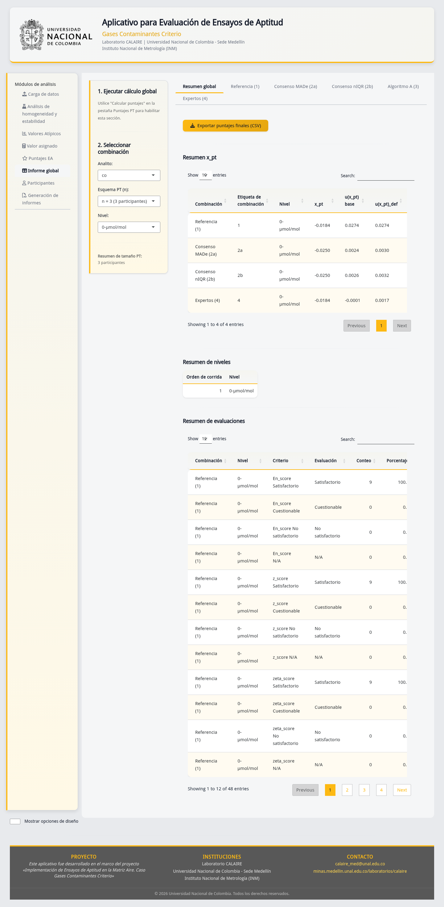

# Entregable 09 — Informe final de validación

## Resumen para decisión

Se reejecutaron 12 casos deterministas sobre el núcleo `ptcalc` que está en el
workspace: 11 aprobaron y uno quedó como riesgo técnico abierto. Las pruebas
confirman, dentro del alcance descrito, cálculos reproducibles de homogeneidad,
estabilidad, nIQR, MADe, Algoritmo A y puntajes z, z', zeta y En. No demuestran
por sí solas la competencia de un proveedor, la conformidad integral con una
norma ni la aceptación contractual del aplicativo.

El riesgo abierto está en el criterio expandido de homogeneidad: la función
retorna una magnitud cuadrática y la ruta vigente de la aplicación la invoca con
argumentos posicionales incompatibles; la prueba reproduce `Invalid arguments`.
El criterio básico sí fue ejecutado y
verificado. Hasta corregir y validar ese defecto, no debe usarse la salida
expandida para una decisión operativa.

## Control documental

| Campo | Valor |
|---|---|
| Versión evaluada | Commit y estado raíz registrados en `anexos/entorno_ejecucion.txt` |
| Núcleo estadístico | Commit, estado, diff binario y hashes de fuentes registrados en anexos |
| Datos | Sintéticos, deterministas y sin información sensible |
| Fecha de ejecución | 2026-07-14 |
| Resultado | 11 PASS; 1 OPEN_RISK |
| Aprobación externa/contractual | Pendiente |

## 1. Alcance y exclusiones

### Incluido

- Funciones cargadas con `devtools::load_all("ptcalc")` para homogeneidad,
  estabilidad, estadísticos robustos y puntajes.
- Casos numéricos con precisión completa, fronteras de clasificación y
  denominadores inválidos.
- Reproducibilidad de anexos, integridad de derivados y trazabilidad a código,
  pruebas, capturas y entorno.
- Evidencia visual del flujo vigente generada en la Fase 3.

### No incluido

- Certificación, acreditación o auditoría de competencia del proveedor.
- Revisión cláusula por cláusula de textos normativos licenciados.
- Aprobación contractual, porque no se encontró contrato, TDR ni acta primaria
  en el workspace.
- Seguridad ofensiva, carga, accesibilidad formal o validación en todos los
  sistemas operativos y navegadores.
- Corrección del defecto del criterio expandido o publicación del repositorio
  anidado `ptcalc`; ambos se registran como riesgos, no como resultados válidos.

## 2. Método y criterio de aceptación

El generador `R/genera_anexos.R` carga el código de desarrollo vigente, crea un
conjunto sintético fijo y escribe resultados, iteraciones, matriz y entorno. La
prueba `tests/test_09_reproducibilidad.R` compara valores esperados con
tolerancias explícitas, verifica fronteras, entradas inválidas y artefactos.

Los valores esperados están congelados en la prueba focal y se comparan con
tolerancias explícitas; no se acepta únicamente que una salida sea finita. Un
caso es `PASS` cuando el resultado coincide con el esperado y existe
evidencia reproducible. `OPEN_RISK` significa que la función o integración no
es apta todavía para sustentar la afirmación evaluada. El redondeo se aplica
solo en este informe; los CSV conservan la precisión de R.

## 3. Resultados consolidados

| Grupo | Casos | Resultado | Evidencia principal |
|---|---:|---|---|
| Homogeneidad y estabilidad básicas | 2 | PASS | `anexos/calculos_reproducibles.csv` |
| nIQR, MADe y Algoritmo A | 3 | PASS | CSV de cálculos e iteraciones |
| z, z', zeta y En | 4 | PASS | CSV y prueba focal |
| Fronteras e inválidos | 2 | PASS | Prueba focal E09 |
| Criterio expandido de homogeneidad | 1 | OPEN_RISK | Código vigente y defecto documentado en E03 |

La matriz completa está en `anexos/matriz_validacion.csv`. Cada fila contiene
capacidad, resultado esperado, resultado obtenido, evidencia, estado y
responsable. El log de ejecución y las versiones del entorno están en
`anexos/generacion_log.txt` y `anexos/entorno_ejecucion.txt`.



**Figura CAP-15.** Vista del informe global dentro del recorrido funcional. La
captura demuestra presentación e interacción, no exactitud matemática aislada;
esta última se sustenta con los CSV y pruebas.

## 4. Desviaciones y riesgos residuales

| ID | Riesgo | Impacto | Tratamiento |
|---|---|---|---|
| R-E09-01 | Criterio expandido mezcla firma posicional y unidad cuadrática | La rama vigente produce `Invalid arguments` y no sustenta una decisión expandida | No usar; corregir código y añadir prueba dimensional |
| R-E09-02 | `ptcalc` es un repositorio anidado con cambios locales | El commit raíz no reproduce por sí solo el núcleo | Publicar/fijar el commit y conservar el estado registrado |
| R-E09-03 | No hay contrato/TDR/acta primaria | No se puede declarar cobertura contractual completa | Obtener fuente y ejecutar auditoría de Fase 7 |
| R-E09-04 | No existe lockfile R | El entorno puede variar entre instalaciones | Crear `renv.lock` probado antes de producción |
| R-E09-05 | Deuda visual de ajuste de DataTables | Tablas ocultas pueden requerir reajuste al mostrarse | Corregir y repetir prueba visual |

## 5. Referencias normativas controladas

- ISO 13528:2022, *Statistical methods for use in proficiency testing by
  interlaboratory comparison*, tercera edición, publicada en agosto de 2022.
- ISO/IEC 17043:2023, *Conformity assessment — General requirements for the
  competence of proficiency testing providers*, segunda edición, publicada en
  mayo de 2023.

Las ediciones, URLs y estados se verificaron el 2026-07-14 en el catálogo
oficial de ISO y quedaron registrados en
`anexos/referencias_normativas.md`. Hay una enmienda a ISO 13528:2022 en proceso de publicación; no se declara
incorporada a esta validación. Las normas completas son documentos protegidos y
su revisión de cláusulas requiere acceso autorizado. Las referencias internas
del código no sustituyen esa revisión independiente.

## 6. Conclusión limitada

La evidencia ejecutada sustenta que las capacidades enumeradas con estado
`PASS` son deterministas y coinciden, dentro de tolerancias explícitas, con los valores esperados del conjunto de
prueba. E09 queda apto para revisión técnica, con un riesgo abierto que impide
afirmar validación completa del criterio expandido. La aprobación normativa y
contractual permanece pendiente y debe resolverse en la auditoría de Fase 7.

## Reproducción

Desde la raíz del proyecto:

```bash
scripts/documentacion/generar_entregables_fase_6.sh
Rscript -e 'testthat::test_file("tests/testthat/test-entregables-fase-6.R")'
```

## Historial de cambios

| Versión | Fecha | Cambio |
|---|---|---|
| 1.0 | 2026-01-24 | Informe inicial |
| 2.0 | 2026-03-13 | Revisión histórica y Algoritmo A |
| 3.0 | 2026-07-14 | Alcance limitado, evidencia reejecutada, matriz y riesgos explícitos |
