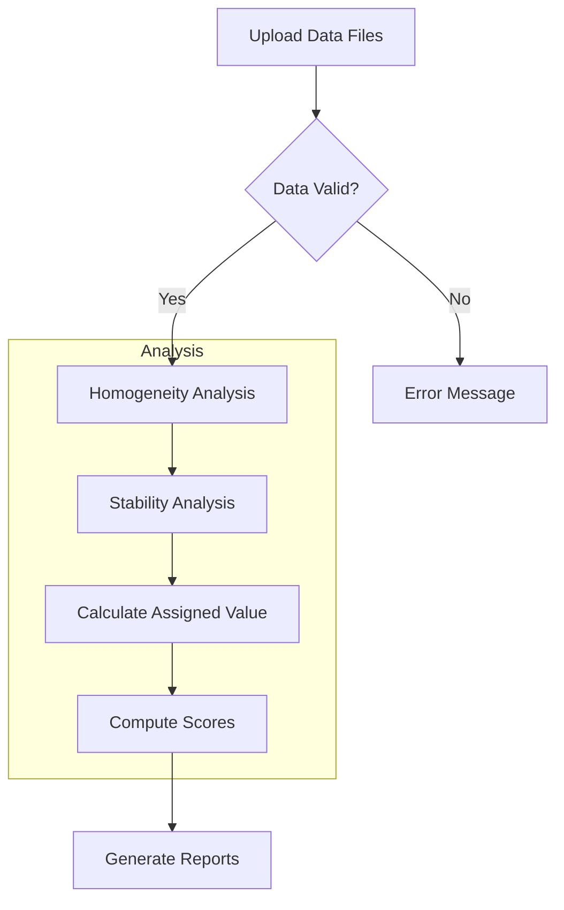

# Quick Start Guide: Proficiency Testing Application

## Overview

This application implements proficiency testing (PT) analysis for criterion pollutant gases following ISO 17043:2024 and ISO 13528:2022 standards. Developed by Laboratorio CALAIRE (Universidad Nacional de Colombia) in partnership with the Instituto Nacional de Metrologia (INM).

---

## System Requirements

### R Version
- **Minimum:** R 4.1.0
- **Recommended:** R 4.3.0 or later

### Required Packages

| Package | Purpose |
|---------|---------|
| shiny | Web framework |
| bslib | Bootstrap 5 theming |
| tidyverse | Data manipulation |
| vroom | Fast CSV reading |
| DT | Interactive tables |
| rhandsontable | Editable tables |
| plotly | Interactive plots |
| ggplot2 | Static plots |
| patchwork | Plot composition |
| outliers | Grubbs test |
| rmarkdown | Report generation |
| devtools | Package development |

### Installation

```r
# Install required packages
install.packages(c(
  "shiny", "bslib", "tidyverse", "vroom", "DT", 
  "rhandsontable", "plotly", "ggplot2", "patchwork",
  "outliers", "rmarkdown", "devtools", "shinythemes", "bsplus"
))
```

---

## Launching the Application

### Step 1: Set Working Directory

```r
setwd("/path/to/pt_app")
```

### Step 2: Run the Application

```r
shiny::runApp("cloned_app.R")
```

The application will open in your default web browser at `http://127.0.0.1:XXXX`.

---

## Your First Analysis in 5 Minutes

### Step 1: Prepare Your Data Files

The application requires three types of CSV files:

#### 1. Homogeneity Data (`homogeneity.csv`)
Contains replicate measurements from homogeneity testing.

```csv
"pollutant","level","replicate","sample_id","value"
"co","0-umol/mol",1,1,0.00670
"co","0-umol/mol",1,2,0.00479
"co","0-umol/mol",2,1,-0.0480
"co","0-umol/mol",2,2,-0.0488
```

| Column | Type | Description |
|--------|------|-------------|
| pollutant | text | Gas identifier (e.g., "co", "so2", "no") |
| level | text | Concentration level (e.g., "0-umol/mol") |
| replicate | integer | Replicate number (1, 2, ...) |
| sample_id | integer | Sample/item identifier |
| value | numeric | Measured concentration |

#### 2. Stability Data (`stability.csv`)
Same format as homogeneity data, measured at a later time point.

```csv
"pollutant","level","replicate","sample_id","value"
"co","0-umol/mol",1,1,-0.0481
"co","0-umol/mol",1,2,0.00515
"co","2-umol/mol",1,1,2.00979
"co","2-umol/mol",1,2,2.00924
```

#### 3. Participant Summary Files (`summary_n*.csv`)
One file per participant count scenario, named with pattern `summary_n{N}.csv`.

```csv
"pollutant","level","participant_id","replicate","sample_group","mean_value","sd_value"
"co","0-umol/mol","part_1",2,"1-10",-0.0271,0.0278
"co","0-umol/mol","part_2",3,"1-10",-0.0059,0.0217
"co","0-umol/mol","ref",1,"1-10",-0.0335,0.0261
```

| Column | Type | Description |
|--------|------|-------------|
| pollutant | text | Gas identifier |
| level | text | Concentration level |
| participant_id | text | Lab ID ("part_1", "part_2", ...) or "ref" |
| replicate | integer | Number of replicates |
| sample_group | text | Sample grouping identifier |
| mean_value | numeric | Participant's mean result |
| sd_value | numeric | Participant's standard deviation |

### Step 2: Load Data Files

1. Navigate to the **"Carga de datos"** (Data Loading) tab
2. Upload your files:
   - Click "Archivo de homogeneidad" and select `homogeneity.csv`
   - Click "Archivo de estabilidad" and select `stability.csv`
   - Click "Archivos resumen" and select all `summary_n*.csv` files

### Step 3: Run Homogeneity Analysis

1. Go to the **"Homogeneidad"** tab
2. Select a pollutant from the dropdown
3. Select a concentration level
4. Click **"Ejecutar analisis"** (Run Analysis)

The application will display:
- ANOVA summary table
- Homogeneity criterion evaluation (ss vs c)
- Boxplots and distribution charts

### Step 4: Calculate Assigned Value

1. Navigate to the **"Valor Asignado"** tab
2. Choose a method:
   - **Algorithm A**: Robust consensus value (recommended)
   - **Reference value**: Use the "ref" participant
3. Click the appropriate calculation button

### Step 5: Compute Performance Scores

1. Go to the **"Puntajes PT"** tab
2. Select score type(s):
   - **z-score**: Basic performance metric
   - **z'-score**: Includes assigned value uncertainty
   - **zeta (ζ)**: Includes participant uncertainty
   - **En**: Normalized error
3. Click **"Calcular puntajes"**

### Step 6: Generate Reports

1. Navigate to **"Generacion de Informes"** tab
2. Fill in report metadata (PT ID, date, coordinator)
3. Select output format (Word or HTML)
4. Click **"Generar Informe"**

---

## Example Data Files

Sample data files are included in the `data/` folder:

```
data/
  homogeneity.csv      # Homogeneity test data
  stability.csv        # Stability test data  
  summary_n4.csv       # 4-participant scenario
  summary_n7.csv       # 7-participant scenario
  summary_n10.csv      # 10-participant scenario
  summary_n13.csv      # 13-participant scenario
```

To use sample data, simply upload these files through the application interface.

---

## Application Workflow



---

## Common Issues

### "Column not found" Error
Ensure your CSV files contain all required columns with exact names (case-sensitive).

### "Insufficient data" Error
- Homogeneity/stability require at least 2 items and 2 replicates
- Algorithm A requires at least 3 participants

### Application Won't Start
```r
# Verify ptcalc package loads correctly
devtools::load_all("ptcalc")

# Check for missing dependencies
sessionInfo()
```

---

## Next Steps

- [Glossary of Terms](00_glossary.md) - Spanish/English terminology
- [Data Formats Reference](01_carga_datos.md) - Complete CSV specifications
- [Package API](02_ptcalc_package.md) - Mathematical functions

---

## References

- ISO 13528:2022 - Statistical methods for use in proficiency testing
- ISO 17043:2024 - Conformity assessment - General requirements for PT
