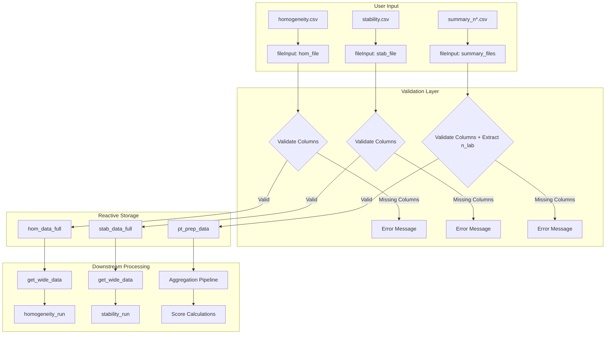
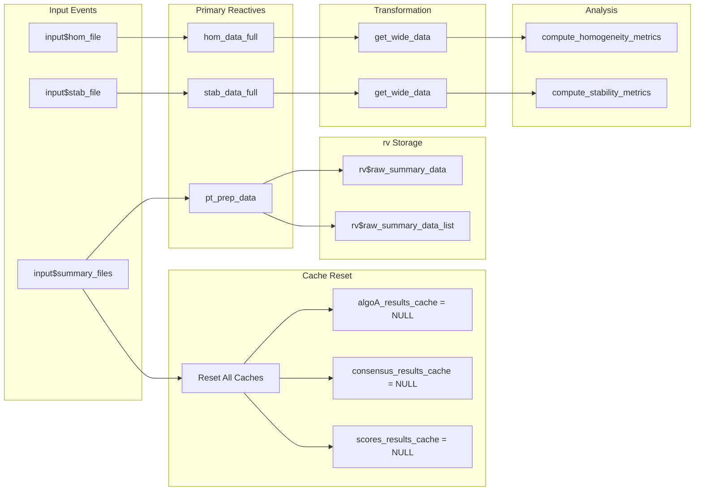

# Module: Data Loading (Carga de Datos)

## Description

This module manages the initial loading and validation of input CSV files. It is the starting point for all analyses in the application, ensuring data integrity before any statistical processing begins.

---

## Location in Code

| Element | Value |
|---------|-------|
| File | `cloned_app.R` |
| Lines | 79 - 156 (server function) |
| UI Tab | `tabPanel("Carga de datos")` (lines 730-759) |
| Dependencies | `vroom`, `stringr`, `dplyr` |

---

## Data Flow Diagram



---

## Example Data Files

The application expects three types of CSV files. Below are actual examples from the project's `data/` folder.

### 1. Homogeneity Data (`homogeneity.csv`)

Contains replicate measurements for each pollutant/level combination across multiple items (samples).

```csv
"pollutant","level","replicate","sample_id","value"
"co","0-umol/mol",1,1,0.00670212765957447
"co","0-umol/mol",1,2,0.00478723404255319
"co","0-umol/mol",1,3,-0.0492830188679245
"co","0-umol/mol",2,1,-0.0479622641509434
"co","0-umol/mol",2,2,-0.0488490566037736
"co","2-umol/mol",1,1,2.01153535353535
"co","2-umol/mol",1,2,2.01617021276596
```

**Key Structure:**
- Each `sample_id` represents a physical item
- Each `replicate` (1 or 2) is a repeated measurement on the same item
- Multiple `level` values per pollutant (e.g., "0-umol/mol", "2-umol/mol")

### 2. Stability Data (`stability.csv`)

Same structure as homogeneity, but measured at the end of the PT period.

```csv
"pollutant","level","replicate","sample_id","value"
"co","0-umol/mol",1,1,-0.0480754716981132
"co","0-umol/mol",1,2,0.00514893617021277
"co","0-umol/mol",2,1,-0.0494150943396226
"co","0-umol/mol",2,2,0.00331914893617021
```

### 3. Participant Summary Data (`summary_n*.csv`)

Contains aggregated results from each participant. The `n` in the filename is extracted as `n_lab`.

**Filename Pattern:** `summary_n(\d+).csv` (regex used to extract scheme ID)

```csv
"pollutant","level","participant_id","replicate","sample_group","mean_value","sd_value"
"co","0-umol/mol","part_1",2,"1-10",-0.0279839823364111,0.0282128659028142
"co","0-umol/mol","part_2",3,"1-10",-0.0224892011240466,0.0283144126155705
"co","0-umol/mol","ref",1,"1-10",-0.0216925331192292,0.0274757231826971
```

**Note:** The `ref` participant_id designates the reference laboratory.

---

## Validation Rules

### 1. Homogeneity & Stability Files

**Reactive:** `hom_data_full()` (lines 84-94), `stab_data_full()` (lines 96-106)

| Validation | Rule | Error Displayed |
|------------|------|-----------------|
| Required columns | `value`, `pollutant`, `level` must exist | "El archivo de homogeneidad debe contener las columnas 'value', 'pollutant' y 'level'" |
| File presence | File must be uploaded via `req(input$hom_file)` | Silent - no output until file provided |

**Validation Code:**
```r
validate(
  need(
    all(c("value", "pollutant", "level") %in% names(df)),
    "Error: El archivo de homogeneidad debe contener las columnas..."
  )
)
```

### 2. Participant Summary Files

**Reactive:** `pt_prep_data()` (lines 109-152)

| Validation | Rule | Error Displayed |
|------------|------|-----------------|
| Required columns | `participant_id`, `pollutant`, `level`, `mean_value`, `sd_value` | "Los archivos resumen deben contener las columnas..." |
| Filename pattern | Must contain a number for `n_lab` extraction | Values extracted via `str_extract(filename, "\\d+")` |
| Non-empty data | `data_list` must have entries | Returns `NULL` if empty |

**n_lab Extraction Logic:**
```r
n <- as.integer(stringr::str_extract(input$summary_files$name[i], "\\d+"))
df$n_lab <- n
```

---

## Complete Reactive Chain



---

## Reactive Details

### `hom_data_full()`

| Property | Value |
|----------|-------|
| **Description** | Loads and validates the homogeneity CSV file |
| **Trigger** | `input$hom_file` changes |
| **Dependencies** | `req(input$hom_file)` |
| **Returns** | DataFrame with columns: `value`, `pollutant`, `level`, plus any additional columns |
| **Error Handling** | Uses `validate(need(...))` to display user-friendly error |

### `stab_data_full()`

| Property | Value |
|----------|-------|
| **Description** | Loads and validates the stability CSV file |
| **Trigger** | `input$stab_file` changes |
| **Dependencies** | `req(input$stab_file)` |
| **Returns** | DataFrame with columns: `value`, `pollutant`, `level`, plus any additional columns |

### `pt_prep_data()`

| Property | Value |
|----------|-------|
| **Description** | Consolidates multiple participant summary files, extracts `n_lab`, aggregates data |
| **Trigger** | `input$summary_files` changes |
| **Side Effects** | Populates `rv$raw_summary_data` and `rv$raw_summary_data_list` |
| **Returns** | Aggregated DataFrame grouped by `participant_id`, `pollutant`, `level`, `n_lab` |
| **Aggregation** | Mean of `mean_value` and `sd_value` per group |

---

## Column Naming Conventions

| Column Pattern | Usage | Example |
|----------------|-------|---------|
| `sample_*` | Wide format columns created by `pivot_wider` | `sample_1`, `sample_2` |
| `participant_id` | Lab identifier, "ref" reserved for reference | `LAB_01`, `ref` |
| `n_lab` | Scheme ID extracted from filename | `4`, `7`, `10` |

---

## Error Messages Explained

| Error Message | Cause | Solution |
|---------------|-------|----------|
| "El archivo de homogeneidad debe contener las columnas 'value', 'pollutant' y 'level'" | Missing required columns in uploaded file | Check column names match exactly (case-sensitive) |
| "Los archivos resumen deben contener las columnas 'participant_id', 'pollutant', 'level', 'mean_value' y 'sd_value'" | Summary file missing required columns | Verify all 5 columns present |
| "No se encontraron datos para el analito" | Pollutant filter returned empty result | Ensure pollutant name in file matches selector |
| "La columna 'level' no se encuentra en los datos cargados" | Level column missing after transformation | Check original file has `level` column |

---

## Cache Invalidation

When `input$summary_files` changes, all downstream caches are reset (lines 213-224):

```r
observeEvent(input$summary_files, {
  algoA_results_cache(NULL)
  algoA_trigger(NULL)
  robust_trigger(NULL)
  consensus_results_cache(NULL)
  consensus_trigger(NULL)
  scores_results_cache(NULL)
  scores_trigger(NULL)
}, ignoreNULL = FALSE)
```

This ensures that old calculation results don't persist when new data is loaded.

---

## UI Components

| UI Element | Input ID | Widget Type | Purpose |
|------------|----------|-------------|---------|
| Homogeneity upload | `hom_file` | `fileInput` | Upload homogeneity.csv |
| Stability upload | `stab_file` | `fileInput` | Upload stability.csv |
| Summary files upload | `summary_files` | `fileInput` (multiple=TRUE) | Upload summary_n*.csv files |
| Upload status | `data_upload_status` | `verbatimTextOutput` | Display file loading status |

---

## Cross-References

- **Data Formats:** See [01a_data_formats.md](01a_data_formats.md) for complete CSV schema
- **Transformation:** `get_wide_data()` documented in [01a_data_formats.md](01a_data_formats.md)
- **Glossary:** Term definitions in [00_glossary.md](00_glossary.md)
- **Homogeneity Analysis:** See [04_pt_homogeneity.md](../cloned_docs/04_pt_homogeneity.md)
- **Score Calculations:** See [05_pt_scores.md](../cloned_docs/05_pt_scores.md)

---

## ISO References

| Standard | Section | Application |
|----------|---------|-------------|
| ISO 13528:2022 | 7.2 | Homogeneity testing requirements |
| ISO 13528:2022 | 7.3 | Stability testing requirements |
| ISO 17043:2024 | 5.4 | Data handling requirements for PT providers |
