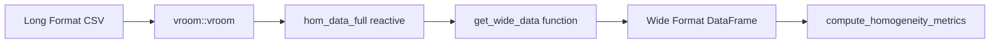
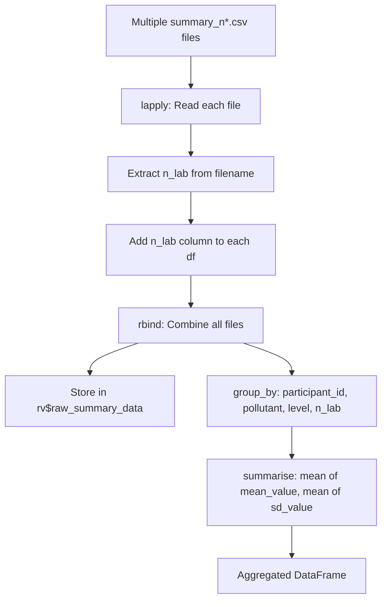

# Data Formats & Transformation Pipeline

This document provides a complete reference for all data formats accepted by the application and explains the internal transformation logic used to prepare data for ISO 13528/17043 statistical analysis.

---

## 1. Complete CSV Schema Reference

### 1.1 Homogeneity & Stability Data

Used for `homogeneity.csv` and `stability.csv`. This format represents **Long Format** data where each row is a single measurement.

| Column | Required | Type | Description | Example Values |
|:-------|:--------:|:-----|:------------|:---------------|
| `pollutant` | **Yes** | String | Analyte identifier (case-sensitive) | `co`, `no`, `so2`, `o3`, `no2` |
| `level` | **Yes** | String | Concentration level with units | `0-umol/mol`, `2-umol/mol`, `121-nmol/mol` |
| `replicate` | No* | Integer | Replicate number (typically 1 or 2) | `1`, `2` |
| `sample_id` | No | Integer | Item/sample identifier | `1`, `2`, `3`, ... `10` |
| `value` | **Yes** | Float | Measured concentration value | `0.00670`, `2.01153`, `-0.04928` |
| `date` | No | Date | Measurement date (if tracked) | `2023-10-01` |

> **Note:** While `replicate` is not checked by the validator, it is **essential** for the `pivot_wider` transformation. Without it, the wide format conversion will fail or produce unexpected results.

#### Actual Data Example (from `data/homogeneity.csv`)

```csv
"pollutant","level","replicate","sample_id","value"
"co","0-umol/mol",1,1,0.00670212765957447
"co","0-umol/mol",1,2,0.00478723404255319
"co","0-umol/mol",1,3,-0.0492830188679245
"co","0-umol/mol",2,1,-0.0479622641509434
"co","0-umol/mol",2,2,-0.0488490566037736
"co","2-umol/mol",1,1,2.01153535353535
"co","2-umol/mol",1,2,2.01617021276596
```

---

### 1.2 Participant Summary Data

Used for `summary_n*.csv` files. Contains aggregated results from PT participants.

| Column | Required | Type | Description | Example Values |
|:-------|:--------:|:-----|:------------|:---------------|
| `participant_id` | **Yes** | String | Unique laboratory identifier | `part_1`, `LAB_01`, `ref` |
| `pollutant` | **Yes** | String | Analyte identifier | `co`, `no`, `so2` |
| `level` | **Yes** | String | Concentration level | `0-umol/mol`, `2-umol/mol` |
| `mean_value` | **Yes** | Float | Participant's reported mean | `2.01215082742317` |
| `sd_value` | **Yes** | Float | Participant's reported standard deviation | `0.0035971898480072` |
| `replicate` | No | Integer | Number of replicates | `2`, `3`, `4` |
| `sample_group` | No | String | Sample grouping identifier | `1-10`, `11-20`, `21-30` |

#### Special Values

| Value | Meaning |
|-------|---------|
| `ref` (participant_id) | Reference laboratory - used as assigned value x_pt |

#### Filename Convention

The filename **must** contain a number that identifies the scheme:

| Pattern | Regex | Example | Extracted `n_lab` |
|---------|-------|---------|-------------------|
| `summary_n4.csv` | `\d+` | `summary_n4.csv` | `4` |
| `summary_n10.csv` | `\d+` | `summary_n10.csv` | `10` |
| `summary_123_final.csv` | `\d+` | `summary_123_final.csv` | `123` |

#### Actual Data Example (from `data/summary_n4.csv`)

```csv
"pollutant","level","participant_id","replicate","sample_group","mean_value","sd_value"
"co","0-umol/mol","part_1",2,"1-10",-0.0279839823364111,0.0282128659028142
"co","0-umol/mol","part_2",3,"1-10",-0.0224892011240466,0.0283144126155705
"co","0-umol/mol","ref",1,"1-10",-0.0216925331192292,0.0274757231826971
"co","2-umol/mol","part_1",2,"1-10",2.01215082742317,0.0035971898480072
```

---

## 2. Data Transformation Pipeline

The application stores uploaded data in **Long Format** but requires **Wide Format** for ANOVA-based homogeneity calculations per ISO 13528.

### 2.1 Transformation Flow



### 2.2 The `get_wide_data()` Function

**Source Location:** `cloned_app.R` (lines 227-238)

This function filters data by pollutant and pivots from long to wide format.

```r
get_wide_data <- function(df, target_pollutant) {
  # Step 1: Filter by pollutant
  filtered <- df %>% filter(pollutant == target_pollutant)
  
  # Step 2: Return NULL if no data found
  if (is.null(filtered) || nrow(filtered) == 0) {
    return(NULL)
  }
  
  # Step 3: Return NULL if critical column missing
  if (!"value" %in% names(filtered)) {
    return(NULL)
  }
  
  # Step 4: Pivot to Wide Format
  filtered %>%
    select(-pollutant) %>%
    pivot_wider(
      names_from = replicate, 
      values_from = value, 
      names_prefix = "sample_"
    )
}
```

### 2.3 Transformation Example

**Input (Long Format):**

| pollutant | level | replicate | sample_id | value |
|-----------|-------|-----------|-----------|-------|
| SO2 | low | 1 | 1 | 0.05 |
| SO2 | low | 2 | 1 | 0.06 |
| SO2 | low | 1 | 2 | 0.07 |
| SO2 | low | 2 | 2 | 0.08 |
| SO2 | high | 1 | 1 | 0.10 |
| SO2 | high | 2 | 1 | 0.11 |

**Operation:** `get_wide_data(df, "SO2")`

**Output (Wide Format):**

| level | sample_id | sample_1 | sample_2 |
|-------|-----------|----------|----------|
| low | 1 | 0.05 | 0.06 |
| low | 2 | 0.07 | 0.08 |
| high | 1 | 0.10 | 0.11 |

---

## 3. pt_prep_data() Aggregation Pipeline

The participant summary data undergoes aggregation before use in score calculations.

### 3.1 Aggregation Steps



### 3.2 Code Implementation

```r
pt_prep_data <- reactive({
  req(input$summary_files)

  # Read each file and add n_lab
  data_list <- lapply(seq_len(nrow(input$summary_files)), function(i) {
    df <- vroom::vroom(input$summary_files$datapath[i], show_col_types = FALSE)
    n <- as.integer(stringr::str_extract(input$summary_files$name[i], "\\d+"))
    df$n_lab <- n
    return(df)
  })

  raw_data <- do.call(rbind, data_list)
  
  # Store raw data for other calculations
  rv$raw_summary_data <- raw_data
  rv$raw_summary_data_list <- data_list

  # Aggregate: one value per participant/pollutant/level/n_lab
  raw_data %>%
    group_by(participant_id, pollutant, level, n_lab) %>%
    summarise(
      mean_value = mean(mean_value, na.rm = TRUE),
      sd_value = mean(sd_value, na.rm = TRUE),
      .groups = "drop"
    )
})
```

---

## 4. Sample Data Generator Script

Use this R script to generate valid dummy data for testing the application.

### 4.1 Generate Homogeneity Data

```r
# Configuration
pollutants <- c("co", "no", "so2")
levels <- list(
  co = c("0-umol/mol", "2-umol/mol", "4-umol/mol"),
  no = c("0-nmol/mol", "121-nmol/mol", "240-nmol/mol"),
  so2 = c("0-nmol/mol", "50-nmol/mol", "100-nmol/mol")
)
n_items <- 10
n_replicates <- 2

# Generate data
hom_data <- do.call(rbind, lapply(pollutants, function(p) {
  do.call(rbind, lapply(levels[[p]], function(lv) {
    expand.grid(
      pollutant = p,
      level = lv,
      sample_id = 1:n_items,
      replicate = 1:n_replicates,
      stringsAsFactors = FALSE
    )
  }))
}))

# Add realistic values (base + small variation)
base_values <- c("0-umol/mol" = 0, "2-umol/mol" = 2, "4-umol/mol" = 4,
                 "0-nmol/mol" = 0, "121-nmol/mol" = 121, "240-nmol/mol" = 240,
                 "50-nmol/mol" = 50, "100-nmol/mol" = 100)

hom_data$value <- sapply(hom_data$level, function(lv) {
  base <- base_values[lv]
  base + rnorm(1, 0, base * 0.01 + 0.01)  # 1% relative + 0.01 absolute noise
})

write.csv(hom_data, "homogeneity_test.csv", row.names = FALSE)
```

### 4.2 Generate Participant Summary Data

```r
# Configuration
participants <- c("part_1", "part_2", "part_3", "ref")
pollutants <- c("co", "no")
levels <- c("low", "medium", "high")
n_lab <- 4

# Generate data
summary_data <- expand.grid(
  participant_id = participants,
  pollutant = pollutants,
  level = levels,
  stringsAsFactors = FALSE
)

# Add realistic values
summary_data$mean_value <- runif(nrow(summary_data), 10, 15)
summary_data$sd_value <- runif(nrow(summary_data), 0.1, 0.5)

write.csv(summary_data, sprintf("summary_n%d.csv", n_lab), row.names = FALSE)
```

---

## 5. Data Quality Checklist

Before uploading files, verify:

### Homogeneity/Stability Files

- [ ] Column names exactly match: `pollutant`, `level`, `value`, `replicate`
- [ ] No extra whitespace in column headers
- [ ] `value` column contains only numeric data
- [ ] `replicate` values are consistent (typically 1 and 2)
- [ ] Each pollutant/level combination has multiple items
- [ ] File encoding is UTF-8 (for special characters like "umol")

### Participant Summary Files

- [ ] Column names exactly match: `participant_id`, `pollutant`, `level`, `mean_value`, `sd_value`
- [ ] Filename contains a number (e.g., `summary_n4.csv`)
- [ ] Contains a row with `participant_id = "ref"` for reference values
- [ ] `mean_value` and `sd_value` are numeric
- [ ] Pollutant and level values match those in homogeneity file

---

## 6. Common Data Format Issues

| Issue | Symptom | Fix |
|-------|---------|-----|
| Column name mismatch | "must contain columns..." error | Use exact lowercase names |
| Missing `replicate` column | Wide format has wrong structure | Add replicate column (1, 2) |
| Extra spaces in values | Filters don't match | Trim whitespace in Excel/R |
| Mixed case pollutant names | "No data found for pollutant" | Standardize to lowercase |
| No `ref` participant | Score calculation fails | Add reference lab with id `ref` |
| Non-numeric `value` | vroom parsing errors | Remove text entries, fix decimals |
| UTF-8 encoding issues | Special characters corrupted | Re-save as UTF-8 |

---

## 7. Cross-References

- **Data Loading Module:** [01_carga_datos.md](01_carga_datos.md)
- **Homogeneity Calculations:** [04_pt_homogeneity.md](../cloned_docs/04_pt_homogeneity.md)
- **Glossary:** [00_glossary.md](00_glossary.md)
- **Example Data Files:** Located in `data/` directory
