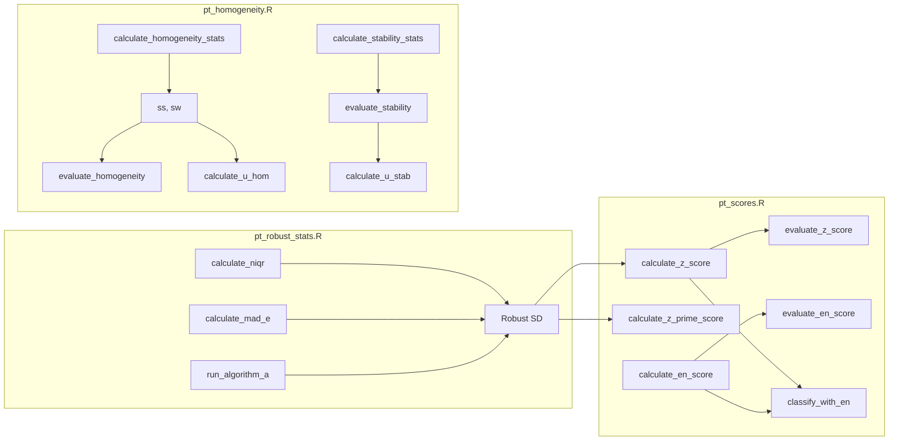

# Paquete ptcalc: Documentacion Completa

## Informacion del Documento

| Atributo | Valor |
|----------|-------|
| Paquete | `ptcalc` |
| Version | 0.1.0 |
| Ubicacion | `pt_app/ptcalc/` |
| Dependencias | stats, dplyr |
| Uso en App | `devtools::load_all("ptcalc")` |

---

## Descripcion General

`ptcalc` es un paquete R que encapsula todas las **funciones matematicas puras** para el calculo de ensayos de aptitud segun las normas **ISO 13528:2022** e **ISO 17043:2024**. 

### Caracteristicas Clave

- **Sin dependencias de Shiny**: Puede usarse independientemente de la aplicacion
- **Funciones puras**: Sin efectos secundarios, solo transformaciones de datos
- **Documentacion roxygen2**: Cada funcion tiene ejemplos ejecutables
- **Testeable**: Funciones independientes facilitan pruebas unitarias

---

## Estructura del Paquete

```
ptcalc/
├── DESCRIPTION           # Metadatos del paquete
├── NAMESPACE             # 24 funciones exportadas
├── LICENSE               # MIT License
├── R/
│   ├── ptcalc-package.R       # Documentacion del paquete
│   ├── pt_robust_stats.R      # nIQR, MADe, Algoritmo A (247 lineas)
│   ├── pt_homogeneity.R       # Homogeneidad y estabilidad (290 lineas)
│   └── pt_scores.R            # z, z', zeta, En scores (275 lineas)
└── man/                       # Documentacion roxygen2 generada
```

---

## Filosofia de Diseno

| Principio | Implementacion | Beneficio |
|-----------|----------------|-----------|
| Separacion de responsabilidades | Logica matematica separada de UI | Mantenibilidad |
| Funciones puras | Sin efectos secundarios | Predecibilidad |
| Documentacion | roxygen2 con ejemplos | Usabilidad |
| Testabilidad | Funciones independientes | Confiabilidad |
| Estandares ISO | Referencias explicitas | Trazabilidad |

---

## Flujo de Datos en el Paquete



---

## Resumen de Funciones Exportadas

### Estadisticos Robustos (pt_robust_stats.R)

| Funcion | Descripcion | Referencia ISO |
|---------|-------------|----------------|
| `calculate_niqr()` | Rango intercuartil normalizado (0.7413 * IQR) | 13528:2022 S9.4 |
| `calculate_mad_e()` | MAD escalado (1.483 * MAD) | 13528:2022 S9.4 |
| `run_algorithm_a()` | Algoritmo A iterativo para media y SD robustas | 13528:2022 Anexo C |

### Homogeneidad y Estabilidad (pt_homogeneity.R)

| Funcion | Descripcion | Referencia ISO |
|---------|-------------|----------------|
| `calculate_homogeneity_stats()` | Estadisticos ss, sw, medias | 13528:2022 S9.2 |
| `calculate_homogeneity_criterion()` | Criterio c = 0.3 * sigma_pt | 13528:2022 S9.2.3 |
| `calculate_homogeneity_criterion_expanded()` | Criterio expandido | 13528:2022 S9.2.4 |
| `evaluate_homogeneity()` | Evaluacion PASS/FAIL | 13528:2022 S9.2 |
| `calculate_stability_stats()` | Estadisticos de estabilidad | 13528:2022 S9.3 |
| `calculate_stability_criterion()` | Criterio de estabilidad | 13528:2022 S9.3.3 |
| `calculate_stability_criterion_expanded()` | Criterio expandido | 13528:2022 S9.3.4 |
| `evaluate_stability()` | Evaluacion de estabilidad | 13528:2022 S9.3 |
| `calculate_u_hom()` | Incertidumbre por homogeneidad | 13528:2022 S9.5 |
| `calculate_u_stab()` | Incertidumbre por estabilidad | 13528:2022 S9.5 |

### Puntajes (pt_scores.R)

| Funcion | Formula | Referencia ISO |
|---------|---------|----------------|
| `calculate_z_score()` | z = (x - x_pt) / sigma_pt | 13528:2022 S10.2 |
| `calculate_z_prime_score()` | z' = (x - x_pt) / sqrt(sigma_pt^2 + u_xpt^2) | 13528:2022 S10.3 |
| `calculate_zeta_score()` | zeta = (x - x_pt) / sqrt(u_x^2 + u_xpt^2) | 13528:2022 S10.4 |
| `calculate_en_score()` | En = (x - x_pt) / sqrt(U_x^2 + U_xpt^2) | 13528:2022 S10.5 |
| `evaluate_z_score()` | Evalua z/z'/zeta (scalar) | 13528:2022 S10.6 |
| `evaluate_z_score_vec()` | Evalua z/z'/zeta (vector) | 13528:2022 S10.6 |
| `evaluate_en_score()` | Evalua En (scalar) | 13528:2022 S10.6 |
| `evaluate_en_score_vec()` | Evalua En (vector) | 13528:2022 S10.6 |
| `classify_with_en()` | Clasificacion combinada a1-a7 | 13528:2022 S10.7 |

### Constantes Exportadas

| Constante | Descripcion |
|-----------|-------------|
| `PT_EN_CLASS_LABELS` | Etiquetas para clasificacion a1-a7 |
| `PT_EN_CLASS_COLORS` | Paleta de colores para visualizacion |

---

## Uso en la Aplicacion

```r
# Al inicio de cloned_app.R (linea ~15)
devtools::load_all("ptcalc")

# Ejemplo de uso en un reactive
scores_data <- reactive({
  x_pt <- consensus_run()$assigned_value
  sigma_pt <- input$sigma_pt
  
  df %>%
    mutate(
      z = calculate_z_score(value, x_pt, sigma_pt),
      eval = evaluate_z_score_vec(z)
    )
})
```

---

## Flujo de Desarrollo

### Desarrollo Local

```r
# Cargar cambios sin reinstalar
devtools::load_all("ptcalc")

# Ejecutar pruebas (si existen)
devtools::test("ptcalc")

# Verificar documentacion
devtools::document("ptcalc")

# Verificar paquete completo
devtools::check("ptcalc")
```

### Reinstalacion Completa

```r
# Instalar localmente
devtools::install("ptcalc")

# Cargar como paquete instalado
library(ptcalc)
```

---

## Estado de Documentacion Roxygen

| Archivo | Funciones | Documentadas | Ejemplos |
|---------|-----------|--------------|----------|
| pt_robust_stats.R | 3 | 3 (100%) | 3 |
| pt_homogeneity.R | 10 | 10 (100%) | 2 |
| pt_scores.R | 11 | 11 (100%) | 4 |

---

## Manejo de Errores

Todas las funciones manejan casos edge de manera consistente:

| Condicion | Comportamiento |
|-----------|----------------|
| Datos insuficientes | Retorna `NA_real_` o lista con `$error` |
| Division por cero | Retorna `NA_real_` |
| Valores no finitos | Filtrados automaticamente |
| Varianza cero | Manejada con fallback a SD clasico |

---

## Referencias

- **ISO 13528:2022** - Statistical methods for use in proficiency testing by interlaboratory comparison
- **ISO 17043:2024** - Conformity assessment - General requirements for proficiency testing

---

## Documentos Relacionados

- [02a_ptcalc_api.md](02a_ptcalc_api.md) - Referencia API completa con ejemplos
- [03_pt_robust_stats.md](../cloned_docs/03_pt_robust_stats.md) - Documentacion detallada de estadisticos robustos
- [04_pt_homogeneity.md](../cloned_docs/04_pt_homogeneity.md) - Documentacion de homogeneidad
- [05_pt_scores.md](../cloned_docs/05_pt_scores.md) - Documentacion de puntajes
