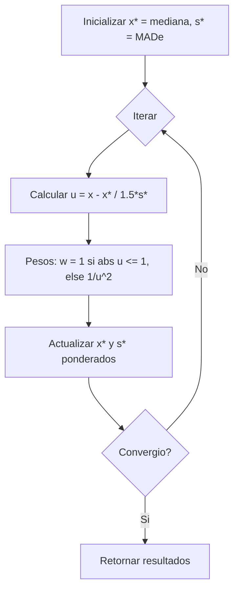
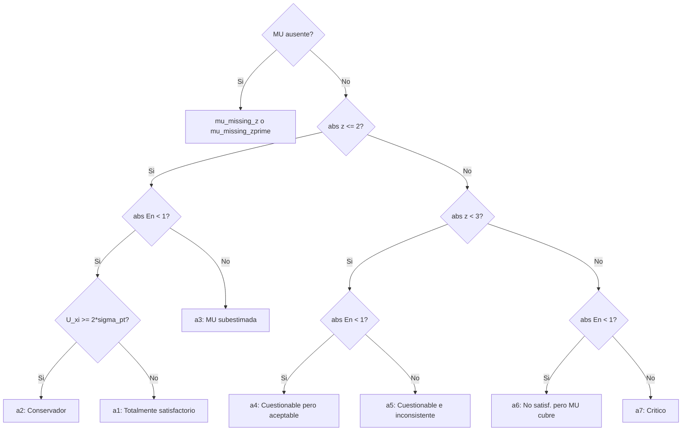

# ptcalc API Reference

## Informacion del Documento

| Atributo | Valor |
|----------|-------|
| Paquete | `ptcalc` v0.1.0 |
| Funciones Exportadas | 24 |
| Constantes Exportadas | 2 |
| Archivo Relacionado | [02_ptcalc_package.md](02_ptcalc_package.md) |

---

## Indice de Funciones

1. [Estadisticos Robustos](#1-estadisticos-robustos)
   - [calculate_niqr](#calculate_niqr)
   - [calculate_mad_e](#calculate_mad_e)
   - [run_algorithm_a](#run_algorithm_a)

2. [Homogeneidad](#2-homogeneidad)
   - [calculate_homogeneity_stats](#calculate_homogeneity_stats)
   - [calculate_homogeneity_criterion](#calculate_homogeneity_criterion)
   - [calculate_homogeneity_criterion_expanded](#calculate_homogeneity_criterion_expanded)
   - [evaluate_homogeneity](#evaluate_homogeneity)

3. [Estabilidad](#3-estabilidad)
   - [calculate_stability_stats](#calculate_stability_stats)
   - [calculate_stability_criterion](#calculate_stability_criterion)
   - [calculate_stability_criterion_expanded](#calculate_stability_criterion_expanded)
   - [evaluate_stability](#evaluate_stability)

4. [Incertidumbres](#4-incertidumbres)
   - [calculate_u_hom](#calculate_u_hom)
   - [calculate_u_stab](#calculate_u_stab)

5. [Puntajes](#5-puntajes)
   - [calculate_z_score](#calculate_z_score)
   - [calculate_z_prime_score](#calculate_z_prime_score)
   - [calculate_zeta_score](#calculate_zeta_score)
   - [calculate_en_score](#calculate_en_score)

6. [Evaluacion de Puntajes](#6-evaluacion-de-puntajes)
   - [evaluate_z_score](#evaluate_z_score)
   - [evaluate_z_score_vec](#evaluate_z_score_vec)
   - [evaluate_en_score](#evaluate_en_score)
   - [evaluate_en_score_vec](#evaluate_en_score_vec)
   - [classify_with_en](#classify_with_en)

7. [Constantes](#7-constantes)
   - [PT_EN_CLASS_LABELS](#pt_en_class_labels)
   - [PT_EN_CLASS_COLORS](#pt_en_class_colors)

---

## 1. Estadisticos Robustos

### calculate_niqr

Calcula el Rango Intercuartil Normalizado (nIQR), un estimador robusto de la desviacion estandar.

**Archivo:** `R/pt_robust_stats.R` (lineas 33-40)  
**Referencia:** ISO 13528:2022, Seccion 9.4

#### Firma

```r
calculate_niqr(x)
```

#### Parametros

| Parametro | Tipo | Descripcion |
|-----------|------|-------------|
| `x` | numeric vector | Vector de valores numericos |

#### Retorno

| Tipo | Descripcion |
|------|-------------|
| `numeric` | nIQR = 0.7413 * IQR, o `NA_real_` si datos insuficientes |

#### Formula

$$\text{nIQR} = 0.7413 \times (Q_3 - Q_1)$$

#### Ejemplo

```r
# Calcular nIQR para datos de ensayo de aptitud
values <- c(10.1, 10.2, 9.9, 10.0, 10.3, 9.8, 10.1)
niqr <- calculate_niqr(values)
# Resultado: 0.223 (aproximadamente)
```

#### Casos Edge

| Condicion | Resultado |
|-----------|-----------|
| `length(x) < 2` | `NA_real_` |
| Valores no finitos | Filtrados automaticamente |

---

### calculate_mad_e

Calcula la Desviacion Absoluta Mediana escalada (MADe), un estimador robusto muy resistente a outliers.

**Archivo:** `R/pt_robust_stats.R` (lineas 63-72)  
**Referencia:** ISO 13528:2022, Seccion 9.4

#### Firma

```r
calculate_mad_e(x)
```

#### Parametros

| Parametro | Tipo | Descripcion |
|-----------|------|-------------|
| `x` | numeric vector | Vector de valores numericos |

#### Retorno

| Tipo | Descripcion |
|------|-------------|
| `numeric` | MADe = 1.483 * MAD, o `NA_real_` si sin datos |

#### Formula

$$\text{MADe} = 1.483 \times \text{median}(|x_i - \text{median}(x)|)$$

#### Ejemplo

```r
# MADe es robusto ante outliers
values <- c(10.1, 10.2, 9.9, 10.0, 50.0)  # 50 es outlier
mad_e <- calculate_mad_e(values)
# Resultado: ~0.222 (ignora el outlier)
```

---

### run_algorithm_a

Algoritmo iterativo de ISO 13528 para calcular media y desviacion estandar robustas usando ponderacion tipo Huber.

**Archivo:** `R/pt_robust_stats.R` (lineas 112-246)  
**Referencia:** ISO 13528:2022, Anexo C

#### Firma

```r
run_algorithm_a(values, ids = NULL, max_iter = 50, tol = 1e-03)
```

#### Parametros

| Parametro | Tipo | Default | Descripcion |
|-----------|------|---------|-------------|
| `values` | numeric vector | - | Resultados de participantes |
| `ids` | vector | `NULL` | Identificadores de participantes |
| `max_iter` | integer | 50 | Maximo de iteraciones |
| `tol` | numeric | 1e-03 | Tolerancia de convergencia |

#### Retorno

Lista con los siguientes elementos:

| Elemento | Tipo | Descripcion |
|----------|------|-------------|
| `assigned_value` | numeric | Media robusta (x*) |
| `robust_sd` | numeric | Desviacion estandar robusta (s*) |
| `iterations` | data.frame | Historial de iteraciones |
| `weights` | data.frame | Pesos finales por participante |
| `converged` | logical | TRUE si convergio |
| `effective_weight` | numeric | Suma de pesos finales |
| `error` | character/NULL | Mensaje de error o NULL |

#### Algoritmo



#### Ejemplo

```r
# Media robusta con outlier
values <- c(10.1, 10.2, 9.9, 10.0, 10.3, 50.0)  # 50 es outlier
result <- run_algorithm_a(values)

cat("Media robusta:", result$assigned_value, "\n")
# Resultado: ~10.1 (outlier tiene peso reducido)

cat("SD robusta:", result$robust_sd, "\n")
# Resultado: ~0.14

# Ver pesos asignados
print(result$weights)
# El valor 50.0 tendra peso cercano a 0
```

#### Casos Edge

| Condicion | Comportamiento |
|-----------|----------------|
| `n < 3` | Error: requiere minimo 3 observaciones |
| Dispersion cero | Retorna media con SD = 0, converged = TRUE |
| No converge | Retorna ultimos valores, converged = FALSE |

---

## 2. Homogeneidad

### calculate_homogeneity_stats

Calcula estadisticos de homogeneidad a partir de datos de muestras con replicas.

**Archivo:** `R/pt_homogeneity.R` (lineas 38-91)  
**Referencia:** ISO 13528:2022, Seccion 9.2

#### Firma

```r
calculate_homogeneity_stats(sample_data)
```

#### Parametros

| Parametro | Tipo | Descripcion |
|-----------|------|-------------|
| `sample_data` | matrix/data.frame | Muestras en filas, replicas en columnas |

#### Retorno

Lista con los siguientes elementos:

| Elemento | Tipo | Descripcion |
|----------|------|-------------|
| `g` | integer | Numero de muestras |
| `m` | integer | Numero de replicas por muestra |
| `grand_mean` | numeric | Media global |
| `sample_means` | numeric vector | Medias por muestra |
| `s_x_bar_sq` | numeric | Varianza de medias muestrales |
| `s_xt` | numeric | SD de medias muestrales |
| `sw` | numeric | SD intra-muestra |
| `sw_sq` | numeric | Varianza intra-muestra |
| `ss_sq` | numeric | Componente varianza entre-muestras |
| `ss` | numeric | SD entre-muestras |
| `error` | character/NULL | Mensaje de error o NULL |

#### Formulas

Para m = 2 replicas:
$$s_w = \sqrt{\frac{\sum_{i=1}^{g} w_i^2}{2g}}$$

Donde $w_i$ es el rango de la muestra i.

Componente entre-muestras:
$$s_s^2 = |s_{\bar{x}}^2 - \frac{s_w^2}{m}|$$

#### Ejemplo

```r
# Crear datos: 10 muestras con 2 replicas
sample_data <- matrix(
  c(10.1, 10.2,
    9.9, 10.0,
    10.3, 10.1,
    9.8, 9.9,
    10.0, 10.1,
    10.2, 10.3,
    9.7, 9.8,
    10.1, 10.0,
    10.0, 10.2,
    9.9, 10.0),
  nrow = 10, ncol = 2, byrow = TRUE
)

stats <- calculate_homogeneity_stats(sample_data)
cat("SD entre-muestras (ss):", stats$ss, "\n")
cat("SD intra-muestra (sw):", stats$sw, "\n")
```

---

### calculate_homogeneity_criterion

Calcula el criterio de homogeneidad c = 0.3 * sigma_pt.

**Archivo:** `R/pt_homogeneity.R` (lineas 109-111)  
**Referencia:** ISO 13528:2022, Seccion 9.2.3

#### Firma

```r
calculate_homogeneity_criterion(sigma_pt)
```

#### Parametros

| Parametro | Tipo | Descripcion |
|-----------|------|-------------|
| `sigma_pt` | numeric | Desviacion estandar para evaluacion de aptitud |

#### Retorno

| Tipo | Descripcion |
|------|-------------|
| `numeric` | Criterio c = 0.3 * sigma_pt |

#### Ejemplo

```r
c_criterion <- calculate_homogeneity_criterion(sigma_pt = 0.5)
# Resultado: 0.15
```

---

### calculate_homogeneity_criterion_expanded

Calcula el criterio de homogeneidad expandido.

**Archivo:** `R/pt_homogeneity.R` (lineas 123-127)  
**Referencia:** ISO 13528:2022, Seccion 9.2.4

#### Firma

```r
calculate_homogeneity_criterion_expanded(sigma_pt, sw_sq)
```

#### Parametros

| Parametro | Tipo | Descripcion |
|-----------|------|-------------|
| `sigma_pt` | numeric | Desviacion estandar para evaluacion |
| `sw_sq` | numeric | Varianza intra-muestra |

#### Retorno

| Tipo | Descripcion |
|------|-------------|
| `numeric` | Criterio expandido |

#### Formula

$$c_{expandido} = \sqrt{\sigma_{permitida}^2 \times 1.88 + s_w^2 \times 1.01}$$

Donde $\sigma_{permitida} = 0.3 \times \sigma_{pt}$

---

### evaluate_homogeneity

Evalua si la homogeneidad cumple con los criterios.

**Archivo:** `R/pt_homogeneity.R` (lineas 139-165)  
**Referencia:** ISO 13528:2022, Seccion 9.2

#### Firma

```r
evaluate_homogeneity(ss, c_criterion, c_expanded = NULL)
```

#### Parametros

| Parametro | Tipo | Default | Descripcion |
|-----------|------|---------|-------------|
| `ss` | numeric | - | SD entre-muestras |
| `c_criterion` | numeric | - | Criterio de homogeneidad |
| `c_expanded` | numeric | `NULL` | Criterio expandido (opcional) |

#### Retorno

| Elemento | Tipo | Descripcion |
|----------|------|-------------|
| `passes_criterion` | logical | TRUE si ss <= c_criterion |
| `passes_expanded` | logical | TRUE si ss <= c_expanded (o NA) |
| `conclusion` | character | Descripcion textual del resultado |

#### Ejemplo

```r
eval <- evaluate_homogeneity(ss = 0.12, c_criterion = 0.15, c_expanded = 0.18)
cat(eval$conclusion)
# "ss (0.1200) <= criterion (0.1500): MEETS HOMOGENEITY CRITERION"
```

---

## 3. Estabilidad

### calculate_stability_stats

Calcula estadisticos de estabilidad comparando muestras de estabilidad con homogeneidad.

**Archivo:** `R/pt_homogeneity.R` (lineas 181-194)  
**Referencia:** ISO 13528:2022, Seccion 9.3

#### Firma

```r
calculate_stability_stats(stab_sample_data, hom_grand_mean)
```

#### Parametros

| Parametro | Tipo | Descripcion |
|-----------|------|-------------|
| `stab_sample_data` | matrix/data.frame | Datos de muestras de estabilidad |
| `hom_grand_mean` | numeric | Media global del estudio de homogeneidad |

#### Retorno

Lista con todos los elementos de `calculate_homogeneity_stats` mas:

| Elemento | Tipo | Descripcion |
|----------|------|-------------|
| `stab_grand_mean` | numeric | Media de muestras de estabilidad |
| `diff_hom_stab` | numeric | Diferencia absoluta entre medias |

---

### calculate_stability_criterion

Calcula el criterio de estabilidad c_stab = 0.3 * sigma_pt.

**Archivo:** `R/pt_homogeneity.R` (lineas 205-207)  
**Referencia:** ISO 13528:2022, Seccion 9.3.3

#### Firma

```r
calculate_stability_criterion(sigma_pt)
```

---

### calculate_stability_criterion_expanded

Calcula el criterio de estabilidad expandido.

**Archivo:** `R/pt_homogeneity.R` (lineas 218-220)  
**Referencia:** ISO 13528:2022, Seccion 9.3.4

#### Firma

```r
calculate_stability_criterion_expanded(c_criterion, u_hom_mean, u_stab_mean)
```

#### Formula

$$c_{stab\_expandido} = c + 2\sqrt{u_{hom\_mean}^2 + u_{stab\_mean}^2}$$

---

### evaluate_stability

Evalua si la estabilidad cumple con los criterios.

**Archivo:** `R/pt_homogeneity.R` (lineas 232-258)  
**Referencia:** ISO 13528:2022, Seccion 9.3

#### Firma

```r
evaluate_stability(diff_hom_stab, c_criterion, c_expanded = NULL)
```

---

## 4. Incertidumbres

### calculate_u_hom

Calcula la contribucion de incertidumbre por homogeneidad.

**Archivo:** `R/pt_homogeneity.R` (lineas 269-271)  
**Referencia:** ISO 13528:2022, Seccion 9.5

#### Firma

```r
calculate_u_hom(ss)
```

#### Formula

$$u_{hom} = s_s$$

#### Ejemplo

```r
u_hom <- calculate_u_hom(ss = 0.12)
# Resultado: 0.12
```

---

### calculate_u_stab

Calcula la contribucion de incertidumbre por estabilidad.

**Archivo:** `R/pt_homogeneity.R` (lineas 284-289)  
**Referencia:** ISO 13528:2022, Seccion 9.5

#### Firma

```r
calculate_u_stab(diff_hom_stab, c_criterion)
```

#### Formula

$$u_{stab} = \begin{cases} 0 & \text{si } diff \leq c \\ \frac{diff}{\sqrt{3}} & \text{si } diff > c \end{cases}$$

---

## 5. Puntajes

### calculate_z_score

Calcula el puntaje z estandar.

**Archivo:** `R/pt_scores.R` (lineas 28-33)  
**Referencia:** ISO 13528:2022, Seccion 10.2

#### Firma

```r
calculate_z_score(x, x_pt, sigma_pt)
```

#### Parametros

| Parametro | Tipo | Descripcion |
|-----------|------|-------------|
| `x` | numeric | Resultado del participante |
| `x_pt` | numeric | Valor asignado |
| `sigma_pt` | numeric | Desviacion estandar para evaluacion |

#### Formula

$$z = \frac{x - x_{pt}}{\sigma_{pt}}$$

#### Ejemplo

```r
z <- calculate_z_score(x = 10.5, x_pt = 10.0, sigma_pt = 0.5)
# Resultado: 1.0 (Satisfactorio)
```

---

### calculate_z_prime_score

Calcula el puntaje z' que considera incertidumbre del valor asignado.

**Archivo:** `R/pt_scores.R` (lineas 53-59)  
**Referencia:** ISO 13528:2022, Seccion 10.3

#### Firma

```r
calculate_z_prime_score(x, x_pt, sigma_pt, u_xpt)
```

#### Formula

$$z' = \frac{x - x_{pt}}{\sqrt{\sigma_{pt}^2 + u_{xpt}^2}}$$

---

### calculate_zeta_score

Calcula el puntaje zeta usando incertidumbre del participante.

**Archivo:** `R/pt_scores.R` (lineas 79-85)  
**Referencia:** ISO 13528:2022, Seccion 10.4

#### Firma

```r
calculate_zeta_score(x, x_pt, u_x, u_xpt)
```

#### Formula

$$\zeta = \frac{x - x_{pt}}{\sqrt{u_x^2 + u_{xpt}^2}}$$

---

### calculate_en_score

Calcula el puntaje En usando incertidumbres expandidas.

**Archivo:** `R/pt_scores.R` (lineas 106-112)  
**Referencia:** ISO 13528:2022, Seccion 10.5

#### Firma

```r
calculate_en_score(x, x_pt, U_x, U_xpt)
```

#### Formula

$$E_n = \frac{x - x_{pt}}{\sqrt{U_x^2 + U_{xpt}^2}}$$

#### Ejemplo

```r
en <- calculate_en_score(x = 10.5, x_pt = 10.0, U_x = 0.4, U_xpt = 0.2)
cat("En-score:", en, "\n")
cat("Evaluacion:", evaluate_en_score(en), "\n")
```

---

## 6. Evaluacion de Puntajes

### evaluate_z_score

Evalua un puntaje z individual.

**Archivo:** `R/pt_scores.R` (lineas 124-135)  
**Referencia:** ISO 13528:2022, Seccion 10.6

#### Firma

```r
evaluate_z_score(z)
```

#### Criterios

| Condicion | Evaluacion |
|-----------|------------|
| \|z\| <= 2 | "Satisfactorio" |
| 2 < \|z\| < 3 | "Cuestionable" |
| \|z\| >= 3 | "No satisfactorio" |
| No finito | "N/A" |

---

### evaluate_z_score_vec

Version vectorizada de evaluate_z_score.

**Archivo:** `R/pt_scores.R` (lineas 142-149)

#### Firma

```r
evaluate_z_score_vec(z)
```

#### Ejemplo

```r
z_values <- c(0.5, 2.5, 4.0, NA)
evals <- evaluate_z_score_vec(z_values)
# Resultado: c("Satisfactorio", "Cuestionable", "No satisfactorio", "N/A")
```

---

### evaluate_en_score

Evalua un puntaje En individual.

**Archivo:** `R/pt_scores.R` (lineas 160-169)  
**Referencia:** ISO 13528:2022, Seccion 10.6

#### Criterios

| Condicion | Evaluacion |
|-----------|------------|
| \|En\| <= 1 | "Satisfactorio" |
| \|En\| > 1 | "No satisfactorio" |
| No finito | "N/A" |

---

### evaluate_en_score_vec

Version vectorizada de evaluate_en_score.

**Archivo:** `R/pt_scores.R` (lineas 176-182)

---

### classify_with_en

Clasificacion combinada usando puntaje z (o z') y En para categorias a1-a7.

**Archivo:** `R/pt_scores.R` (lineas 229-274)  
**Referencia:** ISO 13528:2022, Seccion 10.7

#### Firma

```r
classify_with_en(score_val, en_val, U_xi, sigma_pt, mu_missing, score_label)
```

#### Parametros

| Parametro | Tipo | Descripcion |
|-----------|------|-------------|
| `score_val` | numeric | Valor z o z' |
| `en_val` | numeric | Valor En |
| `U_xi` | numeric | Incertidumbre expandida del participante |
| `sigma_pt` | numeric | Desviacion estandar para evaluacion |
| `mu_missing` | logical | TRUE si MU del participante esta ausente |
| `score_label` | character | Etiqueta del tipo de puntaje ("z" o "z'") |

#### Retorno

| Elemento | Tipo | Descripcion |
|----------|------|-------------|
| `code` | character | Codigo de clasificacion (a1-a7) |
| `label` | character | Etiqueta descriptiva |

#### Logica de Clasificacion



#### Ejemplo

```r
result <- classify_with_en(
  score_val = 1.5,
  en_val = 0.8,
  U_xi = 0.4,
  sigma_pt = 0.5,
  mu_missing = FALSE,
  score_label = "z"
)
cat(result$code, "-", result$label)
# "a1 - a1 - Totalmente satisfactorio"
```

---

## 7. Constantes

### PT_EN_CLASS_LABELS

Vector nombrado con etiquetas para clasificacion a1-a7.

**Archivo:** `R/pt_scores.R` (lineas 190-198)

```r
PT_EN_CLASS_LABELS <- c(
  a1 = "a1 - Totalmente satisfactorio",
  a2 = "a2 - Satisfactorio pero conservador",
  a3 = "a3 - Satisfactorio con MU subestimada",
  a4 = "a4 - Cuestionable pero aceptable",
  a5 = "a5 - Cuestionable e inconsistente",
  a6 = "a6 - No satisfactorio pero la MU cubre la desviacion",
  a7 = "a7 - No satisfactorio (critico)"
)
```

---

### PT_EN_CLASS_COLORS

Paleta de colores para visualizacion de clasificaciones.

**Archivo:** `R/pt_scores.R` (lineas 202-212)

```r
PT_EN_CLASS_COLORS <- c(
  a1 = "#2E7D32",  # Verde oscuro
  a2 = "#66BB6A",  # Verde medio
  a3 = "#9CCC65",  # Verde claro
  a4 = "#FFF59D",  # Amarillo claro
  a5 = "#FBC02D",  # Amarillo oscuro
  a6 = "#EF9A9A",  # Rojo claro
  a7 = "#C62828",  # Rojo oscuro
  mu_missing_z = "#90A4AE",      # Gris
  mu_missing_zprime = "#78909C"  # Gris oscuro
)
```

---

## Apendice: Resumen de Tipos

### Tipos de Entrada Comunes

| Tipo | Descripcion | Ejemplo |
|------|-------------|---------|
| `numeric` | Valor numerico escalar | `10.5` |
| `numeric vector` | Vector de valores | `c(10.1, 10.2, 9.9)` |
| `matrix` | Matriz (muestras x replicas) | `matrix(data, nrow=10, ncol=2)` |
| `data.frame` | Marco de datos | `data.frame(r1=..., r2=...)` |

### Tipos de Retorno Comunes

| Tipo | Descripcion |
|------|-------------|
| `NA_real_` | Valor numerico faltante |
| `list` | Lista con multiples elementos nombrados |
| `data.frame` | Marco de datos con historial o pesos |
| `character` | Texto de evaluacion |

---

## Referencias

- ISO 13528:2022 - Statistical methods for use in proficiency testing
- ISO 17043:2024 - General requirements for proficiency testing
