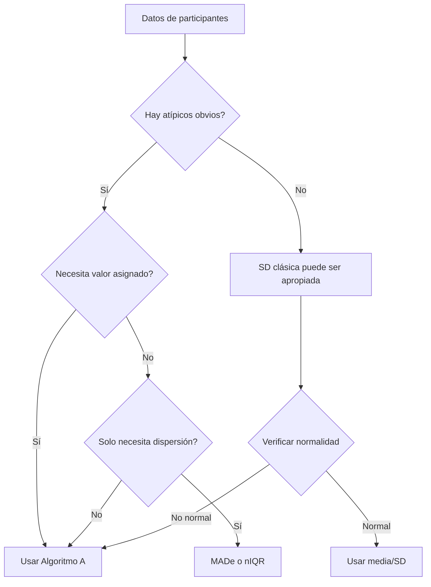

# pt_robust_stats.R: Estadísticos Robustos

## Descripción
Este archivo contiene estimadores estadísticos robustos utilizados para calcular valores asignados y desviaciones estándar resistentes a valores atípicos, implementando los métodos descritos en ISO 13528:2022.

## Ubicación
| Elemento | Valor |
|----------|-------|
| Archivo | `ptcalc/R/pt_robust_stats.R` |
| Líneas | 1 - 247 |

---

## Funciones

### `calculate_niqr(x)`
**Rango Intercuartil Normalizado**

$$nIQR = 0.7413 \times (Q_3 - Q_1)$$

| Parámetro | Tipo | Descripción |
|-----------|------|-------------|
| `x` | numeric vector | Datos de entrada |

**Retorna**: `NA_real_` si hay menos de 2 valores finitos, de lo contrario el nIQR.

**Referencia**: ISO 13528:2022 Sección 9.4

---

### `calculate_mad_e(x)`
**Desviación Absoluta Mediana Escalada (MADe)**

$$MADe = 1.483 \times \text{median}(|x_i - \text{median}(x)|)$$

| Parámetro | Tipo | Descripción |
|-----------|------|-------------|
| `x` | numeric vector | Datos de entrada |

**Retorna**: Estimador robusto de la desviación estándar.

**Referencia**: ISO 13528:2022 Sección 9.4

---

### `run_algorithm_a(values, ids, max_iter, tol)`
**Algoritmo A de ISO 13528**

Procedimiento iterativo para calcular estimaciones robustas de ubicación ($x^*$) y escala ($s^*$).

| Parámetro | Tipo | Default | Descripción |
|-----------|------|---------|-------------|
| `values` | numeric vector | - | Resultados de participantes |
| `ids` | character vector | NULL | Identificadores |
| `max_iter` | numeric | 50 | Máximo de iteraciones |
| `tol` | numeric | 1e-03 | Tolerancia de convergencia |

**Retorna**: Lista con `assigned_value`, `robust_sd`, `iterations`, `weights`, `converged`, `error`.

**Referencia**: ISO 13528:2022 Anexo C

---

## Flujo Visual del Algoritmo A

```mermaid
flowchart TD
    A[Inicio: vector de valores] --> B{n >= 3?}
    B -- No --> ERR[Error: Requiere al menos 3 observaciones]
    B -- Sí --> C[Inicializar x* = median, s* = 1.483 × MAD]
    C --> D{s* > 0?}
    D -- No --> E[Usar SD clásica como respaldo]
    D -- Sí --> F[Calcular residuos: u = (x - x*) / (1.5 × s*)]
    E --> F
    F --> G[Calcular pesos Huber]
    G --> H["w = 1 si |u| <= 1, sino w = 1/u²"]
    H --> I[Actualizar x* = Σ(w×x) / Σw]
    I --> J[Actualizar s* = √(Σw(x-x*)² / Σw)]
    J --> K{Δx < tol Y Δs < tol?}
    K -- No --> L{iter < max_iter?}
    L -- Sí --> F
    L -- No --> M[Retornar con converged=FALSE]
    K -- Sí --> N[Retornar con converged=TRUE]
```

---

## Ejemplo Numérico Detallado

Consideremos datos de un ensayo de aptitud con un valor atípico:

**Datos iniciales**: `[10.1, 10.2, 9.9, 10.0, 10.3, 50.0]` (el valor 50.0 es un atípico evidente)

### Iteración 0: Inicialización
| Paso | Cálculo | Resultado |
|------|---------|-----------|
| Mediana | median([10.1, 10.2, 9.9, 10.0, 10.3, 50.0]) | 10.05 |
| MAD | median(\|valores - 10.05\|) = median([0.05, 0.15, 0.15, 0.05, 0.25, 39.95]) | 0.15 |
| s* inicial | 1.483 × 0.15 | 0.222 |

### Iteración 1
| Participante | Valor | u = (x - 10.05)/(1.5 × 0.222) | \|u\| | Peso w |
|--------------|-------|------------------------------|-------|--------|
| 1 | 10.1 | 0.150 | 0.150 | 1.000 |
| 2 | 10.2 | 0.451 | 0.451 | 1.000 |
| 3 | 9.9 | -0.451 | 0.451 | 1.000 |
| 4 | 10.0 | -0.150 | 0.150 | 1.000 |
| 5 | 10.3 | 0.751 | 0.751 | 1.000 |
| 6 | 50.0 | **119.97** | 119.97 | **0.00007** |

**Cálculos**:
- $\sum w = 5.00007$
- $x^*_{new} = \frac{10.1 + 10.2 + 9.9 + 10.0 + 10.3 + 0.0035}{5.00007} = 10.10$
- $s^*_{new} = 0.141$

### Iteración 2
El valor atípico (50.0) recibe peso cercano a cero, eliminando su influencia.

| Paso | Valor |
|------|-------|
| x* | 10.10 |
| s* | 0.141 |
| Δx | 0.05 |
| Δs | 0.081 |

### Convergencia (típicamente 3-5 iteraciones)
| Iteración | x* | s* | Δ máximo |
|-----------|-------|-------|----------|
| 1 | 10.10 | 0.141 | 0.081 |
| 2 | 10.10 | 0.141 | 0.000 |
| 3 | 10.10 | 0.141 | 0.000 |

**Resultado final**: 
- Media robusta: $x^* = 10.10$
- SD robusta: $s^* = 0.141$
- El atípico (50.0) tiene peso efectivo ~0.0001

**Comparación con estadísticos clásicos**:
| Estadístico | Valor |
|-------------|-------|
| Media aritmética | 16.75 |
| Media robusta (x*) | 10.10 |
| SD clásica | 16.23 |
| SD robusta (s*) | 0.14 |

---

## Comportamiento de Convergencia

El Algoritmo A típicamente converge en 3-8 iteraciones dependiendo de:

1. **Proporción de atípicos**: Más atípicos = más iteraciones
2. **Magnitud de atípicos**: Atípicos extremos convergen más rápido (pesos cercanos a 0)
3. **Dispersión inicial**: Datos más dispersos requieren más iteraciones

```
Iteraciones típicas vs. proporción de atípicos:

% Atípicos  | Iteraciones promedio
------------|---------------------
0%          | 2-3
5%          | 3-4  
10%         | 4-5
20%         | 5-7
```

El factor 1.5 en el cálculo de $u$ (el "tuning constant") determina cuánta influencia se permite a observaciones moderadamente alejadas. Valores más pequeños son más resistentes pero menos eficientes con datos normales.

---

## Casos Límite

### Menos de 3 participantes
```r
run_algorithm_a(c(10.1, 10.2))
# Retorna:
# $error: "Algorithm A requires at least 3 valid observations."
# $assigned_value: NA_real_
# $converged: FALSE
```

**Razón**: Con menos de 3 puntos, los estimadores robustos no tienen sentido estadístico. La mediana y MAD requieren al menos 3 valores para ser informativos.

### Dispersión cero o casi cero
Si todos los valores son idénticos o muy similares:
```r
run_algorithm_a(c(10.0, 10.0, 10.0, 10.0))
# s* inicial = 0, se usa SD clásica como respaldo
# Si SD también = 0, retorna s* = 0 con assigned_value = valor único
```

### Valores no finitos
Los valores `NA`, `Inf`, `-Inf` son filtrados automáticamente antes del cálculo.

---

## Tabla Comparativa: MADe vs nIQR vs Algoritmo A

| Característica | MADe | nIQR | Algoritmo A |
|----------------|------|------|-------------|
| **Punto de ruptura** | 50% | 25% | ~50% |
| **Eficiencia (normal)** | 37% | 37% | ~95% |
| **Complejidad** | O(n log n) | O(n log n) | O(n × iter) |
| **Iterativo** | No | No | Sí |
| **Produce ubicación y escala** | Solo escala | Solo escala | Ambos |
| **Uso recomendado** | Inicialización | Alternativa | Valor final |

### Punto de ruptura (Breakdown Point)
El **punto de ruptura** es la proporción máxima de datos contaminados que el estimador puede tolerar antes de dar resultados arbitrariamente erróneos.

- **MADe**: Puede tolerar hasta 50% de valores atípicos
- **nIQR**: Tolera hasta 25% de valores atípicos
- **Algoritmo A**: Hereda el punto de ruptura de MADe (~50%)

### Eficiencia
La **eficiencia** indica qué tan bien funciona el estimador con datos normales comparado con el estimador óptimo (media/SD).

- Los estimadores robustos sacrifican eficiencia por resistencia a atípicos
- Algoritmo A recupera la eficiencia mediante ponderación iterativa

---

## Cuándo Usar Cada Estimador



---

## Implementación en R

### Uso básico
```r
# Calcular estadísticos robustos
values <- c(10.1, 10.2, 9.9, 10.0, 10.3, 50.0)

# MADe (escala robusta)
mad_e <- calculate_mad_e(values)  # 0.222

# nIQR (alternativa)
niqr <- calculate_niqr(values)  # 0.185

# Algoritmo A (ubicación y escala robustas)
result <- run_algorithm_a(values)
result$assigned_value  # 10.10
result$robust_sd       # 0.14
result$converged       # TRUE
```

### Inspección de pesos
```r
# Ver cómo se ponderan los participantes
result$weights
#   id value    weight standardized_residual
# 1  1  10.1    1.000                  0.000
# 2  2  10.2    1.000                  0.707
# ...
# 6  6  50.0    0.0001               282.84
```

---

## Referencias
- ISO 13528:2022 Sección 9.4 (Estimadores robustos de escala)
- ISO 13528:2022 Anexo C (Algoritmo A)
- Huber, P.J. (1981). Robust Statistics. Wiley.

---

## Documentos Relacionados
- [04_pt_homogeneity.md](04_pt_homogeneity.md) - Uso de ss como u_hom
- [07_valor_asignado.md](07_valor_asignado.md) - Cálculo del valor asignado por consenso
- [02_ptcalc_package.md](02_ptcalc_package.md) - Visión general del paquete
