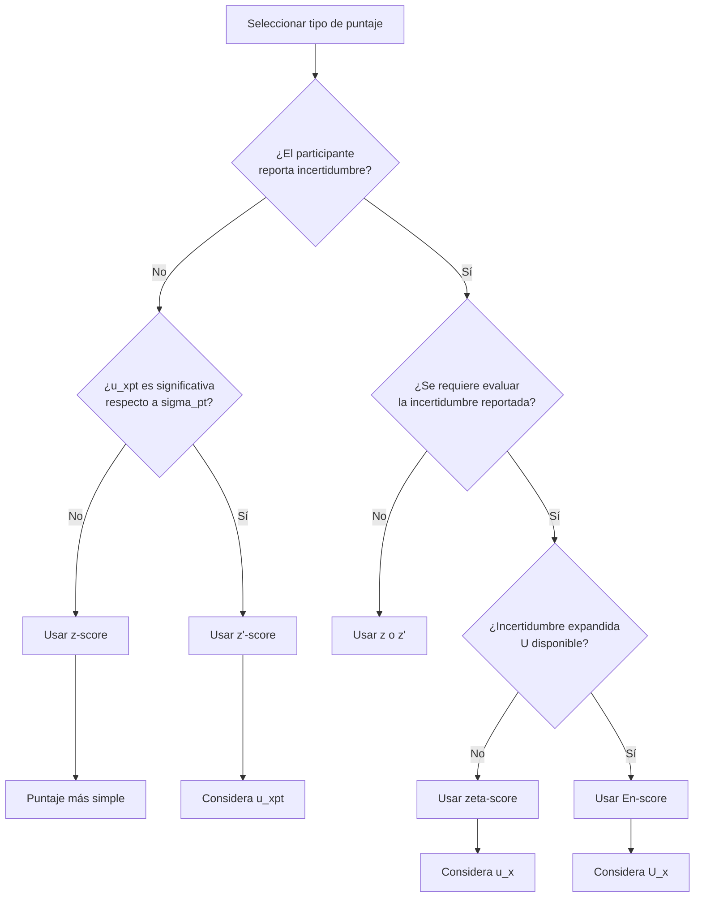
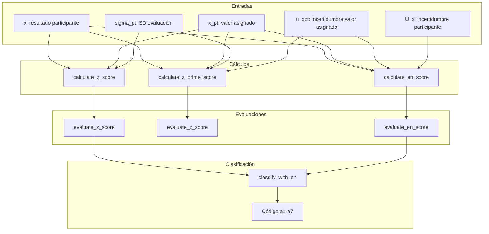

# pt_scores.R: Cálculo de Puntajes

## Descripción
Funciones para calcular y evaluar los puntajes de desempeño de participantes (z, z', ζ, En) según ISO 13528:2022 Sección 10. Estos puntajes permiten evaluar la competencia de los laboratorios participantes en ensayos de aptitud.

## Ubicación
| Elemento | Valor |
|----------|-------|
| Archivo | `ptcalc/R/pt_scores.R` |
| Líneas | 1 - 275 |

---

## Guía de Selección de Puntajes

### Cuándo Usar Cada Tipo de Puntaje



### Tabla Resumen de Puntajes

| Puntaje | Fórmula | Usa u_xpt | Usa u_x/U_x | Caso de uso |
|---------|---------|-----------|-------------|-------------|
| **z** | $(x - x_{pt}) / \sigma_{pt}$ | No | No | Evaluación básica |
| **z'** | $(x - x_{pt}) / \sqrt{\sigma_{pt}^2 + u_{xpt}^2}$ | Sí | No | u_xpt significativa |
| **ζ (zeta)** | $(x - x_{pt}) / \sqrt{u_x^2 + u_{xpt}^2}$ | Sí | u_x (std) | Evaluar incertidumbre |
| **En** | $(x - x_{pt}) / \sqrt{U_x^2 + U_{xpt}^2}$ | Sí | U_x (exp) | Comparación laboratorio |

---

## Funciones de Cálculo

### `calculate_z_score(x, x_pt, sigma_pt)`
**z-score básico**

$$z = \frac{x - x_{pt}}{\sigma_{pt}}$$

| Parámetro | Tipo | Descripción |
|-----------|------|-------------|
| `x` | numeric | Resultado del participante |
| `x_pt` | numeric | Valor asignado |
| `sigma_pt` | numeric | Desviación estándar para evaluación |

**Retorna**: z-score, o `NA_real_` si sigma_pt ≤ 0

**Ejemplo**:
```r
z <- calculate_z_score(x = 10.5, x_pt = 10.0, sigma_pt = 0.5)
# z = (10.5 - 10.0) / 0.5 = 1.0
```

---

### `calculate_z_prime_score(x, x_pt, sigma_pt, u_xpt)`
**z'-score (z prima)**

$$z' = \frac{x - x_{pt}}{\sqrt{\sigma_{pt}^2 + u_{xpt}^2}}$$

| Parámetro | Tipo | Descripción |
|-----------|------|-------------|
| `x` | numeric | Resultado del participante |
| `x_pt` | numeric | Valor asignado |
| `sigma_pt` | numeric | Desviación estándar para evaluación |
| `u_xpt` | numeric | Incertidumbre estándar del valor asignado |

**Cuándo usar**: Cuando $u_{xpt}$ es significativa respecto a $\sigma_{pt}$ (regla práctica: $u_{xpt} > 0.3 \times \sigma_{pt}$)

**Ejemplo**:
```r
zprime <- calculate_z_prime_score(x = 10.5, x_pt = 10.0, sigma_pt = 0.5, u_xpt = 0.1)
# denominador = sqrt(0.5² + 0.1²) = sqrt(0.26) = 0.51
# z' = 0.5 / 0.51 = 0.98
```

---

### `calculate_zeta_score(x, x_pt, u_x, u_xpt)`
**ζ-score (zeta)**

$$\zeta = \frac{x - x_{pt}}{\sqrt{u_x^2 + u_{xpt}^2}}$$

| Parámetro | Tipo | Descripción |
|-----------|------|-------------|
| `x` | numeric | Resultado del participante |
| `x_pt` | numeric | Valor asignado |
| `u_x` | numeric | Incertidumbre estándar del participante |
| `u_xpt` | numeric | Incertidumbre estándar del valor asignado |

**Interpretación especial**: Además de evaluar el resultado, permite evaluar si la incertidumbre reportada es realista.

---

### `calculate_en_score(x, x_pt, U_x, U_xpt)`
**En-score (Error normalizado)**

$$E_n = \frac{x - x_{pt}}{\sqrt{U_x^2 + U_{xpt}^2}}$$

| Parámetro | Tipo | Descripción |
|-----------|------|-------------|
| `x` | numeric | Resultado del participante |
| `x_pt` | numeric | Valor asignado |
| `U_x` | numeric | Incertidumbre expandida del participante (k=2) |
| `U_xpt` | numeric | Incertidumbre expandida del valor asignado (k=2) |

**Umbral diferente**: $|E_n| \leq 1$ es satisfactorio (no 2 como z-scores)

---

## Propagación de Incertidumbre

### Fórmula de u_xpt_def

La incertidumbre definitiva del valor asignado combina múltiples fuentes:

$$u_{xpt,def} = \sqrt{u_{xpt}^2 + u_{hom}^2 + u_{stab}^2}$$

| Componente | Origen | Cálculo |
|------------|--------|---------|
| $u_{xpt}$ | Método de asignación | Algoritmo A: $s^*/\sqrt{n}$, Referencia: incertidumbre certificada |
| $u_{hom}$ | Homogeneidad | $s_s$ (entre-muestras) |
| $u_{stab}$ | Estabilidad | 0 si cumple, $D/\sqrt{3}$ si no |

### Ejemplo de Propagación

| Fuente | Valor | $u^2$ |
|--------|-------|-------|
| Algoritmo A | $u_{xpt} = 0.015$ | 0.000225 |
| Homogeneidad | $u_{hom} = 0.008$ | 0.000064 |
| Estabilidad | $u_{stab} = 0.000$ | 0.000000 |
| **Total** | $u_{xpt,def} = 0.017$ | 0.000289 |

$$u_{xpt,def} = \sqrt{0.000225 + 0.000064 + 0} = 0.017$$

---

## Funciones de Evaluación

### `evaluate_z_score(z)` / `evaluate_z_score_vec(z)`
Clasificación de z, z' y ζ scores:

| Resultado | Criterio | Color sugerido |
|-----------|----------|----------------|
| Satisfactorio | $|z| \leq 2$ | Verde |
| Cuestionable | $2 < |z| < 3$ | Amarillo |
| No satisfactorio | $|z| \geq 3$ | Rojo |

### `evaluate_en_score(en)` / `evaluate_en_score_vec(en)`
Clasificación de En-score:

| Resultado | Criterio | Color sugerido |
|-----------|----------|----------------|
| Satisfactorio | $|E_n| \leq 1$ | Verde |
| No satisfactorio | $|E_n| > 1$ | Rojo |

**Nota**: En-score no tiene categoría "Cuestionable" porque usa incertidumbres expandidas (k=2) que ya incorporan un intervalo de confianza del 95%.

---

## Clasificación Combinada (a1-a7)

### `classify_with_en(score_val, en_val, U_xi, sigma_pt, mu_missing, score_label)`

Esta función combina z-score y En-score para una evaluación más completa del desempeño del laboratorio.

### Tabla de Clasificación Detallada

| Código | Descripción | z-score | En-score | U vs σ_pt | Interpretación |
|--------|-------------|---------|----------|-----------|----------------|
| **a1** | Totalmente satisfactorio | ≤2 | <1 | Normal | Resultado e incertidumbre correctos |
| **a2** | Satisfactorio pero conservador | ≤2 | <1 | ≥2σ | Resultado correcto, incertidumbre sobreestimada |
| **a3** | Satisfactorio con MU subestimada | ≤2 | ≥1 | - | Resultado correcto, incertidumbre subestimada |
| **a4** | Cuestionable pero aceptable | 2-3 | <1 | - | Resultado cuestionable, incertidumbre lo cubre |
| **a5** | Cuestionable e inconsistente | 2-3 | ≥1 | - | Resultado e incertidumbre problemáticos |
| **a6** | No satisfactorio pero MU cubre | ≥3 | <1 | - | Resultado malo, incertidumbre muy grande |
| **a7** | No satisfactorio (crítico) | ≥3 | ≥1 | - | Resultado e incertidumbre incorrectos |

### Diagrama de Clasificación

```
                    |En| < 1              |En| >= 1
           ┌─────────────────────┬─────────────────────┐
           │                     │                     │
  |z| ≤ 2  │   a1 (o a2 si U     │        a3           │
           │   conservadora)     │   MU subestimada    │
           │     [VERDE]         │   [VERDE CLARO]     │
           ├─────────────────────┼─────────────────────┤
           │                     │                     │
  2<|z|<3  │        a4           │        a5           │
           │   Cuestionable OK   │   Cuestionable mal  │
           │    [AMARILLO]       │   [NARANJA]         │
           ├─────────────────────┼─────────────────────┤
           │                     │                     │
  |z| ≥ 3  │        a6           │        a7           │
           │   MU cubre error    │     CRÍTICO         │
           │   [ROSA]            │   [ROJO]            │
           └─────────────────────┴─────────────────────┘
```

---

## Paleta de Colores de Referencia

### Constantes Exportadas

```r
PT_EN_CLASS_COLORS <- c(
  a1 = "#2E7D32",  # Verde oscuro - Excelente
  a2 = "#66BB6A",  # Verde medio - Conservador
  a3 = "#9CCC65",  # Verde claro - MU subestimada
  a4 = "#FFF59D",  # Amarillo claro - Cuestionable OK
  a5 = "#FBC02D",  # Amarillo/Naranja - Cuestionable mal
  a6 = "#EF9A9A",  # Rosa - No satisfactorio cubierto
  a7 = "#C62828",  # Rojo - Crítico
  mu_missing_z = "#90A4AE",       # Gris azulado - Sin MU (z)
  mu_missing_zprime = "#78909C"   # Gris oscuro - Sin MU (z')
)
```

### Visualización de Paleta

```
a1 ████ #2E7D32 - Totalmente satisfactorio
a2 ████ #66BB6A - Satisfactorio conservador  
a3 ████ #9CCC65 - Satisfactorio MU subestimada
a4 ████ #FFF59D - Cuestionable aceptable
a5 ████ #FBC02D - Cuestionable inconsistente
a6 ████ #EF9A9A - No satisfactorio cubierto
a7 ████ #C62828 - No satisfactorio crítico
```

---

## Ejemplos Prácticos

### Escenario 1: Laboratorio con Buen Resultado y Buena Incertidumbre
```r
x <- 10.05      # Resultado
x_pt <- 10.00   # Valor asignado
sigma_pt <- 0.5
u_xpt <- 0.03
U_x <- 0.20     # k=2

z <- calculate_z_score(x, x_pt, sigma_pt)           # 0.10
zprime <- calculate_z_prime_score(x, x_pt, sigma_pt, u_xpt)  # 0.10
en <- calculate_en_score(x, x_pt, U_x, 2*u_xpt)     # 0.25

# Evaluación: z satisfactorio, En satisfactorio
# Clasificación: a1 (Totalmente satisfactorio)
```

### Escenario 2: Laboratorio con Incertidumbre Subestimada
```r
x <- 10.80      # Resultado
x_pt <- 10.00
sigma_pt <- 0.5
u_xpt <- 0.03
U_x <- 0.10     # Incertidumbre muy pequeña

z <- calculate_z_score(x, x_pt, sigma_pt)           # 1.60 (satisfactorio)
en <- calculate_en_score(x, x_pt, U_x, 2*u_xpt)     # 7.69 (no satisfactorio)

# Clasificación: a3 (Satisfactorio pero MU subestimada)
# El resultado está bien pero la incertidumbre reportada es demasiado pequeña
```

### Escenario 3: Resultado Malo pero Incertidumbre Grande
```r
x <- 12.00      # Resultado muy desviado
x_pt <- 10.00
sigma_pt <- 0.5
u_xpt <- 0.03
U_x <- 2.50     # Incertidumbre muy grande

z <- calculate_z_score(x, x_pt, sigma_pt)           # 4.00 (no satisfactorio)
en <- calculate_en_score(x, x_pt, U_x, 2*u_xpt)     # 0.80 (satisfactorio)

# Clasificación: a6 (No satisfactorio pero MU cubre la desviación)
# El laboratorio sabe que tiene problemas pero no los ha resuelto
```

---

## Interpretación Visual de Puntajes

### Diagrama de z-score
```
     No sat.    Cuestionable    Satisfactorio    Cuestionable    No sat.
    ←───────────────────────────────────────────────────────────────────→
        -3           -2              0              +2           +3
    ████████   ▓▓▓▓▓▓▓▓▓   ░░░░░░░░░░░░░░░░░   ▓▓▓▓▓▓▓▓▓   ████████
      Rojo      Amarillo         Verde          Amarillo       Rojo
```

### Diagrama de En-score
```
           No satisfactorio    Satisfactorio    No satisfactorio
          ←─────────────────────────────────────────────────────→
              -1                    0                   +1
          █████████████   ░░░░░░░░░░░░░░░░░░░░   █████████████
              Rojo              Verde                Rojo
```

---

## Casos Sin Incertidumbre Reportada

Cuando el participante no reporta incertidumbre ($U_x$ ausente):

```r
classify_with_en(
  score_val = 1.5,
  en_val = NA,
  U_xi = NA,
  sigma_pt = 0.5,
  mu_missing = TRUE,
  score_label = "z"
)
# Retorna:
# $code: "mu_missing_z"
# $label: "MU ausente - solo z: Satisfactorio"
```

En estos casos:
- Solo se evalúa el z-score (o z'-score)
- Se indica claramente que falta la incertidumbre
- Se usa color gris en las visualizaciones

---

## Flujo de Cálculo en la Aplicación



---

## Consideraciones Estadísticas

### Distribución de z-scores
En una población de laboratorios competentes, los z-scores deberían:
- Seguir aproximadamente N(0,1)
- ~95% dentro de ±2
- ~99.7% dentro de ±3

### Análisis de Patrones
| Patrón observado | Posible causa |
|------------------|---------------|
| Media z ≠ 0 | Sesgo sistemático en x_pt |
| SD(z) >> 1 | sigma_pt subestimado |
| SD(z) << 1 | sigma_pt sobreestimado |
| Asimetría | Sesgo en algunos laboratorios |

---

## Referencias
- ISO 13528:2022 Sección 10.2 (z-score)
- ISO 13528:2022 Sección 10.3 (z'-score)
- ISO 13528:2022 Sección 10.4 (zeta-score)
- ISO 13528:2022 Sección 10.5 (En-score)
- ILAC-G13:08/2007 (Guía para ensayos de aptitud)

---

## Documentos Relacionados
- [03_pt_robust_stats.md](03_pt_robust_stats.md) - Cálculo de x_pt y sigma_pt
- [04_pt_homogeneity.md](04_pt_homogeneity.md) - u_hom y u_stab
- [09_puntajes_pt.md](09_puntajes_pt.md) - Interfaz de usuario para puntajes
- [10_informe_global.md](10_informe_global.md) - Mapas de calor de clasificación
