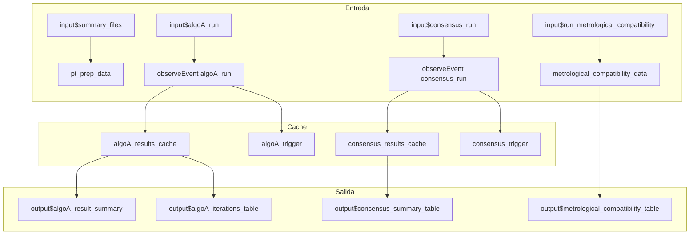
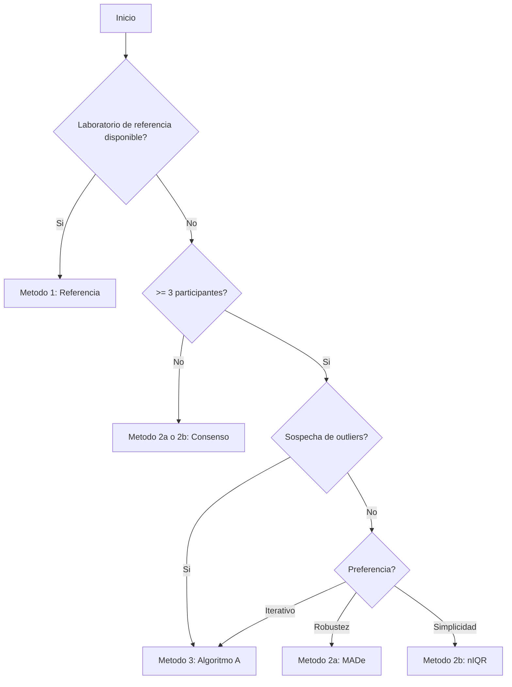

# Modulo: Valor Asignado

## Descripcion General

| Propiedad | Valor |
|-----------|-------|
| Archivo | `cloned_app.R` |
| Lineas UI | 877-946 (tabPanel "Valor asignado") |
| Lineas Logica | 642-715 (observeEvent algoA_run), 2480-2658 (compatibilidad) |
| Dependencias | `pt_prep_data()`, `algoA_results_cache()`, `consensus_results_cache()` |
| Norma ISO | ISO 13528:2022 Seccion 6 |

Este modulo gestiona el calculo del valor asignado ($x_{pt}$) utilizando diferentes metodos segun la disponibilidad de datos y las preferencias del usuario.

---

## Metodos Disponibles para Valor Asignado

| Metodo | Codigo | Formula x_pt | Formula sigma_pt | Cuando Usar |
|--------|--------|--------------|------------------|-------------|
| Referencia | 1 | $\bar{x}_{ref}$ | DE del laboratorio ref | Laboratorio de referencia disponible |
| Consenso MADe | 2a | Mediana | $1.483 \times MAD$ | Sin referencia, preferir robustez a outliers |
| Consenso nIQR | 2b | Mediana | $0.7413 \times IQR$ | Sin referencia, alternativa a MADe |
| Algoritmo A | 3 | $x^*$ (robusto) | $s^*$ (robusto) | Sin referencia, >= 3 participantes |

---

## Mapa de Componentes UI

| Elemento UI | Input ID | Output ID | Tipo | Descripcion |
|-------------|----------|-----------|------|-------------|
| Boton Algoritmo A | `algoA_run` | - | actionButton | Ejecuta Algoritmo A |
| Boton Consenso | `consensus_run` | - | actionButton | Calcula valores consenso |
| Boton Compatibilidad | `run_metrological_compatibility` | - | actionButton | Evalua compatibilidad |
| Selector Analito | `assigned_pollutant` | `assigned_pollutant_selector` | selectInput | Filtra por contaminante |
| Selector n | `assigned_n` | `assigned_n_selector` | selectInput | Esquema PT (n participantes) |
| Selector Nivel | `assigned_level` | `assigned_level_selector` | selectInput | Nivel de concentracion |
| Iteraciones Max | `algoA_max_iter` | - | numericInput | Limite iteraciones Algo A |
| Resumen Algo A | - | `algoA_result_summary` | uiOutput | Resultado del algoritmo |
| Tabla entrada | - | `algoA_input_table` | dataTableOutput | Datos de participantes |
| Histograma | - | `algoA_histogram` | plotlyOutput | Distribucion de valores |
| Iteraciones | - | `algoA_iterations_table` | dataTableOutput | Historial de iteraciones |
| Resumen consenso | - | `consensus_summary_table` | tableOutput | Estadisticos de consenso |
| Tabla referencia | - | `reference_table` | dataTableOutput | Valores de referencia |
| Compatibilidad | - | `metrological_compatibility_table` | dataTableOutput | Evaluacion compatibilidad |

---

## Flujo Reactivo



---

## Algoritmo A - Detalle de Implementacion

### Proceso del observeEvent (lineas 642-715)

```r
observeEvent(input$algoA_run, {
  # 1. Obtener datos de participantes
  data <- isolate(pt_prep_data())
  
  # 2. Obtener todas las combinaciones (pollutant, n_lab, level)
  combos <- data %>% distinct(pollutant, n_lab, level)
  
  # 3. Para cada combinacion:
  for (i in seq_len(nrow(combos))) {
    # 3.1 Filtrar participantes (excluir "ref")
    participants <- subset_data %>% filter(participant_id != "ref")
    
    # 3.2 Agregar resultados por participante
    aggregated <- participants %>%
      group_by(participant_id) %>%
      summarise(Resultado = mean(mean_value, na.rm = TRUE))
    
    # 3.3 Verificar minimo 3 participantes
    if (nrow(aggregated) < 3) {
      # Error: insuficientes participantes
    }
    
    # 3.4 Ejecutar run_algorithm_a()
    algo_res <- run_algorithm_a(
      values = aggregated$Resultado,
      ids = aggregated$participant_id,
      max_iter = max_iter
    )
  }
  
  # 4. Almacenar en cache
  algoA_results_cache(results)
  algoA_trigger(Sys.time())
})
```

### Clave de Cache

Las claves de cache usan el formato: `"pollutant||n_lab||level"` generado por `algo_key()`.

---

## Valor Consenso - Detalle

### Estadisticos Calculados

| Estadistico | Formula | Descripcion |
|-------------|---------|-------------|
| x_pt(2) | `median(valores)` | Valor asignado robusto |
| sigma_pt_2a | `1.483 * median(abs(x - median(x)))` | MADe |
| sigma_pt_2b | `0.7413 * IQR(x)` | nIQR |
| u_xpt | `1.25 * sigma_pt / sqrt(n)` | Incertidumbre del valor asignado |

---

## Compatibilidad Metrologica

### Formula de Evaluacion

La compatibilidad entre valor de referencia y consenso se evalua mediante:

$$|x_{pt,ref} - x_{pt,consenso}| \leq \sqrt{u_{xpt,def,consenso}^2 + u_{ref}^2}$$

donde:
- $u_{xpt,def} = \sqrt{u_{xpt}^2 + u_{hom}^2 + u_{stab}^2}$
- $u_{ref} = k \times \frac{s_{ref}}{\sqrt{m}}$

### Tabla de Resultados

| Columna | Descripcion |
|---------|-------------|
| `x_pt_ref` | Valor asignado de referencia |
| `u_ref` | Incertidumbre de referencia |
| `x_pt_2a` | Valor consenso (MADe) |
| `Diff_Ref_2a` | $|x_{pt,ref} - x_{pt,2a}|$ |
| `Crit_Ref_2a` | Criterio de compatibilidad |
| `Eval_Ref_2a` | "Compatible" / "No Compatible" |

---

## Guia de Seleccion de Metodo



---

## Pestanas del Modulo

### 1. Algoritmo A
- Resumen del valor asignado y desviacion robusta
- Tabla de datos de entrada
- Histograma de resultados
- Tabla de iteraciones (convergencia)

### 2. Valor Consenso
- Tabla resumen con x_pt(2), sigma_pt_2a, sigma_pt_2b
- Numero de participantes
- Datos de participantes utilizados

### 3. Valor de Referencia
- Datos declarados como referencia (`participant_id == "ref"`)
- Valores por analito y nivel

### 4. Compatibilidad Metrologica
- Diferencias entre referencia y cada metodo de consenso
- Criterios de evaluacion
- Estado de compatibilidad

---

## Formulas de Incertidumbre

### Incertidumbre del Valor Asignado (u_xpt)
$$u_{xpt} = 1.25 \times \frac{\sigma_{pt}}{\sqrt{n}}$$

### Incertidumbre Definitiva (u_xpt_def)
$$u_{xpt,def} = \sqrt{u_{xpt}^2 + u_{hom}^2 + u_{stab}^2}$$

### Incertidumbre Expandida
$$U_{xpt} = k \times u_{xpt,def}$$

donde $k = 2$ (factor de cobertura por defecto para 95% de confianza)

---

## Estados de Error

| Estado | Mensaje | Causa |
|--------|---------|-------|
| Datos insuficientes | "Se requieren al menos tres participantes para ejecutar el Algoritmo A" | n < 3 |
| Sin referencia | "No se encontro informacion del participante de referencia" | participant_id == "ref" ausente |
| Sin convergencia | Error en iteraciones | Algoritmo A no converge |

---

## Referencias

- ISO 13528:2022 Seccion 6.3 (Valor asignado por consenso)
- ISO 13528:2022 Anexo C (Algoritmo A)
- ISO 13528:2022 Seccion 6.5 (Incertidumbre del valor asignado)
