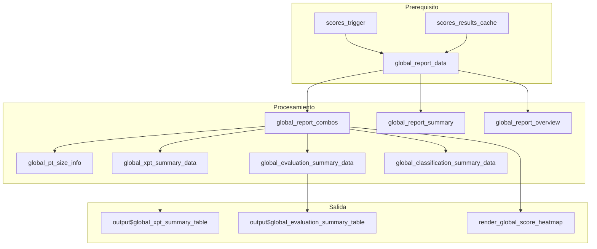

# Modulo: Informe Global

## Descripcion General

| Propiedad | Valor |
|-----------|-------|
| Archivo | `cloned_app.R` |
| Lineas UI | 984-1084 (tabPanel "Informe global") |
| Lineas Logica | 2138-2478 (global_report_data, reactivos de resumen) |
| Dependencias | `scores_trigger()`, `scores_results_cache()` |
| Norma ISO | ISO 13528:2022 Seccion 10 |

Este modulo proporciona una vista consolidada de resultados de todos los participantes mediante tablas resumen y mapas de calor interactivos para cada metodo de valor asignado.

---

## Mapa de Componentes UI

| Elemento UI | Input ID | Output ID | Tipo | Descripcion |
|-------------|----------|-----------|------|-------------|
| Selector Analito | `global_report_pollutant` | `global_report_pollutant_selector` | selectInput | Filtro contaminante |
| Selector n | `global_report_n_lab` | `global_report_n_selector` | selectInput | Esquema PT |
| Selector Nivel | `global_report_level` | `global_report_level_selector` | selectInput | Nivel concentracion |
| Info tamano PT | - | `global_report_pt_size_info` | uiOutput | Participantes + ref |
| Tabla x_pt | - | `global_xpt_summary_table` | dataTableOutput | Resumen valores asignados |
| Tabla niveles | - | `global_level_summary_table` | tableOutput | Orden de corrida |
| Tabla evaluaciones | - | `global_evaluation_summary_table` | dataTableOutput | Conteo por evaluacion |
| Params Ref | - | `global_params_ref` | tableOutput | Parametros metodo 1 |
| Overview Ref | - | `global_overview_ref` | dataTableOutput | Puntajes metodo 1 |
| Heatmaps z/z'/zeta/En | - | `global_heatmap_*_ref` | plotlyOutput | Mapas de calor metodo 1 |

*(Similar para consensus_ma, consensus_niqr, algo)*

---

## Flujo Reactivo



---

## Reactive: global_report_data()

### Ubicacion
Lineas 2138-2245 en `cloned_app.R`

### Proposito
Agrega todos los resultados de puntajes del cache en estructuras unificadas.

### Retorno
```r
list(
  error = NULL,                    # NULL si hay datos
  summary = tibble(...),           # Resumen por combinacion
  overview = tibble(...),          # Puntajes por participante
  combos = tibble(...),            # Datos completos de combos
  errors = tibble(...)             # Errores encontrados
)
```

### Estructura de combos
| Columna | Tipo | Descripcion |
|---------|------|-------------|
| pollutant | character | Contaminante |
| n_lab | character | Numero de laboratorio |
| level | character | Nivel |
| participant_id | character | ID participante |
| result | numeric | Resultado medido |
| x_pt | numeric | Valor asignado |
| sigma_pt | numeric | Desviacion estandar aptitud |
| z_score | numeric | Puntaje z |
| z_score_eval | character | Evaluacion z |
| z_prime_score | numeric | Puntaje z' |
| zeta_score | numeric | Puntaje zeta |
| En_score | numeric | Puntaje En |
| combination | character | Nombre metodo |
| combination_label | character | Codigo metodo (1, 2a, 2b, 3) |
| combo_key | character | Clave interna (ref, consensus_ma, etc) |

---

## Paleta de Colores para Heatmaps

```r
score_heatmap_palettes <- list(
  z = c(
    "Satisfactorio" = "#00B050",      # Verde
    "Cuestionable" = "#FFEB3B",       # Amarillo
    "No satisfactorio" = "#D32F2F",   # Rojo
    "N/A" = "#BDBDBD"                 # Gris
  ),
  zprime = c(...),  # Igual que z
  zeta = c(...),    # Igual que z
  en = c(
    "Satisfactorio" = "#00B050",
    "Cuestionable" = "#D32F2F",       # Solo 2 estados para En
    "No satisfactorio" = "#D32F2F",
    "N/A" = "#BDBDBD"
  )
)
```

---

## Funcion: render_global_score_heatmap()

### Ubicacion
Lineas 2845-2926 en `cloned_app.R`

### Proposito
Genera mapas de calor interactivos de puntajes por participante y nivel.

### Parametros
```r
render_global_score_heatmap(
  output_id,     # character: ID del output (ej: "global_heatmap_z_ref")
  combo_key,     # character: clave del combo (ref, consensus_ma, etc)
  score_col,     # character: columna de puntaje (z_score, z_prime_score, etc)
  eval_col,      # character: columna de evaluacion (z_score_eval, etc)
  palette,       # named vector: colores por evaluacion
  title_prefix   # character: prefijo del titulo
)
```

### Proceso
1. Filtra datos por pollutant, n_lab, combination_label
2. Excluye participante "ref"
3. Crea grid base (participant_id x level)
4. Une con datos de puntajes
5. Genera heatmap con ggplot + geom_tile
6. Convierte a plotly para interactividad

---

## Pestanas del Modulo

### 1. Resumen Global
- **Tabla x_pt**: Valores asignados, incertidumbres, sigma_pt por metodo
- **Tabla niveles**: Orden de corrida por nivel
- **Tabla evaluaciones**: Conteo de Satisfactorio/Cuestionable/No satisfactorio

### 2-5. Pestanas por Metodo (Referencia, Consenso MADe, Consenso nIQR, Algoritmo A)

Cada pestana incluye:
- **Parametros principales**: x_pt, sigma_pt, u(x_pt)
- **Resultados por participante**: Tabla con todos los puntajes
- **Mapas de calor** (2x2 grid):
  - Puntaje z
  - Puntaje z'
  - Puntaje zeta
  - Puntaje En

---

## Logica de Agregacion

### global_xpt_summary_data()
```r
combos %>%
  group_by(pollutant, n_lab, level, combination, combination_label) %>%
  summarise(
    x_pt = first(x_pt),
    u_xpt = first(u_xpt),
    u_xpt_def = first(u_xpt_def),
    sigma_pt = first(sigma_pt),
    k_factor = first(k_factor)
  ) %>%
  mutate(expanded_uncertainty = k_factor * u_xpt_def)
```

### global_evaluation_summary_data()
Pivotea evaluaciones y cuenta por categoria:
```r
combos %>%
  filter(participant_id != "ref") %>%
  pivot_longer(
    cols = c(z_score_eval, zeta_score_eval, En_score_eval),
    names_to = "score_type",
    values_to = "evaluation"
  ) %>%
  count(pollutant, n_lab, level, combination, score_type, evaluation) %>%
  mutate(Porcentaje = (Conteo / Total) * 100)
```

---

## Filtrado de Participantes

Los participantes con `participant_id == "ref"` se excluyen de:
- Mapas de calor
- Conteos de evaluacion
- Resumen de clasificacion

Esto asegura que solo se evaluen los participantes del ensayo, no el laboratorio de referencia.

---

## Especificaciones de Metodos

```r
global_combo_specs <- list(
  ref = list(
    title = "Referencia (1)",
    label = "1",
    tab = "z1 - Referencia (1)"
  ),
  consensus_ma = list(
    title = "Consenso MADe (2a)",
    label = "2a",
    tab = "z2a - Consenso MADe (2a)"
  ),
  consensus_niqr = list(
    title = "Consenso nIQR (2b)",
    label = "2b",
    tab = "z2b - Consenso nIQR (2b)"
  ),
  algo = list(
    title = "Algoritmo A (3)",
    label = "3",
    tab = "z3 - Algoritmo A (3)"
  )
)
```

---

## Estados de Error

| Estado | Mensaje | Causa |
|--------|---------|-------|
| Sin calculo | "Calcule los puntajes para habilitar el reporte global" | scores_trigger() == NULL |
| Sin resultados | "No se generaron resultados globales" | Cache vacio |
| Sin datos | "No hay datos disponibles para esta combinacion" | Filtro sin resultados |

---

## Consideraciones de Rendimiento

- Los heatmaps se generan dinamicamente para cada pestana
- El filtrado por pollutant/n_lab/level reduce el conjunto de datos
- Los niveles se ordenan numericamente cuando es posible
- Se usa `plotly::ggplotly()` para interactividad sin recalcular

---

## Referencias

- ISO 13528:2022 Seccion 10 (Informe del proveedor de PT)
- ISO 17043:2024 Seccion 7 (Presentacion de resultados)
