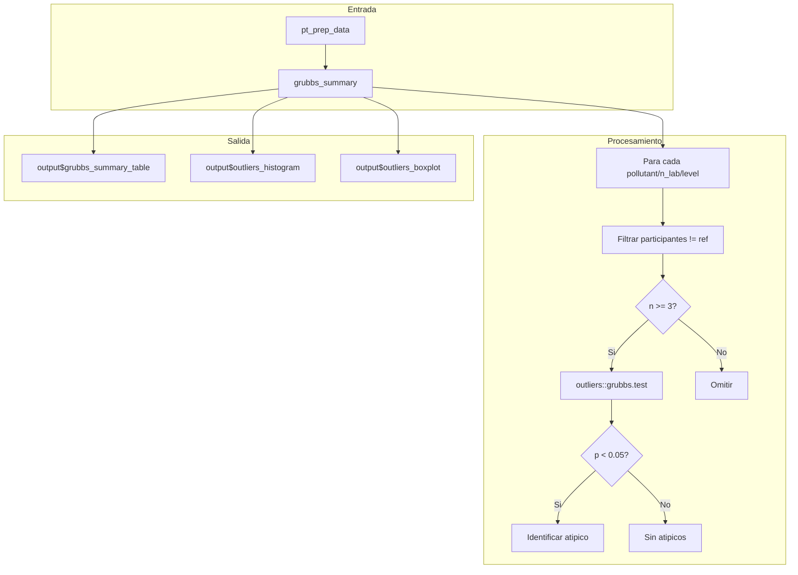

# Modulo: Valores Atipicos

## Descripcion General

| Propiedad | Valor |
|-----------|-------|
| Archivo | `cloned_app.R` |
| Lineas UI | 858-876 (tabPanel "Valores Atipicos") |
| Lineas Logica | 3801-3870 (grubbs_summary) |
| Libreria | `outliers` |
| Dependencias | `pt_prep_data()` |
| Norma ISO | ISO 13528:2022 Seccion 7.3 |

Este modulo implementa la deteccion de valores anomalos mediante la prueba de Grubbs, permitiendo identificar participantes con resultados estadisticamente extremos.

---

## Mapa de Componentes UI

| Elemento UI | Input ID | Output ID | Tipo | Descripcion |
|-------------|----------|-----------|------|-------------|
| Tabla Grubbs | - | `grubbs_summary_table` | dataTableOutput | Resumen de pruebas |
| Selector Analito | `outliers_pollutant` | `outliers_pollutant_selector` | selectInput | Filtro contaminante |
| Selector Nivel | `outliers_level` | `outliers_level_selector` | selectInput | Filtro nivel |
| Histograma | - | `outliers_histogram` | plotlyOutput | Distribucion con densidad |
| Diagrama de caja | - | `outliers_boxplot` | plotlyOutput | Boxplot con atipicos |

---

## Flujo Reactivo



---

## Metodo: Prueba de Grubbs

### Descripcion
La prueba de Grubbs detecta un valor atipico en un conjunto de datos univariado bajo la hipotesis de normalidad.

### Estadistico de Prueba
$$G = \frac{\max|x_i - \bar{x}|}{s}$$

donde:
- $\bar{x}$ = media muestral
- $s$ = desviacion estandar muestral

### Hipotesis
- **H0**: No hay valores atipicos
- **H1**: Existe al menos un valor atipico

### Criterio de Decision
- Si $p < 0.05$: Se detecta un valor atipico (rechazar H0)
- Si $p \geq 0.05$: No se detecta valor atipico (no rechazar H0)

### Requisitos
- Minimo 3 observaciones ($n \geq 3$)
- Datos aproximadamente normales

---

## Reactive: grubbs_summary()

### Ubicacion
Lineas 3801-3870 en `cloned_app.R`

### Proceso
```r
grubbs_summary <- reactive({
  req(pt_prep_data())
  data <- pt_prep_data()
  
  # Obtener todas las combinaciones
  combos <- data %>% distinct(pollutant, n_lab, level)
  
  for (i in 1:nrow(combos)) {
    # Filtrar datos excluyendo referencia
    subset_data <- data %>%
      filter(pollutant == pol, n_lab == n, level == lev, participant_id != "ref")
    
    n_eval <- nrow(subset_data)
    
    if (n_eval >= 3) {
      # Ejecutar prueba de Grubbs
      test_res <- outliers::grubbs.test(subset_data$mean_value)
      p_val <- test_res$p.value
      
      if (p_val < 0.05) {
        # Identificar el valor atipico (maximo z-score)
        vals <- subset_data$mean_value
        z_vals <- abs(vals - mean(vals)) / sd(vals)
        idx_max <- which.max(z_vals)
        outlier_participant <- subset_data$participant_id[idx_max]
        outlier_value <- vals[idx_max]
      }
    }
  }
})
```

### Retorno
```r
data.frame(
  Contaminante = character(),           # Nombre del contaminante
  Nivel = character(),                  # Nivel de concentracion
  Participantes_Evaluados = integer(),  # Numero de participantes
  Valor_p = character(),                # Valor p formateado
  Atipicos_detectados = integer(),      # 0 o 1
  Participante = character(),           # ID del atipico o "NA"
  Valor_Atipico = character()           # Valor del atipico o "NA"
)
```

---

## Estructura de la Tabla de Resultados

| Columna | Tipo | Descripcion |
|---------|------|-------------|
| Contaminante | character | SO2, CO, O3, NO/NO2 |
| Nivel | character | bajo, medio, alto |
| Participantes_Evaluados | integer | Numero de labs evaluados |
| Valor_p | character | p-value de la prueba (4 decimales) |
| Atipicos_detectados | integer | 0 = ninguno, 1 = detectado |
| Participante | character | ID del lab atipico o "NA" |
| Valor_Atipico | character | Valor medido (3 decimales) o "NA" |

---

## Visualizaciones

### Histograma con Curva de Densidad

```r
output$outliers_histogram <- renderPlotly({
  data <- filtered_data()
  
  ggplot(data, aes(x = mean_value)) +
    geom_histogram(aes(y = after_stat(density)), bins = 15, fill = "skyblue", color = "black") +
    geom_density(alpha = 0.3, fill = "lightblue") +
    labs(title = "Distribucion de Resultados", x = "Valor", y = "Densidad") +
    theme_minimal()
})
```

### Diagrama de Caja con Atipicos Resaltados

```r
output$outliers_boxplot <- renderPlotly({
  data <- filtered_data()
  
  ggplot(data, aes(x = "", y = mean_value)) +
    geom_boxplot(fill = "lightgreen", outlier.colour = "red", outlier.size = 3) +
    labs(title = "Diagrama de Caja", x = NULL, y = "Valor") +
    theme_minimal()
})
```

---

## Identificacion del Valor Atipico

Cuando se detecta un atipico, se identifica mediante:

```r
# Calcular z-scores
vals <- subset_data$mean_value
mean_val <- mean(vals)
sd_val <- sd(vals)
z_vals <- abs(vals - mean_val) / sd_val

# El atipico es el de mayor z-score absoluto
idx_max <- which.max(z_vals)
outlier_participant <- subset_data$participant_id[idx_max]
outlier_value <- vals[idx_max]
```

---

## Integracion con Calculo de Puntajes

### Pregunta: Se excluyen los atipicos del calculo?

**Respuesta**: No automaticamente. La deteccion de atipicos es informativa. El coordinador del ensayo debe decidir si excluir manualmente los datos atipicos de los archivos de entrada.

### Flujo Recomendado
1. Cargar datos y ejecutar analisis
2. Revisar tabla de valores atipicos
3. Si se detectan atipicos significativos:
   - Investigar causa (error de medicion, problema del lab)
   - Decidir si excluir del calculo
   - Modificar archivos CSV si corresponde
   - Re-ejecutar analisis

---

## Limitaciones de la Prueba

| Limitacion | Descripcion | Mitigacion |
|------------|-------------|------------|
| Un atipico a la vez | Solo detecta el mas extremo | Ejecutar iterativamente |
| Asume normalidad | Puede fallar con datos no normales | Verificar histograma |
| Sensible a n | Menos potencia con pocos datos | n >= 7 recomendado |
| Solo univariado | No considera correlaciones | Usar para cada nivel separado |

---

## Estados de Error

| Estado | Comportamiento | Causa |
|--------|----------------|-------|
| n < 3 | Se omite la prueba | Muy pocos participantes |
| Error en test | Se registra en consola | Datos invalidos |
| Sin datos | Tabla vacia | pt_prep_data() no disponible |

---

## Ejemplo de Interpretacion

### Caso 1: Sin Atipicos
```
Contaminante: SO2
Nivel: bajo
Participantes: 8
Valor_p: 0.2341
Atipicos: 0
```
**Interpretacion**: Los datos son consistentes, no hay evidencia de valores extremos.

### Caso 2: Atipico Detectado
```
Contaminante: CO
Nivel: alto
Participantes: 10
Valor_p: 0.0023
Atipicos: 1
Participante: LAB07
Valor: 12.543
```
**Interpretacion**: LAB07 reporto un valor significativamente diferente. Investigar si hubo error de medicion o problema de calibracion.

---

## Referencias

- ISO 13528:2022 Seccion 7.3 (Deteccion de valores atipicos)
- Grubbs, F. E. (1969). "Procedures for Detecting Outlying Observations in Samples"
- Paquete R `outliers`: https://cran.r-project.org/package=outliers
