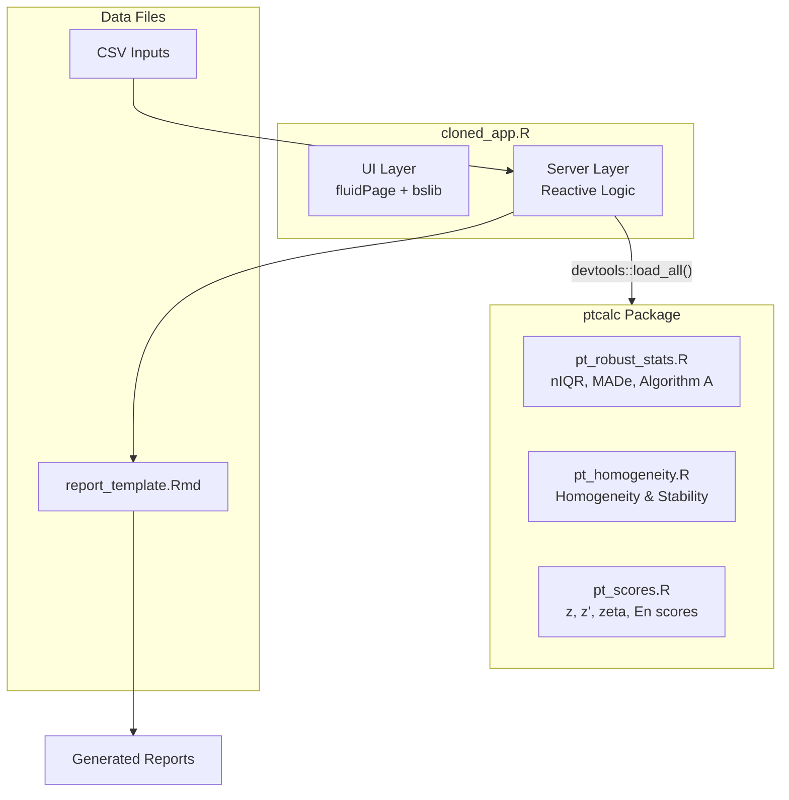
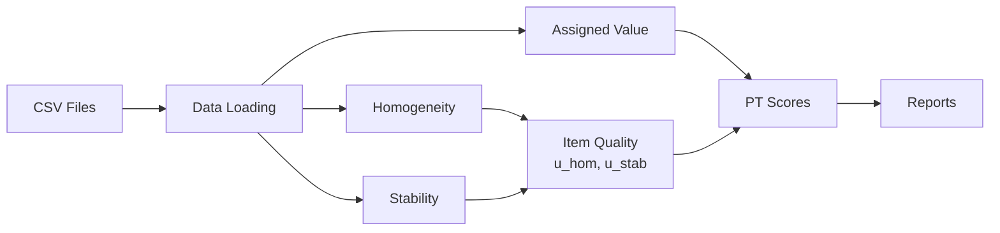

# Proficiency Testing Application for Criterion Pollutant Gases

## Documentation for the Refactored Application

This documentation corresponds to the refactored version of the proficiency testing application, implementing a **separation of concerns** between:

- **`ptcalc/`**: R package with pure mathematical functions (ISO 13528/17043)
- **`cloned_app.R`**: Shiny reactive logic for the user interface

---

## Quick Start

```r
# 1. Set working directory
setwd("/path/to/pt_app")

# 2. Launch the application
shiny::runApp("cloned_app.R")
```

For detailed setup instructions, see [00_quickstart.md](00_quickstart.md).

---

## Software Requirements

### R Version
- **Minimum:** R 4.1.0
- **Recommended:** R 4.3.0+

### Package Dependencies

| Package | Version | Purpose |
|---------|---------|---------|
| shiny | >= 1.7.0 | Web framework |
| bslib | >= 0.4.0 | Bootstrap 5 theming |
| tidyverse | >= 1.3.0 | Data manipulation (dplyr, tidyr, ggplot2) |
| vroom | >= 1.5.0 | Fast CSV parsing |
| DT | >= 0.20 | Interactive data tables |
| rhandsontable | >= 0.3.8 | Editable spreadsheet widget |
| plotly | >= 4.10.0 | Interactive visualizations |
| patchwork | >= 1.1.0 | Plot composition |
| outliers | >= 0.15 | Grubbs test for outliers |
| rmarkdown | >= 2.14 | Report generation |
| devtools | >= 2.4.0 | Package development tools |
| shinythemes | >= 1.2.0 | UI themes |
| bsplus | >= 0.1.4 | Bootstrap extensions |

### Installation

```r
# Install all dependencies
install.packages(c(
  "shiny", "bslib", "tidyverse", "vroom", "DT",
  "rhandsontable", "plotly", "patchwork", "outliers",
  "rmarkdown", "devtools", "shinythemes", "bsplus"
))
```

---

## System Architecture



---

## Data Flow



---

## Example Data

Sample data files are provided in the `data/` directory:

| File | Description |
|------|-------------|
| `homogeneity.csv` | Homogeneity test measurements |
| `stability.csv` | Stability test measurements |
| `summary_n4.csv` | Participant results (n=4 scenario) |
| `summary_n7.csv` | Participant results (n=7 scenario) |
| `summary_n10.csv` | Participant results (n=10 scenario) |
| `summary_n13.csv` | Participant results (n=13 scenario) |

### Loading Example Data

```r
# Read homogeneity data
hom_data <- vroom::vroom("data/homogeneity.csv")

# Read participant summary
summary_data <- vroom::vroom("data/summary_n7.csv")
```

---

## Module Index

### Getting Started
- [Quick Start Guide](00_quickstart.md) - Installation and first analysis
- [Glossary](00_glossary.md) - Spanish/English terminology reference

### ptcalc Package
1. [Package Overview](02_ptcalc_package.md) - Architecture and exports
2. [Robust Statistics](03_pt_robust_stats.md) - nIQR, MADe, Algorithm A
3. [Homogeneity & Stability](04_pt_homogeneity.md) - Item quality assessment
4. [Score Calculations](05_pt_scores.md) - z, z', zeta, En formulas

### Shiny Application
5. [Data Loading](01_carga_datos.md) - File upload and validation
6. [Homogeneity Module](06_shiny_homogeneidad.md) - UI components
7. [Assigned Value](07_valor_asignado.md) - Consensus and reference methods
8. [Metrological Compatibility](08_compatibilidad.md) - D_2a, D_2b
9. [PT Scores](09_puntajes_pt.md) - Score computation and display
10. [Global Report](10_informe_global.md) - Summary heatmaps
11. [Participant Detail](11_participantes.md) - Individual results
12. [Report Generation](12_generacion_informes.md) - RMarkdown export
13. [Outlier Detection](13_valores_atipicos.md) - Grubbs test
14. [Report Template](14_report_template.md) - RMarkdown structure

---

## Troubleshooting

### Application Won't Start

**Problem:** Error loading ptcalc package

```r
# Solution: Manually load the package
devtools::load_all("ptcalc")
```

**Problem:** Missing dependencies

```r
# Check which packages are missing
required <- c("shiny", "bslib", "tidyverse", "vroom", "DT", 
              "rhandsontable", "plotly", "patchwork", "outliers",
              "rmarkdown", "devtools", "shinythemes", "bsplus")
missing <- required[!required %in% installed.packages()[,"Package"]]
if(length(missing)) install.packages(missing)
```

### Data Loading Errors

**Problem:** "Column not found" error

Ensure your CSV files contain the required columns with exact names:
- Homogeneity/Stability: `pollutant`, `level`, `replicate`, `value`
- Summary files: `participant_id`, `pollutant`, `level`, `mean_value`, `sd_value`

**Problem:** File name pattern not recognized

Summary files must follow the pattern `summary_n{N}.csv` where `{N}` is an integer:
- Valid: `summary_n7.csv`, `summary_n10.csv`
- Invalid: `summary_7.csv`, `summary-n7.csv`

### Calculation Errors

**Problem:** "Insufficient data for Algorithm A"

Algorithm A requires at least 3 valid participant values. Check that:
- The selected pollutant/level combination has enough participants
- Participant values are numeric (not NA)

**Problem:** Homogeneity criterion fails

This is expected for some datasets. The application reports both the standard criterion (`ss <= 0.3 * sigma_pt`) and the expanded criterion.

---

## Contributing

### Development Workflow

```r
# 1. Make changes to ptcalc functions
# Edit files in ptcalc/R/

# 2. Reload the package
devtools::load_all("ptcalc")

# 3. Test the application
shiny::runApp("cloned_app.R")

# 4. Run package checks
devtools::check("ptcalc")
```

### Code Style

- R files use 2-space indentation
- Functions are documented with Roxygen2 comments
- Spanish UI text, English code comments

---

## References

- **ISO 13528:2022** - Statistical methods for use in proficiency testing by interlaboratory comparison
- **ISO 17043:2024** - Conformity assessment - General requirements for proficiency testing

---

## License

MIT License

Developed under contract OSE-282-3065-2025 by:
- **Laboratorio CALAIRE** - Universidad Nacional de Colombia
- **Instituto Nacional de Metrologia (INM)**

Author: Wilson Rafael Salas Chavez (wrsalasc@unal.edu.co)
