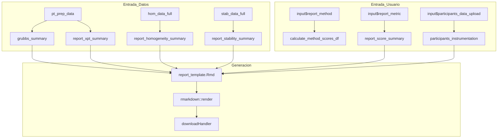

# Modulo: Generacion de Informes

## Descripcion General

| Propiedad | Valor |
|-----------|-------|
| Archivo | `cloned_app.R` |
| Lineas UI | 1102-1163 (tabPanel "Generacion de informes") |
| Lineas Logica | 3748-4500+ (report reactives, downloadHandler) |
| Template | `reports/report_template.Rmd` |
| Dependencias | `pt_prep_data()`, `scores_results_cache()`, `grubbs_summary()` |
| Norma ISO | ISO 13528:2022 Seccion 10, ISO 17043:2024 Seccion 7 |

Este modulo exporta resultados consolidados a documentos Word (.docx) y HTML mediante RMarkdown, generando informes formales del ensayo de aptitud.

---

## Mapa de Componentes UI

| Elemento UI | Input ID | Output ID | Tipo | Descripcion |
|-------------|----------|-----------|------|-------------|
| Selector n | `report_n_lab` | `report_n_selector` | selectInput | Esquema PT |
| Selector Nivel | `report_level` | `report_level_selector` | selectInput | Nivel |
| Selector Metrica | `report_metric` | - | selectInput | z, z', zeta, En |
| Selector Metodo | `report_method` | - | selectInput | 1, 2a, 2b, 3 |
| Selector Compat. | `report_metrological_compatibility` | - | selectInput | Consenso para compatibilidad |
| Factor k | `report_k` | - | numericInput | Factor de cobertura |
| Upload Instrumentacion | `participants_data_upload` | - | fileInput | CSV de analizadores |
| ID Esquema | `report_scheme_id` | - | textInput | ID del esquema EA |
| ID Informe | `report_id` | - | textInput | ID del informe |
| Fecha | `report_date` | - | dateInput | Fecha de emision |
| Periodo | `report_period` | - | textInput | Periodo del ensayo |
| Coordinador | `report_coordinator` | - | textInput | Nombre coordinador |
| Prof. Calidad Aire | `report_quality_pro` | - | textInput | Profesional calidad |
| Ing. Operativo | `report_ops_eng` | - | textInput | Ingeniero operativo |
| Prof. Gestion | `report_quality_manager` | - | textInput | Profesional gestion |
| Formato | `report_format` | - | radioButtons | word / html |
| Descarga | - | `download_report` | downloadButton | Genera y descarga |
| Estado | - | `report_status` | uiOutput | Estado de prerequisitos |
| Vista previa | - | `report_preview_summary` | verbatimTextOutput | Resumen de datos |

---

## Flujo Reactivo



---

## Reactivos de Soporte

### grubbs_summary()
**Ubicacion**: Lineas 3801-3870

Genera tabla de deteccion de valores atipicos:
```r
data.frame(
  Contaminante = pol,
  Nivel = lev,
  Participantes_Evaluados = n_eval,
  Valor_p = p_val,
  Atipicos_detectados = 0/1,
  Participante = outlier_id,
  Valor_Atipico = outlier_value
)
```

### report_xpt_summary()
**Ubicacion**: Lineas 3873-3962

Calcula valores asignados segun el metodo seleccionado:
```r
data.frame(
  Contaminante = pol,
  Nivel = lev,
  Metodo = "Referencia" | "Consenso MADe" | "Consenso nIQR" | "Algoritmo A",
  x_pt = valor_asignado,
  u_xpt = incertidumbre,
  sigma_pt = desviacion_estandar
)
```

### report_homogeneity_summary()
**Ubicacion**: Lineas 3965-4015

Resume evaluacion de homogeneidad:
```r
data.frame(
  Contaminante = pol,
  Nivel = lev,
  Items = g,
  Replicas = m,
  sigma_pt, u_xpt, ss, sw,
  c_criterio,
  Cumple_Criterio = "Si" | "No",
  Conclusion = texto_html
)
```

### report_stability_summary()
**Ubicacion**: Lineas 4018-4080

Resume evaluacion de estabilidad:
```r
data.frame(
  Contaminante = pol,
  Nivel = lev,
  Items = g,
  Replicas = m,
  sigma_pt, u_xpt,
  diff_hom_stab,
  c_criterio,
  Cumple_Criterio = "Si" | "No",
  Conclusion = texto_html
)
```

### participants_instrumentation()
**Ubicacion**: Lineas 3782-3798

Lee CSV de instrumentacion de participantes:
```r
# Columnas requeridas:
# Codigo_Lab, Analizador_SO2, Analizador_CO, Analizador_O3, Analizador_NO_NO2
```

---

## Funcion: calculate_method_scores_df()

**Ubicacion**: Lineas 4084-4155

Calcula puntajes para todos los participantes segun un metodo especifico:

```r
calculate_method_scores_df <- function(method_code) {
  # method_code: "1", "2a", "2b", "3"
  
  # Para cada combinacion pollutant/level:
  # 1. Calcular valor asignado segun metodo
  # 2. Obtener sigma_pt de homogeneidad
  # 3. Calcular z, z', zeta, En
  
  return(data.frame(
    participant_id, pollutant, level,
    mean_value, sd_value,
    x_pt, u_xpt, sigma_pt,
    z_score, z_prime_score, zeta_score, En_score
  ))
}
```

---

## Funcion: summarize_scores()

**Ubicacion**: Lineas 4157-4229

Genera tabla resumen de evaluaciones por contaminante:

| Indicador | Evaluacion | SO2 | CO | O3 | NO/NO2 | TOTAL | TOTAL (%) |
|-----------|------------|-----|----|----|--------|-------|-----------|
| z-score | Satisfactorio | n | n | n | n | sum | % |
| z-score | Cuestionable | n | n | n | n | sum | % |
| z-score | Insatisfactorio | n | n | n | n | sum | % |
| z'-score | ... | | | | | | |
| zeta-score | ... | | | | | | |
| En-score | ... | | | | | | |

---

## Generacion de Mapas de Calor

### report_heatmaps()
**Ubicacion**: Lineas 4267-4318

Genera lista de graficos ggplot para cada contaminante:

```r
report_heatmaps <- reactive({
  scores_df <- calculate_method_scores_df(input$report_method)
  
  for (pol in pollutants) {
    pol_data <- scores_df %>% filter(pollutant == pol)
    
    # Seleccionar metrica y asignar evaluacion
    pol_data$score_val <- switch(input$report_metric, ...)
    pol_data$eval <- case_when(...)
    
    # Generar heatmap
    p <- ggplot(pol_data, aes(x = level, y = participant_id, fill = eval)) +
      geom_tile(color = "white") +
      geom_text(aes(label = round(score_val, 2))) +
      scale_fill_manual(values = c(
        "Satisfactorio" = "#2E7D32",
        "Cuestionable" = "#F9A825",
        "Insatisfactorio" = "#C62828"
      ))
  }
})
```

---

## Datos por Participante

### report_participant_data()
**Ubicacion**: Lineas 4320-4450+

Genera estructura de datos y graficos por cada participante:

```r
list(
  participant_id = list(
    summary_table = data.frame(...),  # Tabla resumen
    combo_plot = patchwork_plot       # Grafico combinado
  ),
  ...
)
```

### Estructura del Grafico Combinado
Usa `patchwork` para combinar:
1. **Grafico superior**: Valores (Participante vs Referencia)
2. **Grafico inferior**: Puntaje seleccionado con lineas de control

---

## Patron downloadHandler

```r
output$download_report <- downloadHandler(
  filename = function() {
    ext <- if (input$report_format == "word") ".docx" else ".html"
    paste0("informe_PT_", input$report_scheme_id, "_", Sys.Date(), ext)
  },
  content = function(file) {
    # 1. Copiar template a directorio temporal
    temp_template <- file.path(tempdir(), "report_template.Rmd")
    file.copy("reports/report_template.Rmd", temp_template, overwrite = TRUE)
    
    # 2. Preparar parametros
    params <- list(
      scheme_id = input$report_scheme_id,
      report_id = input$report_id,
      report_date = input$report_date,
      # ... mas parametros
      grubbs_data = grubbs_summary(),
      xpt_data = report_xpt_summary(),
      homogeneity_data = report_homogeneity_summary(),
      stability_data = report_stability_summary(),
      scores_data = report_score_summary(),
      heatmaps = report_heatmaps(),
      participant_data = report_participant_data()
    )
    
    # 3. Renderizar
    rmarkdown::render(
      temp_template,
      output_format = if (input$report_format == "word") "word_document" else "html_document",
      output_file = file,
      params = params,
      envir = new.env(parent = globalenv())
    )
  }
)
```

---

## Formato de Archivos de Instrumentacion

### Columnas Requeridas
```csv
Codigo_Lab,Analizador_SO2,Analizador_CO,Analizador_O3,Analizador_NO_NO2
LAB01,Thermo 43i,Thermo 48i,Thermo 49i,Thermo 42i
LAB02,Teledyne T100,Teledyne T300,Teledyne T400,Teledyne T200
```

---

## Pestanas del Modulo

### 1. Identificacion
- ID Esquema EA
- ID Informe
- Fecha de Emision
- Periodo del Ensayo
- Coordinador EA
- Profesional Calidad Aire
- Ingeniero Operativo
- Profesional Gestion Calidad

### 2. Vista Previa
- Estado de prerequisitos (datos cargados, calculos ejecutados)
- Resumen de parametros seleccionados
- Validacion de datos

---

## Formatos de Salida

| Formato | Extension | Libreria | Ventajas |
|---------|-----------|----------|----------|
| Word | .docx | officer/rmarkdown | Editable, formato formal |
| HTML | .html | rmarkdown | Interactivo, graficos dinamicos |

---

## Estados de Error

| Estado | Mensaje | Causa |
|--------|---------|-------|
| Sin datos PT | "No hay esquemas PT disponibles" | summary_files no cargados |
| Sin niveles comunes | "No hay niveles comunes entre los datos" | Archivos inconsistentes |
| Sin puntajes | "Ejecute el calculo de puntajes primero" | scores_trigger() == NULL |

---

## Referencias

- ISO 13528:2022 Seccion 10 (Informe del proveedor de PT)
- ISO 17043:2024 Seccion 7 (Informes)
- RMarkdown Documentation (rmarkdown.rstudio.com)
