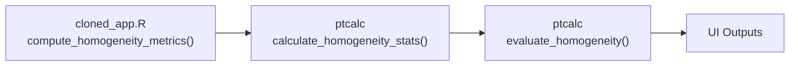

# Módulo Shiny: Homogeneidad y Estabilidad

## Descripción
Este módulo implementa la interfaz de usuario y lógica reactiva para el análisis de homogeneidad y estabilidad del ítem de ensayo. Utiliza las funciones puras del paquete `ptcalc` para los cálculos.

## Ubicación en el Código
| Elemento | Valor |
|----------|-------|
| Archivo | `cloned_app.R` |
| Líneas | 239 - 486 (Lógica) |
| UI | `tabPanel("Análisis de homogeneidad y estabilidad")` |

## Funciones Wrapper

### `compute_homogeneity_metrics(target_pollutant, target_level)`
Función wrapper que:
1. Obtiene datos en formato ancho via `get_wide_data()`
2. Calcula estadísticos con `ptcalc::calculate_homogeneity_stats()`
3. Evalúa criterio con `ptcalc::evaluate_homogeneity()`
4. Retorna lista completa con resultados y conclusiones

### `compute_stability_metrics(target_pollutant, target_level, hom_results)`
Similar al anterior pero para estabilidad:
1. Usa resultados de homogeneidad como entrada
2. Llama a `ptcalc::calculate_stability_stats()`
3. Evalúa con `ptcalc::evaluate_stability()`

## Reactives

### `homogeneity_run()`
| Propiedad | Valor |
|-----------|-------|
| Depende de | `input$pollutant_analysis`, `input$target_level`, `analysis_trigger()` |
| Retorna | Resultado de `compute_homogeneity_metrics()` |

### `stability_run()`
| Propiedad | Valor |
|-----------|-------|
| Depende de | `homogeneity_run()`, `analysis_trigger()` |
| Retorna | Resultado de `compute_stability_metrics()` |

## Outputs
- `output$homog_conclusion`: Cuadro de alerta con conclusión
- `output$variance_components`: Tabla de estadísticos
- `output$details_per_item_table`: Cálculos por ítem
- `output$u_hom_table`, `output$u_stab_table`: Incertidumbres

## Integración con ptcalc

