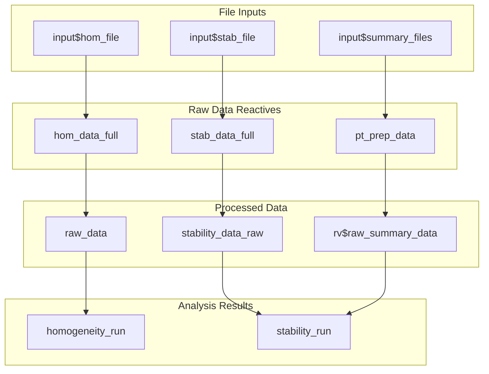
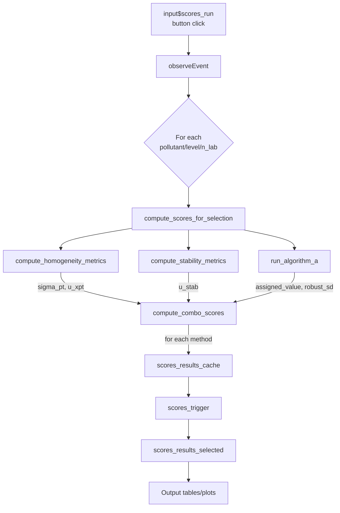
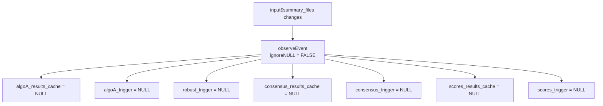

# 15. System Architecture Deep Dive

| Property | Value |
|----------|-------|
| **Document Type** | Architecture Reference |
| **Primary File** | `cloned_app.R` (5,184 lines) |
| **Package** | `ptcalc/` |
| **Related Docs** | `02_ptcalc_package.md`, `README.md` |

---

## Overview

The PT application follows a **clean separation of concerns**:

- **`ptcalc/`**: Pure R package with mathematical functions (no Shiny dependencies)
- **`cloned_app.R`**: Shiny reactive/UI logic that orchestrates the package functions

This architecture enables:
- Unit testing of calculations independent of UI
- Reuse of `ptcalc` functions in other contexts (scripts, reports)
- Clear boundaries between business logic and presentation

---

## Server Function Structure

The server function (lines 79-5177) is organized into logical sections:

| Section | Lines (approx.) | Purpose |
|---------|-----------------|---------|
| **Data Loading** | 84-151 | File upload reactives (`hom_data_full`, `stab_data_full`, `pt_prep_data`) |
| **Trigger/Cache Setup** | 162-224 | Analysis trigger definitions and reset handlers |
| **Helper Functions** | 226-638 | `get_wide_data`, `compute_homogeneity_metrics`, `compute_stability_metrics`, `compute_scores_metrics` |
| **Algorithm A Handler** | 642-715 | `observeEvent(input$algoA_run)` |
| **Dynamic UI Layout** | 717-1165 | `output$main_layout` rendering navlistPanel |
| **Homogeneity/Stability** | 1168-1390 | Core analysis reactives and outputs |
| **Uncertainty Tables** | 1291-1389 | `u_hom_data`, `u_stab_data` |
| **Data Preview Outputs** | 1391-1718 | Tables, histograms, validation |
| **PT Scores Module** | 1720-2255 | Score selectors, `compute_scores_for_selection`, `scores_results_selected` |
| **Global Report Module** | 2256-3237 | Heatmaps, summary tables, classification |
| **Participants Module** | 3238-3746 | Per-participant views and plots |
| **Report Generation** | 3748-4690 | Grubbs, summary reactives, `downloadHandler` |
| **Assigned Value Module** | 4715-5042 | Algorithm A UI, consensus, reference tables |
| **Outliers Module** | 5114-5176 | Grubbs test visualization |

---

## State Management with ReactiveValues

### Primary `rv` Object

```r
rv <- reactiveValues(
  raw_summary_data = NULL,      # Raw combined summary data for sigma_pt_1 calculations
  raw_summary_data_list = NULL  # List of individual file dataframes for consensus calculations
)
```

| Field | Type | Purpose |
|-------|------|---------|
| `raw_summary_data` | `data.frame` or `NULL` | Combined summary data from all uploaded files |
| `raw_summary_data_list` | `list` or `NULL` | List of individual dataframes (one per uploaded file) |

### Trigger-Cache Pattern

The application uses a **trigger-cache pattern** for expensive computations. This prevents unnecessary re-computation and gives users explicit control over when calculations run.


#### Trigger-Cache Pairs

| Trigger | Cache | Purpose |
|---------|-------|---------|
| `analysis_trigger()` | - | Controls homogeneity/stability execution |
| `algoA_trigger()` | `algoA_results_cache()` | Algorithm A results |
| `robust_trigger()` | - | Robust statistics |
| `consensus_trigger()` | `consensus_results_cache()` | Consensus values |
| `scores_trigger()` | `scores_results_cache()` | PT scores |

#### Pattern Implementation

```r
# 1. Define trigger and cache
scores_results_cache <- reactiveVal(NULL)
scores_trigger <- reactiveVal(NULL)

# 2. Button click sets trigger
observeEvent(input$scores_run, {
  # ... compute all scores ...
  scores_results_cache(results)
  scores_trigger(Sys.time())
})

# 3. Reactive gates execution on trigger
scores_results_selected <- reactive({
  req(scores_trigger())  # Won't execute until triggered
  cache <- scores_results_cache()
  # ... retrieve from cache ...
})
```

---

## Reactive Dependency Graph

### Primary Data Flow



### Score Calculation Chain



### Cache Invalidation Chain

When summary files change, all downstream caches are invalidated:



---

## Major observeEvent Handlers

| Handler Location | Trigger Input | Purpose |
|------------------|---------------|---------|
| Lines 202-204 | `input$run_analysis` | Sets `analysis_trigger(Sys.time())` |
| Lines 206-211 | File inputs change | Resets `analysis_trigger(NULL)` |
| Lines 213-224 | `input$summary_files` | Clears all caches |
| Lines 642-715 | `input$algoA_run` | Runs Algorithm A for all combinations |
| Lines 2100-2136 | `input$scores_run` | Computes scores for all combinations |
| Lines 2480-2658 | `input$run_metrological_compatibility` | Calculates metrological compatibility |
| Lines 4908-4980 | `input$consensus_run` | Calculates consensus values |

---

## Performance Optimization Patterns

### 1. Trigger-Cache Pattern

Prevents re-computation until explicitly requested by user action:

```r
# Results only accessible when triggered
get_scores_result <- function(pollutant, n_lab, level) {
  if (is.null(scores_trigger())) {
    return(list(error = "Calcule los puntajes primero..."))
  }
  cache <- scores_results_cache()
  key <- paste(pollutant, n_lab, level, sep = "||")
  cache[[key]]
}
```

### 2. Batch Processing

All combinations are processed in a single button click, avoiding multiple reactive invalidations:

```r
observeEvent(input$algoA_run, {
  combos <- unique(data[, c("pollutant", "n_lab", "level")])
  results <- list()
  
  for (i in seq_len(nrow(combos))) {
    key <- paste(combos$pollutant[i], combos$n_lab[i], combos$level[i], sep = "||")
    results[[key]] <- run_algorithm_a(...)
  }
  
  algoA_results_cache(results)  # Store all at once
  algoA_trigger(Sys.time())
})
```

### 3. Isolate Pattern

Prevents reactive re-execution when reading values that shouldn't trigger updates:

```r
observeEvent(input$algoA_run, {
  data <- isolate(pt_prep_data())  # Read once, don't track changes
  # ... process data ...
})
```

### 4. Key-Based Result Lookup

Uses composite keys for O(1) cache access instead of filtering:

```r
# Key generation function
algo_key <- function(pollutant, n_lab, level) {
  paste(pollutant, n_lab, level, sep = "||")
}

# O(1) lookup
key <- algo_key("SO2", 1, "low")
result <- cache[[key]]
```

### 5. tryCatch for Robustness

Prevents single failures from breaking batch processing:

```r
for (i in seq_len(nrow(combos))) {
  res <- tryCatch({
    compute_homogeneity_metrics(pollutant, level)
  }, error = function(e) {
    list(error = e$message)
  })
  results[[key]] <- res
}
```

---

## Error Handling Patterns

### Validation with `validate()/need()`

Used for user-facing input validation:

```r
validate(
  need(
    all(c("value", "pollutant", "level") %in% names(df)),
    "Error: El archivo debe contener columnas 'value', 'pollutant' y 'level'."
  )
)
```

### Error List Pattern

Functions return errors in a structured way for consistent handling:

```r
compute_homogeneity_metrics <- function(pollutant, level) {
  # Early return on error conditions
  if (m < 2) {
    return(list(
      error = "No hay suficientes replicas (se requieren al menos 2)..."
    ))
  }
  
  # Normal computation
  hom_result <- calculate_homogeneity_stats(...)
  
  # Successful return with explicit NULL error
  list(
    ss = hom_result$ss,
    sw = hom_result$sw,
    conclusion = "APROBADO",
    error = NULL
  )
}
```

### UI Error Display

```r
output$homog_conclusion <- renderUI({
  res <- homogeneity_run()
  
  if (!is.null(res$error)) {
    div(class = "alert alert-danger", res$error)
  } else {
    div(class = res$conclusion_class, HTML(res$conclusion))
  }
})
```

---

## ptcalc Package Integration

### Package Location and Structure

```
ptcalc/
  DESCRIPTION       # Package metadata (v0.1.0, MIT license)
  NAMESPACE         # Exported functions
  R/
    pt_robust_stats.R   # nIQR, MADe, Algorithm A
    pt_homogeneity.R    # Homogeneity/stability calculations
    pt_scores.R         # Score calculations and evaluation
    ptcalc-package.R    # Package-level documentation
  man/                  # Documentation (28 .Rd files)
```

### Key Exported Functions

| Category | Functions |
|----------|-----------|
| **Robust Statistics** | `calculate_niqr()`, `calculate_mad_e()`, `run_algorithm_a()` |
| **Homogeneity** | `calculate_homogeneity_stats()`, `calculate_homogeneity_criterion()`, `evaluate_homogeneity()`, `calculate_u_hom()` |
| **Stability** | `calculate_stability_stats()`, `calculate_stability_criterion()`, `evaluate_stability()`, `calculate_u_stab()` |
| **Scores** | `calculate_z_score()`, `calculate_z_prime_score()`, `calculate_zeta_score()`, `calculate_en_score()` |
| **Evaluation** | `evaluate_z_score()`, `evaluate_z_score_vec()`, `evaluate_en_score()`, `evaluate_en_score_vec()` |
| **Classification** | `classify_with_en()`, `PT_EN_CLASS_LABELS`, `PT_EN_CLASS_COLORS` |

### Package Loading

The app loads the package at startup:

```r
# At top of cloned_app.R
library(ptcalc)

# Or during development:
devtools::load_all("ptcalc")
```

---

## Architectural Patterns Summary

| Pattern | Implementation | Benefit |
|---------|----------------|---------|
| **Separation of Concerns** | Pure functions in `ptcalc/`, UI logic in `cloned_app.R` | Testability, reusability |
| **Trigger-Cache** | `reactiveVal()` pairs for expensive computations | User control, performance |
| **Batch Processing** | Loop over combinations, store in keyed cache | Fewer reactive invalidations |
| **Error Propagation** | Return `list(error=...)` pattern | Consistent error handling |
| **Dynamic UI** | `renderUI()` for conditional components | Adaptive interface |
| **Composite Keys** | `pollutant||n_lab||level` format | O(1) cache lookups |
| **Validation** | `req()`, `validate(need())` | User-friendly error messages |

---

## See Also

- `02_ptcalc_package.md` - Package API reference
- `README.md` - Application overview
- `06_shiny_homogeneidad.md` - Homogeneity module details
- `09_puntajes_pt.md` - Scores module details
