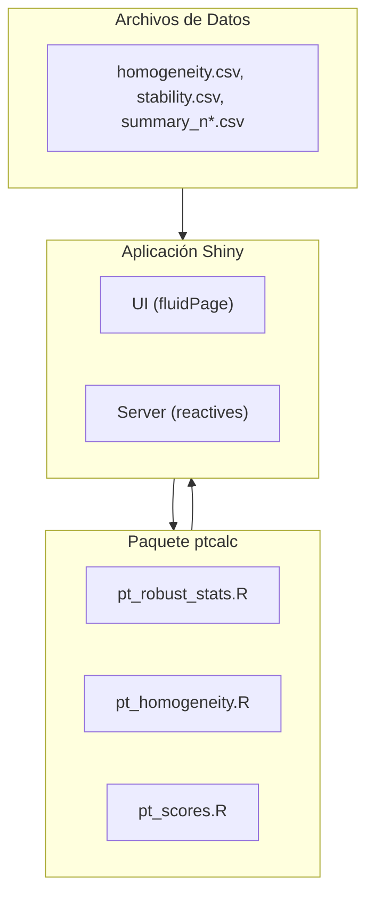
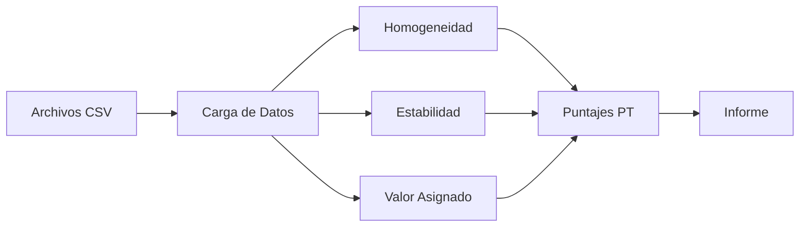

# Entregable 01 - Repositorio de código y scripts iniciales

## Propósito

Este entregable tiene como objetivo crear un snapshot del código original de la aplicación como línea base del proyecto. Proporciona una copia íntegra de los archivos fuente y scripts iniciales antes de cualquier modificación o refactorización, asegurando la reproducibilidad de los resultados originales.

Este repositorio de código sirve como referencia fundamental y cumple con los requisitos de documentación de las normas **ISO 13528:2022** e **ISO 17043:2024** para la gestión de datos y algoritmos en ensayos de aptitud.

---

## Arquitectura del Sistema

La aplicación implementa una **separación de responsabilidades**:
- **`ptcalc/`**: Paquete R con funciones matemáticas puras (ISO 13528).
- **`app_original.R`**: Lógica reactiva Shiny para la interfaz de usuario.



---

## Flujo de Datos



---

## Archivos Incluidos

### Código Fuente

| Archivo | Descripción | Líneas |
|---------|-------------|--------|
| `app_original.R` | Copia exacta del archivo `app.R` original | 5,381 |
| `R/pt_homogeneity.R` | Funciones para análisis de homogeneidad y estabilidad | ~290 |
| `R/pt_robust_stats.R` | Estimadores robustos (nIQR, MADe, Algoritmo A) | ~247 |
| `R/pt_scores.R` | Cálculo de puntajes (z, z', ζ, En) | ~275 |
| `R/utils.R` | Funciones utilitarias (deprecadas) | ~50 |

### Paquete ptcalc

```
ptcalc/
├── DESCRIPTION          # Metadatos del paquete
├── LICENSE              # Licencia MIT
├── NAMESPACE            # 24 exportaciones
├── README.md            # Documentación del paquete
├── R/                   # Código fuente
│   ├── ptcalc-package.R
│   ├── pt_robust_stats.R
│   ├── pt_homogeneity.R
│   └── pt_scores.R
└── man/                 # Documentación generada (21 archivos .Rd)
```

### Datos de Ejemplo

| Archivo | Descripción | Registros |
|---------|-------------|-----------|
| `data/homogeneity.csv` | Datos de homogeneidad | 622 líneas |
| `data/stability.csv` | Datos de estabilidad | ~600 líneas |
| `data/summary_n4.csv` | Datos consolidados de participantes | 361 líneas |
| `data/participants_data4.csv` | Tabla de instrumentación | 5 líneas |

### Reportes y Tests

| Archivo | Descripción |
|---------|-------------|
| `reports/report_template.Rmd` | Plantilla RMarkdown para informes |
| `tests/test_01_existencia_archivos.R` | Test automatizado (testthat) |
| `tests/test_01_existencia_archivos.md` | Guía técnica del test |

---

## Requisitos del Sistema

| Requisito | Versión | Notas |
|-----------|---------|-------|
| R | ≥ 4.3.0 | [Descargar desde CRAN](https://cran.r-project.org/) |
| RStudio | ≥ 2023.06 | Opcional pero recomendado |
| Sistema Operativo | Windows 10+, macOS 11+, Linux | Cualquier SO moderno |

### Paquetes R Requeridos

```r
install.packages(c(
  "shiny", "bslib", "tidyverse", "vroom", "DT",
  "rhandsontable", "plotly", "patchwork", "outliers",
  "rmarkdown", "devtools", "shinythemes", "bsplus"
))
```

---

## Instalación del Paquete ptcalc

**Para desarrollo:**
```r
devtools::load_all("ptcalc")
```

**Para producción:**
```r
devtools::install("ptcalc")
library(ptcalc)
```

---

## Ejecución de Pruebas

Para validar la correcta disposición e integridad de los archivos de este entregable:

### Desde la consola de R
```r
library(testthat)
test_file("deliv/01_repo_inicial/tests/test_01_existencia_archivos.R")
```

### Desde la línea de comandos
```bash
Rscript deliv/01_repo_inicial/tests/test_01_existencia_archivos.R
```

El test verificará:
- Existencia de todos los archivos fuente
- Correspondencia SHA256 entre originales y copias
- Validación básica de sintaxis R
- Estructura completa del paquete ptcalc

---

## Módulos de la Aplicación

| Módulo | Descripción |
|--------|-------------|
| **Carga de datos** | Carga y validación de archivos CSV |
| **Homogeneidad y Estabilidad** | Evaluación según ISO 13528:2022 §9.2-9.3 |
| **Valores Atípicos** | Prueba de Grubbs para detección de outliers |
| **Valor Asignado** | Algoritmo A, Consenso (MADe/nIQR), Referencia |
| **Puntajes PT** | Cálculo de z, z', ζ, En según ISO 13528:2022 §10 |
| **Informe Global** | Heatmaps y tablas resumen |
| **Participantes** | Detalle individual por laboratorio |
| **Generación de Informes** | Exportación RMarkdown (Word/HTML) |

---

## Errores Comunes y Soluciones

| Error | Causa | Solución |
|-------|-------|----------|
| `could not find function "xxx"` | ptcalc no cargado | Ejecutar `devtools::load_all("ptcalc")` |
| `El archivo debe contener las columnas...` | Cabeceras CSV incorrectas | Verificar: `pollutant`, `level`, `value` |
| `disconnected from the server` | Sesión R crasheó | Revisar logs, reiniciar app |
| `package 'outliers' not found` | Dependencia faltante | `install.packages("outliers")` |

---

## Referencias Normativas

| Estándar | Título | Estado |
|----------|--------|--------|
| ISO 13528:2022 | Métodos estadísticos para ensayos de aptitud | Implementado |
| ISO 17043:2024 | Requisitos generales para ensayos de aptitud | Implementado |

---

## Información del Proyecto

| Propiedad | Valor |
|-----------|-------|
| **Contrato** | OSE-282-3065-2025 |
| **Desarrollador** | Laboratorio CALAIRE - Universidad Nacional de Colombia |
| **Colaborador** | Instituto Nacional de Metrología (INM) |
| **Autor** | Wilson Rafael Salas Chavez (wrsalasc@unal.edu.co) |
| **Licencia** | MIT |
