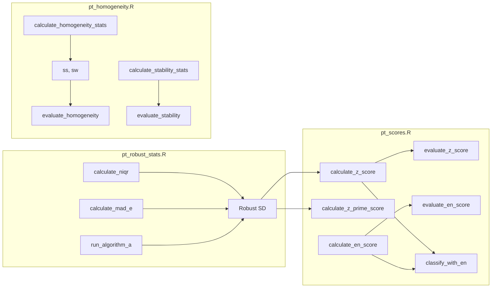

# ptcalc

Paquete R para cálculos de ensayos de aptitud conforme a ISO 13528:2022 e ISO 17043:2024.

## Información del Paquete

| Atributo | Detalles |
|----------|----------|
| **Versión** | 0.1.0 |
| **Licencia** | MIT |
| **Estándares** | ISO 13528:2022, ISO 17043:2024 |
| **Autor** | Wilson Rafael Salas Chavez (wrsalasc@unal.edu.co) |
| **Dependencias** | stats, dplyr (>= 1.0.0) |
| **Funciones Exportadas** | 24 |
| **Constantes Exportadas** | 2 |

---

## Descripción General

`ptcalc` encapsula todas las **funciones matemáticas puras** para el cálculo de ensayos de aptitud. Está diseñado con **cero dependencias de Shiny**, lo que lo hace ideal para:

- Uso independiente en scripts de R y procesamiento por lotes.
- Pruebas unitarias exhaustivas sin la sobrecarga de la interfaz de usuario.
- Integración vía API con sistemas externos.
- Flujos de trabajo automatizados de validación de datos.

---

## Filosofía de Diseño

| Principio | Implementación | Beneficio |
|-----------|----------------|-----------|
| **Separación de responsabilidades** | Lógica matemática desacoplada de la UI (Shiny) | Alta mantenibilidad y modularidad |
| **Funciones puras** | Salidas determinadas únicamente por parámetros de entrada | Predecibilidad y facilidad de depuración |
| **Testabilidad** | Funciones independientes para pruebas unitarias | Confiabilidad en los resultados |
| **Documentación técnica** | Roxygen2 con ejemplos y referencias ISO | Facilidad de uso para desarrolladores |
| **Cumplimiento de estándares** | Implementación estricta de fórmulas ISO 13528 | Validez técnica y legal |

---

## Instalación

```r
# Desarrollo (iteración rápida)
devtools::load_all("ptcalc")

# Producción (instalación persistente)
devtools::install("ptcalc")
library(ptcalc)

# Reconstruir documentación
devtools::document("ptcalc")
```

---

## Estructura del Paquete

```
ptcalc/
├── DESCRIPTION              # Metadatos del paquete
├── LICENSE                  # Licencia MIT
├── NAMESPACE                # 24 exportaciones
├── README.md                # Este archivo
├── R/                       # Código fuente
│   ├── ptcalc-package.R     # Documentación general
│   ├── pt_robust_stats.R    # Estadísticos robustos (~247 líneas)
│   ├── pt_homogeneity.R     # Homogeneidad y estabilidad (~290 líneas)
│   └── pt_scores.R          # Cálculo de puntajes (~275 líneas)
└── man/                     # Documentación .Rd (21 archivos)
```

---

## Flujo de Datos



---

## Funciones Principales

### 1. Estadísticos Robustos (`pt_robust_stats.R`)

| Función | Parámetros | Retorno | Referencia ISO |
|---------|------------|---------|----------------|
| `calculate_niqr` | `x` (numeric) | nIQR = 0.7413 × IQR | 13528:2022 §9.4 |
| `calculate_mad_e` | `x` (numeric) | MADe = 1.483 × MAD | 13528:2022 §9.4 |
| `run_algorithm_a` | `values`, `ids`, `max_iter`, `tol` | Lista: `assigned_value`, `robust_sd`, `weights`, `converged` | 13528:2022 Anexo C |

### 2. Homogeneidad y Estabilidad (`pt_homogeneity.R`)

| Función | Descripción | Referencia ISO |
|---------|-------------|----------------|
| `calculate_homogeneity_stats` | Estadísticos ANOVA (g, m, sw, ss) | 13528:2022 §9.2 |
| `calculate_homogeneity_criterion` | c = 0.3 × σ_pt | 13528:2022 §9.2.3 |
| `calculate_homogeneity_criterion_expanded` | Criterio expandido con incertidumbre | 13528:2022 §9.2.4 |
| `evaluate_homogeneity` | Evalúa ss ≤ c | 13528:2022 §9.2 |
| `calculate_stability_stats` | Media estabilidad vs homogeneidad | 13528:2022 §9.3 |
| `calculate_stability_criterion` | c = 0.3 × σ_pt | 13528:2022 §9.3.3 |
| `calculate_stability_criterion_expanded` | Criterio con incertidumbres | 13528:2022 §9.3.4 |
| `evaluate_stability` | Evalúa diferencia ≤ c | 13528:2022 §9.3 |
| `calculate_u_hom` | u_hom = ss | 13528:2022 §9.5 |
| `calculate_u_stab` | Incertidumbre por inestabilidad | 13528:2022 §9.5 |

### 3. Cálculo de Puntajes (`pt_scores.R`)

| Función | Fórmula | Referencia ISO |
|---------|---------|----------------|
| `calculate_z_score` | z = (x - x_pt) / σ_pt | 13528:2022 §10.2 |
| `calculate_z_prime_score` | z' = (x - x_pt) / √(σ_pt² + u_xpt²) | 13528:2022 §10.3 |
| `calculate_zeta_score` | ζ = (x - x_pt) / √(u_x² + u_xpt²) | 13528:2022 §10.4 |
| `calculate_en_score` | En = (x - x_pt) / √(U_x² + U_xpt²) | 13528:2022 §10.5 |

### 4. Evaluación de Puntajes

| Función | Descripción |
|---------|-------------|
| `evaluate_z_score` | Clasifica: Satisfactorio (\|z\|≤2) / Cuestionable (2<\|z\|<3) / No satisfactorio (\|z\|≥3) |
| `evaluate_z_score_vec` | Versión vectorizada |
| `evaluate_en_score` | Clasifica: Satisfactorio (\|En\|≤1) / No satisfactorio (\|En\|>1) |
| `evaluate_en_score_vec` | Versión vectorizada |
| `classify_with_en` | Clasificación combinada a1-a7 |

---

## Clasificación Combinada (a1-a7)

| Código | Descripción |
|--------|-------------|
| **a1** | Totalmente satisfactorio |
| **a2** | Satisfactorio pero conservador (U informada muy grande) |
| **a3** | Satisfactorio con MU subestimada (En > 1 pero z bueno) |
| **a4** | Cuestionable pero aceptable (la MU cubre el error) |
| **a5** | Cuestionable e inconsistente |
| **a6** | No satisfactorio pero la MU cubre la desviación |
| **a7** | No satisfactorio (crítico - fuera de z y fuera de En) |

---

## Constantes Exportadas

| Constante | Tipo | Descripción |
|-----------|------|-------------|
| `PT_EN_CLASS_LABELS` | Named Vector | Etiquetas para clasificación a1-a7 |
| `PT_EN_CLASS_COLORS` | Named Vector | Colores hex para visualización (a1=#2E7D32, a7=#C62828) |

---

## Fórmulas Matemáticas

### Estadísticos Robustos
- **nIQR:** `nIQR = 0.7413 × (Q3 - Q1)`
- **MADe:** `MADe = 1.483 × median(|xi - median(x)|)`
- **Algoritmo A:** Iterativo con ponderación de Huber

### Homogeneidad (m=2)
- **sw:** `sw = √[Σ(rango²) / (2g)]`
- **ss²:** `ss² = max(0, s_x̄² - sw²/m)`
- **Criterio:** `c = 0.3 × σ_pt`

### Puntajes
- **z:** `z = (x - x_pt) / σ_pt`
- **z':** `z' = (x - x_pt) / √(σ_pt² + u_xpt²)`
- **ζ:** `ζ = (x - x_pt) / √(u_x² + u_xpt²)`
- **En:** `En = (x - x_pt) / √(U_x² + U_xpt²)`

---

## Manejo de Errores

| Condición | Comportamiento |
|-----------|----------------|
| Datos insuficientes (n < 2) | Retorna `NA_real_` o lista con `$error` |
| División por cero | Retorna `NA_real_` |
| Valores no finitos (Inf, NaN) | Filtrados automáticamente |
| Varianza cero | Fallback a desviación estándar clásica |
| Algoritmo A con n < 3 | Error: "Algorithm A requires at least 3 valid observations" |

---

## Ejemplos de Uso

### Algoritmo A
```r
library(ptcalc)

valores <- c(10.1, 10.2, 9.9, 10.0, 10.3, 50.0)  # 50.0 es outlier
resultado <- run_algorithm_a(valores)
cat("Media robusta:", resultado$assigned_value)  # ~10.1
cat("SD robusta:", resultado$robust_sd)          # ~0.14
```

### Puntaje z
```r
z <- calculate_z_score(x = 10.5, x_pt = 10.0, sigma_pt = 0.5)
cat("z =", z, "-", evaluate_z_score(z))
```

### Evaluación de Homogeneidad
```r
hom_stats <- calculate_homogeneity_stats(datos_csv)
criterion <- calculate_homogeneity_criterion(sigma_pt = 0.5)
evaluacion <- evaluate_homogeneity(hom_stats$ss, criterion)
print(evaluacion$conclusion)
```

### Uso en Shiny (Reactive)
```r
scores_data <- reactive({
  res_a <- run_algorithm_a(df$valor, df$id)
  x_pt <- res_a$assigned_value
  
  df %>%
    mutate(
      z = calculate_z_score(valor, x_pt, input$sigma_pt),
      eval = evaluate_z_score_vec(z)
    )
})
```

---

## Referencias

- ISO 13528:2022 - Statistical methods for use in proficiency testing
- ISO 17043:2024 - Conformity assessment — General requirements for proficiency testing
- Huber, P.J. (1964) - Robust estimation of a location parameter

---

## Licencia

MIT © 2026 Universidad Nacional de Colombia (Laboratorio CALAIRE) & Instituto Nacional de Metrología

Desarrollado bajo contrato OSE-282-3065-2025.
