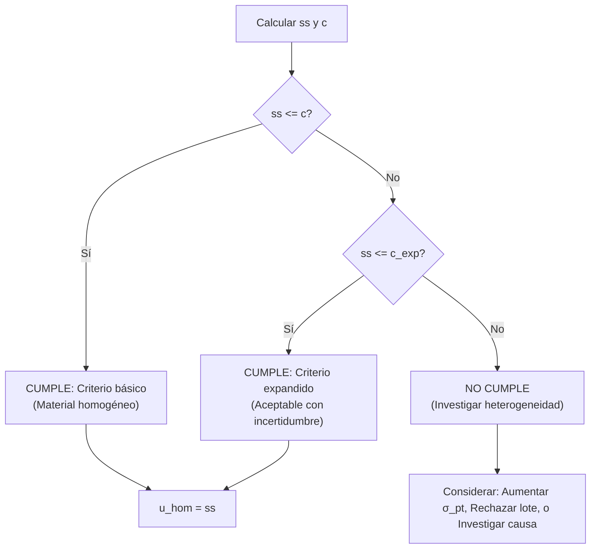
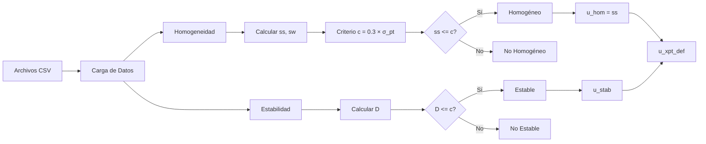

# Ejemplo de Cálculo Paso a Paso (ISO 13528:2022)

Este documento presenta ejemplos detallados de los cálculos estadísticos realizados para el análisis de ensayos de aptitud, siguiendo las normas **ISO 13528:2022** e **ISO 17043:2024**.

---

## Índice

1. [Datos de Origen](#1-datos-de-origen)
2. [Estadísticos Robustos de Dispersión](#2-estadísticos-robustos-de-dispersión)
3. [Análisis de Homogeneidad](#3-análisis-de-homogeneidad)
4. [Algoritmo A](#4-algoritmo-a-iso-135282022-anexo-c)
5. [Análisis de Estabilidad](#5-análisis-de-estabilidad)
6. [Componentes de Incertidumbre](#6-componentes-de-incertidumbre)
7. [Flujo de Decisión](#7-flujo-de-decisión)

---

## 1. Datos de Origen

Se seleccionan 10 muestras medidas por duplicado para el contaminante **CO** al nivel de **2-μmol/mol** del archivo `homogeneity.csv`.

| Muestra | Réplica 1 | Réplica 2 | Media ($\bar{x}_i$) | Rango ($w_i$) |
|:--------|:----------|:----------|:--------------------|:--------------|
| 1 | 2.011535 | 2.019468 | 2.015502 | 0.007933 |
| 2 | 2.016170 | 2.007576 | 2.011873 | 0.008594 |
| 3 | 2.020532 | 2.014273 | 2.017403 | 0.006259 |
| 4 | 2.010638 | 2.019574 | 2.015106 | 0.008936 |
| 5 | 2.017766 | 2.016162 | 2.016964 | 0.001604 |
| 6 | 2.011475 | 2.017979 | 2.014727 | 0.006504 |
| 7 | 2.007859 | 2.014869 | 2.011364 | 0.007010 |
| 8 | 2.014495 | 2.007766 | 2.011131 | 0.006729 |
| 9 | 2.007515 | 2.014681 | 2.011098 | 0.007166 |
| 10 | 2.017021 | 2.009505 | 2.013263 | 0.007516 |

---

## 2. Estadísticos Robustos de Dispersión

Utilizamos los 20 valores individuales para calcular estimadores resistentes a valores atípicos.

### 2.1 nIQR (Rango Intercuartílico Normalizado)

**Fórmula (ISO 13528:2022, §9.4):**
$$nIQR = 0.7413 \times (Q_3 - Q_1)$$

**Cálculo:**
1. **Cuartiles:**
   - $Q_1$ (percentil 25): 2.010072
   - $Q_3$ (percentil 75): 2.017394

2. **Rango Intercuartílico (IQR):**
   $$IQR = 2.017394 - 2.010072 = 0.007322$$

3. **Resultado:**
   $$nIQR = 0.7413 \times 0.007322 = \mathbf{0.005428}$$

**Código R:**
```r
values <- c(2.011535, 2.019468, 2.016170, ...)  # 20 valores
niqr <- calculate_niqr(values)  # 0.005428
```

---

### 2.2 MADe (Desviación Absoluta de la Mediana Escalada)

**Fórmula (ISO 13528:2022, §9.4):**
$$MADe = 1.483 \times \text{mediana}(|x_i - \text{mediana}(x)|)$$

**Cálculo:**
1. **Mediana de los 20 valores:**
   $$x_{med} = 2.014588$$

2. **Desviaciones absolutas:**
   $$|x_i - 2.014588| = \{0.003053, 0.004880, 0.001582, ...\}$$

3. **Mediana de las desviaciones (MAD):**
   $$MAD = 0.003285$$

4. **Resultado:**
   $$MADe = 1.483 \times 0.003285 = \mathbf{0.004871}$$

**Código R:**
```r
mad_e <- calculate_mad_e(values)  # 0.004871
```

---

### 2.3 Comparación de Estimadores

| Estimador | Valor | Interpretación |
|:----------|:------|:---------------|
| **Desviación estándar clásica** | 0.004161 | Sensible a outliers |
| **nIQR** | 0.005428 | Robusto (percentiles) |
| **MADe** | 0.004871 | Muy robusto (mediana) |

---

## 3. Análisis de Homogeneidad

Cálculos basados en **ISO 13528:2022, Sección 9.2**.

### 3.1 Modelo ANOVA

$$x_{ij} = \mu + \alpha_i + \epsilon_{ij}$$

Donde:
- $x_{ij}$ = j-ésima medición de la i-ésima muestra
- $\mu$ = Media general
- $\alpha_i$ = Efecto de la muestra i (variación entre-muestras)
- $\epsilon_{ij}$ = Error de medición (variación intra-muestra)

---

### 3.2 Desviación Estándar Intra-Muestra ($s_w$)

**Fórmula (para m=2 réplicas):**
$$s_w = \sqrt{\frac{\sum_{i=1}^{g} w_i^2}{2g}}$$

Donde $g=10$ (número de muestras) y $w_i = |x_{i1} - x_{i2}|$.

**Cálculo:**
1. **Suma de cuadrados de rangos:**
   $$\sum w_i^2 = 0.007933^2 + 0.008594^2 + ... + 0.007516^2 = 0.0005027$$

2. **Resultado:**
   $$s_w = \sqrt{\frac{0.0005027}{20}} = \mathbf{0.005013}$$

---

### 3.3 Desviación Estándar Entre-Muestras ($s_s$)

**Fórmula:**
$$s_s^2 = \max\left(0, s_{\bar{x}}^2 - \frac{s_w^2}{m}\right)$$

**Cálculo:**
1. **Varianza de las medias de las muestras:**
   $$s_{\bar{x}}^2 = \text{var}(2.015502, 2.011873, ...) = 0.00000589$$

2. **Componente de varianza entre-muestras:**
   $$s_s^2 = 0.00000589 - \frac{0.005013^2}{2} = -0.00000668$$

3. **Resultado (aplicando max(0, ...)):**
   $$s_s = \sqrt{\max(0, -0.00000668)} = \mathbf{0}$$

*Nota: Cuando $s_s^2 < 0$, se establece $s_s = 0$ según ISO 13528 para evitar valores imaginarios.*

---

### 3.4 Tabla ANOVA

| Fuente | GL | Suma de Cuadrados | Cuadrado Medio |
|:-------|:---|:------------------|:---------------|
| **Entre muestras** | $g-1 = 9$ | $SS_B = m \sum(\bar{x}_i - \bar{\bar{x}})^2$ | $MS_B$ |
| **Intra muestras** | $g(m-1) = 10$ | $SS_W = \sum\sum(x_{ij} - \bar{x}_i)^2$ | $MS_W = s_w^2$ |
| **Total** | $gm-1 = 19$ | $SS_T = SS_B + SS_W$ | |

---

### 3.5 Evaluación del Criterio de Homogeneidad

**Criterio básico:** $s_s \leq 0.3 \times \sigma_{pt}$

Asumiendo $\sigma_{pt} = MADe = 0.004871$:

$$c = 0.3 \times 0.004871 = 0.001461$$

**Evaluación:**
$$s_s (0) \leq c (0.001461) \implies \text{CUMPLE}$$

El lote de muestras **cumple** con el criterio de homogeneidad.

---

### 3.6 Flujo de Decisión para Homogeneidad



---

## 4. Algoritmo A (ISO 13528:2022, Anexo C)

Procedimiento iterativo para obtener el valor asignado robusto ($x^*$) y la desviación estándar robusta ($s^*$).

### 4.1 Flujo del Algoritmo

```mermaid
flowchart TD
    START[Inicio: Vector de valores] --> CHECK{n >= 3?}
    CHECK -->|No| ERR[Error: Requiere al menos 3 observaciones]
    CHECK -->|Sí| INIT[Inicializar x* = mediana, s* = 1.483 × MAD]
    
    INIT --> ZCHECK{s* > 0?}
    ZCHECK -->|No| FALLBACK[Usar SD clásica como fallback]
    ZCHECK -->|Sí| RESIDUALS[Calcular residuos: u = x - x* / 1.5 × s*]
    FALLBACK --> RESIDUALS
    
    RESIDUALS --> WEIGHTS[Calcular pesos de Huber]
    WEIGHTS --> WEIGHT_DECISION{|u| <= 1?}
    WEIGHT_DECISION -->|Sí| WEIGHT1[w = 1]
    WEIGHT_DECISION -->|No| WEIGHT2[w = 1 / u²]
    
    WEIGHT1 --> UPDATE[Actualizar x* = Σw×x / Σw]
    WEIGHT2 --> UPDATE
    
    UPDATE --> UPDATE_S[Actualizar s* = √Σw×(x-x*)² / Σw]
    UPDATE_S --> CONVERGENCE{Δx < tol y Δs < tol?}
    
    CONVERGENCE -->|No| ITER_CHECK{iter < max_iter?}
    ITER_CHECK -->|Sí| RESIDUALS
    ITER_CHECK -->|No| NO_CONV[Retornar: converged = FALSE]
    
    CONVERGENCE -->|Sí| YES_CONV[Retornar: converged = TRUE]
```

---

### 4.2 Ejemplo con Datos Reales

**Datos:** Los 20 valores de CO del ejemplo anterior.

#### Paso Inicial
- $x^* = \text{mediana}(x_i) = 2.014588$
- $s^* = 1.483 \times MAD = 0.004871$

#### Iteración 1
1. **Límites de truncamiento:**
   $$\delta = 1.5 \times s^* = 1.5 \times 0.004871 = 0.007307$$
   $$L = x^* - \delta = 2.007281, \quad U = x^* + \delta = 2.021895$$

2. **Residuos estandarizados ($u_i$):**
   $$u_i = \frac{x_i - x^*}{1.5 \times s^*}$$

3. **Pesos de Huber:**
   Como todos los valores están dentro de $[L, U]$, todos reciben peso $w_i = 1$.

4. **Actualización:**
   $$x^*_{new} = \text{media ponderada}(x_i) = 2.013843$$
   $$s^*_{new} = 1.134 \times \text{sd}(\phi_i) = 0.004719$$

#### Iteración 2
1. **Nuevos límites:**
   $$\delta = 1.5 \times 0.004719 = 0.007079 \rightarrow [2.006764, 2.020922]$$

2. **Convergencia:**
   Los valores de $x^*$ y $s^*$ se estabilizan.

**Valores Finales:**
- **Valor Asignado ($x^*$):** 2.013843
- **Desviación Estándar Robusta ($s^*$):** 0.004719

---

### 4.3 Ejemplo con Valor Atípico

**Datos:** `[10.1, 10.2, 9.9, 10.0, 10.3, 50.0]` (50.0 es outlier)

| Participante | Valor | $x_i - 10.05$ | $u$ | \|u\| | Peso $w$ |
|:-------------|:------|:--------------|:----|:------|:---------|
| 1 | 10.1 | 0.05 | 0.150 | 0.150 | 1.000 |
| 2 | 10.2 | 0.15 | 0.451 | 0.451 | 1.000 |
| 3 | 9.9 | -0.15 | -0.451 | 0.451 | 1.000 |
| 4 | 10.0 | -0.05 | -0.150 | 0.150 | 1.000 |
| 5 | 10.3 | 0.25 | 0.751 | 0.751 | 1.000 |
| 6 | **50.0** | 39.95 | **119.97** | 119.97 | **0.00007** |

**Resultado:** El outlier recibe peso casi nulo, y el algoritmo converge a:
- $x^* = 10.10$ (vs. media clásica 16.75)
- $s^* = 0.14$ (vs. SD clásica 16.23)

---

## 5. Análisis de Estabilidad

Comparación de la media del estudio de estabilidad contra la media del estudio de homogeneidad.

### 5.1 Datos de Estabilidad (30 días después)

| Muestra | Réplica 1 | Réplica 2 | Media |
|:--------|:----------|:----------|:------|
| 1 | 2.014 | 2.015 | 2.0145 |
| 2 | 2.012 | 2.016 | 2.0140 |
| 3 | 2.013 | 2.014 | 2.0135 |

$\bar{\bar{x}}_{stab} = 2.0140$

### 5.2 Diferencia de Estabilidad

$$D = |\bar{\bar{x}}_{hom} - \bar{\bar{x}}_{stab}| = |2.013843 - 2.0140| = 0.000157$$

### 5.3 Evaluación

**Criterio:** $D \leq 0.3 \times \sigma_{pt}$

$$0.000157 \leq 0.001461 \implies \text{CUMPLE (Estable)}$$

---

## 6. Componentes de Incertidumbre

### 6.1 Incertidumbre por Homogeneidad

$$u_{hom} = s_s = 0$$

### 6.2 Incertidumbre por Estabilidad

$$u_{stab} = \begin{cases} 
0 & \text{si } D \leq c \\
\frac{D}{\sqrt{3}} & \text{si } D > c
\end{cases}$$

En este caso: $D (0.000157) \leq c (0.001461)$, entonces $u_{stab} = 0$.

### 6.3 Incertidumbre Combinada

$$u_{xpt,def} = \sqrt{u_{xpt}^2 + u_{hom}^2 + u_{stab}^2}$$

---

## 7. Flujo de Decisión



---

## Código R Completo

```r
library(ptcalc)

# 1. Cargar datos
hom_data <- matrix(c(
  2.011535, 2.019468,
  2.016170, 2.007576,
  # ... más datos
), ncol = 2, byrow = TRUE)

# 2. Estadísticos robustos
all_values <- as.vector(hom_data)
niqr <- calculate_niqr(all_values)
mad_e <- calculate_mad_e(all_values)

# 3. Homogeneidad
hom_stats <- calculate_homogeneity_stats(hom_data)
sigma_pt <- mad_e
c_criterion <- calculate_homogeneity_criterion(sigma_pt)
hom_eval <- evaluate_homogeneity(hom_stats$ss, c_criterion)

cat("ss =", hom_stats$ss, "\n")
cat("Criterio c =", c_criterion, "\n")
cat("Conclusión:", hom_eval$conclusion, "\n")

# 4. Algoritmo A
result <- run_algorithm_a(all_values)
cat("Valor Asignado (x*):", result$assigned_value, "\n")
cat("SD Robusta (s*):", result$robust_sd, "\n")

# 5. Estabilidad
stab_stats <- calculate_stability_stats(stab_data, hom_stats$grand_mean)
stab_eval <- evaluate_stability(stab_stats$diff_hom_stab, c_criterion)

# 6. Incertidumbres
u_hom <- calculate_u_hom(hom_stats$ss)
u_stab <- calculate_u_stab(stab_stats$diff_hom_stab, c_criterion)
```

---

## Referencias

- **ISO 13528:2022**: Statistical methods for use in proficiency testing by interlaboratory comparison.
- **ISO 17043:2024**: Conformity assessment — General requirements for proficiency testing.
- **ISO Guide 35:2017**: Reference materials — Guidance for characterization and assessment of homogeneity and stability.
- **Huber, P.J. (1981)**: Robust Statistics. Wiley.
