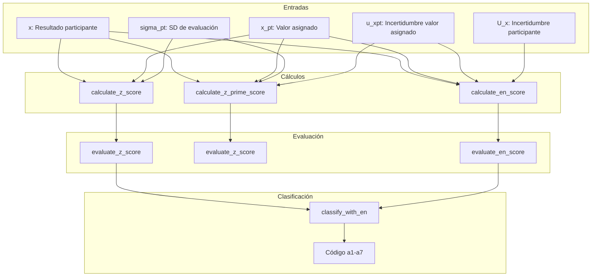

# Fórmulas y Ejemplos de Puntajes de Desempeño

Este documento detalla las fórmulas, criterios de evaluación y clasificación combinada para puntajes de desempeño en ensayos de aptitud, conforme a **ISO 13528:2022** (secciones **§10.2 a §10.7**) e **ISO 17043:2024**.

---

## Índice

1. [Guía de Selección de Puntajes](#1-guía-de-selección-de-puntajes)
2. [Fórmulas de Puntajes](#2-fórmulas-de-puntajes)
3. [Criterios de Evaluación](#3-criterios-de-evaluación)
4. [Clasificación Combinada (a1-a7)](#4-clasificación-combinada-a1-a7)
5. [Constantes Exportadas](#5-constantes-exportadas)
6. [Propagación de Incertidumbre](#6-propagación-de-incertidumbre)
7. [Ejemplo Numérico Completo](#7-ejemplo-numérico-completo)
8. [Escenarios Prácticos](#8-escenarios-prácticos)
9. [Flujo en la Aplicación](#9-flujo-en-la-aplicación)

---

## 1. Guía de Selección de Puntajes

### 1.1 Diagrama de Decisión

```mermaid
flowchart TD
    START[Calcular puntaje PT] --> UNC_X{¿Participante reporta incertidumbre?}
    
    UNC_X -->|Sí| UNC_XPT{¿Se conoce incertidumbre del valor asignado?}
    UNC_XPT -->|Sí| ZETA[Usar zeta<br/>ζ = (x - x_pt) / √(u_x² + u_xpt²)]
    UNC_XPT -->|No| ZPRIME[Usar z'<br/>z' = (x - x_pt) / √(σ_pt² + u_xpt²)]
    
    UNC_X -->|No| SIGMA_PT{¿σ_pt especificado?}
    SIGMA_PT -->|Sí| Z[Usar z<br/>z = (x - x_pt) / σ_pt]
    SIGMA_PT -->|No| CALIBRATION{¿Comparación de calibración?}
    
    CALIBRATION -->|Sí| EN[Usar En<br/>En = (x - x_pt) / √(U_x² + U_xpt²)]
    CALIBRATION -->|No| CONSENSUS{¿Usar consenso para x_pt?}
    
    CONSENSUS -->|Sí| ZPRIME
    CONSENSUS -->|No| NO_INFO[Información insuficiente]
```

### 1.2 Tabla Resumen de Puntajes

| Puntaje | Fórmula | Usa $u_{xpt}$ | Usa $u_x/U_x$ | Caso de Uso |
|:--------|:--------|:-------------:|:-------------:|:------------|
| **z** | $(x - x_{pt}) / \sigma_{pt}$ | No | No | Evaluación básica, $\sigma_{pt}$ especificado |
| **z'** | $(x - x_{pt}) / \sqrt{\sigma_{pt}^2 + u_{xpt}^2}$ | Sí | No | $u_{xpt}$ significativo (> 0.3 $\sigma_{pt}$) |
| **ζ (zeta)** | $(x - x_{pt}) / \sqrt{u_x^2 + u_{xpt}^2}$ | Sí | $u_x$ (std) | Evalúa incertidumbre estándar reportada |
| **En** | $(x - x_{pt}) / \sqrt{U_x^2 + U_{xpt}^2}$ | Sí | $U_x$ (exp) | Compatibilidad metrológica (k=2) |

---

## 2. Fórmulas de Puntajes

### 2.1 Puntaje z (z-score)

**Referencia:** ISO 13528:2022 §10.2

$$z = \frac{x - x_{pt}}{\sigma_{pt}}$$

Donde:
- $x$ = Resultado del participante
- $x_{pt}$ = Valor asignado (referencia)
- $\sigma_{pt}$ = Desviación estándar objetivo para evaluación

**Uso:** Cuando la incertidumbre del valor asignado es despreciable ($u(x_{pt}) \le 0.3 \sigma_{pt}$).

```r
z <- calculate_z_score(x = 10.5, x_pt = 10.0, sigma_pt = 0.5)
# z = (10.5 - 10.0) / 0.5 = 1.0
```

---

### 2.2 Puntaje z' (z'-score)

**Referencia:** ISO 13528:2022 §10.3

$$z' = \frac{x - x_{pt}}{\sqrt{\sigma_{pt}^2 + u_{xpt}^2}}$$

Donde:
- $u_{xpt}$ = Incertidumbre estándar del valor asignado

**Uso:** Cuando la incertidumbre del valor asignado es significativa ($u(x_{pt}) > 0.3 \sigma_{pt}$).

```r
zprime <- calculate_z_prime_score(x = 10.5, x_pt = 10.0, sigma_pt = 0.5, u_xpt = 0.1)
# denominador = sqrt(0.5^2 + 0.1^2) = 0.51
# z' = 0.5 / 0.51 = 0.98
```

---

### 2.3 Puntaje zeta (ζ-score)

**Referencia:** ISO 13528:2022 §10.4

$$\zeta = \frac{x - x_{pt}}{\sqrt{u_x^2 + u_{xpt}^2}}$$

Donde:
- $u_x$ = Incertidumbre estándar del resultado del participante

**Uso:** Evalúa la consistencia entre el resultado reportado y su incertidumbre declarada.

```r
zeta <- calculate_zeta_score(x = 10.5, x_pt = 10.0, u_x = 0.2, u_xpt = 0.1)
# zeta = 0.5 / sqrt(0.2^2 + 0.1^2) = 2.24
```

---

### 2.4 Número En (En-score)

**Referencia:** ISO 13528:2022 §10.5

$$E_n = \frac{x - x_{pt}}{\sqrt{U_x^2 + U_{xpt}^2}}$$

Donde:
- $U_x$ = Incertidumbre expandida del participante (normalmente $k=2$)
- $U_{xpt}$ = Incertidumbre expandida del valor asignado

**Uso:** Compatibilidad metrológica en comparaciones de calibración.

```r
en <- calculate_en_score(x = 10.5, x_pt = 10.0, U_x = 0.4, U_xpt = 0.2)
# En = 0.5 / sqrt(0.4^2 + 0.2^2) = 1.12
```

---

## 3. Criterios de Evaluación

### 3.1 Evaluación para z, z' y zeta

| Criterio | Interpretación | Color |
|:---------|:---------------|:------|
| $\|z\| \leq 2$ | **Satisfactorio** | Verde (`#4CAF50`) |
| $2 < \|z\| < 3$ | **Cuestionable** | Amarillo (`#FFC107`) |
| $\|z\| \geq 3$ | **No satisfactorio** | Rojo (`#F44336`) |

### 3.2 Evaluación para En

| Criterio | Interpretación | Color |
|:---------|:---------------|:------|
| $\|E_n\| \leq 1$ | **Satisfactorio** | Verde (`#4CAF50`) |
| $\|E_n\| > 1$ | **No satisfactorio** | Rojo (`#F44336`) |

*Nota: El puntaje $E_n$ no tiene categoría "Cuestionable" porque usa incertidumbres expandidas ($k=2$) que ya incorporan un intervalo de confianza de ~95%.*

---

## 4. Clasificación Combinada (a1-a7)

La función `classify_with_en()` combina puntajes de desempeño (z/z') con $E_n$ para una evaluación integral del laboratorio.

### 4.1 Tabla de Clasificación

| Código | Etiqueta | z-score | En-score | $U_x$ vs $\sigma_{pt}$ | Significado |
|:-------|:---------|:-------:|:--------:|:----------------------:|:------------|
| **a1** | Totalmente satisfactorio | ≤ 2 | ≤ 1 | $U_x < 2\sigma_{pt}$ | Resultado e incertidumbre correctos |
| **a2** | Satisfactorio pero conservador | ≤ 2 | ≤ 1 | $U_x ≥ 2\sigma_{pt}$ | Resultado correcto, MU sobreestimada |
| **a3** | Satisfactorio con MU subestimada | ≤ 2 | > 1 | - | Resultado correcto, MU subestimada |
| **a4** | Cuestionable pero aceptable | 2 - 3 | ≤ 1 | - | Cuestionable, cubierto por MU |
| **a5** | Cuestionable e inconsistente | 2 - 3 | > 1 | - | Resultado y MU problemáticos |
| **a6** | No satisfactorio pero MU cubre | ≥ 3 | ≤ 1 | - | Mal resultado, cubierto por MU grande |
| **a7** | No satisfactorio (crítico) | ≥ 3 | > 1 | - | Fallo crítico en resultado y MU |

### 4.2 Códigos Especiales

| Código | Etiqueta | Condición |
|:-------|:---------|:----------|
| `mu_missing_z` | MU ausente - solo z: [desempeño] | Sin incertidumbre, se usó puntaje z |
| `mu_missing_zprime` | MU ausente - solo z': [desempeño] | Sin incertidumbre, se usó puntaje z' |

### 4.3 Matriz de Interpretación Visual

```
                    |En| <= 1             |En| > 1
           ┌─────────────────────┬─────────────────────┐
           │                     │                     │
  |z| <= 2 │   a1 (o a2 si U     │        a3           │
           │   conservadora)     │   MU subestimada    │
           │   [VERDE OSCURO]    │   [VERDE CLARO]     │
           ├─────────────────────┼─────────────────────┤
           │                     │                     │
  2<|z|<3  │        a4           │        a5           │
           │   Cuestionable OK   │   Cuestionable mal  │
           │   [AMARILLO]        │   [NARANJA]         │
           ├─────────────────────┼─────────────────────┤
           │                     │                     │
  |z| >= 3 │        a6           │        a7           │
           │   MU cubre error    │     CRÍTICO         │
           │   [ROSA]            │     [ROJO]          │
           └─────────────────────┴─────────────────────┘
```

### 4.4 Diagrama de Lógica de Clasificación

```mermaid
flowchart TD
    A{¿MU ausente?} -->|Sí| B[mu_missing]
    A -->|No| C{|z| <= 2?}
    C -->|Sí| D{|En| < 1?}
    D -->|Sí| E{U_xi >= 2*σ_pt?}
    E -->|Sí| F[a2: Conservador]
    E -->|No| G[a1: Totalmente satisfactorio]
    D -->|No| H[a3: MU subestimada]
    C -->|No| I{|z| < 3?}
    I -->|Sí| J{|En| < 1?}
    J -->|Sí| K[a4: Cuestionable aceptable]
    J -->|No| L[a5: Cuestionable inconsistente]
    I -->|No| M{|En| < 1?}
    M -->|Sí| N[a6: No satisf. cubierto]
    M -->|No| O[a7: Crítico]
```

---

## 5. Constantes Exportadas

### 5.1 PT_EN_CLASS_LABELS

Vector nombrado con las descripciones textuales para las categorías a1-a7:

```r
PT_EN_CLASS_LABELS
#> a1: "Totalmente satisfactorio"
#> a2: "Satisfactorio pero conservador"
#> a3: "Satisfactorio con MU subestimada"
#> a4: "Cuestionable pero aceptable"
#> a5: "Cuestionable e inconsistente"
#> a6: "No satisfactorio pero MU cubre"
#> a7: "No satisfactorio (crítico)"
```

### 5.2 PT_EN_CLASS_COLORS

Paleta de colores oficial para visualización:

| Código | Hex | Descripción |
|:-------|:----|:------------|
| **a1** | `#2E7D32` | Verde oscuro (Excelente) |
| **a2** | `#66BB6A` | Verde medio (Conservador) |
| **a3** | `#9CCC65` | Verde claro (MU subestimada) |
| **a4** | `#FFF59D` | Amarillo claro (Cuestionable OK) |
| **a5** | `#FBC02D` | Naranja (Cuestionable mal) |
| **a6** | `#EF9A9A` | Rosa (No satisf. cubierto) |
| **a7** | `#C62828` | Rojo oscuro (Crítico) |
| `mu_missing_z` | `#90A4AE` | Gris-azul (Sin MU - z) |
| `mu_missing_zprime` | `#78909C` | Gris oscuro (Sin MU - z') |

---

## 6. Propagación de Incertidumbre

La incertidumbre estándar definitiva del valor asignado ($u_{xpt,def}$) combina múltiples fuentes:

$$u_{xpt,def} = \sqrt{u_{xpt}^2 + u_{hom}^2 + u_{stab}^2}$$

| Componente | Origen | Cálculo Típico |
|:-----------|:-------|:---------------|
| $u_{xpt}$ | Método de asignación | Alg. A: $1.25 \cdot s^* / \sqrt{n}$ |
| $u_{hom}$ | Estudio de homogeneidad | $s_s$ (SD entre-muestras) |
| $u_{stab}$ | Estudio de estabilidad | $0$ si estable, $D/\sqrt{3}$ si no |

### Impacto en los Puntajes

Mayor $u_{xpt}$ produce valores absolutos de puntaje más bajos (evaluación más indulgente), ya que aumenta el denominador.

---

## 7. Ejemplo Numérico Completo

**Datos de un participante:**

| Parámetro | Valor | Descripción |
|:----------|:------|:------------|
| $x$ | 10.5 | Resultado del participante |
| $x_{pt}$ | 10.0 | Valor asignado |
| $\sigma_{pt}$ | 0.5 | Desviación estándar objetivo |
| $u_x$ | 0.2 | Incertidumbre estándar del participante |
| $u_{xpt}$ | 0.1 | Incertidumbre estándar del valor asignado |
| $U_x$ | 0.4 | Incertidumbre expandida del participante (k=2) |
| $U_{xpt}$ | 0.2 | Incertidumbre expandida del valor asignado (k=2) |

### Paso 1: Puntaje z

$$z = \frac{10.5 - 10.0}{0.5} = 1.0$$

**Evaluación:** Satisfactorio ($|z| \leq 2$)

### Paso 2: Puntaje z'

$$z' = \frac{10.5 - 10.0}{\sqrt{0.5^2 + 0.1^2}} = \frac{0.5}{0.5099} = 0.981$$

**Evaluación:** Satisfactorio ($|z'| \leq 2$)

### Paso 3: Puntaje zeta

$$\zeta = \frac{10.5 - 10.0}{\sqrt{0.2^2 + 0.1^2}} = \frac{0.5}{0.2236} = 2.236$$

**Evaluación:** Cuestionable ($2 < |\zeta| < 3$)

### Paso 4: Puntaje En

$$E_n = \frac{10.5 - 10.0}{\sqrt{0.4^2 + 0.2^2}} = \frac{0.5}{0.4472} = 1.118$$

**Evaluación:** No satisfactorio ($|E_n| > 1$)

### Paso 5: Clasificación Combinada

- $|z| = 1.0 \leq 2$ → Satisfactorio
- $|E_n| = 1.118 > 1$ → No satisfactorio

**Clasificación: a3** (Satisfactorio con MU subestimada)

---

## 8. Escenarios Prácticos

### Escenario 1: Resultado Bueno e Incertidumbre Confiable (a1)

- $x = 10.05, x_{pt} = 10.00, \sigma_{pt} = 0.5, U_x = 0.20$
- $z = 0.10$ (Satisfactorio)
- $E_n = 0.25$ (Satisfactorio)
- **Clasificación:** **a1** (Totalmente satisfactorio)

### Escenario 2: Incertidumbre Subestimada (a3)

- $x = 10.80, x_{pt} = 10.00, \sigma_{pt} = 0.5, U_x = 0.10$
- $z = 1.60$ (Satisfactorio)
- $E_n = 7.69$ (No satisfactorio)
- **Clasificación:** **a3** (Satisfactorio pero MU muy pequeña)

### Escenario 3: Mal Resultado Cubierto por MU Grande (a6)

- $x = 12.00, x_{pt} = 10.00, \sigma_{pt} = 0.5, U_x = 2.50$
- $z = 4.00$ (No satisfactorio)
- $E_n = 0.80$ (Satisfactorio)
- **Clasificación:** **a6** (No satisfactorio, pero MU cubre el error)

### Escenario 4: Fallo Crítico (a7)

- $x = 12.00, x_{pt} = 10.00, \sigma_{pt} = 0.5, U_x = 0.30$
- $z = 4.00$ (No satisfactorio)
- $E_n = 6.08$ (No satisfactorio)
- **Clasificación:** **a7** (Crítico - fallo en resultado y MU)

---

## 9. Flujo en la Aplicación



---

## 10. Código R de Ejemplo

```r
library(ptcalc)

# Datos del participante
x <- 10.5
x_pt <- 10.0
sigma_pt <- 0.5
u_x <- 0.2
u_xpt <- 0.1
U_x <- 0.4
U_xpt <- 0.2

# Calcular puntajes
z <- calculate_z_score(x, x_pt, sigma_pt)
zprime <- calculate_z_prime_score(x, x_pt, sigma_pt, u_xpt)
zeta <- calculate_zeta_score(x, x_pt, u_x, u_xpt)
en <- calculate_en_score(x, x_pt, U_x, U_xpt)

# Evaluar
eval_z <- evaluate_z_score(z)
eval_en <- evaluate_en_score(en)

# Clasificación combinada
clasificacion <- classify_with_en(
  score_val = z,
  en_val = en,
  U_xi = U_x,
  sigma_pt = sigma_pt,
  mu_missing = FALSE,
  score_label = "z"
)

cat("Clasificación:", clasificacion$code, "-", clasificacion$label)
```

---

## Referencias

- **ISO 13528:2022**: Statistical methods for use in proficiency testing by interlaboratory comparison.
- **ISO 17043:2024**: Conformity assessment — General requirements for proficiency testing.
- **ILAC-G13:08/2007**: Guidelines for the Requirements for the Competence of Providers of Proficiency Testing Schemes.
- **EURACHEM Guide (2000)**: Quantifying Uncertainty in Analytical Measurement.
