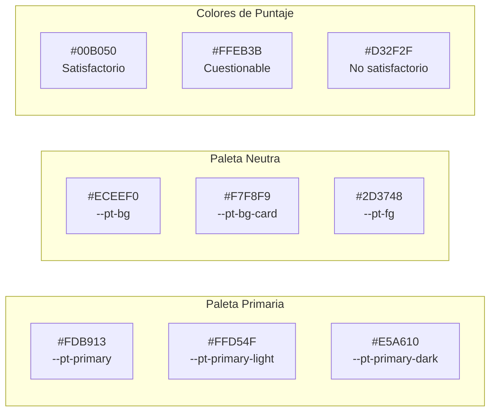
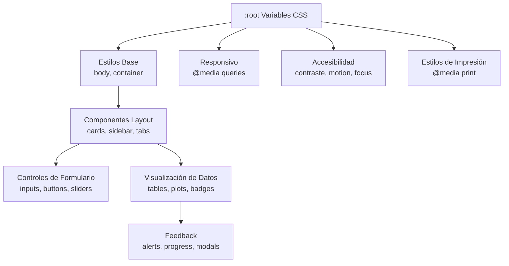

# Prototipo de Interfaz de Usuario - Wireframes

Este documento describe la estructura de la interfaz de usuario del aplicativo para la evaluación de ensayos de aptitud, siguiendo los lineamientos de las normas ISO 13528:2022 e ISO 17043:2024.

---

## Índice

1. [Arquitectura CSS](#1-arquitectura-css)
2. [Paleta de Colores](#2-paleta-de-colores)
3. [Componentes de UI](#3-componentes-de-ui)
4. [Módulos de la Aplicación](#4-módulos-de-la-aplicación)
5. [Estructura General](#5-estructura-general)
6. [Diseño Responsivo](#6-diseño-responsivo)
7. [Accesibilidad](#7-accesibilidad)

---

## 1. Arquitectura CSS

### 1.1 Estructura de Archivos

```
pt_app/
└── www/
    └── appR.css    # Hoja de estilos principal (913 líneas)
```

### 1.2 Secciones del CSS

| Sección | Propósito |
|---------|-----------|
| **Variables CSS** | Propiedades personalizadas para temas |
| **Estilos Base** | Body, contenedor por defecto |
| **Tipografía** | Encabezados, párrafos, enlaces |
| **Tarjetas y Paneles** | Well, card, panel |
| **Barra Lateral** | Navegación lateral |
| **Pestañas de Navegación** | Tabs, pills, navlist |
| **Controles de Formulario** | Inputs, selects, sliders |
| **Botones** | Action buttons, variantes |
| **Tablas** | DataTables, estilos de tabla |
| **Alertas** | Notificaciones Shiny |
| **Badges de Puntaje** | Indicadores de estado PT |
| **Gráficos** | Contenedores Shiny/Plotly |
| **Diseño Responsivo** | Breakpoints móviles |
| **Estilos de Impresión** | Overrides para impresión |
| **Accesibilidad** | Focus, contraste, lectores de pantalla |

### 1.3 Carga en Shiny

```r
fluidPage(
  theme = bs_theme(...),        # Tema base bslib
  includeCSS("www/appR.css"),   # Overrides personalizados
  ...
)
```

---

## 2. Paleta de Colores

### 2.1 Colores Primarios (Marca Amarilla)

| Variable CSS | Hex | Uso |
|--------------|-----|-----|
| `--pt-primary` | `#FDB913` | Color principal de marca |
| `--pt-primary-light` | `#FFD54F` | Estados hover |
| `--pt-primary-dark` | `#E5A610` | Estados active |
| `--pt-primary-subtle` | `#F5F5F0` | Fondos sutiles |

### 2.2 Colores Neutros

| Variable CSS | Hex | Uso |
|--------------|-----|-----|
| `--pt-bg` | `#ECEEF0` | Fondo de página |
| `--pt-bg-card` | `#F7F8F9` | Fondo de tarjetas |
| `--pt-fg` | `#2D3748` | Texto principal |
| `--pt-fg-muted` | `#718096` | Texto secundario |
| `--pt-border` | `#CBD5E0` | Color de borde |
| `--pt-border-focus` | `#FDB913` | Borde de focus |

### 2.3 Colores Semánticos

| Variable CSS | Hex | Uso |
|--------------|-----|-----|
| `--pt-success` | `#38A169` | Estados de éxito |
| `--pt-warning` | `#ECC94B` | Estados de advertencia |
| `--pt-danger` | `#E53E3E` | Estados de error |
| `--pt-info` | `#3182CE` | Estados informativos |

### 2.4 Colores de Puntajes (ISO 13528)

| Estado | Hex | Criterio |
|--------|-----|----------|
| **Satisfactorio** | `#00B050` | \|z\| ≤ 2.0 |
| **Cuestionable** | `#FFEB3B` | 2.0 < \|z\| < 3.0 |
| **No satisfactorio** | `#D32F2F` | \|z\| ≥ 3.0 |

### 2.5 Colores de Clasificación Combinada (a1-a7)

| Código | Hex | Descripción |
|--------|-----|-------------|
| **a1** | `#2E7D32` | Verde oscuro (Excelente) |
| **a2** | `#66BB6A` | Verde medio (Conservador) |
| **a3** | `#9CCC65` | Verde claro (MU subestimada) |
| **a4** | `#FFF59D` | Amarillo claro (Cuestionable OK) |
| **a5** | `#FBC02D` | Naranja (Cuestionable mal) |
| **a6** | `#EF9A9A` | Rosa (No satisf. cubierto) |
| **a7** | `#C62828` | Rojo oscuro (Crítico) |

### 2.6 Diagrama de Paleta



---

## 3. Componentes de UI

### 3.1 Tarjetas y Paneles

```css
.well, .card, .panel {
  background-color: var(--pt-bg-card);
  border: 1px solid var(--pt-border);
  border-radius: var(--radius-lg);  /* 12px */
  box-shadow: var(--shadow-sm);
  padding: var(--space-lg);         /* 24px */
}
```

### 3.2 Barra Lateral

Borde izquierdo amarillo distintivo:

```css
.sidebar .well {
  background: linear-gradient(180deg, 
    var(--pt-bg-card) 0%, 
    var(--pt-primary-subtle) 100%);
  border-left: 4px solid var(--pt-primary);
}
```

### 3.3 Pestañas de Navegación

Subrayado amarillo animado para el estado activo:

```css
.nav-tabs .nav-link.active::after {
  content: '';
  position: absolute;
  bottom: -2px;
  left: 0;
  right: 0;
  height: 3px;
  background: var(--pt-primary);
}
```

### 3.4 Botones

Gradientes para profundidad con efectos hover:

```css
.btn-primary {
  background: linear-gradient(135deg, 
    var(--pt-primary) 0%, 
    var(--pt-primary-dark) 100%);
  color: var(--pt-secondary);
}

.btn-primary:hover {
  transform: translateY(-1px);
  box-shadow: var(--shadow-md);
}
```

### 3.5 Controles de Formulario

```css
.form-control:focus {
  border-color: var(--pt-primary);
  box-shadow: 0 0 0 3px rgba(253, 185, 19, 0.3);
}

input[type="file"] {
  border: 2px dashed var(--pt-primary);
  background-color: var(--pt-primary-subtle);
}
```

### 3.6 Tablas

Cabeceras con acento amarillo:

```css
.table thead th {
  background: linear-gradient(180deg, 
    var(--pt-primary-subtle) 0%, 
    var(--pt-bg-card) 100%);
  border-bottom: 2px solid var(--pt-primary);
  text-transform: uppercase;
}
```

### 3.7 Badges de Puntaje

```css
.badge-satisfactory {
  background-color: #00B050;
  color: white;
}

.badge-questionable {
  background-color: #FFEB3B;
  color: #2D3748;
}

.badge-unsatisfactory {
  background-color: #D32F2F;
  color: white;
}
```

---

## 4. Módulos de la Aplicación

### 4.1 Carga de Datos

- **Propósito**: Cargar los archivos base para todos los cálculos.
- **Inputs**:
  - `fileInput("hom_file")`: homogeneity.csv
  - `fileInput("stab_file")`: stability.csv
  - `fileInput("summary_files")`: summary_n*.csv
- **Formato de archivos**:
  - **homogeneity.csv**: `pollutant, level, replicate, sample_id, value`
  - **stability.csv**: `pollutant, level, replicate, sample_id, value`
  - **summary_n*.csv**: `pollutant, level, participant_id, replicate, sample_group, mean_value, sd_value`
- **Contaminantes**: co, no, no2, o3, so2

### 4.2 Análisis de Homogeneidad y Estabilidad

- **Propósito**: Evaluar criterios ISO 13528:2022.
- **Pestañas**:
  1. Vista previa de datos
  2. Evaluación de homogeneidad (ss, sw, criterio)
  3. Evaluación de estabilidad (diferencia de medias)
  4. Contribuciones a la incertidumbre (u_hom, u_stab)
- **Outputs**:
  - Tablas de componentes de varianza
  - Conclusiones del criterio con indicadores de color
  - Histogramas y boxplots interactivos (Plotly)

### 4.3 Valores Atípicos

- **Propósito**: Identificar outliers mediante prueba de Grubbs.
- **Outputs**:
  - Tabla resumen de la prueba de Grubbs
  - Histograma con identificación de atípicos
  - Boxplot con identificación de atípicos

### 4.4 Valor Asignado

- **Propósito**: Determinar valor de referencia y su incertidumbre.
- **Métodos**:
  1. **Algoritmo A** (ISO 13528 Anexo C)
  2. **Consenso MADe/nIQR**
  3. **Valor de Referencia**
  4. **Compatibilidad Metrológica**
- **Outputs**:
  - Tabla de iteraciones del Algoritmo A
  - Histograma de resultados
  - Tabla de compatibilidad metrológica

### 4.5 Puntajes PT

- **Propósito**: Calcular puntajes de desempeño.
- **Tipos de puntajes**:
  - z = (x - x_pt) / σ_pt
  - z' = (x - x_pt) / √(σ_pt² + u_xpt²)
  - ζ = (x - x_pt) / √(u_x² + u_xpt²)
  - En = (x - x_pt) / √(U_x² + U_xpt²)
- **Criterios**:
  - z, z', ζ: \|valor\| ≤ 2 → Satisfactorio; 2 < \|valor\| < 3 → Cuestionable; \|valor\| ≥ 3 → No satisfactorio
  - En: \|valor\| ≤ 1 → Satisfactorio; \|valor\| > 1 → No satisfactorio

### 4.6 Informe Global

- **Propósito**: Visión integral de todos los resultados.
- **Pestañas**:
  1. Resumen global
  2. Referencia (1)
  3. Consenso MADe (2a)
  4. Consenso nIQR (2b)
  5. Algoritmo A (3)
- **Outputs**:
  - Heatmaps de puntajes z, z', zeta, En (Plotly)
  - Tablas resumen por nivel y contaminante

### 4.7 Participantes

- **Propósito**: Detalle individual por laboratorio.
- **Outputs**:
  - Pestañas dinámicas por participante
  - Tabla de resultados detallados
  - Información de instrumentación

### 4.8 Generación de Informes

- **Propósito**: Exportar informe final en Word/HTML.
- **Configuración**:
  - Métrica (z, z', zeta, En)
  - Método (Referencia, Consenso, Algoritmo A)
  - Factor de cobertura (k)
  - Datos de identificación del esquema
- **Campos de identificación**:
  - ID Esquema EA
  - ID Informe
  - Fecha de Emisión
  - Periodo del Ensayo
  - Coordinador EA
  - Personal técnico

---

## 5. Estructura General

### 5.1 Layout Principal

```
fluidPage(
  titlePanel("Aplicativo para Evaluación de Ensayos de Aptitud")
  h3("Gases Contaminantes Criterio")
  h4("Laboratorio Calaire")
  
  uiOutput("main_layout")  # navlistPanel con 8 módulos
)

main_layout = navlistPanel(
  "Carga de datos",
  "Análisis de homogeneidad y estabilidad",
  "Valores Atípicos",
  "Valor asignado",
  "Puntajes PT",
  "Informe global",
  "Participantes",
  "Generación de informes"
)
```

### 5.2 Diagrama de Jerarquía de Componentes



---

## 6. Diseño Responsivo

### 6.1 Breakpoint Móvil (≤768px)

```css
@media (max-width: 768px) {
  .container-fluid {
    padding: var(--space-md);
  }
  
  .well, .card {
    padding: var(--space-md);
  }
  
  .nav-tabs .nav-link {
    padding: var(--space-xs) var(--space-md);
    font-size: 0.875rem;
  }
  
  .table thead th,
  .table tbody td {
    padding: var(--space-sm);
    font-size: 0.875rem;
  }
}
```

### 6.2 Estilos de Impresión

```css
@media print {
  body {
    background: white;
  }
  
  /* Ocultar elementos interactivos */
  .btn, .nav-tabs, .dataTables_filter,
  .dataTables_length, .dataTables_paginate {
    display: none !important;
  }
  
  /* Remover sombras para impresión limpia */
  .well, .card, .table {
    box-shadow: none;
    border: 1px solid #ddd;
  }
}
```

---

## 7. Accesibilidad

### 7.1 Indicadores de Focus

```css
:focus-visible {
  outline: 2px solid var(--pt-primary);
  outline-offset: 2px;
}
```

### 7.2 Soporte para Lectores de Pantalla

```css
.sr-only {
  position: absolute;
  width: 1px;
  height: 1px;
  padding: 0;
  margin: -1px;
  overflow: hidden;
  clip: rect(0, 0, 0, 0);
  white-space: nowrap;
  border: 0;
}
```

### 7.3 Modo de Alto Contraste

```css
@media (prefers-contrast: high) {
  :root {
    --pt-border: #333;
    --shadow-sm: none;
  }
  
  .btn, .form-control, .well, .card {
    border: 2px solid currentColor;
  }
}
```

### 7.4 Movimiento Reducido

```css
@media (prefers-reduced-motion: reduce) {
  *, *::before, *::after {
    animation-duration: 0.01ms !important;
    transition-duration: 0.01ms !important;
  }
}
```

---

## Variables CSS de Espaciado

```css
:root {
  --space-xs: 0.25rem;   /* 4px */
  --space-sm: 0.5rem;    /* 8px */
  --space-md: 1rem;      /* 16px */
  --space-lg: 1.5rem;    /* 24px */
  --space-xl: 2rem;      /* 32px */
  --space-xxl: 3rem;     /* 48px */
}
```

## Variables CSS de Bordes y Sombras

```css
:root {
  /* Sombras - Niveles de profundidad */
  --shadow-xs: 0 1px 2px rgba(0, 0, 0, 0.06);
  --shadow-sm: 0 2px 4px rgba(0, 0, 0, 0.08);
  --shadow-md: 0 4px 12px rgba(0, 0, 0, 0.10);
  --shadow-lg: 0 8px 24px rgba(0, 0, 0, 0.14);
  --shadow-focus: 0 0 0 3px rgba(253, 185, 19, 0.3);
  
  /* Radio de borde */
  --radius-sm: 6px;   /* Elementos pequeños */
  --radius-md: 8px;   /* Botones, inputs */
  --radius-lg: 12px;  /* Cards, paneles */
  --radius-xl: 16px;  /* Contenedores grandes */
}
```

---

## Referencia

El prototipo se basa en la implementación completa en `app.R` del proyecto PT App. Para la implementación funcional, consulte el código fuente en `app.R` y los estilos en `www/appR.css`.
