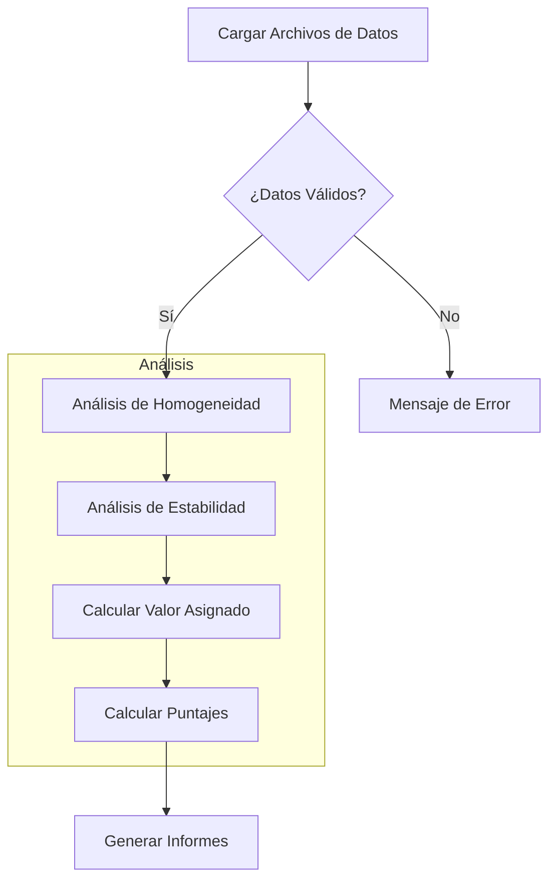

# Manual de Usuario - Aplicativo de Ensayos de Aptitud

## Descripción General

Este manual guía al usuario en el uso del aplicativo para la evaluación de ensayos de aptitud de gases contaminantes criterio (CO, SO2, NO, NO2, O3), implementando los métodos estadísticos de las normas **ISO 13528:2022** e **ISO 17043:2024**.

Desarrollado por el Laboratorio CALAIRE (Universidad Nacional de Colombia) en colaboración con el Instituto Nacional de Metrología (INM).

---

## Índice

1. [Requisitos del Sistema](#1-requisitos-del-sistema)
2. [Instalación](#2-instalación)
3. [Ejecución de la Aplicación](#3-ejecución-de-la-aplicación)
4. [Flujo de Trabajo](#4-flujo-de-trabajo)
5. [Módulos de la Aplicación](#5-módulos-de-la-aplicación)
6. [Guía Paso a Paso](#6-guía-paso-a-paso)
7. [Formatos de Datos](#7-formatos-de-datos)
8. [Solución de Problemas](#8-solución-de-problemas)

---

## 1. Requisitos del Sistema

| Requisito | Versión Mínima | Recomendada |
|-----------|----------------|-------------|
| **R** | 4.1.0 | 4.4.0 o posterior |
| **RStudio** | 2023.06 | 2024.04 o posterior |
| **Sistema Operativo** | Windows 10+, macOS 11+, Linux | Cualquier SO moderno |
| **RAM** | 4 GB | 8 GB+ |
| **Navegador Web** | Chrome, Firefox, Edge, Safari | Versiones modernas |

---

## 2. Instalación

### Paso 1: Instalar Paquetes de R

Abra R o RStudio y ejecute:

```r
install.packages(c(
  "shiny", "bslib", "tidyverse", "vroom", "DT", 
  "rhandsontable", "plotly", "ggplot2", "patchwork",
  "outliers", "rmarkdown", "devtools", "shinythemes", 
  "bsplus", "dplyr", "stats"
))
```

### Referencia de Paquetes

| Paquete | Propósito |
|---------|-----------|
| shiny | Framework web |
| bslib | Temas Bootstrap 5 |
| tidyverse | Manipulación de datos |
| vroom | Lectura rápida de CSV |
| DT | Tablas interactivas |
| plotly | Gráficos interactivos |
| outliers | Prueba de Grubbs |
| rmarkdown | Generación de informes |

### Paso 2: Instalar el Paquete ptcalc

El aplicativo utiliza el paquete local `ptcalc` para los cálculos ISO 13528/17043.

**Para desarrollo:**
```r
# Ejecutar desde el directorio raíz del proyecto
devtools::load_all("ptcalc")
```

**Para producción:**
```r
# Ejecutar desde el directorio raíz del proyecto
devtools::install("ptcalc")
```

---

## 3. Ejecución de la Aplicación

### Método A: Desde la Consola de R (Recomendado)

```r
setwd("/ruta/a/pt_app")
shiny::runApp("cloned_app.R")
```

### Método B: Línea de Comandos

```bash
# Opción 1: Usando Rscript
Rscript cloned_app.R

# Opción 2: Usando R
R -e "shiny::runApp('cloned_app.R')"
```

La aplicación estará disponible en el navegador, típicamente en `http://127.0.0.1:3838`.

---

## 4. Flujo de Trabajo



---

## 5. Módulos de la Aplicación

### 5.1 Carga de Datos

- **Propósito**: Cargar los archivos base para todos los cálculos.
- **Archivos requeridos**:
  - `homogeneity.csv`: Datos de homogeneidad
  - `stability.csv`: Datos de estabilidad
  - `summary_n*.csv`: Resultados de participantes

### 5.2 Homogeneidad y Estabilidad

- **Propósito**: Evaluar si los ítems son suficientemente homogéneos y estables.
- **Cálculos**:
  - Desviación estándar intra-muestra ($s_w$)
  - Desviación estándar entre-muestras ($s_s$)
  - Criterio: $s_s \leq 0.3 \times \sigma_{pt}$
- **Outputs**:
  - Tabla ANOVA
  - Conclusión del criterio (CUMPLE/NO CUMPLE)
  - Incertidumbres $u_{hom}$ y $u_{stab}$

### 5.3 Valores Atípicos

- **Propósito**: Identificar outliers mediante la prueba de Grubbs.
- **Outputs**:
  - Tabla resumen de la prueba
  - Histograma con atípicos marcados
  - Boxplot con identificación

### 5.4 Valor Asignado

- **Propósito**: Determinar el valor de referencia.
- **Métodos disponibles**:
  1. **Algoritmo A** (Consenso robusto, ISO 13528 Anexo C)
  2. **Valor de Referencia** (Laboratorio de referencia)
  3. **Consenso** (Mediana/MADe/nIQR)
- **Outputs**:
  - Valor asignado ($x_{pt}$)
  - Incertidumbre ($u_{xpt}$)
  - Historial de iteraciones (Algoritmo A)

### 5.5 Puntajes PT

- **Propósito**: Calcular puntajes de desempeño.
- **Tipos de puntajes**:

| Puntaje | Fórmula | Referencia ISO |
|---------|---------|----------------|
| z | $(x - x_{pt}) / \sigma_{pt}$ | 13528 §10.2 |
| z' | $(x - x_{pt}) / \sqrt{\sigma_{pt}^2 + u_{xpt}^2}$ | 13528 §10.3 |
| ζ | $(x - x_{pt}) / \sqrt{u_x^2 + u_{xpt}^2}$ | 13528 §10.4 |
| En | $(x - x_{pt}) / \sqrt{U_x^2 + U_{xpt}^2}$ | 13528 §10.5 |

- **Criterios de evaluación**:
  - z, z', ζ: |valor| ≤ 2 → Satisfactorio; 2 < |valor| < 3 → Cuestionable; |valor| ≥ 3 → No satisfactorio
  - En: |valor| ≤ 1 → Satisfactorio; |valor| > 1 → No satisfactorio

### 5.6 Informe Global

- **Propósito**: Visión integral de todos los resultados.
- **Outputs**:
  - Heatmaps de puntajes por contaminante y nivel
  - Tablas resumen de evaluaciones

### 5.7 Participantes

- **Propósito**: Detalle individual por laboratorio.
- **Información**:
  - Resultados detallados
  - Puntajes obtenidos
  - Información de instrumentación

### 5.8 Generación de Informes

- **Propósito**: Exportar el informe final del ensayo.
- **Formatos**: Word (.docx), HTML
- **Campos de configuración**:
  - Identificación del esquema
  - Fecha de emisión
  - Personal responsable

---

## 6. Guía Paso a Paso

### Paso 1: Preparar Archivos de Datos

Los archivos de ejemplo están en la carpeta `data/`:

- `homogeneity.csv`
- `stability.csv`
- `summary_n4.csv`
- `participants_data4.csv`

### Paso 2: Cargar Datos

1. Navegue a la pestaña **"Carga de datos"**
2. Haga clic en **Browse** para cargar sus archivos
3. Verifique que aparezca "Archivo cargado correctamente" en verde

### Paso 3: Ejecutar Análisis de Homogeneidad

1. Vaya a la pestaña **"Homogeneidad"**
2. Seleccione **Contaminante** (ej: `SO2`) y **Nivel** (ej: `bajo`)
3. Haga clic en **"Ejecutar análisis"**
4. Revise la tabla ANOVA y el cuadro de conclusión

### Paso 4: Calcular Valor Asignado

1. Navegue a **"Valor Asignado"**
2. Elija un método: **Algoritmo A**, **Referencia**, o **Consenso**
3. Haga clic en **"Calcular Valor Asignado"**

### Paso 5: Calcular Puntajes

1. Vaya a **"Puntajes PT"**
2. Seleccione tipos de puntaje: **z**, **z'**, **zeta**, o **En**
3. Haga clic en **"Calcular puntajes"**

### Paso 6: Generar Informe

1. Navegue a **"Generación de Informes"**
2. Complete los metadatos (ID, fecha, coordinador)
3. Seleccione formato de salida y haga clic en **"Generar Informe"**

---

## 7. Formatos de Datos

### 7.1 Datos de Homogeneidad y Estabilidad

```csv
"pollutant","level","replicate","sample_id","value"
"co","0-umol/mol",1,1,0.00670
"co","0-umol/mol",1,2,0.00479
```

| Columna | Tipo | Descripción |
|---------|------|-------------|
| pollutant | texto | Identificador del gas (co, so2, no, no2, o3) |
| level | texto | Nivel de concentración |
| replicate | entero | Número de réplica (1, 2, ...) |
| sample_id | entero | Identificador de muestra |
| value | numérico | Concentración medida |

### 7.2 Datos de Participantes

```csv
"pollutant","level","participant_id","replicate","sample_group","mean_value","sd_value"
"co","0-umol/mol","part_1",2,"1-10",-0.0271,0.0278
```

### 7.3 Datos de Instrumentación

```csv
Codigo_Lab,Analizador_SO2,Analizador_CO,Analizador_O3,Analizador_NO_NO2
REFERENCIA,HORIBA APSA-370,Teledyne T300,Thermo 49i,HORIBA APSA-370
```

---

## 8. Solución de Problemas

### Error "Columna no encontrada"

Asegúrese de que sus archivos CSV contengan todas las columnas requeridas con nombres exactos (sensible a mayúsculas).

### Error "Datos insuficientes"

- Homogeneidad/estabilidad requieren al menos 2 muestras y 2 réplicas
- El Algoritmo A requiere al menos 3 participantes

### La aplicación no inicia

1. **Verificar dependencias:**
   ```r
   paquetes <- c("shiny", "bslib", "tidyverse", "vroom", "DT", "rhandsontable",
                 "shinythemes", "outliers", "patchwork", "bsplus", "plotly",
                 "rmarkdown", "devtools", "dplyr", "stats")
   faltantes <- setdiff(paquetes, rownames(installed.packages()))
   if (length(faltantes) > 0) install.packages(faltantes)
   ```

2. **Verificar directorio:** Asegúrese de estar en el directorio raíz donde está `cloned_app.R`

### Paquete ptcalc no encontrado

Ejecute `devtools::load_all("ptcalc")` desde el directorio raíz antes de iniciar la aplicación.

### Error "could not find function"

El paquete ptcalc no está cargado. Ejecute:
```r
devtools::load_all("ptcalc")
```

### La sesión se desconecta

Revise los logs de la consola de R para identificar el error y reinicie la aplicación.

---

## Descargas

Cada tabla en la aplicación tiene un botón para descargar el CSV correspondiente.

---

## Contacto y Soporte

- **Desarrollador**: Laboratorio CALAIRE - Universidad Nacional de Colombia
- **Colaborador**: Instituto Nacional de Metrología (INM)
- **Contrato**: OSE-282-3065-2025
- **Autor**: Wilson Rafael Salas Chavez (wrsalasc@unal.edu.co)
