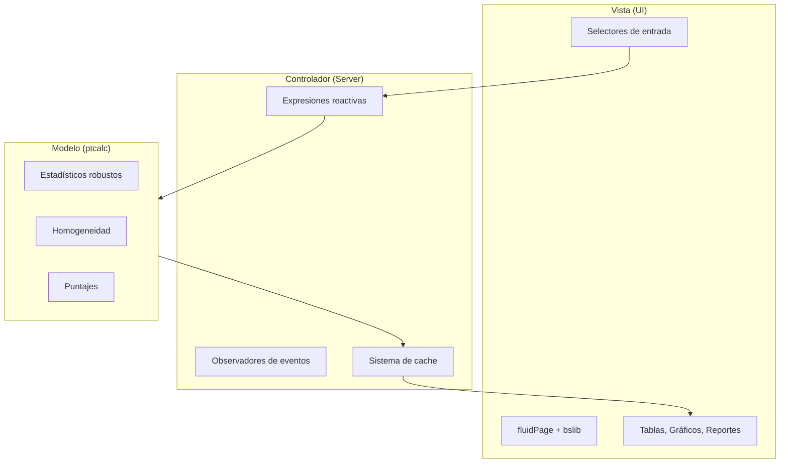
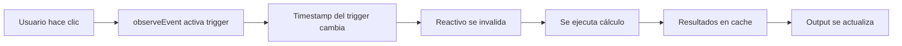
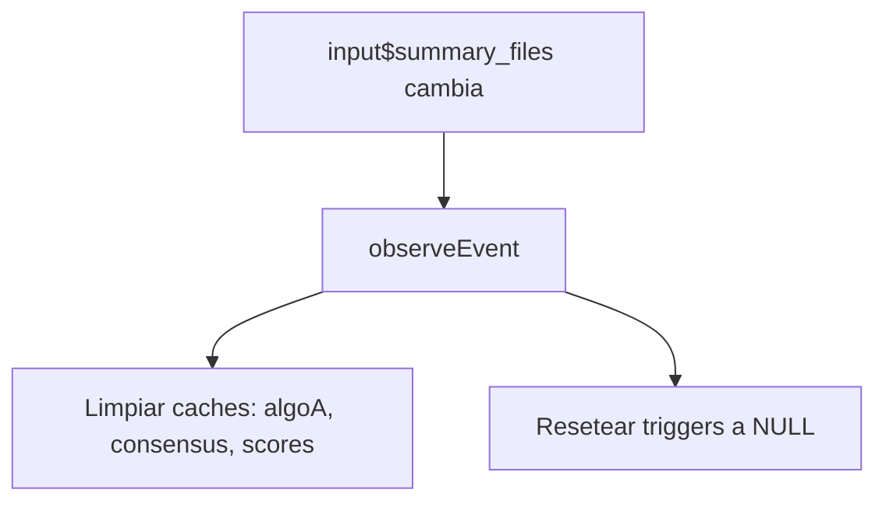

# Manual del Desarrollador - Aplicativo de Ensayos de Aptitud

Este manual proporciona la documentación técnica para desarrolladores que trabajen en el aplicativo de ensayos de aptitud, implementando los estándares **ISO 13528:2022** e **ISO 17043:2024**.

---

## Índice

1. [Arquitectura del Sistema](#1-arquitectura-del-sistema)
2. [Estructura de Archivos](#2-estructura-de-archivos)
3. [Paquete ptcalc](#3-paquete-ptcalc)
4. [Dependencias](#4-dependencias)
5. [Gestión de Estado](#5-gestión-de-estado)
6. [Patrones de Diseño](#6-patrones-de-diseño)
7. [Flujo de Desarrollo](#7-flujo-de-desarrollo)
8. [Guía de Extensión](#8-guía-de-extensión)
9. [Manejo de Errores](#9-manejo-de-errores)
10. [Optimización de Rendimiento](#10-optimización-de-rendimiento)
11. [Solución de Problemas](#11-solución-de-problemas)

---

## 1. Arquitectura del Sistema

La aplicación sigue una arquitectura **MVC (Model-View-Controller)** con programación reactiva:



### Beneficios Clave

- **Testabilidad**: Los cálculos se prueban independientemente de la UI via el paquete `ptcalc`
- **Reusabilidad**: Las funciones de `ptcalc` pueden usarse en scripts o reportes automatizados
- **Rendimiento**: Límites claros permiten optimización y estrategias de cache focalizadas

---

## 2. Estructura de Archivos

```
pt_app/
├── cloned_app.R          # Aplicación Shiny principal (~5,184 líneas)
├── ptcalc/               # Paquete R con funciones matemáticas
│   ├── DESCRIPTION       # Metadatos del paquete
│   ├── NAMESPACE         # 24 exportaciones
│   ├── R/                # Código fuente
│   │   ├── pt_robust_stats.R    # nIQR, MADe, Algoritmo A
│   │   ├── pt_homogeneity.R     # Homogeneidad y estabilidad
│   │   └── pt_scores.R          # Puntajes z, z', ζ, En
│   └── man/              # Documentación .Rd
├── data/                 # Archivos CSV de ejemplo
├── www/                  # Recursos estáticos
│   └── appR.css          # Hoja de estilos (1458 líneas, incluye shadcn)
└── reports/              # Plantillas RMarkdown
```

---

## 3. Paquete ptcalc

El paquete `ptcalc` encapsula todas las funciones matemáticas puras (sin dependencias de Shiny).

### 3.1 Módulos

| Archivo | Contenido | Líneas |
|---------|-----------|--------|
| `pt_robust_stats.R` | nIQR, MADe, Algoritmo A | ~247 |
| `pt_homogeneity.R` | ANOVA, criterios, incertidumbres | ~290 |
| `pt_scores.R` | z, z', ζ, En, clasificación a1-a7 | ~275 |

### 3.2 Funciones Exportadas

| Categoría | Funciones |
|-----------|-----------|
| **Estadísticos Robustos** | `calculate_niqr()`, `calculate_mad_e()`, `run_algorithm_a()` |
| **Homogeneidad** | `calculate_homogeneity_stats()`, `evaluate_homogeneity()`, `calculate_u_hom()` |
| **Estabilidad** | `calculate_stability_stats()`, `evaluate_stability()`, `calculate_u_stab()` |
| **Puntajes** | `calculate_z_score()`, `calculate_z_prime_score()`, `calculate_zeta_score()`, `calculate_en_score()` |
| **Evaluación** | `evaluate_z_score_vec()`, `evaluate_en_score_vec()`, `classify_with_en()` |

### 3.3 Constantes

| Constante | Descripción |
|-----------|-------------|
| `PT_EN_CLASS_LABELS` | Etiquetas para clasificación a1-a7 |
| `PT_EN_CLASS_COLORS` | Colores hex para visualización |

### 3.4 Instalación del Paquete

```r
# Desarrollo (carga rápida)
devtools::load_all("ptcalc")

# Producción (instalación persistente)
devtools::install("ptcalc")

# Reconstruir documentación
devtools::document("ptcalc")
```

---

## 4. Dependencias

### 4.1 Paquetes Requeridos

```r
install.packages(c(
  "shiny", "bslib", "tidyverse", "vroom", "DT",
  "rhandsontable", "plotly", "ggplot2", "patchwork",
  "outliers", "rmarkdown", "devtools", "shinythemes",
  "bsplus", "dplyr", "stats"
))
```

### 4.2 Propósito de Cada Paquete

| Paquete | Propósito |
|---------|-----------|
| shiny | Framework web |
| bslib | Temas Bootstrap 5 |
| tidyverse | Manipulación de datos |
| vroom | Lectura rápida de CSV |
| DT | Tablas interactivas |
| plotly | Gráficos interactivos |
| outliers | Prueba de Grubbs |
| rmarkdown | Generación de informes |

---

## 5. Gestión de Estado

### 5.1 Valores Reactivos (`rv`)

Usados para almacenar estado mutable que persiste entre evaluaciones:

| Variable | Tipo | Propósito |
|----------|------|-----------|
| `rv$raw_summary_data` | `data.frame` | Datos combinados de todos los archivos |
| `rv$raw_summary_data_list` | `list` | DataFrames individuales por archivo |

### 5.2 Patrón Trigger-Cache

Para cálculos costosos, la app usa un patrón **trigger-cache**:



### 5.3 Pares Trigger-Cache

| Trigger | Cache | Propósito |
|---------|-------|-----------|
| `analysis_trigger()` | - | Ejecución de homogeneidad/estabilidad |
| `algoA_trigger()` | `algoA_results_cache()` | Resultados del Algoritmo A |
| `consensus_trigger()` | `consensus_results_cache()` | Estadísticos robustos (MADe/nIQR) |
| `scores_trigger()` | `scores_results_cache()` | Puntajes PT finales |

### 5.4 Invalidación de Cache

Cuando cambian los archivos de summary, todos los caches downstream se limpian:



---

## 6. Patrones de Diseño

### 6.1 Procesamiento por Lotes

En lugar de actualizaciones reactivas individuales, todas las combinaciones se procesan en un solo loop:

```r
observeEvent(input$algoA_run, {
  combos <- unique(data[, c("pollutant", "n_lab", "level")])
  results <- list()
  for (i in seq_len(nrow(combos))) {
    key <- paste(combos$pollutant[i], combos$n_lab[i], combos$level[i], sep = "||")
    results[[key]] <- run_algorithm_a(...)
  }
  algoA_results_cache(results)  # Actualización única
})
```

### 6.2 Claves Compuestas

Usa formato `pollutant||n_lab||level` para acceso O(1) al cache:

```r
key <- paste(pollutant, n_lab, level, sep = "||")
result <- cache[[key]]
```

### 6.3 Aislamiento Reactivo

Usa `isolate()` para prevenir re-ejecución al leer valores que no deberían disparar actualizaciones.

---

## 7. Flujo de Desarrollo

### 7.1 Estructura del Servidor

| Sección | Líneas (aprox.) | Propósito |
|---------|-----------------|-----------|
| **Data Loading** | 80-160 | Reactivos de carga de archivos |
| **Trigger/Cache Setup** | 161-224 | Definición de triggers y caches |
| **Helper Functions** | 226-638 | Lógica interna de procesamiento |
| **Algorithm A Handler** | 642-715 | Estimación robusta iterativa |
| **Dynamic UI Layout** | 717-1165 | Renderizado de navlistPanel |
| **Homogeneity/Stability** | 1168-1390 | Análisis core y outputs de incertidumbre |
| **PT Scores Module** | 1720-2255 | Selectores y cálculo multi-método |
| **Global Report Module** | 2256-3237 | Heatmaps agregados y tablas resumen |
| **Participants Module** | 3238-3746 | Vistas individuales por laboratorio |
| **Report Generation** | 3748-4690 | Renderizado RMarkdown y downloadHandler |

### 7.2 Ciclo de Desarrollo

```bash
# 1. Cargar paquete para desarrollo
devtools::load_all("ptcalc")

# 2. Ejecutar la app
shiny::runApp("cloned_app.R")

# 3. Ejecutar tests
devtools::test("ptcalc")

# 4. Verificar documentación
devtools::check("ptcalc")
```

---

## 8. Guía de Extensión

### 8.1 Agregar Nueva Métrica

1. Añadir la función en `ptcalc/R/pt_scores.R`
2. Exportar en `NAMESPACE`
3. Documentar con Roxygen2
4. Incluir en `calculate_scores_table()` en la app
5. Agregar columna en la tabla de puntajes o nuevo gráfico

### 8.2 Cambiar Fuentes de Datos

1. Reemplazar CSVs en `data/` manteniendo columnas requeridas:
   - `homogeneity.csv`: `pollutant, level, sample_id, replicate, value`
   - `stability.csv`: `pollutant, level, sample_id, replicate, value`
   - `summary_n*.csv`: `pollutant, level, participant_id, mean_value, sd_value`

### 8.3 Agregar Nueva Vista

```r
# En la UI
tabPanel("Nueva Vista",
  sidebarLayout(
    sidebarPanel(...),
    mainPanel(
      dataTableOutput("nueva_tabla"),
      plotlyOutput("nuevo_grafico")
    )
  )
)

# En el Server
output$nueva_tabla <- renderDataTable({...})
output$nuevo_grafico <- renderPlotly({...})
```

### 8.4 Agregar Nuevo Contaminante

1. Agregar datos al CSV con el nuevo valor de `pollutant`
2. Actualizar selectores en la UI (se actualizan dinámicamente)
3. Verificar que las unidades sean consistentes

---

## 9. Manejo de Errores

### 9.1 Capas de Validación

1. **Validación de Input**: Restricciones de UI y `validate(need())`
2. **Validación Reactiva**: `req()` antes de procesar
3. **Validación Matemática**: Chequeos internos en `ptcalc` (ej: n ≥ 3 para Algoritmo A)

### 9.2 Patrón de Lista de Errores

Las funciones retornan una estructura con resultado y mensaje de error:

```r
# Éxito
list(result = calculation, error = NULL)

# Fallo
list(result = NULL, error = "Réplicas insuficientes...")
```

### 9.3 Flujo de Propagación

```
Error de Usuario -> Validación UI -> Gate Reactivo -> Check de Paquete -> Display Estructurado
```

---

## 10. Optimización de Rendimiento

### 10.1 Estrategias Implementadas

| Estrategia | Descripción |
|------------|-------------|
| **Procesamiento por lotes** | Un loop por clic de botón |
| **Claves compuestas** | Acceso O(1) al cache |
| **Aislamiento reactivo** | Evita re-ejecuciones innecesarias |
| **vroom** | Lectura lazy de CSV |
| **DataTables server-side** | `server = TRUE` para datasets grandes |
| **Vectorización** | Funciones de ptcalc vectorizadas |

### 10.2 Consideraciones Futuras

- Implementación de `future` y `promises` para análisis paralelo por contaminante

---

## 11. Solución de Problemas

### Problemas Comunes

| Problema | Causa | Solución |
|----------|-------|----------|
| Error al cargar datos | Ruta incorrecta | Verificar ruta relativa desde directorio de trabajo |
| Columnas faltantes | Nombres incorrectos en CSV | Validar nombres exactos (case-sensitive) |
| Gráficos vacíos | Sin datos para combinación | Revisar que analito/nivel tenga datos |
| Puntajes NA | sigma_pt no finito | Verificar datos y participantes ≠ ref |
| Fallo en testthat | Rutas relativas incorrectas | Ejecutar desde raíz del repositorio |
| ptcalc no encontrado | Paquete no cargado | `devtools::load_all("ptcalc")` |
| Sesión desconectada | Error en R | Revisar logs de consola |

### Verificación de Dependencias

```r
paquetes <- c("shiny", "bslib", "tidyverse", "vroom", "DT", "rhandsontable",
              "shinythemes", "outliers", "patchwork", "bsplus", "plotly",
              "rmarkdown", "devtools", "dplyr", "stats")
faltantes <- setdiff(paquetes, rownames(installed.packages()))
if (length(faltantes) > 0) install.packages(faltantes)
```

---

## Referencias

- **ISO 13528:2022**: Statistical methods for use in proficiency testing
- **ISO 17043:2024**: Conformity assessment — General requirements for proficiency testing
- **Shiny Documentation**: https://shiny.rstudio.com/
- **bslib Documentation**: https://rstudio.github.io/bslib/

---

## Información del Proyecto

| Propiedad | Valor |
|-----------|-------|
| **Contrato** | OSE-282-3065-2025 |
| **Desarrollador** | Laboratorio CALAIRE - Universidad Nacional de Colombia |
| **Colaborador** | Instituto Nacional de Metrología (INM) |
| **Autor** | Wilson Rafael Salas Chavez (wrsalasc@unal.edu.co) |
| **Licencia** | MIT |
