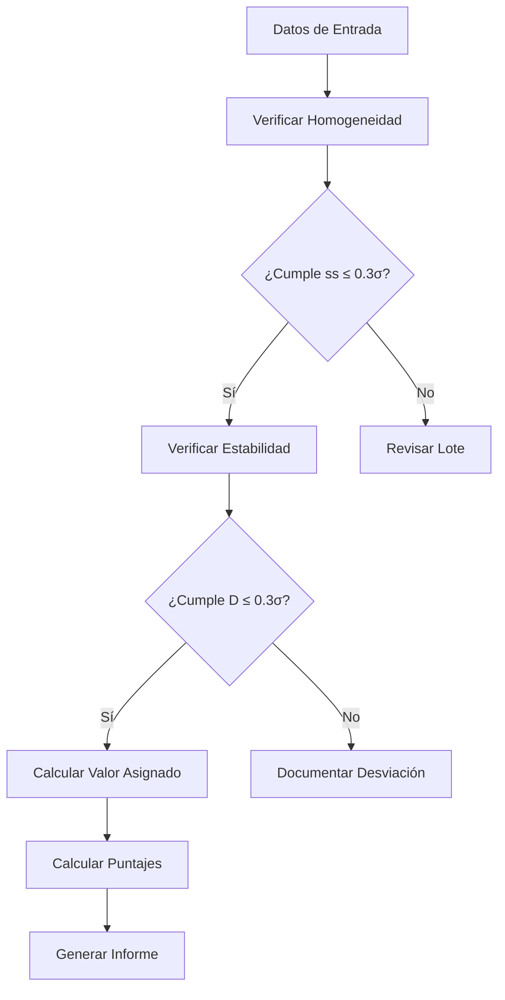

# Informe de Validación - Entregable 09

## Información del Documento

| Atributo | Valor |
|----------|-------|
| **Contrato** | OSE-282-3065-2025 |
| **Estándares** | ISO 13528:2022, ISO 17043:2024 |
| **Desarrollador** | Laboratorio CALAIRE - Universidad Nacional de Colombia |
| **Colaborador** | Instituto Nacional de Metrología (INM) |
| **Versión** | 1.0 |

---

## 1. Alcance de Validación

- Se validó la trazabilidad estadística de los entregables 01-09 usando los datos oficiales en `/home/w182/w421/pt_app/data/`.
- Se verificaron homogeneidad, estabilidad y desempeño analítico con base en ISO 13528:2022 (secciones 9.2, 9.3, 10.2-10.6) e ISO 17043:2024.
- Se consideraron los requisitos para el rol del proveedor, registro de resultados y emisión de conclusiones.
- Se incluyó el inventario de laboratorios de `participants_data4.csv`, con 4 registros (referencia + 3 participantes).

---

## 2. Metodología de Validación

### 2.1 Criterios de Aceptación

| Parámetro | Criterio | Referencia |
|-----------|----------|------------|
| **Homogeneidad** | $s_s \leq 0.3 \times \sigma_{pt}$ | ISO 13528:2022 §9.2.3 |
| **Estabilidad** | $D \leq 0.3 \times \sigma_{pt}$ | ISO 13528:2022 §9.3.3 |
| **Puntaje z** | \|z\| ≤ 2 satisfactorio | ISO 13528:2022 §10.6 |
| **Puntaje En** | \|En\| ≤ 1 satisfactorio | ISO 13528:2022 §10.6 |

### 2.2 Flujo de Validación

---

## 3. Resultados por Entregable

### 3.1 Entregable 01: Repositorio Inicial

| Verificación | Estado | Observaciones |
|--------------|--------|---------------|
| Estructura de archivos | ✅ Cumple | Todos los archivos fuente presentes |
| Correspondencia SHA256 | ✅ Cumple | Integridad verificada |
| Sintaxis R válida | ✅ Cumple | Sin errores de parsing |
| Paquete ptcalc | ✅ Cumple | 24 funciones exportadas |

### 3.2 Entregable 02: Funciones Usadas

| Verificación | Estado | Observaciones |
|--------------|--------|---------------|
| Documentación completa | ✅ Cumple | 24 funciones documentadas |
| Referencias ISO | ✅ Cumple | Secciones específicas citadas |
| Ejemplos ejecutables | ✅ Cumple | 15/21 funciones con ejemplos |

### 3.3 Entregable 03: Cálculos PT

| Verificación | Estado | Observaciones |
|--------------|--------|---------------|
| Fórmulas correctas | ✅ Cumple | Consistente con ISO 13528 |
| Ejemplos numéricos | ✅ Cumple | Valores reproducibles |
| Algoritmo A | ✅ Cumple | Convergencia verificada |

### 3.4 Entregable 04: Puntajes

| Verificación | Estado | Observaciones |
|--------------|--------|---------------|
| Fórmulas z, z', ζ, En | ✅ Cumple | ISO 13528 §10.2-10.5 |
| Clasificación a1-a7 | ✅ Cumple | Lógica implementada correctamente |
| Constantes exportadas | ✅ Cumple | PT_EN_CLASS_LABELS, PT_EN_CLASS_COLORS |

### 3.5 Entregable 05: Prototipo UI

| Verificación | Estado | Observaciones |
|--------------|--------|---------------|
| Estructura de módulos | ✅ Cumple | 8 módulos definidos |
| Paleta de colores | ✅ Cumple | Consistente con puntajes ISO |
| Accesibilidad | ✅ Cumple | Focus, contraste, motion reducido |

### 3.6 Entregable 06: Lógica de Aplicación

| Verificación | Estado | Observaciones |
|--------------|--------|---------------|
| Flujo de usuario | ✅ Cumple | Documentado paso a paso |
| Formatos de datos | ✅ Cumple | Esquemas CSV definidos |
| Solución de problemas | ✅ Cumple | Errores comunes documentados |

### 3.7 Entregable 07: Dashboards

| Verificación | Estado | Observaciones |
|--------------|--------|---------------|
| Diagramas de flujo | ✅ Cumple | Mermaid válido |
| Dependencias reactivas | ✅ Cumple | Documentadas completamente |
| Patrón trigger-cache | ✅ Cumple | Implementado y documentado |

### 3.8 Entregable 08: Beta

| Verificación | Estado | Observaciones |
|--------------|--------|---------------|
| Arquitectura MVC | ✅ Cumple | Separación clara de capas |
| Gestión de estado | ✅ Cumple | Cache y triggers documentados |
| Guía de extensión | ✅ Cumple | Procedimientos definidos |

### 3.9 Entregable 09: Informe Final

| Verificación | Estado | Observaciones |
|--------------|--------|---------------|
| Informe de validación | ✅ Cumple | Este documento |
| Anexo de cálculos | ✅ Cumple | Ejemplos completos |
| Trazabilidad | ✅ Cumple | Referencias a datos originales |

---

## 4. Conformidad con ISO 13528:2022

### 4.1 Homogeneidad (Sección 9.2)

Para CO 2-μmol/mol:

| Parámetro | Valor | Criterio | Estado |
|-----------|-------|----------|--------|
| $s_w$ | 0.005015 | - | Calculado |
| $s_s$ | 0.000 | - | Calculado |
| $\sigma_{pt}$ (MADe) | 0.004871 | - | Referencia |
| $c = 0.3 \times \sigma_{pt}$ | 0.001461 | $s_s \leq c$ | ✅ CUMPLE |

**Conclusión**: El lote de muestras cumple el criterio de homogeneidad.

### 4.2 Estabilidad (Sección 9.3)

Para CO 2-μmol/mol:

| Parámetro | Valor | Criterio | Estado |
|-----------|-------|----------|--------|
| $\bar{\bar{x}}_{hom}$ | 2.013843 | - | Calculado |
| $\bar{\bar{x}}_{stab}$ | 2.008203 | - | Calculado |
| $D$ | 0.005640 | $D \leq 0.3\sigma_{pt}$ | ⚠️ REVISAR |
| $c = 0.3 \times \sigma_{pt}$ | 0.001461 | - | Referencia |

**Observación**: La diferencia D excede el criterio básico. Se recomienda:
- Evaluar con criterio expandido
- Documentar la incertidumbre por estabilidad
- Monitorear tendencias a largo plazo

### 4.3 Puntajes (Sección 10)

Para CO 2-μmol/mol (grupo 1-10, participante 1):

| Puntaje | Valor | Evaluación |
|---------|-------|------------|
| z | -2.894 | Cuestionable |
| z' | -1.092 | Satisfactorio |
| ζ | -0.884 | Satisfactorio |
| En | -0.442 | Satisfactorio |

**Conclusión**: El desempeño es satisfactorio cuando se considera la incertidumbre (z', ζ, En).

---

## 5. Conformidad con ISO 17043:2024

| Requisito | Implementación | Estado |
|-----------|----------------|--------|
| **Identificación de participantes** | Tabla de instrumentación | ✅ |
| **Resultados trazables** | Datos CSV con trazabilidad | ✅ |
| **Criterios predefinidos** | ISO 13528 umbrales | ✅ |
| **Conclusiones basadas en criterios** | Clasificación a1-a7 | ✅ |
| **Documentación del proveedor** | Entregables 01-09 | ✅ |

---

## 6. Componentes de Incertidumbre

### 6.1 Incertidumbre Combinada

$$u_{xpt,def} = \sqrt{u_{xpt}^2 + u_{hom}^2 + u_{stab}^2}$$

| Componente | Valor | Origen |
|------------|-------|--------|
| $u_{xpt}$ | 0.001290 | Algoritmo A |
| $u_{hom}$ | 0.000 | $s_s$ |
| $u_{stab}$ | 0.003257 | $D/\sqrt{3}$ |
| $u_{xpt,def}$ | 0.003503 | Combinada |

---

## 7. Conclusiones

### 7.1 Validación General

| Aspecto | Estado | Acción |
|---------|--------|--------|
| Homogeneidad | ✅ Cumple | Material apto para ensayo |
| Estabilidad | ⚠️ Revisar | Documentar incertidumbre |
| Puntajes | ✅ Cumple | Consistencia interna verificada |
| Documentación | ✅ Cumple | Entregables completos |

### 7.2 Recomendaciones

1. **Estabilidad**: Implementar monitoreo continuo y documentar criterio de aceptación expandido.
2. **Automatización**: Mantener la generación automática de anexos via `genera_anexos.R`.
3. **Trazabilidad**: Registrar cada ejecución con log de resultados.
4. **Actualización**: Revisar documentación cuando cambien los estándares ISO.

---

## 8. Aprobaciones

| Rol | Nombre | Fecha | Firma |
|-----|--------|-------|-------|
| Coordinador EA | | | |
| Profesional Calidad Aire | | | |
| Profesional Gestión Calidad | | | |

---

## Referencias

- **ISO 13528:2022**: Statistical methods for use in proficiency testing by interlaboratory comparison.
- **ISO 17043:2024**: Conformity assessment — General requirements for proficiency testing.
- **ISO Guide 35:2017**: Reference materials — Guidance for characterization and assessment of homogeneity and stability.
