# DG-PSEA-03: Aplicativo `pt_app`

**Tipo de documento:** descriptivo tecnico del aplicativo  
**Aplicativo:** `pt_app`  
**Version documental:** 2026-06-28  
**SGC relacionado:** ISO/IEC 17043:2023 e ISO 13528:2022  
**Fuente del aplicativo:** repositorio `pt_app`, aplicacion Shiny `app.R`  

## 1. Objetivo

Documentar el alcance, uso previsto, entradas, salidas, controles, evidencias y limites del aplicativo `pt_app` como herramienta analitica del Programa de Ensayos de Aptitud (PEA) para gases contaminantes criterio.

El aplicativo soporta el preprocesamiento, consolidacion de datos, revision inicial, analisis estadistico, evaluacion de homogeneidad y estabilidad, calculo de valores asignados, puntajes de desempeno, salidas tecnicas e informe final. Su uso debe permitir demostrar que los datos, transformaciones, criterios estadisticos, versiones, resultados y decisiones tecnicas permanecen trazables, revisables y adecuados para evaluaciones de desempeno tecnicamente defendibles.

## 2. Alcance

Aplica al aplicativo `pt_app` durante las fases de recepcion de exportaciones oficiales, preprocesamiento, revision inicial de datos, consolidacion, analisis estadistico, evaluacion de homogeneidad/estabilidad y generacion de informe del ensayo de aptitud.

Incluye:

- Carga de datos oficiales exportados desde `calaire-app` y datasets consolidados.
- Preprocesamiento de datos crudos, participantes, referencia, homogeneidad y estabilidad.
- Revision de completitud, unidades, consistencia, duplicados, formatos, incertidumbres y datos faltantes.
- Consolidacion del dataset oficial para evaluacion de aptitud.
- Implementacion de criterios estadisticos definidos por el PEA.
- Calculo de valor asignado por referencia, consenso, Algoritmo A y metodo de expertos, cuando aplique.
- Calculo de `sigma_pt`, incertidumbres, diferencias, compatibilidad metrologica y puntajes `z`, `z'`, `zeta` y `En`.
- Evaluacion de homogeneidad y estabilidad del item de ensayo.
- Generacion de tablas, graficos, archivos exportables e informe final en Word.
- Evidencia de validacion de software, pruebas con datos conocidos, control de cambios, revision tecnica y tratamiento de incidentes.

No incluye:

- Captura directa oficial de resultados de participantes.
- Definicion metodologica primaria de criterios estadisticos, valor asignado, `sigma_pt`, incertidumbre o reglas de decision.
- Aprobacion editorial, revision tecnica formal ni emision oficial del informe.
- Gestion integral de quejas, apelaciones, trabajo no conforme o acciones correctivas, aunque puede generar evidencia para dichos procesos.
- Reemplazo de competencia estadistica, revision tecnica ni autorizacion documental.

## 3. Ficha del aplicativo

| Campo | Descripcion |
|---|---|
| Aplicativo | `pt_app` |
| Plataforma | Aplicacion web R/Shiny con modulos reactivos y calculos en R. |
| Archivo principal | `app.R` |
| Uso previsto | Preprocesar datos oficiales, consolidar datasets, ejecutar calculos estadisticos aprobados, evaluar homogeneidad/estabilidad, generar salidas tecnicas e informe final. |
| Rol en el SGC | Aplicativo critico para validez estadistica, trazabilidad de calculos, integridad de datos y generacion de evidencias para informe. |
| Normas relacionadas | ISO/IEC 17043:2023 e ISO 13528:2022. |
| Documentos SGC relacionados | `sgc_17043.md`, `sgc_13528.md`, `P-PSEA-03`, `P-PSEA-07`, `P-PSEA-08`, `P-PSEA-09`, `P-PSEA-15`, `P-PSEA-16`, `P-PSEA-19`, `P-PSEA-20`, `I-PSEA-04`, `I-PSEA-05`. |
| Evidencia visual | Carpeta `capturas/`, generada con Playwright y Chromium `/usr/bin/chromium`. |

## 4. Arquitectura funcional

El aplicativo separa la operacion en modulos de analisis:

| Modulo | Proposito | Evidencia |
|---|---|---|
| Carga de datos | Recibir archivos de homogeneidad, estabilidad, consolidados de participantes y referencia CALAIRE. | Figura 1 y Figura 2 |
| Preprocesador | Ejecutar flujo crudos CALAIRE -> `pt_app`, exportacion a `calaire-app`, importacion y consolidacion final. | Figura 3 |
| Homogeneidad y estabilidad | Evaluar datos de entrada, distribuciones, validacion, resultados de homogeneidad, estabilidad e incertidumbre asociada. | Figuras 4 a 7 |
| Valores atipicos | Revisar valores extremos mediante resumen y visualizacion. | Figura 8 |
| Valor asignado | Calcular Algoritmo A, consenso, referencia, expertos y compatibilidad metrologica. | Figuras 9 a 11 |
| Puntajes EA | Calcular y visualizar puntajes `z`, `z'`, `zeta` y `En`. | Figuras 12 a 14 |
| Informe global | Consolidar resultados, parametros y mapas de evaluacion por metodo. | Figura 15 |
| Participantes | Presentar resultados detallados por participante. | Figura 16 |
| Generacion de informes | Configurar identificacion, parametros, vista previa y descarga del informe final en Word. | Figura 17 |

## 5. Entradas controladas

| Entrada | Uso en `pt_app` | Control requerido |
|---|---|---|
| `F-PSEA-09` / datos de participantes exportados | Base oficial para evaluacion de aptitud. | Deben corresponder a exportacion oficial aprobada y conservar identificacion de ronda. |
| `F-PSEA-12` / datos consolidados de ronda | Entrada principal para calculo de valor asignado, puntajes e informe. | Deben estar versionados y trazables a fuente, fecha y responsable. |
| `F-PSEA-11A` / datos preprocesados de homogeneidad | Evaluacion de suficiencia de homogeneidad del item. | Deben conservar muestras, replicas, analito, nivel y unidades. |
| `F-PSEA-11B` / datos preprocesados de estabilidad | Evaluacion de estabilidad durante el periodo de ronda. | Deben conservar fechas, replicas, analito, nivel y unidades. |
| Referencia CALAIRE | Valor de referencia separado o incluido como participante `ref`. | Debe identificarse como referencia y protegerse contra divulgacion indebida. |
| `F-PSEA-04` / tabla de equipos e instrumentacion | Anexo tecnico para informe. | Debe mantenerse asociada al participante y a la ronda. |
| `F-PSEA-05` / `F-PSEA-06` / plan y ficha de ronda | Definen configuracion, analitos, niveles, criterios y condiciones aplicables. | Deben estar aprobados antes de aplicar calculos oficiales. |
| Parametros de informe | Identificacion, responsables, fecha, metrica, metodo, factor `k`. | Deben revisarse antes de emision. |

## 6. Salidas controladas

| Salida | Descripcion | Uso SGC |
|---|---|---|
| `F-PSEA-10` / registro de preprocesamiento | Datos listos para intercambio `pt_app` / `calaire-app` y bitacora de preparacion. | Evidencia de flujo tecnico de datos. |
| `F-PSEA-12` / dataset consolidado | Datos oficiales de evaluacion. | Base de calculo y trazabilidad de resultados. |
| `F-PSEA-11C` / resultados de homogeneidad | Tablas, criterios y conclusiones por metodo. | Evidencia de aptitud del item. |
| `F-PSEA-11D` / resultados de estabilidad | Tablas, criterios y conclusiones por metodo. | Evidencia de mantenimiento del item durante la ronda. |
| Contribuciones de incertidumbre | `u_hom`, `u_stab` y componentes usados en evaluacion. | Soporte para incertidumbre del valor asignado. |
| Valores asignados | Referencia, consenso, Algoritmo A y expertos. | Base de comparacion de desempeno. |
| Puntajes de desempeno | `z`, `z'`, `zeta`, `En` y clasificaciones. | Evaluacion de participantes. |
| Informe global | Resumen de parametros, resultados y mapas de desempeno. | Revision tecnica previa al informe. |
| `F-PSEA-13` / informe final Word | Documento descargable para emision controlada. | Insumo para expediente de ronda, revision y autorizacion. |

## 7. Matriz de cumplimiento ISO/IEC 17043:2023

| Eje ISO/IEC 17043 | Referencia SGC | Requisito de control | Implementacion/evidencia en `pt_app` |
|---|---|---|---|
| Diseno y planificacion del esquema | `sgc_17043.md`, secciones 8.3 y 8.4 | La evaluacion debe responder a objetivos, criterios y metodos preestablecidos. | La app no define el criterio; implementa criterios aprobados mediante modulos parametrizados de valor asignado, puntajes e informe. |
| Manejo de items | `sgc_17043.md`, seccion 8.5 | Debe demostrarse que los items son adecuados para el proposito. | Modulos de homogeneidad, estabilidad y contribuciones de incertidumbre documentan suficiencia del item. |
| Recepcion y validacion de datos | `sgc_17043.md`, seccion 8.7 | Deben controlarse formato, transferencia, unidades, consistencia y resultados incompletos. | Modulo de carga y validacion muestra estado de archivos, vistas previas y mensajes de revision. |
| Analisis estadistico | `sgc_17043.md`, secciones 8.4 y 8.7 | Los metodos deben ser apropiados, documentados y aplicados de forma consistente. | Se implementan metodos robustos, consenso, Algoritmo A, referencia, expertos y puntajes normalizados. |
| Evaluacion de desempeno | `sgc_17043.md`, seccion 8.8 | Los criterios deben ser preestablecidos y aplicados consistentemente. | Modulo de puntajes clasifica desempeno por participante, analito, nivel y metodo. |
| Informe | `sgc_17043.md`, seccion 8.8 | El informe debe ser claro, controlado y revisable antes de emision. | Modulo de generacion de informes permite configurar identificacion, responsables, metrica, metodo y descarga Word. |
| Confidencialidad | `sgc_17043.md`, seccion 5.2 | Debe protegerse identidad y datos sensibles de participantes. | El aplicativo opera con codigos de participante; la divulgacion oficial queda sujeta a revision y autorizacion SGC. |
| Registros y trazabilidad | `sgc_17043.md`, seccion 9 | Debe poder reconstruirse la ronda, entradas, calculos, revisiones y salidas. | Archivos de entrada, salidas CSV/Word, capturas, parametros, indice tecnico e informe global permiten reconstruccion tecnica. |
| Sistemas informaticos | `sgc_17043.md`, seccion 9 | El software que analiza o reporta datos debe estar controlado y validado proporcionalmente al riesgo. | Repositorio versionado, pruebas, datos conocidos, capturas y script reproducible soportan validacion y control de cambios. |

## 8. Matriz de cumplimiento ISO 13528:2022

| Eje ISO 13528 | Referencia SGC | Requisito estadistico | Implementacion/evidencia en `pt_app` |
|---|---|---|---|
| Revision inicial de datos | `sgc_13528.md`, seccion 7.2 | Detectar errores de unidad, formato, transcripcion, duplicados, faltantes y valores extremos antes del calculo. | Carga de datos, vistas previas, validacion y modulo de valores atipicos. |
| Homogeneidad | `sgc_13528.md`, seccion 7.1 | Evaluar si variacion entre items afecta la evaluacion. | Modulo de homogeneidad con resumen, ANOVA, criterios MADe/nIQR y exportacion CSV. |
| Estabilidad | `sgc_13528.md`, seccion 7.1 | Evaluar si el item se mantiene apto durante la ronda. | Modulo de estabilidad con comparaciones, criterios MADe/nIQR y exportacion CSV. |
| Valor asignado | `sgc_13528.md`, seccion 8 | Justificar y calcular el valor usado como referencia de desempeno. | Valor de referencia, consenso MADe/nIQR, Algoritmo A y metodo de expertos. |
| Incertidumbre del valor asignado | `sgc_13528.md`, secciones 4.2 y 7.1 | Considerar incertidumbre propia y contribuciones relevantes. | Tablas de `u_hom`, `u_stab`, `u(x_pt)` y `U(x_pt)_def`. |
| `sigma_pt` | `sgc_13528.md`, secciones 4.3 y 9 | Definir criterio de dispersion para evaluar aptitud. | Parametros de consenso, robustos y expertos usados en calculo de puntajes. |
| Valores atipicos | `sgc_13528.md`, seccion 7.3 | Minimizar influencia sin exclusiones discrecionales no justificadas. | Resumen de Grubbs y metodos robustos que reducen influencia de extremos. |
| Puntajes | `sgc_13528.md`, seccion 10 | Evaluar desempeno con indicadores adecuados al proposito. | Calculo de `z`, `z'`, `zeta` y `En`, con tablas y graficos por participante. |
| Validacion de software | `sgc_13528.md`, seccion 5 | Verificar rutinas con datos conocidos y pruebas de regresion ante cambios. | Evidencias existentes: `tests/testthat/`, `validation_1/outputs/`, `VALIDACION DEFINITIVA/validation_1/outputs/` y `Entregables_pt_app/09_informe_final/tests/test_09_reproducibilidad.R`; este expediente agrega capturas y script reproducible. |

## 9. Trazabilidad minima por ejecucion

Cada uso oficial del aplicativo debe dejar evidencia de:

- Identificador de ronda y esquema.
- Fecha y hora de ejecucion.
- Version del aplicativo, repositorio o commit usado.
- Archivos de entrada y su origen.
- Archivos de salida generados.
- Parametros estadisticos aplicados: metodo, `x_pt`, `sigma_pt`, incertidumbre, factor `k`, metrica e intervalos/criterios.
- Resultados de homogeneidad y estabilidad.
- Tratamiento de datos atipicos, faltantes, corregidos o excluidos.
- Responsable del analisis y revisor tecnico.
- Advertencias, restricciones y decisiones de continuidad.

## 10. Validacion, cambios y mantenimiento

`pt_app` debe validarse antes de uso oficial y despues de cambios que puedan afectar lectura, transformaciones, filtros, calculos, graficos, plantillas de informe, estructura de datos, dependencias, permisos, exportaciones o almacenamiento de resultados.

La evidencia minima de validacion o cambio debe incluir:

- Version del aplicativo, modulo, script o paquete evaluado.
- Metodo estadistico o funcion cubierta por la prueba.
- Datos de prueba con resultado esperado.
- Resultado obtenido y diferencia frente al esperado.
- Verificacion de formulas, rutinas o parametros criticos.
- Prueba de regresion frente a una version previamente aceptada si cambian calculos.
- Evaluacion de impacto sobre rondas abiertas, informes preliminares, datos consolidados o informes emitidos.
- Responsable de ejecucion, revision y aprobacion.
- Restricciones de uso o acciones cuando la prueba no sea satisfactoria.

Los cambios no deben liberarse para uso oficial sin aprobacion del responsable autorizado. Una falla que pueda afectar resultados emitidos debe tratarse como potencial trabajo no conforme y activar los procedimientos aplicables.

## 11. Controles operativos

- El dataset oficial consolidado debe ser la unica entrada autorizada para resultados oficiales.
- Los criterios estadisticos aplicados deben corresponder al criterio aprobado y al plan/ficha de ronda vigente.
- Las salidas tecnicas intermedias deben diferenciarse de resultados finales revisados.
- La generacion de informe debe estar trazable al dataset, version del aplicativo, criterio estadistico y revision tecnica.
- Los archivos preliminares, resultados antes de revision y valores sensibles deben protegerse contra divulgacion no autorizada.
- Las decisiones sobre inclusion, exclusion o correccion de datos deben quedar documentadas antes de emitir resultados.
- Las versiones obsoletas del aplicativo o scripts no deben usarse para resultados oficiales salvo autorizacion y justificacion documentada.
- Deben existir respaldos o mecanismos de recuperacion proporcionales al riesgo de perdida de datos, calculos e informes.

## 12. Evidencia visual del aplicativo

Las siguientes capturas fueron tomadas con Playwright usando Chromium en `/usr/bin/chromium`, con archivos de ejemplo del repositorio (`data/homogeneity.csv`, `data/stability.csv`, `data/summary_n4.csv`).

El registro reproducible de ejecucion, comando usado, commit base, URL local, navegador y proposito de cada imagen se conserva en `indice_capturas.md`.

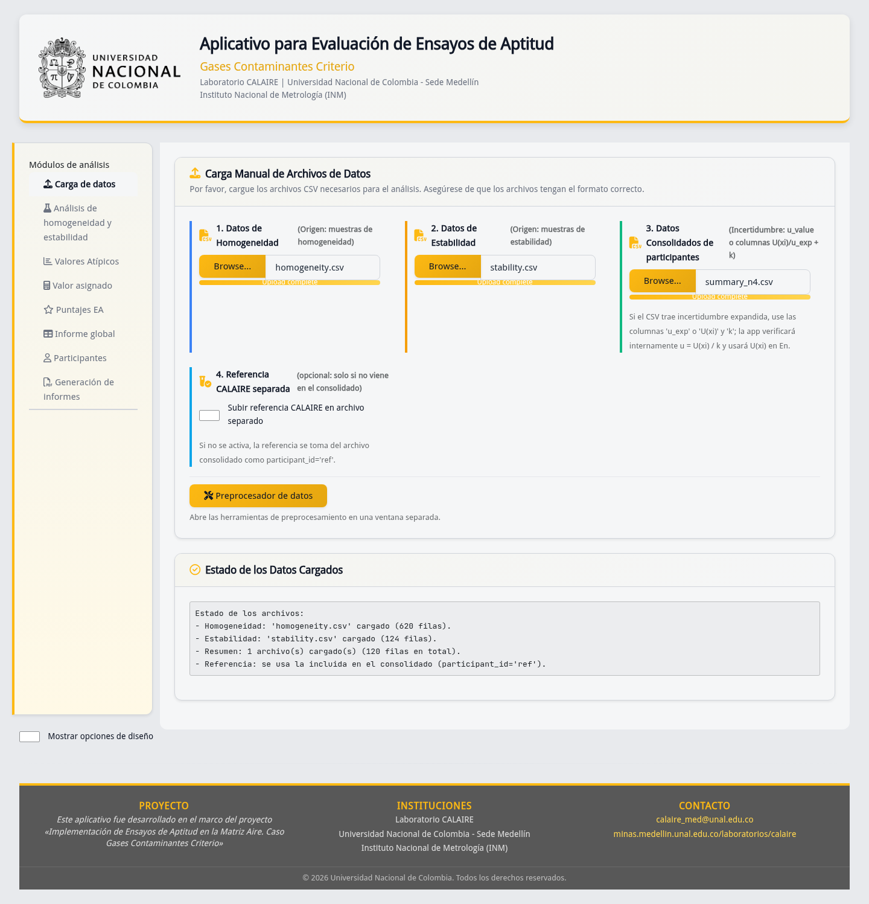

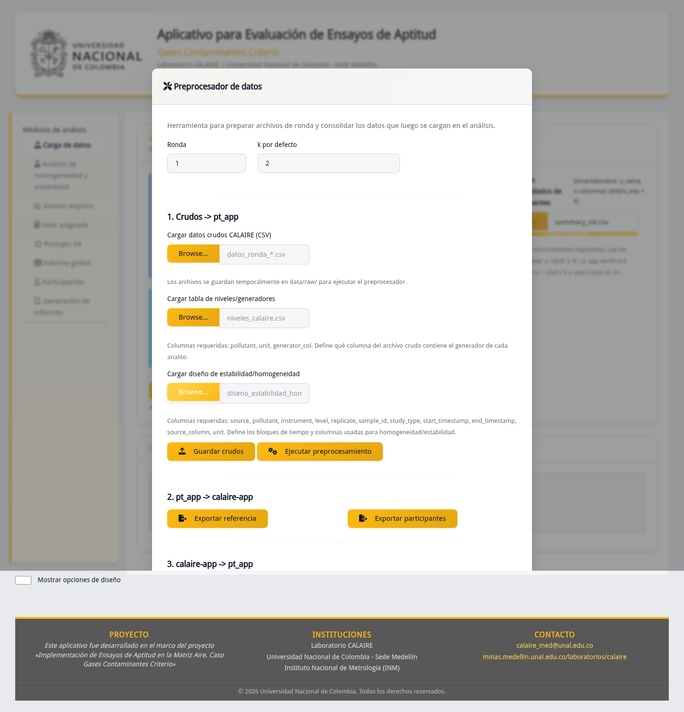

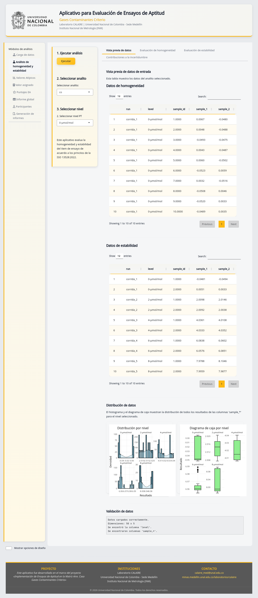

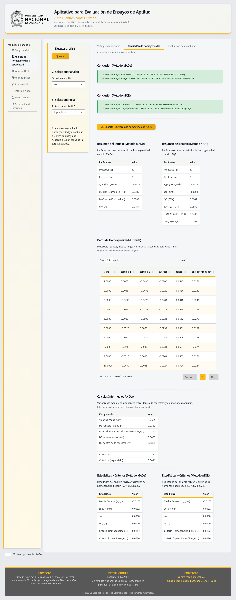

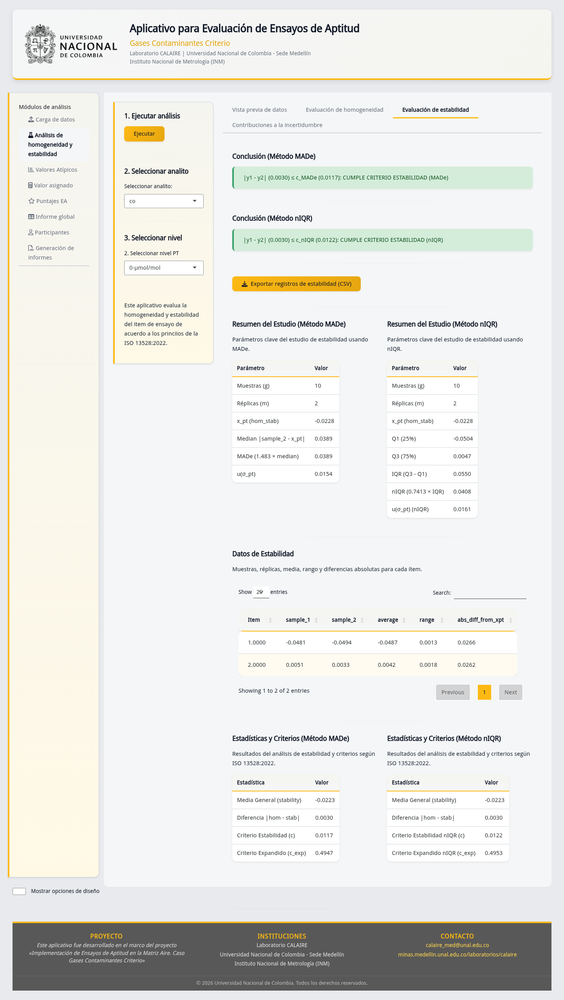

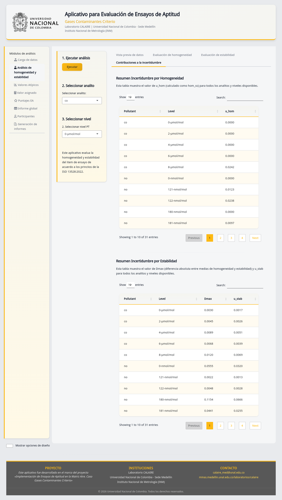

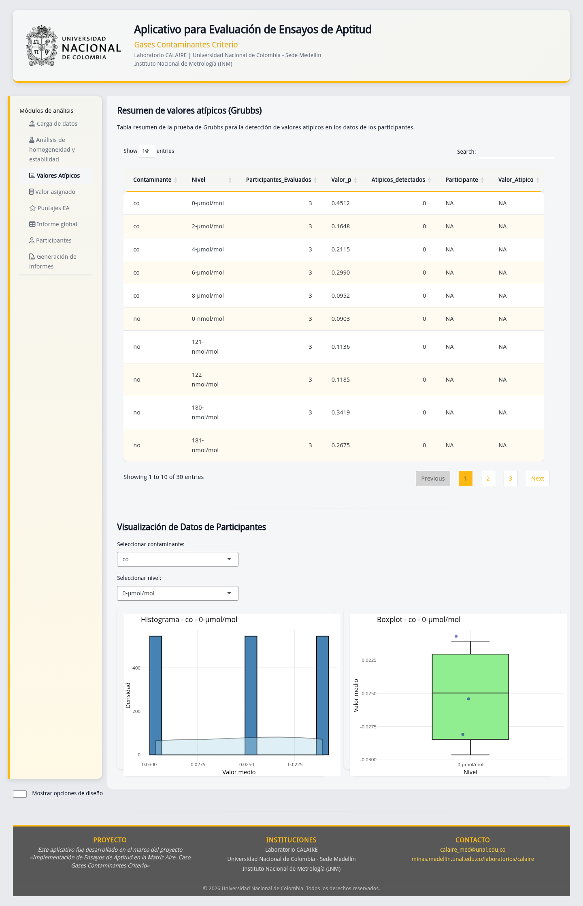

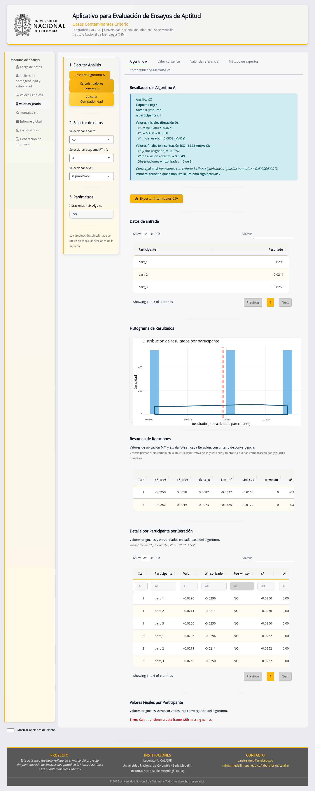

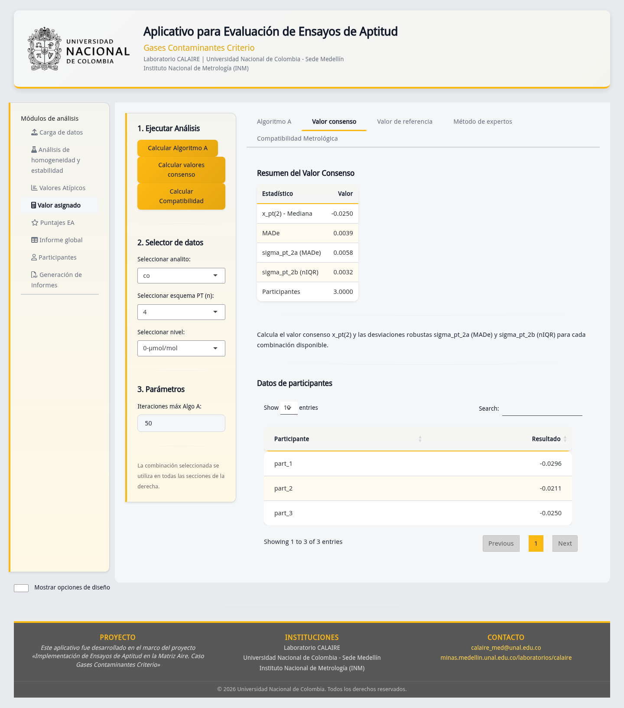

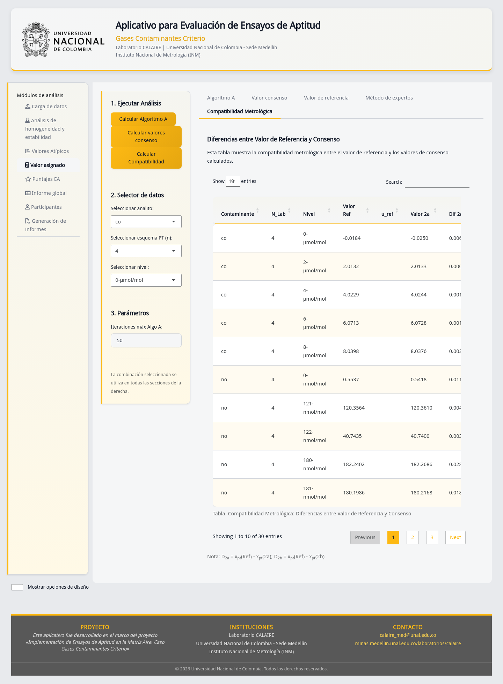

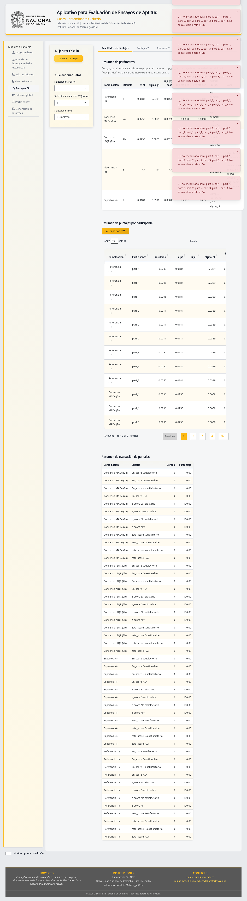

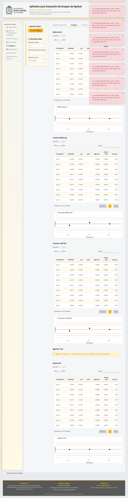

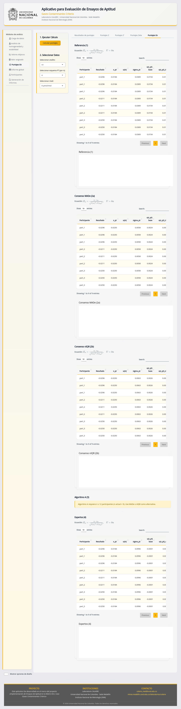

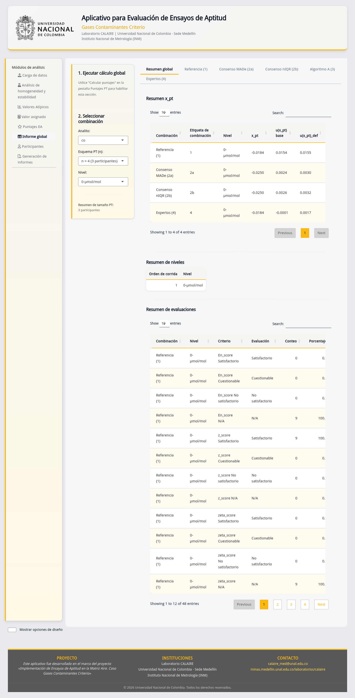

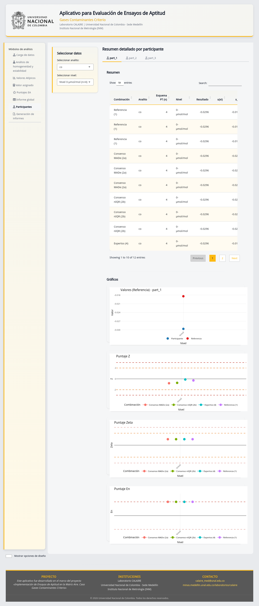

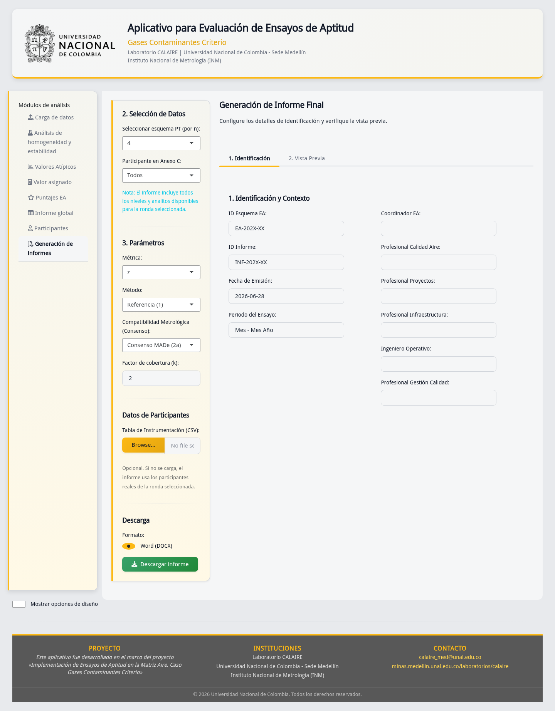

## 13. Documentos relacionados

| Codigo/documento | Relacion |
|---|---|
| `sgc_17043.md` | Guia conceptual de requisitos del SGC basados en ISO/IEC 17043:2023. |
| `sgc_13528.md` | Guia conceptual de requisitos estadisticos basados en ISO 13528:2022. |
| `DG-PSEA-02` | Aplicativo `calaire-app`, fuente de datos oficiales para `pt_app`. |
| `I-PSEA-04` | Instructivo de uso del preprocesador de `pt_app`. |
| `I-PSEA-05` | Instructivo de uso del modulo de analisis PT de `pt_app`. |
| `P-PSEA-03` | Control de registros y evidencias del PEA. |
| `P-PSEA-07` | Criterio estadistico que gobierna el analisis. |
| `P-PSEA-08` | Flujo tecnico de datos digitales del PEA. |
| `P-PSEA-09` | Generacion y emision del informe de resultados. |
| `P-PSEA-15` | Trabajo no conforme, no conformidades y acciones correctivas. |
| `P-PSEA-16` | Divulgacion y control de valores sensibles. |
| `P-PSEA-19` | Confidencialidad operativa interna del PEA. |
| `P-PSEA-20` | Competencia y autorizacion operativa del PEA. |

## 14. Limites

- Este documento no es un formato `F-PSEA`.
- Este documento no sustituye los instructivos de operacion.
- El aplicativo implementa criterios aprobados; no aprueba por si mismo el diseno estadistico.
- La app no reemplaza revision tecnica, competencia estadistica ni autorizacion formal del informe.
- La existencia de capturas demuestra funcionamiento observado, no reemplaza validacion estadistica completa.
- La gestion de quejas, apelaciones, trabajo no conforme y acciones correctivas se realiza por los procedimientos del SGC.
