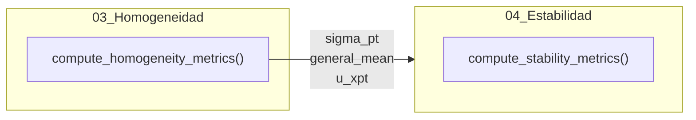

# Módulo: Evaluación de Homogeneidad

## Descripción
Este módulo implementa el análisis de homogeneidad del ítem de ensayo siguiendo los lineamientos de la norma **ISO 13528:2022 (Sección 7.4)**. Su objetivo es asegurar que las diferencias entre los ítems distribuidos sean lo suficientemente pequeñas como para no afectar la evaluación del desempeño de los participantes.

## Ubicación en el Código
| Elemento | Valor |
|----------|-------|
| Archivo | `app.R` |
| Líneas | 227 - 374 (Lógica) y 1274 - 1496 (Server) |
| UI | `tabPanel("Evaluación de homogeneidad")` (Líneas 863 - 886) |

## Dependencias
- **Reactives**: `hom_data_full()`.
- **Inputs**: `input$pollutant_analysis`, `input$target_level`.

## Funciones Principales

### `compute_homogeneity_metrics(target_pollutant, target_level)`
**Descripción**: Realiza los cálculos estadísticos completos para determinar si un analito en un nivel específico cumple con el criterio de homogeneidad.

| Parámetro | Tipo | Descripción |
|-----------|------|-------------|
| `target_pollutant` | character | Analito objetivo. |
| `target_level` | character | Nivel de concentración. |

**Retorna**: Una lista detallada con resultados de ANOVA, desviaciones estándar ($s_s$, $s_w$), MADe, $u_{xpt}$, $nIQR$, y la conclusión final.

## Reactives

### `homogeneity_run()`
| Propiedad | Valor |
|-----------|-------|
| Descripción | Ejecuta el cálculo de homogeneidad cuando se activa el `analysis_trigger`. |
| Depende de | `input$pollutant_analysis`, `input$target_level`, `analysis_trigger()` |
| Retorna | El objeto generado por `compute_homogeneity_metrics()`. |

### `u_hom_data()`
| Propiedad | Valor |
|-----------|-------|
| Descripción | Genera una tabla resumen de $u_{hom}$ (calculado como $s_s$) para todos los analitos y niveles disponibles. |
| Retorna | DataFrame con `Pollutant`, `Level`, `u_hom`. |

## Outputs

### `output$homog_conclusion`
- **Tipo**: renderUI
- **Descripción**: Muestra un cuadro de alerta (verde/naranja) con la conclusión del cumplimiento del criterio.

### `output$variance_components`
- **Tipo**: renderTable
- **Descripción**: Resumen de estadísticos robustos ($x_{pt}$, $\sigma_{pt}$, $u_{xpt}$) derivados de los datos de homogeneidad.

### `output$details_per_item_table`
- **Tipo**: renderTable
- **Descripción**: Tabla interactiva que muestra la media y el rango para cada ítem evaluado.

## Fórmulas y Cálculos

### Estadísticos de Ítem
- **Media por ítem ($x_i$):** promedio de las réplicas del ítem $i$.
- **Rango por ítem ($w_i$):** diferencia absoluta entre las réplicas del ítem $i$.

### Varianzas ANOVA
- **Media general ($\bar{x}_{\dots}$):** `mean(x_i)`
- **Varianza de medias ($s_x^2$):** `var(x_i)`
- **Desviación intra-muestra ($s_w$):** $s_w = \sqrt{\frac{\sum w_i^2}{2g}}$ (donde $g$ es el número de ítems).
- **Desviación entre muestras ($s_s$):** $s_s = \sqrt{\max(0, s_x^2 - \frac{s_w^2}{2})}$

### Estadísticos Robustos del Ítem
- **$\sigma_{pt}$ (MADe):** $1.483 \times \text{mediana}(|x_{i,1} - \text{mediana}(x_{i,1})|)$ (usando la primera muestra de cada ítem).
- **$u_{xpt}$:** $1.25 \times \frac{MADe}{\sqrt{g}}$

### Criterios de Evaluación
1. **Criterio Básico:** $s_s \leq 0.3 \times \sigma_{pt}$
2. **Criterio Expandido:** $s_s \leq \sqrt{1.88 \times (0.3 \times \sigma_{pt})^2 + 1.01 \times s_w^2}$

## Flujo de Datos

## Referencias
- ISO 13528:2022 Sección 7.4.
