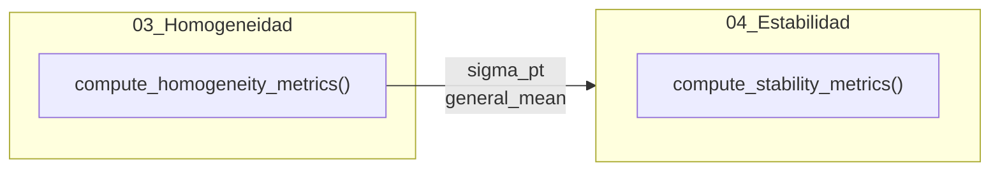

# Módulo: Evaluación de Estabilidad

## Descripción
Este módulo implementa el análisis de estabilidad del ítem de ensayo de acuerdo con la norma **ISO 13528:2022 (Sección 7.5)**. La estabilidad se evalúa comparando los resultados obtenidos en el estudio de homogeneidad (tiempo $T_1$) con los obtenidos en el estudio de estabilidad (tiempo $T_2$).

## Ubicación en el Código
| Elemento | Valor |
|----------|-------|
| Archivo | `app.R` |
| Líneas | 376 - 545 (Lógica) y 1322 - 1396 (Server) |
| UI | `tabPanel("Evaluación de estabilidad")` (Líneas 887 - 903) |

## Dependencias
- **Reactives**: `hom_data_full()`, `stab_data_full()`, `homogeneity_run()`.
- **Inputs**: `input$pollutant_analysis`, `input$target_level`.

## Funciones Principales

### `compute_stability_metrics(target_pollutant, target_level, hom_results)`
**Descripción**: Realiza los cálculos para determinar si el ítem mantiene sus propiedades bajo las condiciones y tiempo de transporte/almacenamiento.

| Parámetro | Tipo | Descripción |
|-----------|------|-------------|
| `target_pollutant` | character | Analito objetivo. |
| `target_level` | character | Nivel de concentración. |
| `hom_results` | list | Resultados del análisis de homogeneidad previo. |

**Retorna**: Una lista que incluye la media de estabilidad, la diferencia observada respecto a la homogeneidad ($D$), el cumplimiento del criterio de estabilidad y estadísticos robustos propios del conjunto de estabilidad.

## Reactives

### `stability_run()`
| Propiedad | Valor |
|-----------|-------|
| Descripción | Calcula la diferencia observada y realiza una prueba t complementaria. |
| Depende de | `homogeneity_run()`, `homogeneity_run_stability()`, `analysis_trigger()` |

### `u_stab_data()`
| Propiedad | Valor |
|-----------|-------|
| Descripción | Genera una tabla resumen de $D_{max}$ y $u_{stab}$ para todos los analitos y niveles. |

## Outputs

### `output$homog_conclusion_stability`
- **Tipo**: renderUI
- **Descripción**: Muestra la conclusión del cumplimiento del criterio de estabilidad (Cumple/No cumple).

### `output$variance_components_stability`
- **Tipo**: renderTable
- **Descripción**: Resumen de estadísticos ($x_{pt}$, $\sigma_{pt}$, $u_{xpt}$) calculados específicamente para los datos de estabilidad.

## Fórmulas y Cálculos

### Diferencia Observada
- **Diferencia ($D$):** $| \bar{y}_{hom} - \bar{y}_{stab} |$
  Donde $\bar{y}_{hom}$ es la media general de homogeneidad y $\bar{y}_{stab}$ es la media general de estabilidad.

### Criterios de Evaluación
1. **Criterio Básico:** $D \leq 0.3 \times \sigma_{pt}$
2. **Criterio Expandido:** $D \leq 0.3 \times \sigma_{pt} + 2 \times \sqrt{u_{hom,mean}^2 + u_{stab,mean}^2}$
   Donde $u_{mean} = \frac{sd}{\sqrt{n}}$ del conjunto de datos respectivo.

### Incertidumbre por Estabilidad ($u_{stab}$)
- $u_{stab} = \frac{D}{\sqrt{3}}$

### Prueba T Complementaria
Se realiza una prueba t de muestras independientes para verificar si la diferencia entre los conjuntos de datos es estadísticamente significativa ($p > 0.05$ respalda la estabilidad).

## Flujo de Datos

## Referencias
- ISO 13528:2022 Sección 7.5.
