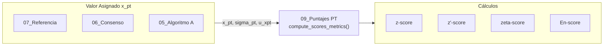

# Módulo: Puntajes PT (z, z', ζ, En)

## Descripción
Este módulo realiza el cálculo y la evaluación del desempeño de los laboratorios participantes mediante cuatro tipos de puntajes estandarizados, siguiendo los lineamientos de la norma **ISO 13528:2022 (Sección 9)**. Permite evaluar tanto la exactitud del resultado como la consistencia de la incertidumbre declarada.

## Ubicación en el Código
| Elemento | Valor |
|----------|-------|
| Archivo | `app.R` |
| Líneas | 547 - 625 (Lógica) y 1827 - 2408 (Server) |
| UI | `tabPanel("Puntajes PT")` (Líneas 1046 - 1081) |

## Dependencias
- **Reactives**: `pt_prep_data()`, `homogeneity_run()`, `u_hom_data()`, `u_stab_data()`.
- **Inputs**: `input$run_scores`, `input$pollutant_scores`, `input$level_scores`, `input$sigma_pt_source`, `input$k_factor`.

## Funciones Principales

### `compute_scores_metrics(summary_df, target_pollutant, target_level, sigma_pt, u_xpt, k, m)`
**Descripción**: Calcula los puntajes z, z', zeta y En para cada participante basándose en sus resultados y las incertidumbres del valor asignado.

| Parámetro | Tipo | Descripción |
|-----------|------|-------------|
| `summary_df` | data.frame | Resumen de datos de los participantes (`pt_prep_data`). |
| `sigma_pt` | numeric | Desviación estándar para la evaluación de la aptitud. |
| `u_xpt` | numeric | Incertidumbre estándar del valor asignado. |
| `k` | numeric | Factor de cobertura para En. |

**Retorna**: Una lista con los puntajes calculados y las evaluaciones cualitativas asociadas.

## Reactives

### `scores_trigger()`
| Propiedad | Valor |
|-----------|-------|
| Descripción | Trigger que indica cuándo se han ejecutado los cálculos de puntajes. |

### `scores_results_cache()`
| Propiedad | Valor |
|-----------|-------|
| Descripción | Almacena los resultados de puntajes para todas las combinaciones de analito/nivel procesadas. |

## Outputs

### `output$z_scores_panel`, `output$en_scores_panel`, etc.
- **Tipo**: renderPlotly / renderTable
- **Descripción**: Visualizaciones interactivas y tablas resumen de los puntajes por participante.

## Fórmulas y Cálculos

### Puntajes de Desempepeño
| Puntaje | Fórmula | Criterio de Evaluación |
|---------|---------|------------------------|
| **z** | $z = \frac{x - x_{pt}}{\sigma_{pt}}$ | Satisfactorio: $|z| \leq 2$   Cuestionable: $2 < |z| < 3$   No satisfactorio: $|z| \geq 3$ |
| **z'** | $z' = \frac{x - x_{pt}}{\sqrt{\sigma_{pt}^2 + u_{xpt}^2}}$ | Igual que puntaje z. Se usa cuando $u_{xpt} > 0.3 \sigma_{pt}$. |
| **ζ (zeta)** | $\zeta = \frac{x - x_{pt}}{\sqrt{u_x^2 + u_{xpt}^2}}$ | Igual que puntaje z. Evalúa coherencia entre resultado e incertidumbre estándar. |
| **En** | $En = \frac{x - x_{pt}}{\sqrt{U_x^2 + U_{xpt}^2}}$ | Satisfactorio: $|En| \leq 1$   No satisfactorio: $|En| > 1$ |

Donde:
- $x$: Valor reportado por el participante.
- $x_{pt}$: Valor asignado.
- $\sigma_{pt}$: Desviación estándar para el PT.
- $u_{xpt}$: Incertidumbre estándar del valor asignado.
- $u_x$: Incertidumbre estándar del participante.
- $U_x$: Incertidumbre expandida del participante ($U_x = k \cdot u_x$).
- $U_{xpt}$: Incertidumbre expandida del valor asignado ($U_{xpt} = k \cdot u_{xpt}$).

## Flujo de Datos

## Referencias
- ISO 13528:2022 Sección 9.
