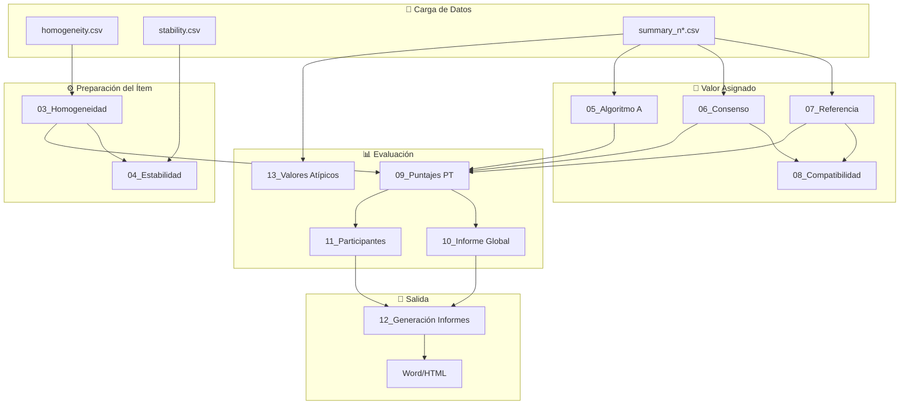

# Documentación: Aplicativo de Ensayos de Aptitud

Este repositorio contiene la documentación detallada del aplicativo Shiny para la evaluación de Ensayos de Aptitud (PT), desarrollado bajo los lineamientos de las normas **ISO 17043** e **ISO 13528**.

## Descripción General
El aplicativo permite automatizar el procesamiento estadístico de datos provenientes de ejercicios de intercomparación, facilitando la evaluación de la homogeneidad y estabilidad de los ítems, así como el desempeño de los laboratorios participantes mediante diversos puntajes (z, z', zeta, En).

## Requisitos de Software
Para ejecutar la aplicación (`app.R`), se requieren las siguientes librerías de R:
- `shiny`, `tidyverse`, `vroom`, `DT`, `rhandsontable`, `shinythemes`, `outliers`, `patchwork`, `bsplus`, `plotly`, `rmarkdown`.

## Estructura del Código (`app.R`)
El código principal está estructurado de la siguiente manera:
1. **Encabezado y Librerías**: Configuración inicial.
2. **Funciones Auxiliares**: Lógica matemática y helpers.
3. **Interfaz de Usuario (UI)**: Definición de la disposición visual.
4. **Lógica del Servidor (Server)**: Procesamiento reactivo y cálculos.
5. **Llamada shinyApp**: Punto de entrada de la aplicación.

## Flujo General de Datos

## Índice de Módulos

1. [Carga de Datos](01_carga_datos.md)
2. [Funciones Auxiliares](02_funciones_auxiliares.md)
3. [Evaluación de Homogeneidad](03_homogeneidad.md)
4. [Evaluación de Estabilidad](04_estabilidad.md)
5. [Cálculo de Valor Asignado (Algoritmo A)](05_algoritmo_a.md)
6. [Valor Consenso](06_valor_consenso.md)
7. [Valor de Referencia](07_valor_referencia.md)
8. [Compatibilidad Metrológica](08_compatibilidad.md)
9. [Puntajes PT (z, z', ζ, En)](09_puntajes_pt.md)
10. [Informe Global](10_informe_global.md)
11. [Detalle por Participante](11_participantes.md)
12. [Generación de Informes](12_generacion_informes.md)
13. [Detección de Valores Atípicos](13_valores_atipicos.md)
