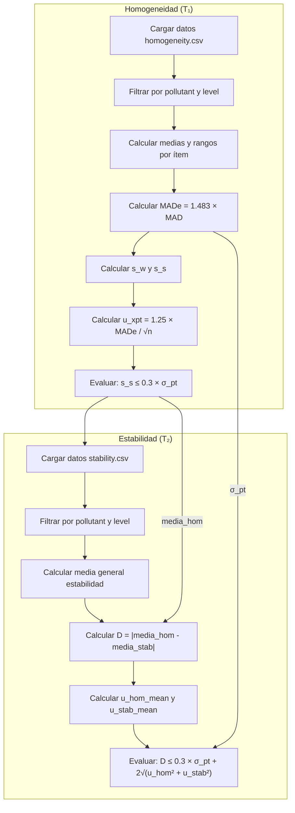

# Cálculos de Homogeneidad, Estabilidad e Incertidumbre

Este documento explica paso a paso los cálculos realizados por las funciones `compute_homogeneity_metrics` y `compute_stability_metrics` en `app.R` (líneas 223-556).

---

## 1. Función Auxiliar: `get_wide_data()`

**Ubicación**: Líneas 224-235

### Propósito
Transforma los datos de formato largo a formato ancho, agrupando las réplicas por columnas.

### Parámetros
| Parámetro | Descripción |
|-----------|-------------|
| `df` | DataFrame con los datos de homogeneidad/estabilidad |
| `target_pollutant` | Contaminante a filtrar |

### Proceso
1. Filtra por el contaminante seleccionado
2. Elimina la columna `pollutant`
3. Pivota los datos: cada réplica se convierte en una columna (`sample_1`, `sample_2`, etc.)

```r
filtered %>%
  select(-pollutant) %>%
  pivot_wider(names_from = replicate, values_from = value, names_prefix = "sample_")
```

---

## 2. Función `compute_homogeneity_metrics()`

**Ubicación**: Líneas 237-384

### Propósito
Evalúa la homogeneidad de los ítems de ensayo de aptitud según ISO 13528.

### Parámetros
| Parámetro | Descripción |
|-----------|-------------|
| `target_pollutant` | Contaminante (ej: "co", "no", "so2") |
| `target_level` | Nivel de concentración (ej: "2-μmol/mol") |

---

### Paso 1: Preparación de Datos (L250-256)

```r
level_data <- wide_df %>%
  filter(level == target_level) %>%
  select(starts_with("sample_"))
```

- **g** = número de ítems (filas)
- **m** = número de réplicas por ítem (columnas)

---

### Paso 2: Cálculo de Estadísticos por Ítem (L264-282, L306-313)

Para cada ítem $i$:

| Estadístico | Fórmula |
|-------------|---------|
| Media ($\bar{x}_i$) | $\bar{x}_i = \frac{1}{m} \sum_{j=1}^{m} x_{ij}$ |
| Rango ($w_i$) | $w_i = x_{i,max} - x_{i,min}$ |
| Varianza ($s_i^2$) | $s_i^2 = \frac{1}{m-1}\sum_{j=1}^{m}(x_{ij} - \bar{x}_i)^2$ |

---

### Paso 3: Cálculo de MADe y σ_pt (L296-301)

El cálculo se basa en la primera muestra de cada ítem (`sample_1`):

```r
first_sample_results <- level_data %>% pull(sample_1)
median_val <- median(first_sample_results, na.rm = TRUE)
abs_diff_from_median <- abs(first_sample_results - median_val)
median_abs_diff <- median(abs_diff_from_median, na.rm = TRUE)
mad_e <- 1.483 * median_abs_diff
```

| Variable | Fórmula | Descripción |
|----------|---------|-------------|
| Mediana | $\tilde{x}$ | Mediana de los valores de `sample_1` |
| MAD | $\text{median}(\|x_i - \tilde{x}\|)$ | Mediana de las desviaciones absolutas |
| **MADe** | $\sigma_{pt} = 1.483 \times MAD$ | Desviación estándar robusta normalizada |
| **nIQR** | $0.7413 \times IQR$ | Estimador robusto alternativo basado en rango intercuartílico |

---

### Paso 4: Incertidumbre del Valor Asignado $u_{xpt}$ (L303-304)

```r
n_robust <- length(first_sample_results)
u_xpt <- 1.25 * mad_e / sqrt(n_robust)
```

$$u_{xpt} = \frac{1.25 \times MADe}{\sqrt{n}}$$

Donde:
- $n$ = número de ítems (g)
- El factor 1.25 es un factor de eficiencia para la estimación robusta

---

### Paso 5: Estadísticos ANOVA (L315-323)

| Variable | Cálculo | Descripción |
|----------|---------|-------------|
| $\bar{x}_{..}$ | `mean(medias_por_ítem)` | Media general |
| $s_{\bar{x}}^2$ | `var(medias_por_ítem)` | Varianza de las medias entre ítems |
| $s_{\bar{x}}$ | $\sqrt{s_{\bar{x}}^2}$ | Desviación estándar de las medias |

**Desviación intra-muestra ($s_w$):**

$$s_w = \sqrt{\frac{\sum_{i=1}^{g} w_i^2}{2g}}$$

**Desviación entre-muestras ($s_s$):**

$$s_s = \sqrt{\max\left(0, s_{\bar{x}}^2 - \frac{s_w^2}{2}\right)}$$

```r
hom_sw <- sqrt(sum(hom_wt^2) / (2 * length(hom_wt)))
hom_ss_sq <- abs(hom_s_xt^2 - ((hom_sw^2) / 2))
hom_ss <- sqrt(hom_ss_sq)
```

---

### Paso 6: Criterios de Homogeneidad (L333-350)

#### Criterio Básico
$$s_s \leq 0.3 \times \sigma_{pt}$$

```r
hom_c_criterion <- 0.3 * hom_sigma_pt
```

#### Criterio Expandido
$$s_s \leq \sqrt{1.88 \times (0.3 \times \sigma_{pt})^2 + 1.01 \times s_w^2}$$

```r
hom_sigma_allowed_sq <- hom_c_criterion^2
hom_c_criterion_expanded <- sqrt(hom_sigma_allowed_sq * 1.88 + (hom_sw^2) * 1.01)
```

| Resultado | Conclusión |
|-----------|------------|
| $s_s \leq c$ | ✅ CUMPLE CRITERIO HOMOGENEIDAD |
| $s_s > c$ | ⚠️ NO CUMPLE CRITERIO HOMOGENEIDAD |

---

### Valores de Retorno

| Campo | Descripción |
|-------|-------------|
| `ss` | Desviación estándar entre muestras $s_s$ |
| `sw` | Desviación estándar intra-muestra $s_w$ |
| `sigma_pt` | MADe ($\sigma_{pt}$) |
| `u_xpt` | Incertidumbre del valor asignado |
| `c_criterion` | Criterio básico $0.3 \times \sigma_{pt}$ |
| `c_criterion_expanded` | Criterio expandido |
| `general_mean` | Media general $\bar{x}_{..}$ |
| `n_iqr` | Estimador nIQR |

---

## 3. Función `compute_stability_metrics()`

**Ubicación**: Líneas 386-555

### Propósito
Evalúa la estabilidad del ítem comparando los resultados de homogeneidad ($T_1$) con los de estabilidad ($T_2$).

### Parámetros
| Parámetro | Descripción |
|-----------|-------------|
| `target_pollutant` | Contaminante objetivo |
| `target_level` | Nivel de concentración |
| `hom_results` | Resultados previos de `compute_homogeneity_metrics()` |

---

### Paso 1: Preparación de Datos de Estabilidad (L402-404)

Proceso idéntico al de homogeneidad pero con datos del tiempo $T_2$.

---

### Paso 2: Cálculo de Estadísticos de Estabilidad (L458-477)

Se calculan los mismos estadísticos que en homogeneidad para los datos de estabilidad:
- Media general de estabilidad: $\bar{y}_{stab}$
- Desviación intra-muestra: $s_w^{stab}$
- Desviación entre-muestras: $s_s^{stab}$

---

### Paso 3: Diferencia entre Homogeneidad y Estabilidad (L468)

$$D = |\bar{y}_{hom} - \bar{y}_{stab}|$$

```r
diff_hom_stab <- abs(stab_x_t_bar - hom_results$general_mean)
```

---

### Paso 4: Incertidumbres para el Criterio Expandido (L491-508)

#### Incertidumbre de la media de homogeneidad:

```r
hom_values <- hom_results$data_wide %>%
  select(starts_with("sample_")) %>%
  unlist() %>%
  as.numeric()
sd_hom_mean <- sd(hom_values)
n_hom <- length(hom_values)
u_hom_mean <- sd_hom_mean / sqrt(n_hom)
```

$$u_{hom,mean} = \frac{s_{hom}}{\sqrt{n_{hom}}}$$

#### Incertidumbre de la media de estabilidad:

```r
stab_values <- stab_data$Resultado
sd_stab_mean <- sd(stab_values)
n_stab <- length(stab_values)
u_stab_mean <- sd_stab_mean / sqrt(n_stab)
```

$$u_{stab,mean} = \frac{s_{stab}}{\sqrt{n_{stab}}}$$

---

### Paso 5: Criterios de Estabilidad (L488, L508-522)

#### Criterio Básico (usando σ_pt de homogeneidad)
$$D \leq 0.3 \times \sigma_{pt}^{hom}$$

```r
stab_c_criterion <- 0.3 * hom_results$sigma_pt
```

#### Criterio Expandido
$$D \leq 0.3 \times \sigma_{pt}^{hom} + 2 \times \sqrt{u_{hom,mean}^2 + u_{stab,mean}^2}$$

```r
stab_c_criterion_expanded <- stab_c_criterion + 2 * sqrt(u_hom_mean^2 + u_stab_mean^2)
```

---

## 4. Resumen de Incertidumbres Calculadas

| Símbolo | Fórmula | Uso |
|---------|---------|-----|
| $\sigma_{pt}$ | $1.483 \times MAD$ | Desviación estándar robusta para el PT |
| $u_{xpt}$ | $\frac{1.25 \times MADe}{\sqrt{n}}$ | Incertidumbre del valor asignado |
| $s_s$ | $\sqrt{s_{\bar{x}}^2 - \frac{s_w^2}{2}}$ | Desviación entre muestras (homogeneidad) |
| $u_{hom}$ | $s_s$ | Incertidumbre por heterogeneidad |
| $u_{hom,mean}$ | $\frac{s_{hom}}{\sqrt{n_{hom}}}$ | Incertidumbre de la media de homogeneidad |
| $u_{stab,mean}$ | $\frac{s_{stab}}{\sqrt{n_{stab}}}$ | Incertidumbre de la media de estabilidad |
| $u_{stab}$ | $\frac{D}{\sqrt{3}}$ | Incertidumbre por estabilidad (ISO 13528) |

---

## 5. Diagrama de Flujo



---

## Referencias

- **ISO 13528:2022** - Sección 7.4 (Homogeneidad) y Sección 7.5 (Estabilidad)
- [app.R](file:///home/w182/w421/pt_app/app.R#L223-556) - Implementación de las funciones
