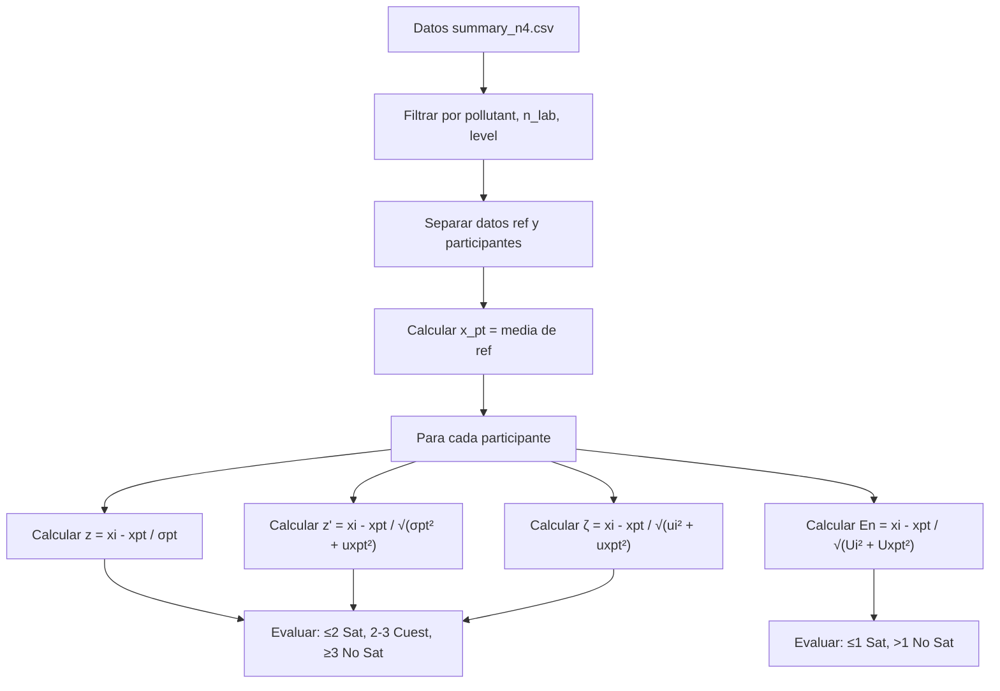

# Cálculo de los 4 Puntajes (Scores) en Ensayos de Aptitud

## Resumen

Este documento explica las funciones utilizadas para el cálculo de los 4 puntajes (scores) en ensayos de aptitud (PT - Proficiency Testing) según la norma ISO 13528:2022.

Los 4 puntajes calculados son:
1. **z-score**: Puntaje estandarizado básico
2. **z'-score (z prima)**: Puntaje que incluye incertidumbre del valor asignado
3. **ζ-score (zeta)**: Puntaje que incluye incertidumbre del participante y del valor asignado
4. **En-score**: Número de error normalizado (para incertidumbres expandidas)

---

## Función Principal: `compute_scores_metrics`

La función `compute_scores_metrics` en `app.R` (líneas 557-635) calcula los 4 puntajes.

### Ubicación en el código
```r
# app.R líneas 557-635
compute_scores_metrics <- function(summary_df, target_pollutant, target_n_lab, 
                                    target_level, sigma_pt, u_xpt, k, m = NULL)
```

### Parámetros de entrada

| Parámetro | Descripción |
|-----------|-------------|
| `summary_df` | DataFrame con los datos consolidados de participantes |
| `target_pollutant` | Analito seleccionado (ej: "co", "no", "o3") |
| `target_n_lab` | Número de laboratorio/esquema PT |
| `target_level` | Nivel de concentración seleccionado |
| `sigma_pt` | Desviación estándar para aptitud (σ_pt) |
| `u_xpt` | Incertidumbre estándar del valor asignado |
| `k` | Factor de cobertura (típicamente k=2 para 95%) |
| `m` | Número de réplicas (opcional, para calcular incertidumbre) |

---

## Fórmulas Matemáticas

### 1. z-score (Puntaje Z)

$$z = \frac{x_i - x_{pt}}{\sigma_{pt}}$$

Donde:
- $x_i$ = resultado del participante
- $x_{pt}$ = valor asignado (media de los valores de referencia)
- $\sigma_{pt}$ = desviación estándar para aptitud

**Evaluación:**
- |z| ≤ 2: Satisfactorio
- 2 < |z| < 3: Cuestionable
- |z| ≥ 3: No satisfactorio

---

### 2. z'-score (Puntaje Z Prima)

$$z' = \frac{x_i - x_{pt}}{\sqrt{\sigma_{pt}^2 + u_{xpt}^2}}$$

Donde:
- $u_{xpt}$ = incertidumbre estándar del valor asignado

**Evaluación:**
- |z'| ≤ 2: Satisfactorio
- 2 < |z'| < 3: Cuestionable
- |z'| ≥ 3: No satisfactorio

---

### 3. ζ-score (Puntaje Zeta)

$$\zeta = \frac{x_i - x_{pt}}{\sqrt{u_i^2 + u_{xpt}^2}}$$

Donde:
- $u_i$ = incertidumbre estándar del resultado del participante

**Evaluación:**
- |ζ| ≤ 2: Satisfactorio
- 2 < |ζ| < 3: Cuestionable
- |ζ| ≥ 3: No satisfactorio

---

### 4. En-score (Número de Error Normalizado)

$$E_n = \frac{x_i - x_{pt}}{\sqrt{U_i^2 + U_{xpt}^2}}$$

Donde:
- $U_i = k \cdot u_i$ = incertidumbre expandida del participante
- $U_{xpt} = k \cdot u_{xpt}$ = incertidumbre expandida del valor asignado
- $k$ = factor de cobertura (típicamente 2)

**Evaluación:**
- |En| ≤ 1: Satisfactorio
- |En| > 1: No satisfactorio

---

## Paso a Paso del Cálculo

### Paso 1: Filtrado de datos
```r
data <- summary_df %>%
  filter(
    pollutant == target_pollutant,
    n_lab == target_n_lab,
    level == target_level
  )
```

### Paso 2: Obtención del valor asignado (x_pt)
```r
ref_data <- data %>% filter(participant_id == "ref")
x_pt <- mean(ref_data$mean_value, na.rm = TRUE)
```

### Paso 3: Preparación de datos del participante
```r
participant_data <- participant_data %>%
  rename(result = mean_value) %>%
  mutate(uncertainty_std = if (!is.null(m) && m > 0) sd_value / sqrt(m) else sd_value)
```

### Paso 4: Cálculo de los 4 puntajes
```r
final_scores <- participant_data %>%
  mutate(
    x_pt = x_pt,
    sigma_pt = sigma_pt,
    z_score = (result - x_pt) / sigma_pt,
    z_prime_score = (result - x_pt) / sqrt(sigma_pt^2 + u_xpt^2),
    zeta_score = (result - x_pt) / sqrt(uncertainty_std^2 + u_xpt^2),
    U_xi = k * uncertainty_std,
    U_xpt = k * u_xpt,
    En_score = (result - x_pt) / sqrt(U_xi^2 + U_xpt^2)
  )
```

### Paso 5: Evaluación de los puntajes
```r
mutate(
  z_score_eval = case_when(
    abs(z_score) <= 2 ~ "Satisfactorio",
    abs(z_score) > 2 & abs(z_score) < 3 ~ "Cuestionable",
    abs(z_score) >= 3 ~ "No satisfactorio",
    TRUE ~ "N/A"
  ),
  # ... similar para los otros 3 puntajes
)
```

---

## Ejemplo con Datos Reales

Usando `data/summary_n4.csv`, para el analito "co", nivel "2-μmol/mol":

| Participante | Resultado | z | z' | ζ | En |
|--------------|-----------|---|----|----|-----|
| ref | 2.0132 | 0.00 | 0.00 | 0.00 | 0.00 |
| part_1 | 2.0133 | pequeño | pequeño | pequeño | pequeño |
| part_2 | 2.0132 | ≈0 | ≈0 | ≈0 | ≈0 |
| part_3 | 2.0130 | pequeño | pequeño | pequeño | pequeño |

> [!NOTE]
> Los valores exactos dependen de los parámetros σ_pt, u_xpt y k seleccionados.

---

## Diagrama del Flujo de Cálculo



---

## Ver También

- [algoritmo_a_explicacion.md](algoritmo_a_explicacion.md) - Cálculo del valor asignado robusto
- [calculo_homogeneidad_estabilidad_incertidumbre.md](calculo_homogeneidad_estabilidad_incertidumbre.md) - Cálculo de σ_pt y u_xpt
