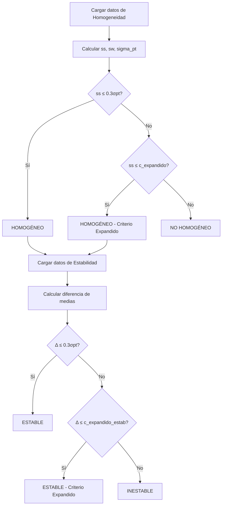

# Entregable 3.1: Cálculo de Homogeneidad y Estabilidad

**Proyecto:** Aplicativo para Evaluación de Ensayos de Aptitud (PT App)  
**Organización:** Laboratorio CALAIRE - Universidad Nacional de Colombia  
**Norma de Referencia:** ISO 13528:2022, Sección 7.4 y Anexo B  
**Fecha:** 2026-01-03

---

## 1. Introducción

La evaluación de la homogeneidad y estabilidad de los ítems de ensayo es un requisito fundamental para asegurar que las diferencias observadas entre los resultados de los participantes reflejen su desempeño real y no variaciones inherentes al material de referencia o su degradación en el tiempo.

---

## 2. Evaluación de Homogeneidad

### 2.1. Objetivo

Verificar que la variabilidad entre los ítems distribuidos a los participantes sea suficientemente pequeña para no afectar significativamente la evaluación del desempeño.

### 2.2. Diseño Experimental

| Parámetro | Símbolo | Descripción |
|-----------|---------|-------------|
| Número de ítems | $g$ | Cantidad de unidades evaluadas (típicamente 10-20) |
| Réplicas por ítem | $m$ | Mediciones independientes por ítem (típicamente 2) |
| Resultados individuales | $x_{ij}$ | Resultado $j$ del ítem $i$ |

### 2.3. Estadísticos Calculados

#### 2.3.1. Media por Ítem ($\bar{x}_i$)

$$\bar{x}_i = \frac{1}{m} \sum_{j=1}^{m} x_{ij}$$

#### 2.3.2. Media General ($\bar{\bar{x}}$)

$$\bar{\bar{x}} = \frac{1}{g} \sum_{i=1}^{g} \bar{x}_i$$

#### 2.3.3. Rango por Ítem ($w_i$)

Para $m = 2$ réplicas:
$$w_i = |x_{i1} - x_{i2}|$$

Para $m > 2$ réplicas:
$$w_i = \max(x_{ij}) - \min(x_{ij})$$

#### 2.3.4. Desviación Intra-Muestra ($s_w$)

Representa la variabilidad analítica (repetibilidad del método de ensayo):

$$s_w = \sqrt{\frac{\sum_{i=1}^{g} w_i^2}{2g}}$$

> **Nota:** Esta fórmula asume $m = 2$. Para $m > 2$, se utiliza el cuadrado medio residual del ANOVA.

#### 2.3.5. Varianza de Medias ($s_{\bar{x}}^2$)

$$s_{\bar{x}}^2 = \frac{1}{g-1} \sum_{i=1}^{g} (\bar{x}_i - \bar{\bar{x}})^2$$

#### 2.3.6. Desviación Entre Muestras ($s_s$)

Representa la variabilidad real entre los ítems:

$$s_s^2 = s_{\bar{x}}^2 - \frac{s_w^2}{m}$$

$$s_s = \sqrt{\max(0, s_s^2)}$$

> **Importante:** Si $s_s^2 < 0$, se toma $s_s = 0$, indicando que no hay evidencia de inhomogeneidad.

### 2.4. Desviación Estándar para la Aptitud ($\sigma_{pt}$)

Para el cálculo del criterio de aceptación, se utiliza el MADe (Median Absolute Deviation escalada):

$$\sigma_{pt} = 1.4826 \times \text{mediana}(|x_{i,1} - \text{mediana}(x_{i,1})|)$$

> Se utiliza solamente la primera réplica (`sample_1`) de cada ítem para este cálculo.

### 2.5. Incertidumbre del Valor Asignado ($u_{xpt}$)

$$u_{xpt} = 1.25 \times \frac{\sigma_{pt}}{\sqrt{g}}$$

### 2.6. Criterios de Aceptación

#### 2.6.1. Criterio Simple

$$s_s \le c = 0.3 \times \sigma_{pt}$$

| Resultado | Interpretación |
|-----------|----------------|
| $s_s \le c$ | **CUMPLE** - El ítem es suficientemente homogéneo. |
| $s_s > c$ | Evaluar criterio expandido. |

#### 2.6.2. Criterio Expandido

Si el criterio simple no se cumple, se aplica el criterio expandido que considera la incertidumbre de la estimación:

$$s_s \le c' = \sqrt{1.88 \times c^2 + 1.01 \times s_w^2}$$

Donde:
- $c = 0.3 \times \sigma_{pt}$
- Los coeficientes 1.88 y 1.01 provienen de la distribución F con los grados de libertad correspondientes.

| Resultado | Interpretación |
|-----------|----------------|
| $s_s \le c'$ | **CUMPLE** (con criterio expandido). |
| $s_s > c'$ | **NO CUMPLE** - Considerar acciones correctivas. |

### 2.7. Tabla ANOVA de Referencia

| Fuente de Variación | Grados de Libertad | Suma de Cuadrados | Media de Cuadrados |
|---------------------|-------------------|-------------------|-------------------|
| Entre ítems | $g - 1$ | $m \times (g-1) \times s_{\bar{x}}^2$ | $m \times s_{\bar{x}}^2$ |
| Dentro de ítems (Residuos) | $g \times (m - 1)$ | $g \times (m-1) \times s_w^2$ | $s_w^2$ |

### 2.8. Implementación en Código R

```r
compute_homogeneity_metrics <- function(target_pollutant, target_level) {
  # Obtener datos en formato wide
  wide_df <- get_wide_data(hom_data_full(), target_pollutant)
  level_data <- wide_df %>% filter(level == target_level) %>% select(starts_with("sample_"))
  
  g <- nrow(level_data)  # Número de ítems
  m <- ncol(level_data)  # Número de réplicas
  
  # Calcular estadísticos por ítem
  item_means <- rowMeans(level_data, na.rm = TRUE)
  item_ranges <- apply(level_data, 1, function(x) max(x) - min(x))
  
  # Desviaciones
  general_mean <- mean(item_means)
  s_x_bar_sq <- var(item_means)
  s_w <- sqrt(sum(item_ranges^2) / (2 * g))
  s_s <- sqrt(max(0, s_x_bar_sq - (s_w^2 / m)))
  
  # Sigma_pt usando MADe
  sample_1 <- level_data$sample_1
  sigma_pt <- 1.483 * median(abs(sample_1 - median(sample_1)))
  
  # Criterios
  c_criterion <- 0.3 * sigma_pt
  c_expanded <- sqrt(1.88 * c_criterion^2 + 1.01 * s_w^2)
  
  # Evaluación
  passed_simple <- s_s <= c_criterion
  passed_expanded <- s_s <= c_expanded
  
  list(ss = s_s, sw = s_w, sigma_pt = sigma_pt, 
       c_criterion = c_criterion, c_expanded = c_expanded,
       passed_simple = passed_simple, passed_expanded = passed_expanded)
}
```

---

## 3. Evaluación de Estabilidad

### 3.1. Objetivo

Verificar que las propiedades del ítem de ensayo no cambien significativamente durante el período del ejercicio de intercomparación.

### 3.2. Diseño Experimental

Se comparan los resultados obtenidos al inicio del ensayo (datos de homogeneidad) con los resultados obtenidos al final (datos de estabilidad).

| Parámetro | Símbolo | Descripción |
|-----------|---------|-------------|
| Media inicial (homogeneidad) | $\bar{y}_1$ | Media general de los datos de homogeneidad |
| Media final (estabilidad) | $\bar{y}_2$ | Media general de los datos de estabilidad |

### 3.3. Estadístico de Evaluación

$$\Delta = |\bar{y}_1 - \bar{y}_2|$$

### 3.4. Criterios de Aceptación

#### 3.4.1. Criterio Simple

$$\Delta \le 0.3 \times \sigma_{pt}$$

| Resultado | Interpretación |
|-----------|----------------|
| $\Delta \le 0.3\sigma_{pt}$ | **ESTABLE** - No hay evidencia de degradación. |
| $\Delta > 0.3\sigma_{pt}$ | Evaluar criterio expandido. |

#### 3.4.2. Criterio Expandido

Considera las incertidumbres de las medias comparadas:

$$\Delta \le 0.3 \times \sigma_{pt} + 2 \times \sqrt{u(\bar{y}_1)^2 + u(\bar{y}_2)^2}$$

Donde:
$$u(\bar{y}) = \frac{s}{\sqrt{n}}$$

### 3.5. Implementación en Código R

```r
compute_stability_metrics <- function(target_pollutant, target_level, hom_results) {
  # Obtener datos de estabilidad
  wide_df <- get_wide_data(stab_data_full(), target_pollutant)
  level_data <- wide_df %>% filter(level == target_level) %>% select(starts_with("sample_"))
  
  # Media de estabilidad
  stab_means <- rowMeans(level_data, na.rm = TRUE)
  stab_general_mean <- mean(stab_means)
  
  # Diferencia con homogeneidad
  diff_hom_stab <- abs(stab_general_mean - hom_results$general_mean)
  
  # Criterio simple
  stab_c_criterion <- 0.3 * hom_results$sigma_pt
  
  # Incertidumbres de las medias
  hom_values <- unlist(hom_results$data_wide %>% select(starts_with("sample_")))
  u_hom_mean <- sd(hom_values) / sqrt(length(hom_values))
  
  stab_values <- unlist(level_data)
  u_stab_mean <- sd(stab_values) / sqrt(length(stab_values))
  
  # Criterio expandido
  stab_c_expanded <- stab_c_criterion + 2 * sqrt(u_hom_mean^2 + u_stab_mean^2)
  
  # Evaluación
  passed_simple <- diff_hom_stab <= stab_c_criterion
  passed_expanded <- diff_hom_stab <= stab_c_expanded
  
  list(diff = diff_hom_stab, c_criterion = stab_c_criterion,
       c_expanded = stab_c_expanded,
       passed_simple = passed_simple, passed_expanded = passed_expanded)
}
```

---

## 4. Flujo de Evaluación Completo



---

## 5. Referencias Normativas

- **ISO 13528:2022** — Statistical methods for use in proficiency testing by interlaboratory comparison
  - Sección 7.4: Homogeneity and stability of proficiency test items
  - Anexo B: Assessment of homogeneity and stability

---

**Siguiente documento:** E3.2 - Cálculo de Valor Asignado y Sigma PT
