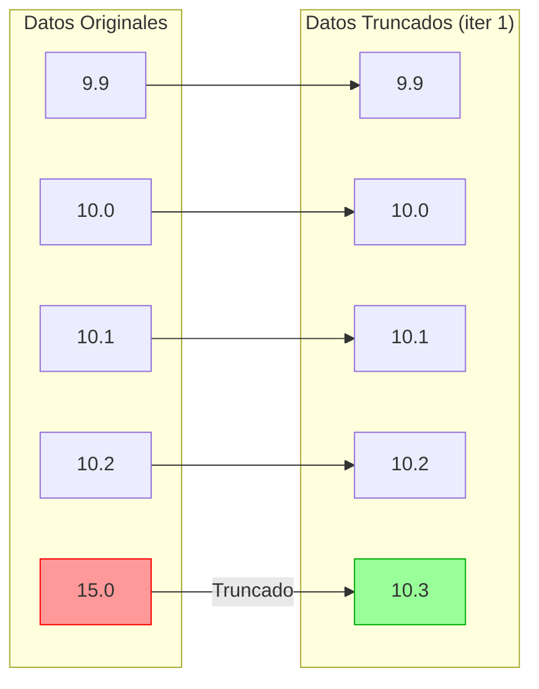

# Entregable 3.2: Cálculo de Valor Asignado ($x_{pt}$) y Desviación ($\sigma_{pt}$)

**Proyecto:** Aplicativo para Evaluación de Ensayos de Aptitud (PT App)  
**Organización:** Laboratorio CALAIRE - Universidad Nacional de Colombia  
**Norma de Referencia:** ISO 13528:2022, Sección 6 y Anexo C  
**Fecha:** 2026-01-03

---

## 1. Introducción

El valor asignado ($x_{pt}$) es el valor central de referencia contra el cual se comparan los resultados de los participantes. La desviación estándar para la evaluación de la aptitud ($\sigma_{pt}$) define la escala de variabilidad aceptable. La correcta determinación de ambos parámetros es crítica para una evaluación justa del desempeño.

---

## 2. Métodos de Determinación del Valor Asignado

El aplicativo implementa cuatro métodos, cada uno adecuado para diferentes escenarios:

| Método | Código | $x_{pt}$ | $\sigma_{pt}$ | Uso Recomendado |
|--------|--------|----------|---------------|-----------------|
| 1 - Referencia | `1` | $x_{ref}$ | $s_{ref}$ o definido | Laboratorio de referencia acreditado disponible |
| 2a - Consenso MADe | `2a` | mediana | MADe | Pocos participantes, alta contaminación de datos |
| 2b - Consenso nIQR | `2b` | mediana | nIQR | Distribución aproximadamente normal |
| 3 - Algoritmo A | `3` | $x^*$ | $s^*$ | Método robusto recomendado por ISO 13528 |

---

## 3. Método 1: Valor de Referencia

### 3.1. Descripción

El valor asignado corresponde directamente al valor certificado o determinado por un laboratorio de referencia con trazabilidad metrológica establecida.

### 3.2. Fórmulas

$$x_{pt} = x_{ref}$$

$$\sigma_{pt} = u_{ref} \times k$$

O un valor predefinido basado en requisitos de aptitud.

### 3.3. Incertidumbre del Valor Asignado

$$u_{xpt} = u_{ref}$$

### 3.4. Aplicación

Este método es preferido cuando:
- Existe un Material de Referencia Certificado (MRC).
- Un laboratorio designado tiene capacidad metrológica superior demostrable.
- La incertidumbre del valor de referencia es despreciable frente a $\sigma_{pt}$.

---

## 4. Método 2a: Consenso con MADe

### 4.1. Descripción

Utiliza la mediana de los resultados de los participantes como valor central y la Desviación Absoluta de la Mediana escalada (MADe) como estimador robusto de dispersión.

### 4.2. Fórmulas

#### 4.2.1. Valor Asignado

$$x_{pt} = \text{mediana}(x_1, x_2, ..., x_n)$$

#### 4.2.2. Desviación Estándar para Aptitud

$$\sigma_{pt} = MADe = 1.4826 \times \text{mediana}(|x_i - \text{mediana}(x)|)$$

> **Nota:** El factor 1.4826 (≈ $1/\Phi^{-1}(0.75)$) hace que MADe sea un estimador consistente de $\sigma$ para distribuciones normales.

### 4.3. Incertidumbre del Valor Asignado

$$u_{xpt} = 1.25 \times \frac{\sigma_{pt}}{\sqrt{n}}$$

> El factor 1.25 ajusta por la eficiencia de la mediana como estimador.

### 4.4. Implementación en R

```r
calculate_made <- function(x) {
  x_clean <- x[is.finite(x)]
  if (length(x_clean) < 1) return(NA)
  med <- median(x_clean)
  1.4826 * median(abs(x_clean - med))
}

# Ejemplo de uso
valores <- c(10.1, 10.2, 9.9, 10.0, 15.0)  # 15.0 es atípico
x_pt <- median(valores)                     # 10.1
sigma_pt <- calculate_made(valores)         # Robusto frente a 15.0
```

### 4.5. Ventajas y Limitaciones

| Ventajas | Limitaciones |
|----------|--------------|
| Alta resistencia a atípicos | Menor eficiencia estadística que la media |
| No requiere iteraciones | Puede ser afectado si >25% son atípicos |
| Cálculo directo | |

---

## 5. Método 2b: Consenso con nIQR

### 5.1. Descripción

Similar al método 2a, pero utiliza el Rango Intercuartílico Normalizado (nIQR) como estimador de dispersión.

### 5.2. Fórmulas

#### 5.2.1. Valor Asignado

$$x_{pt} = \text{mediana}(x_1, x_2, ..., x_n)$$

#### 5.2.2. Desviación Estándar para Aptitud

$$\sigma_{pt} = nIQR = 0.7413 \times (Q_3 - Q_1)$$

Donde:
- $Q_1$ = Primer cuartil (percentil 25)
- $Q_3$ = Tercer cuartil (percentil 75)
- El factor 0.7413 (≈ $1/(2 \times \Phi^{-1}(0.75))$) normaliza el IQR para distribuciones normales.

### 5.3. Implementación en R

```r
calculate_niqr <- function(x) {
  x_clean <- x[is.finite(x)]
  if (length(x_clean) < 2) return(NA_real_)
  quartiles <- quantile(x_clean, probs = c(0.25, 0.75), na.rm = TRUE, type = 7)
  0.7413 * (quartiles[2] - quartiles[1])
}
```

### 5.4. Comparación MADe vs nIQR

| Aspecto | MADe | nIQR |
|---------|------|------|
| Punto de ruptura | 50% | 25% |
| Eficiencia (normal) | 37% | 37% |
| Sensibilidad a colas | Menor | Mayor |
| Recomendación ISO | Ambos aceptables | Ambos aceptables |

---

## 6. Método 3: Algoritmo A (ISO 13528)

### 6.1. Descripción

Es un procedimiento iterativo que calcula simultáneamente la media robusta ($x^*$) y la desviación estándar robusta ($s^*$), ponderando los datos para reducir la influencia de valores extremos.

### 6.2. Proceso Iterativo

#### Paso 1: Inicialización

$$x^* = \text{mediana}(x_1, x_2, ..., x_n)$$

$$s^* = 1.4826 \times \text{mediana}(|x_i - x^*|)$$

#### Paso 2: Cálculo de Valores Modificados

Para cada observación $x_i$:

$$x_i^* = \begin{cases} 
x^* - 1.5s^* & \text{si } x_i < x^* - 1.5s^* \\
x^* + 1.5s^* & \text{si } x_i > x^* + 1.5s^* \\
x_i & \text{en otro caso}
\end{cases}$$

#### Paso 3: Actualización de Estimadores

$$x^*_{nuevo} = \frac{1}{n} \sum_{i=1}^{n} x_i^*$$

$$s^*_{nuevo} = 1.134 \times \sqrt{\frac{1}{n-1} \sum_{i=1}^{n} (x_i^* - x^*_{nuevo})^2}$$

> El factor 1.134 compensa el sesgo introducido por el truncamiento.

#### Paso 4: Criterio de Convergencia

Repetir pasos 2-3 hasta que:

$$|x^*_{nuevo} - x^*_{anterior}| < 10^{-3}$$

**Y**

$$|s^*_{nuevo} - s^*_{anterior}| < 10^{-3}$$

### 6.3. Implementación en R

```r
run_algorithm_a <- function(values, ids, max_iter = 50) {
  values <- values[is.finite(values)]
  n <- length(values)
  
  if (n < 3) return(list(error = "Se requieren al menos 3 valores."))
  
  # Inicialización
  x_star <- median(values)
  s_star <- 1.4826 * median(abs(values - x_star))
  
  if (s_star < 1e-9) s_star <- sd(values)
  
  iteration_log <- data.frame()
  
  for (iter in 1:max_iter) {
    # Valores modificados (truncamiento)
    delta <- 1.5 * s_star
    x_modified <- pmin(pmax(values, x_star - delta), x_star + delta)
    
    # Nuevos estimadores
    x_new <- mean(x_modified)
    s_new <- 1.134 * sd(x_modified)
    
    # Registrar iteración
    iteration_log <- rbind(iteration_log, 
      data.frame(iter = iter, x_star = x_new, s_star = s_new))
    
    # Verificar convergencia
    if (abs(x_new - x_star) < 1e-3 && abs(s_new - s_star) < 1e-3) {
      return(list(
        assigned_value = x_new,
        robust_sd = s_new,
        iterations = iteration_log,
        converged = TRUE,
        n_iterations = iter
      ))
    }
    
    x_star <- x_new
    s_star <- s_new
  }
  
  list(
    assigned_value = x_star,
    robust_sd = s_star,
    iterations = iteration_log,
    converged = FALSE,
    n_iterations = max_iter
  )
}
```

### 6.4. Ejemplo de Convergencia

| Iteración | $x^*$ | $s^*$ |
|-----------|-------|-------|
| 0 (Inicial) | 10.10 | 0.148 |
| 1 | 10.08 | 0.135 |
| 2 | 10.07 | 0.131 |
| 3 | 10.07 | 0.130 |
| 4 | 10.07 | 0.130 |
| **Convergencia** | **10.07** | **0.130** |

### 6.5. Visualización del Truncamiento



---

## 7. Tabla Comparativa de Métodos

| Criterio | Referencia | MADe | nIQR | Algoritmo A |
|----------|------------|------|------|-------------|
| Robustez | N/A | Alta | Media | Alta |
| Eficiencia | 100% | 37% | 37% | ~65% |
| Convergencia | Instantánea | Instantánea | Instantánea | Iterativa |
| Requisito mínimo | 1 valor | 1 valor | 2 valores | 3 valores |
| Uso de incertidumbre | Externo | Calculado | Calculado | Calculado |
| Recomendación ISO | Preferido si disponible | Aceptable | Aceptable | **Recomendado** |

---

## 8. Determinación de $u_{xpt}$ (Incertidumbre del Valor Asignado)

### 8.1. Para Métodos de Consenso (2a, 2b, 3)

$$u_{xpt} = 1.25 \times \frac{s^*}{\sqrt{p}}$$

Donde:
- $s^*$ = Desviación estándar robusta ($\sigma_{pt}$)
- $p$ = Número de participantes (excluyendo referencia)
- 1.25 = Factor de ajuste por uso de estimadores robustos

### 8.2. Para Método de Referencia (1)

$$u_{xpt} = u_{ref}$$

Donde $u_{ref}$ es la incertidumbre declarada del laboratorio de referencia.

### 8.3. Criterio de Negligibilidad

Se considera que $u_{xpt}$ es negligible si:

$$u_{xpt} \le 0.3 \times \sigma_{pt}$$

Si es negligible, se puede usar el puntaje $z$ estándar. Si no, se debe usar $z'$ o $\zeta$.

---

## 9. Validación de Resultados

### 9.1. Script de Validación

```r
# Datos de prueba con atípico
test_data <- c(10.2, 10.5, 9.8, 11.0, 10.1, 10.3, 50.0)

# Media clásica (afectada por atípico)
mean_classic <- mean(test_data)  # ~14.56

# Métodos robustos
median_value <- median(test_data)           # 10.2
made_value <- 1.4826 * median(abs(test_data - median_value))  # ~0.59
niqr_value <- 0.7413 * IQR(test_data)       # ~0.56

# Algoritmo A
algo_result <- run_algorithm_a(test_data, 1:7)
x_star <- algo_result$assigned_value        # ~10.27
s_star <- algo_result$robust_sd             # ~0.43

cat("Comparación de resultados:\n")
cat("Media clásica:", round(mean_classic, 2), "\n")
cat("Mediana:", round(median_value, 2), "\n")
cat("Algoritmo A (x*):", round(x_star, 2), "\n")
```

### 9.2. Resultado Esperado

El Algoritmo A minimiza el efecto del atípico (50.0), produciendo $x^* \approx 10.27$, muy cercano al centro real de los datos "limpios".

---

## 10. Referencias Normativas

- **ISO 13528:2022** — Statistical methods for use in proficiency testing by interlaboratory comparison
  - Sección 6: Methods for determination of assigned value and standard deviation for proficiency assessment
  - Anexo C: Algorithm A for robust analysis

---

**Siguiente documento:** E3.3 - Script de Validación de Cálculos
