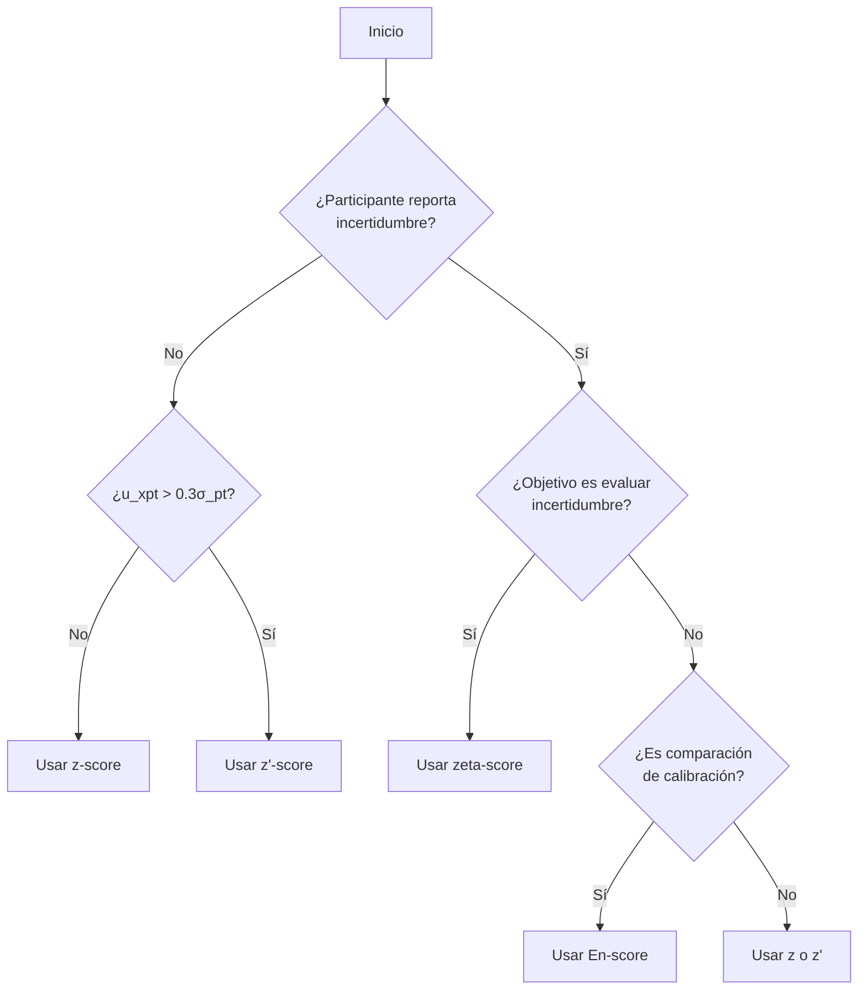

# Entregable 4.1: Módulo de Cálculo de Puntajes (ISO 13528)

**Proyecto:** Aplicativo para Evaluación de Ensayos de Aptitud (PT App)  
**Organización:** Laboratorio CALAIRE - Universidad Nacional de Colombia  
**Norma de Referencia:** ISO 13528:2022, Sección 9  
**Fecha:** 2026-01-03

---

## 1. Introducción

Los puntajes de desempeño son indicadores estandarizados que permiten evaluar qué tan cerca está el resultado de un participante del valor asignado ($x_{pt}$). El aplicativo implementa cuatro tipos de puntajes, cada uno diseñado para diferentes escenarios de evaluación.

---

## 2. Tipos de Puntajes Implementados

### 2.1. Resumen Comparativo

| Puntaje | Símbolo | Considera $u_{xpt}$ | Considera $u_i$ | Uso Principal |
|---------|---------|---------------------|-----------------|---------------|
| z-score | $z$ | No | No | Evaluación estándar |
| z'-score | $z'$ | Sí | No | Cuando $u_{xpt} > 0.3\sigma_{pt}$ |
| zeta-score | $\zeta$ | Sí | Sí | Evaluar incertidumbre del participante |
| En-score | $E_n$ | Sí (expandida) | Sí (expandida) | Comparaciones de calibración |

---

## 3. Puntaje z (z-score)

### 3.1. Definición

El puntaje z es el indicador más básico y ampliamente utilizado. Mide cuántas desviaciones estándar está el resultado del participante respecto al valor asignado.

### 3.2. Fórmula

$$z = \frac{x_i - x_{pt}}{\sigma_{pt}}$$

Donde:
- $x_i$ = Resultado reportado por el participante
- $x_{pt}$ = Valor asignado
- $\sigma_{pt}$ = Desviación estándar para la evaluación de aptitud

### 3.3. Criterios de Evaluación

| Rango | Evaluación | Acción Requerida |
|-------|------------|------------------|
| $|z| \le 2.0$ | **Satisfactorio** | Ninguna |
| $2.0 < |z| < 3.0$ | **Cuestionable** | Investigación recomendada |
| $|z| \ge 3.0$ | **Insatisfactorio** | Acción correctiva obligatoria |

### 3.4. Interpretación Estadística

- **z = 0**: Resultado igual al valor asignado
- **z = ±1**: Resultado a 1 desviación estándar (≈68% de probabilidad)
- **z = ±2**: Resultado a 2 desviaciones estándar (≈95% de probabilidad)
- **z = ±3**: Resultado a 3 desviaciones estándar (≈99.7% de probabilidad)

### 3.5. Ejemplo de Cálculo

```
Datos:
  x_i = 10.5 (resultado del participante)
  x_pt = 10.0 (valor asignado)
  σ_pt = 0.2 (desviación para aptitud)

Cálculo:
  z = (10.5 - 10.0) / 0.2 = 2.5

Evaluación:
  |z| = 2.5, está entre 2 y 3 → CUESTIONABLE
```

---

## 4. Puntaje z' (z'-score)

### 4.1. Definición

El puntaje z' incorpora la incertidumbre del valor asignado ($u_{xpt}$) en el denominador. Se utiliza cuando esta incertidumbre no es despreciable.

### 4.2. Criterio de Aplicación

Se debe usar z' cuando:

$$u_{xpt} > 0.3 \times \sigma_{pt}$$

### 4.3. Fórmula

$$z' = \frac{x_i - x_{pt}}{\sqrt{\sigma_{pt}^2 + u_{xpt}^2}}$$

Donde:
- $u_{xpt}$ = Incertidumbre estándar del valor asignado

### 4.4. Criterios de Evaluación

Idénticos al puntaje z:
- $|z'| \le 2.0$ → Satisfactorio
- $2.0 < |z'| < 3.0$ → Cuestionable
- $|z'| \ge 3.0$ → Insatisfactorio

### 4.5. Ejemplo de Cálculo

```
Datos:
  x_i = 10.5
  x_pt = 10.0
  σ_pt = 0.2
  u_xpt = 0.08

Verificación:
  u_xpt (0.08) > 0.3 × σ_pt (0.06) → Usar z'

Cálculo:
  z' = (10.5 - 10.0) / √(0.2² + 0.08²)
  z' = 0.5 / √(0.04 + 0.0064)
  z' = 0.5 / 0.2154 = 2.32

Evaluación:
  |z'| = 2.32 → CUESTIONABLE
```

---

## 5. Puntaje Zeta (ζ-score)

### 5.1. Definición

El puntaje zeta evalúa si el resultado del participante es consistente con su incertidumbre declarada. Es útil para validar la calidad de las estimaciones de incertidumbre de los laboratorios.

### 5.2. Fórmula

$$\zeta = \frac{x_i - x_{pt}}{\sqrt{u_i^2 + u_{xpt}^2}}$$

Donde:
- $u_i$ = Incertidumbre estándar declarada por el participante

### 5.3. Criterios de Evaluación

| Rango | Evaluación | Interpretación |
|-------|------------|----------------|
| $|\zeta| \le 2.0$ | **Satisfactorio** | Incertidumbre adecuada |
| $2.0 < |\zeta| < 3.0$ | **Cuestionable** | Posible subestimación de incertidumbre |
| $|\zeta| \ge 3.0$ | **Insatisfactorio** | Incertidumbre declarada incorrecta |

### 5.4. Interpretación

- **|ζ| pequeño**: El resultado es consistente con las incertidumbres declaradas.
- **|ζ| grande**: Posible problema con:
  - El resultado del participante
  - La estimación de incertidumbre del participante
  - Ambos

### 5.5. Ejemplo de Cálculo

```
Datos:
  x_i = 10.5
  x_pt = 10.0
  u_i = 0.15 (incertidumbre del participante)
  u_xpt = 0.08

Cálculo:
  ζ = (10.5 - 10.0) / √(0.15² + 0.08²)
  ζ = 0.5 / √(0.0225 + 0.0064)
  ζ = 0.5 / 0.170 = 2.94

Evaluación:
  |ζ| = 2.94 → CUESTIONABLE (cercano a insatisfactorio)
```

---

## 6. Puntaje En (En-score)

### 6.1. Definición

El puntaje En utiliza incertidumbres expandidas (con factor de cobertura $k$) y es típicamente utilizado en comparaciones de calibración entre laboratorios.

### 6.2. Fórmula

$$E_n = \frac{x_i - x_{pt}}{\sqrt{U_i^2 + U_{xpt}^2}}$$

Donde:
- $U_i = k \times u_i$ (incertidumbre expandida del participante)
- $U_{xpt} = k \times u_{xpt}$ (incertidumbre expandida del valor asignado)
- $k$ = Factor de cobertura (típicamente 2 para 95% de confianza)

### 6.3. Criterios de Evaluación

| Rango | Evaluación |
|-------|------------|
| $|E_n| \le 1.0$ | **Satisfactorio** |
| $|E_n| > 1.0$ | **Insatisfactorio** |

> **Nota:** No existe categoría "cuestionable" para En.

### 6.4. Ejemplo de Cálculo

```
Datos:
  x_i = 10.5
  x_pt = 10.0
  u_i = 0.15
  u_xpt = 0.08
  k = 2

Incertidumbres expandidas:
  U_i = 2 × 0.15 = 0.30
  U_xpt = 2 × 0.08 = 0.16

Cálculo:
  En = (10.5 - 10.0) / √(0.30² + 0.16²)
  En = 0.5 / √(0.09 + 0.0256)
  En = 0.5 / 0.340 = 1.47

Evaluación:
  |En| = 1.47 > 1.0 → INSATISFACTORIO
```

---

## 7. Implementación en Código R

### 7.1. Función Principal

```r
compute_scores_metrics <- function(summary_df, target_pollutant, target_n_lab, 
                                    target_level, sigma_pt, u_xpt, k, m = NULL) {
  
  # Filtrar datos
  data <- summary_df %>%
    filter(pollutant == target_pollutant,
           n_lab == target_n_lab,
           level == target_level)
  
  # Obtener valor de referencia
  ref_data <- data %>% filter(participant_id == "ref")
  x_pt <- mean(ref_data$mean_value, na.rm = TRUE)
  
  # Preparar datos de participantes
  participant_data <- data %>%
    rename(result = mean_value) %>%
    mutate(uncertainty_std = if (!is.null(m) && m > 0) sd_value / sqrt(m) else sd_value)
  
  # Calcular puntajes
  final_scores <- participant_data %>%
    mutate(
      x_pt = x_pt,
      sigma_pt = sigma_pt,
      
      # z-score
      z_score = (result - x_pt) / sigma_pt,
      
      # z'-score
      z_prime_score = (result - x_pt) / sqrt(sigma_pt^2 + u_xpt^2),
      
      # zeta-score
      zeta_score = (result - x_pt) / sqrt(uncertainty_std^2 + u_xpt^2),
      
      # En-score
      U_xi = k * uncertainty_std,
      U_xpt = k * u_xpt,
      En_score = (result - x_pt) / sqrt(U_xi^2 + U_xpt^2)
    )
  
  # Asignar evaluaciones
  final_scores <- final_scores %>%
    mutate(
      z_eval = case_when(
        abs(z_score) <= 2 ~ "Satisfactorio",
        abs(z_score) < 3 ~ "Cuestionable",
        TRUE ~ "Insatisfactorio"
      ),
      En_eval = if_else(abs(En_score) <= 1, "Satisfactorio", "Insatisfactorio")
    )
  
  return(list(scores = final_scores, x_pt = x_pt, sigma_pt = sigma_pt))
}
```

---

## 8. Selección del Puntaje Apropiado

### 8.1. Árbol de Decisión



### 8.2. Recomendaciones por Escenario

| Escenario | Puntaje Recomendado |
|-----------|---------------------|
| Evaluación rutinaria de aptitud | z |
| $u_{xpt}$ significativa | z' |
| Validar incertidumbres de participantes | zeta |
| Comparación interlaboratorio de calibración | En |
| Ensayo con MRC de baja incertidumbre | z |
| Ensayo por consenso con pocos participantes | z' o zeta |

---

## 9. Visualización de Puntajes

### 9.1. Codificación de Colores

| Evaluación | Color | Código Hex |
|------------|-------|------------|
| Satisfactorio | Verde | `#28a745` |
| Cuestionable | Naranja | `#ffc107` |
| Insatisfactorio | Rojo | `#dc3545` |

### 9.2. Gráfico de Barras de Ejemplo

El aplicativo genera gráficos de barras horizontales donde:
- El eje X representa el valor del puntaje
- El eje Y lista los participantes
- Las barras se colorean según la evaluación
- Líneas verticales marcan los umbrales (±2 para z, ±1 para En)

---

## 10. Referencias Normativas

- **ISO 13528:2022** — Statistical methods for use in proficiency testing
  - Sección 9: Performance statistics
  - 9.2: z score
  - 9.3: z' score
  - 9.4: zeta score
  - 9.5: En score

---

**Siguiente documento:** E4.2 - Plantilla de Informe R Markdown
