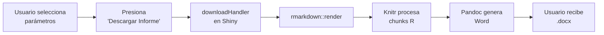

# Entregable 4.2: Plantilla de Informe R Markdown

**Proyecto:** Aplicativo para Evaluación de Ensayos de Aptitud (PT App)  
**Organización:** Laboratorio CALAIRE - Universidad Nacional de Colombia  
**Archivo:** `reports/report_template.Rmd`  
**Fecha:** 2026-01-03

---

## 1. Descripción General

La plantilla `report_template.Rmd` genera informes finales automatizados en formato Microsoft Word (.docx), consolidando todos los resultados del ensayo de aptitud en un documento profesional listo para distribución a los participantes.

---

## 2. Características Técnicas

| Aspecto | Detalle |
|---------|---------|
| **Motor de renderizado** | knitr + rmarkdown |
| **Formato de salida** | Word (.docx) |
| **Líneas de código** | 507 |
| **Parámetros de entrada** | 20+ |
| **Autocontenida** | Sí (redefine funciones core) |

---

## 3. Encabezado YAML

```yaml
---
title: "Informe Final del Ensayo de Aptitud (EA)"
subtitle: "Medición de Gases Contaminantes Criterio SO₂, CO, O₃, NO, NO₂"
author: "Laboratorio CALAIRE"
date: "`r Sys.Date()`"
output:
  word_document:
    toc: true
    toc_depth: 3
    reference_docx: null
params:
  hom_data: NA
  stab_data: NA
  summary_data: NA
  metric: "z"
  method: "3"
  pollutant: NULL
  level: "level_1"
  n_lab: 7
  k_factor: 2
  scheme_id: "EA-202X-XX"
  report_id: "INF-202X-XX"
  # ... más parámetros
---
```

---

## 4. Parámetros de Entrada

### 4.1. Datos Principales

| Parámetro | Tipo | Descripción |
|-----------|------|-------------|
| `summary_data` | data.frame | Resultados agregados de todos los participantes |
| `hom_data` | data.frame | Datos brutos de homogeneidad |
| `stab_data` | data.frame | Datos brutos de estabilidad |
| `participants_data` | data.frame | Información de participantes (opcional) |

### 4.2. Configuración de Evaluación

| Parámetro | Tipo | Valores | Descripción |
|-----------|------|---------|-------------|
| `metric` | character | "z", "z'", "zeta", "En" | Tipo de puntaje a calcular |
| `method` | character | "1", "2a", "2b", "3" | Método de valor asignado |
| `k_factor` | numeric | 2 (típico) | Factor de cobertura para incertidumbres |
| `n_lab` | integer | 4-13 | Número de laboratorios en la ronda |

### 4.3. Identificación del Informe

| Parámetro | Tipo | Ejemplo | Descripción |
|-----------|------|---------|-------------|
| `scheme_id` | character | "EA-2026-01" | Identificador del esquema |
| `report_id` | character | "INF-2026-01" | Identificador del informe |
| `period` | character | "Enero - Marzo 2026" | Período de ejecución |
| `coordinator` | character | "Dr. Nombre" | Nombre del coordinador |

### 4.4. Datos Precalculados

| Parámetro | Tipo | Descripción |
|-----------|------|-------------|
| `xpt_summary` | data.frame | Tabla de valores asignados por nivel |
| `homogeneity_summary` | data.frame | Resumen de evaluación de homogeneidad |
| `stability_summary` | data.frame | Resumen de evaluación de estabilidad |
| `score_summary` | data.frame | Resumen de puntajes por participante |
| `grubbs_summary` | data.frame | Resultados de prueba de atípicos |
| `heatmaps` | list | Gráficos de mapas de calor por contaminante |
| `metrological_compatibility` | data.frame | Comparación referencia vs consenso |

---

## 5. Estructura del Informe Generado

### 5.1. Secciones Principales

```
1. Información del Proveedor y del Esquema
   1.1. Alcance
   1.3. Confidencialidad
   1.4. Roles y Personal Clave
   1.5. Participantes e Instrumentación

2. Descripción del Ensayo y Metodología
   2.1. Ítems de Ensayo y Producción
   2.2. Homogeneidad y Estabilidad
   2.3. Determinación del Valor Asignado
   2.4. Compatibilidad Metrológica

3. Criterios de Evaluación
   3.1. Indicadores de Desempeño
   3.2. Tratamiento Estadístico de Datos

4. Resultados y Discusión
   4.1. Resumen General del Desempeño
   4.2. Evaluación por Contaminante

5. Conclusiones

Anexo A: Valores Asignados y σ_pt
Anexo B: Resumen de Homogeneidad y Estabilidad
Anexo C: Resultados por Participante
```

### 5.2. Tablas Generadas Automáticamente

| Tabla | Contenido |
|-------|-----------|
| Tabla 1 | Código identificador del EA |
| Tabla 2 | Participantes y sus analizadores |
| Tabla 3 | Niveles de concentración (valores de referencia) |
| Tabla 4 | Resultados de la prueba de Grubbs |
| Tabla 5 | Resumen de desempeño por indicador |
| Tabla A.1 | Valores asignados y parámetros estadísticos |
| Tabla B.1 | Evaluación de homogeneidad |
| Tabla B.2 | Evaluación de estabilidad |

---

## 6. Funciones Internas de la Plantilla

La plantilla redefine funciones críticas para asegurar su independencia de la sesión Shiny:

### 6.1. `calculate_niqr(x)`
```r
calculate_niqr <- function(x) {
  x_clean <- x[is.finite(x)]
  if (length(x_clean) < 2) return(NA_real_)
  quartiles <- stats::quantile(x_clean, probs = c(0.25, 0.75), na.rm = TRUE, type = 7)
  0.7413 * (quartiles[2] - quartiles[1])
}
```

### 6.2. `run_algorithm_a(values, max_iter)`
```r
run_algorithm_a <- function(values, max_iter = 50) {
  values <- values[is.finite(values)]
  n <- length(values)
  if (n < 3) return(list(mean = NA, sd = NA, error = "N<3"))
  
  x_star <- median(values, na.rm = TRUE)
  s_star <- 1.483 * median(abs(values - x_star), na.rm = TRUE)
  
  # ... iteraciones ...
  
  list(mean = x_star, sd = s_star, error = NULL)
}
```

### 6.3. `compute_homogeneity(data_full, pol, lev)`
Versión simplificada para los anexos del informe.

---

## 7. Bloques de Código R (Chunks)

### 7.1. Configuración Inicial

```r
```{r setup, include=FALSE}
knitr::opts_chunk$set(echo = FALSE, warning = FALSE, message = FALSE)
library(tidyverse)
library(knitr)
library(kableExtra)
library(outliers)
```

### 7.2. Tabla de Participantes

```r
```{r participants_table, echo=FALSE}
if (!is.null(params$participants_data)) {
  final_part_df <- params$participants_data
} else {
  # Crear tabla con placeholders
  participants <- unique(params$summary_data$participant_id)
  participants <- participants[participants != "ref"]
  # ...
}
kable(final_part_df, caption = "Tabla 2. Participantes del EA")
```

### 7.3. Mapas de Calor por Contaminante

```r
```{r heatmaps_loop, echo=FALSE, results='asis', fig.height=4}
if (!is.null(params$heatmaps) && length(params$heatmaps) > 0) {
  for (pol in names(params$heatmaps)) {
    cat("\n\n### Resultados para", toupper(pol), "\n\n")
    print(params$heatmaps[[pol]])
  }
}
```

---

## 8. Generación del Informe desde el Aplicativo

### 8.1. Flujo de Generación



### 8.2. Código del downloadHandler

```r
output$download_report <- downloadHandler(
  filename = function() {
    paste0("Informe_EA_", Sys.Date(), ".docx")
  },
  content = function(file) {
    # Preparar parámetros
    params_list <- list(
      summary_data = pt_prep_data(),
      hom_data = hom_data_full(),
      stab_data = stab_data_full(),
      metric = input$metric,
      method = input$method,
      k_factor = input$k_factor,
      # ... más parámetros
    )
    
    # Renderizar
    rmarkdown::render(
      input = "reports/report_template.Rmd",
      output_file = file,
      params = params_list,
      envir = new.env(parent = globalenv())
    )
  }
)
```

---

## 9. Personalización del Informe

### 9.1. Uso de Plantilla Word Personalizada

Para aplicar estilos corporativos, crear un archivo `reference.docx` y especificarlo:

```yaml
output:
  word_document:
    reference_docx: "templates/calaire_template.docx"
```

### 9.2. Modificar Secciones

Editar directamente el archivo `.Rmd` para:
- Agregar nuevas secciones de texto
- Modificar el orden de los anexos
- Incluir gráficos adicionales
- Cambiar el idioma de las etiquetas

---

## 10. Solución de Problemas

| Problema | Causa | Solución |
|----------|-------|----------|
| Error "pandoc not found" | Pandoc no instalado | Instalar Pandoc o RStudio |
| Tablas vacías | Parámetros `NA` | Verificar datos de entrada |
| Gráficos no aparecen | Dimensiones incorrectas | Ajustar `fig.height`, `fig.width` |
| Caracteres especiales rotos | Encoding incorrecto | Guardar .Rmd como UTF-8 |

---

## 11. Ejemplo de Informe Generado

El informe final típicamente contiene:
- **8-12 páginas** para un EA con 5-7 participantes
- **15-20 páginas** con anexos detallados por participante
- **Tablas formateadas** con bordes y sombreado
- **Gráficos embebidos** (heatmaps, matrices de desempeño)

---

**Siguiente documento:** E4.3 - Guía de Validación de Puntajes
