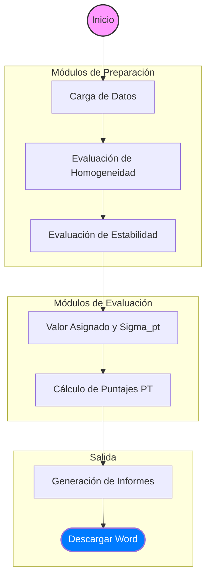

# Entregable 5.2: Diagrama de Navegación de la UI

El siguiente diagrama representa el flujo de interacción del usuario dentro del aplicativo, desde la entrada de datos hasta la obtención del producto final (informe).

## Descripción del Flujo

1. **Carga de Datos:** El usuario debe subir obligatoriamente los archivos `homogeneity.csv`, `stability.csv` y los resúmenes de participantes.
2. **Preparación:** Se verifica que el ítem sea apto (homogéneo y estable). Sin esta verificación, los resultados posteriores carecen de base técnica.
3. **Cálculo:** Se selecciona el método de consenso o referencia para establecer el valor central y su dispersión.
4. **Evaluación:** Se generan los puntajes individuales (z, En, etc.).
5. **Cierre:** Se exporta el informe oficial con todos los anexos técnicos incluidos.
