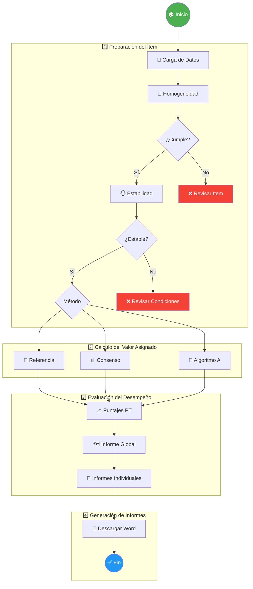
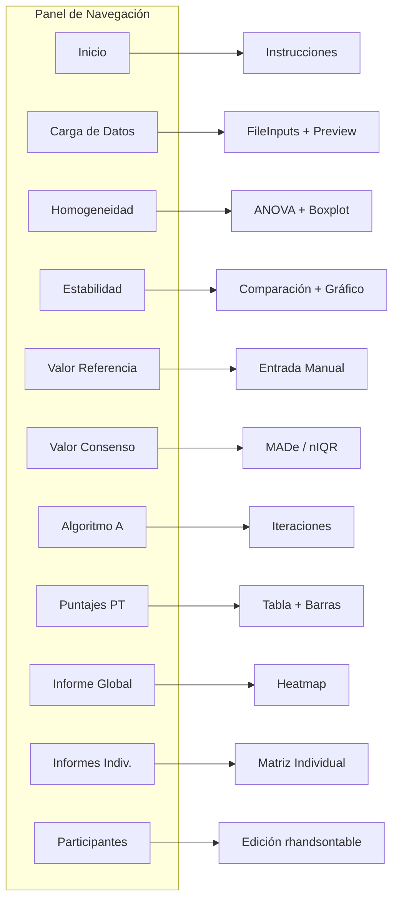
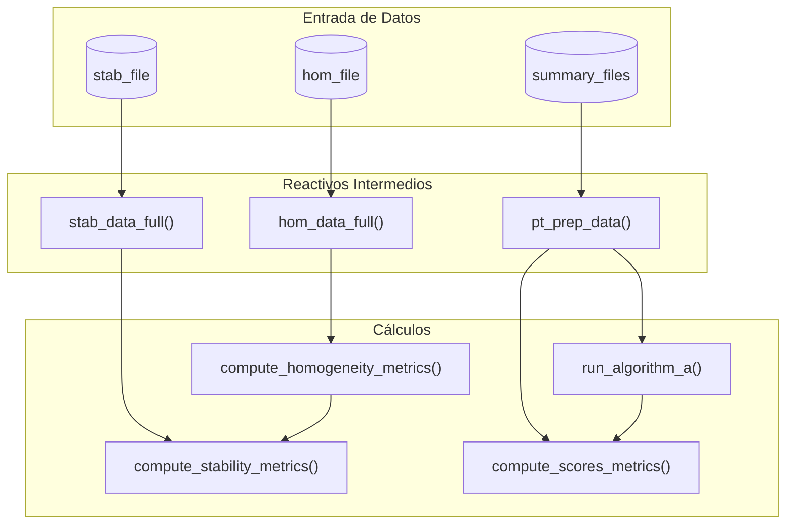
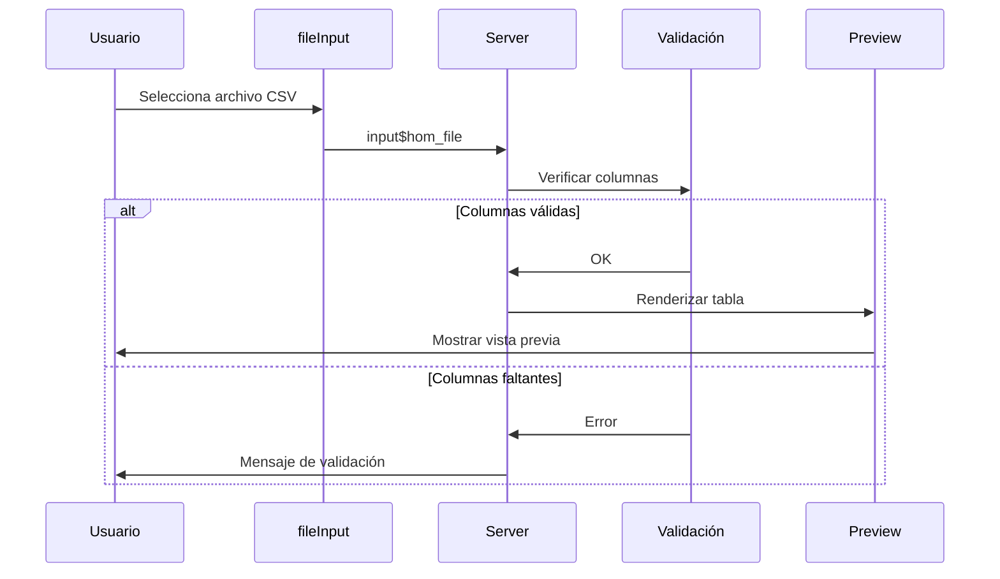
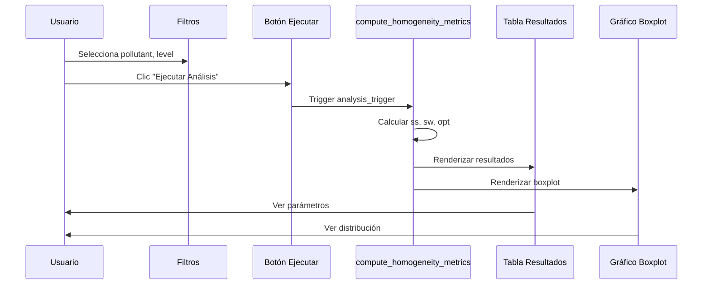
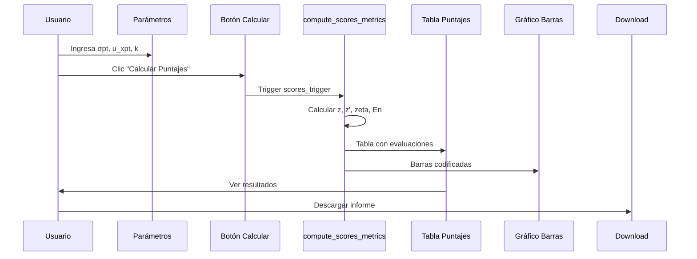
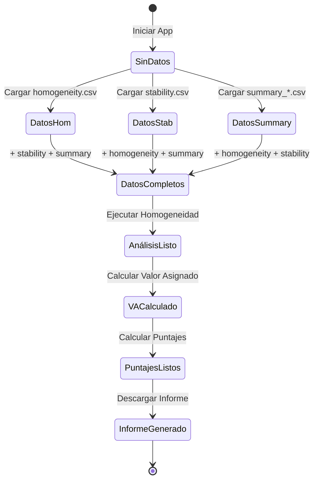
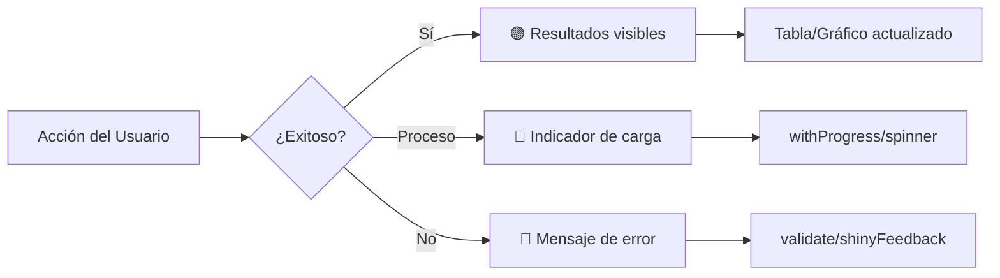
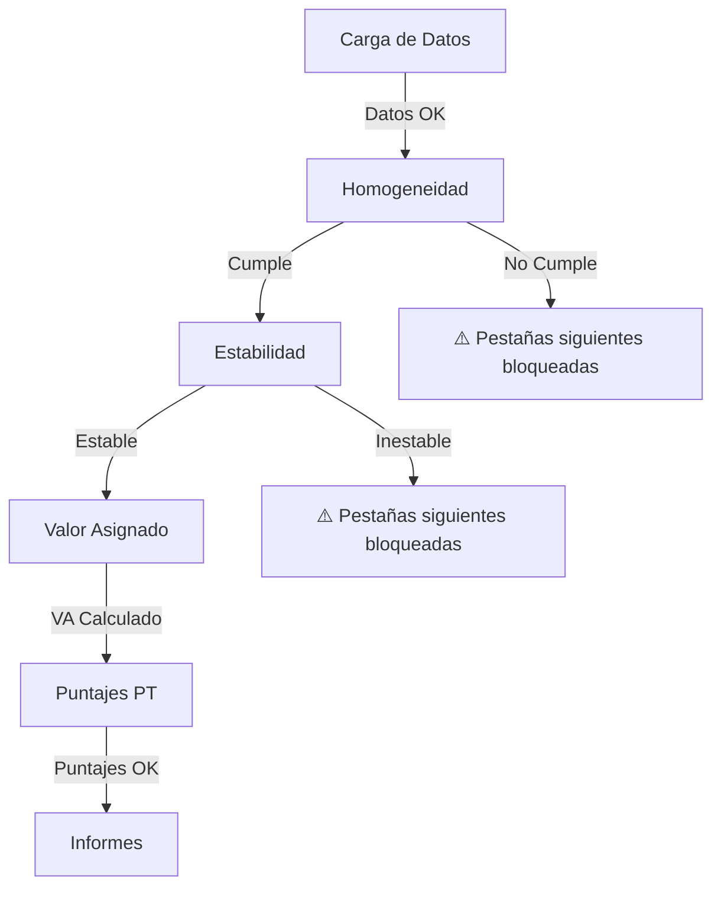
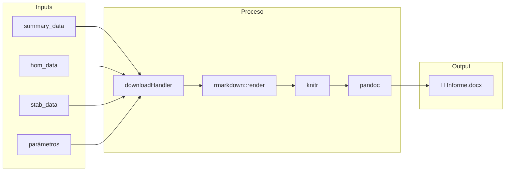

# Entregable 5.2: Diagrama de Navegación de la UI

**Proyecto:** Aplicativo para Evaluación de Ensayos de Aptitud (PT App)  
**Organización:** Laboratorio CALAIRE - Universidad Nacional de Colombia  
**Fecha:** 2026-01-03

---

## 1. Flujo Principal de Trabajo

El siguiente diagrama representa el flujo lógico que debe seguir el usuario para completar un ejercicio de intercomparación:



---

## 2. Mapa de Navegación Detallado

### 2.1. Estructura de Pestañas



### 2.2. Dependencias entre Módulos



---

## 3. Flujo de Datos por Módulo

### 3.1. Módulo: Carga de Datos



### 3.2. Módulo: Homogeneidad



### 3.3. Módulo: Puntajes PT



---

## 4. Estados de la Aplicación

### 4.1. Diagrama de Estados



### 4.2. Validaciones por Estado

| Estado | Validación Requerida | Mensaje de Error |
|--------|---------------------|------------------|
| SinDatos | Ninguna | "Cargue sus archivos de datos" |
| DatosHom | Columnas: value, pollutant, level | "Archivo debe contener..." |
| DatosCompletos | Datos de ref en summary | "No se encontró participante 'ref'" |
| AnálisisListo | g ≥ 2, m ≥ 2 | "Se requieren al menos 2 ítems" |
| VACalculado | σpt > 0 | "La dispersión es insuficiente" |

---

## 5. Interacciones Usuario-Sistema

### 5.1. Acciones Principales

| Acción | Input | Trigger | Resultado |
|--------|-------|---------|-----------|
| Cargar archivo | fileInput | onChange | Reactivo se actualiza |
| Filtrar datos | selectizeInput | onChange | Vista se filtra |
| Ejecutar análisis | actionButton | onClick | Cálculo se ejecuta |
| Cambiar tema | themeSelector | onChange | CSS se recarga |
| Ajustar layout | sliderInput | onChange | Grid se redimensiona |
| Descargar informe | downloadButton | onClick | Word se genera |

### 5.2. Retroalimentación Visual



---

## 6. Navegación Condicional

### 6.1. Habilitación de Pestañas



### 6.2. Mensajes de Guía

| Pestaña | Condición | Mensaje |
|---------|-----------|---------|
| Homogeneidad | Sin archivo | "Primero cargue el archivo de homogeneidad" |
| Estabilidad | Sin homogeneidad | "Complete primero el análisis de homogeneidad" |
| Puntajes | Sin VA | "Calcule primero el valor asignado" |
| Informes | Sin puntajes | "No hay puntajes calculados para generar el informe" |

---

## 7. Flujo de Generación de Informes



---

## 8. Casos de Uso

### 8.1. Caso: Evaluación Completa de un EA

```
1. Usuario carga homogeneity.csv
2. Usuario carga stability.csv
3. Usuario carga summary_n7.csv
4. Sistema valida todos los archivos ✓
5. Usuario navega a "Homogeneidad"
6. Usuario selecciona SO2 / level_1
7. Usuario hace clic en "Ejecutar Análisis"
8. Sistema muestra: ss=0.02, CUMPLE ✓
9. Usuario repite para Estabilidad → ESTABLE ✓
10. Usuario navega a "Algoritmo A"
11. Usuario ejecuta → x*=100.5, s*=5.2
12. Usuario navega a "Puntajes PT"
13. Usuario ingresa σpt=5.2, u_xpt=1.0, k=2
14. Usuario calcula → Tabla de resultados
15. Usuario descarga informe Word
```

### 8.2. Caso: Error en Datos

```
1. Usuario carga archivo con columnas incorrectas
2. Sistema muestra:
   "Error: El archivo debe contener las columnas 
    'value', 'pollutant' y 'level'"
3. Usuario corrige archivo
4. Usuario recarga → Validación exitosa
```

---

**Archivos del Entregable E5:**
- `prototipo_ui.md` — Estructura de componentes
- `diagrama_navegacion.md` — Este documento
