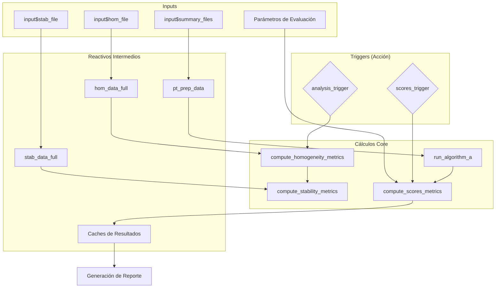

# Entregable 6.2: Dependencias Reactivas de la Aplicación

Este diagrama visualiza cómo los cambios en los inputs del usuario (archivos o parámetros) se propagan a través de los diversos módulos reactivos hasta generar las salidas finales.

## Importancia de la Estructura

- **Desacoplamiento:** Los cálculos están aislados en funciones puras (sin dependencias reactivas internas), facilitando su testeo.
- **Eficiencia:** El uso de triggers previene que la aplicación se "congele" durante cambios menores en la UI, ejecutando los cálculos pesados solo cuando el usuario lo solicita explícitamente.
