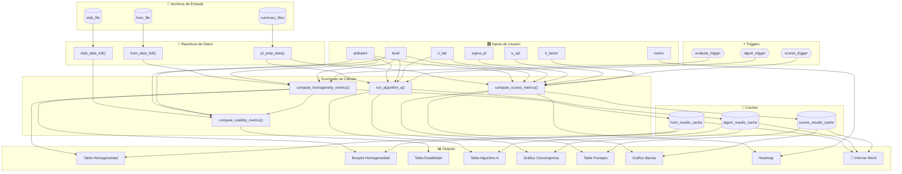
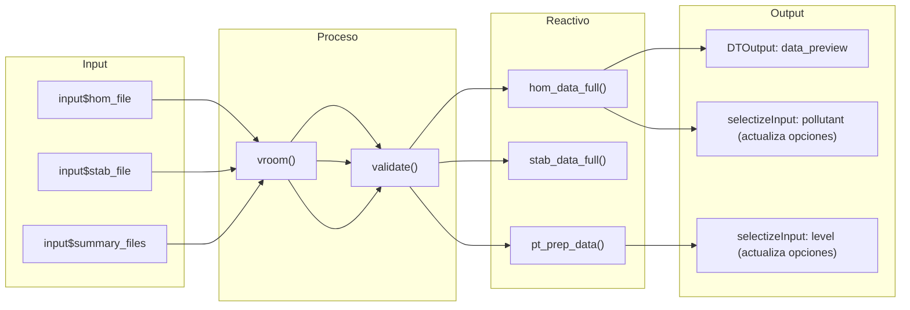
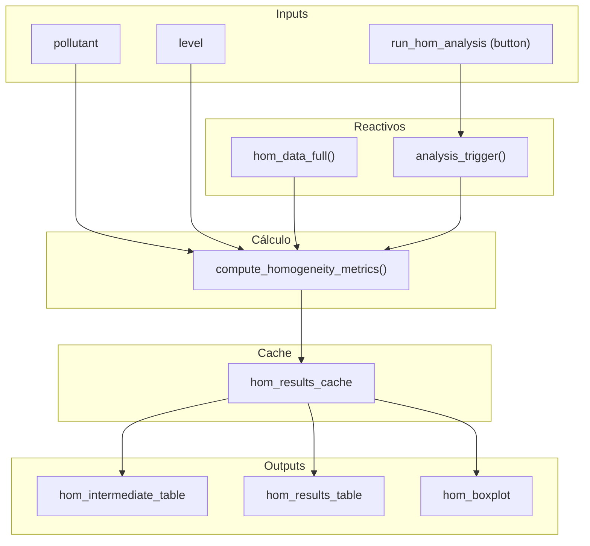
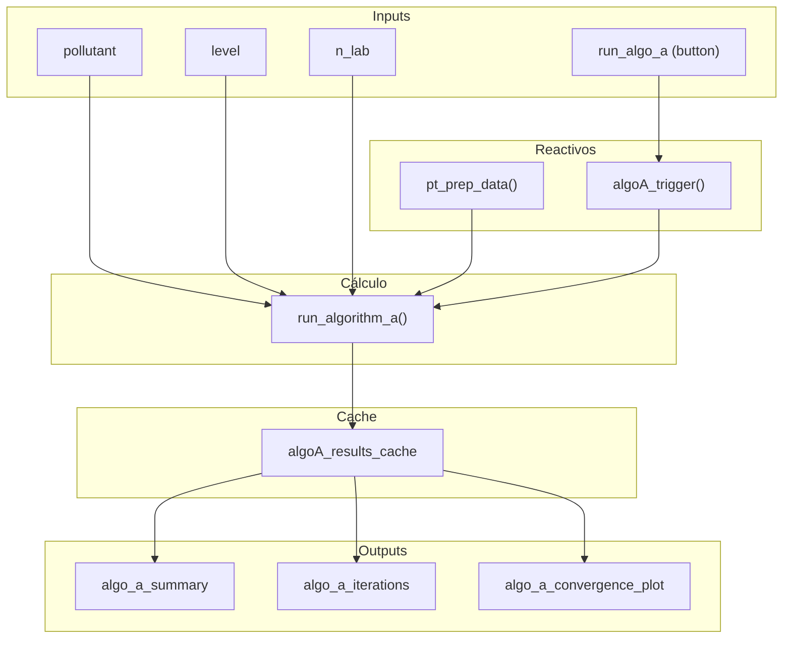
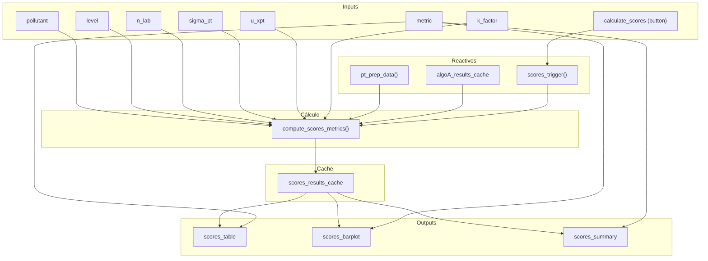
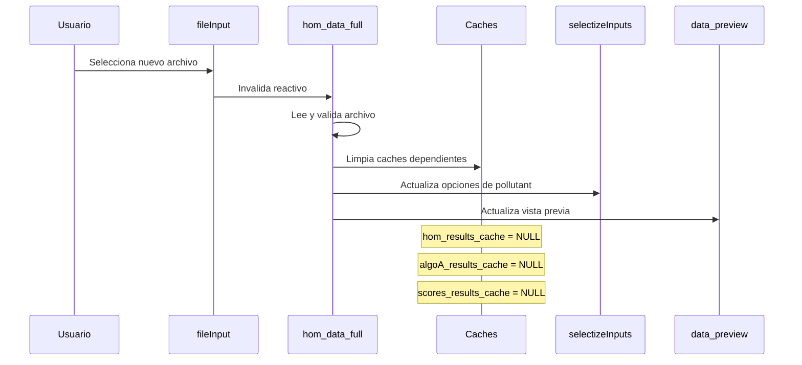
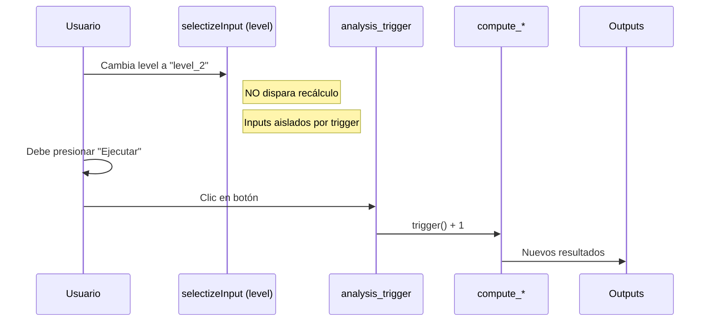
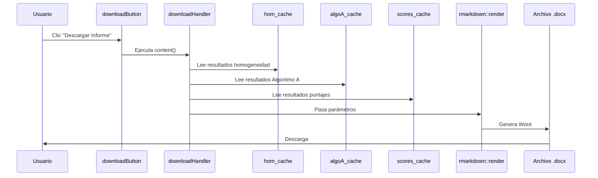
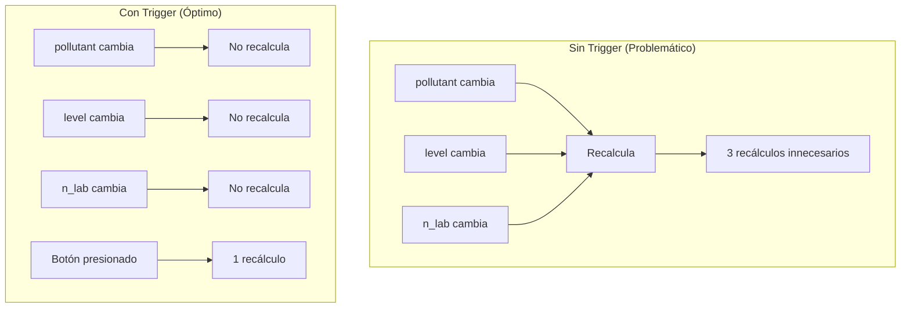
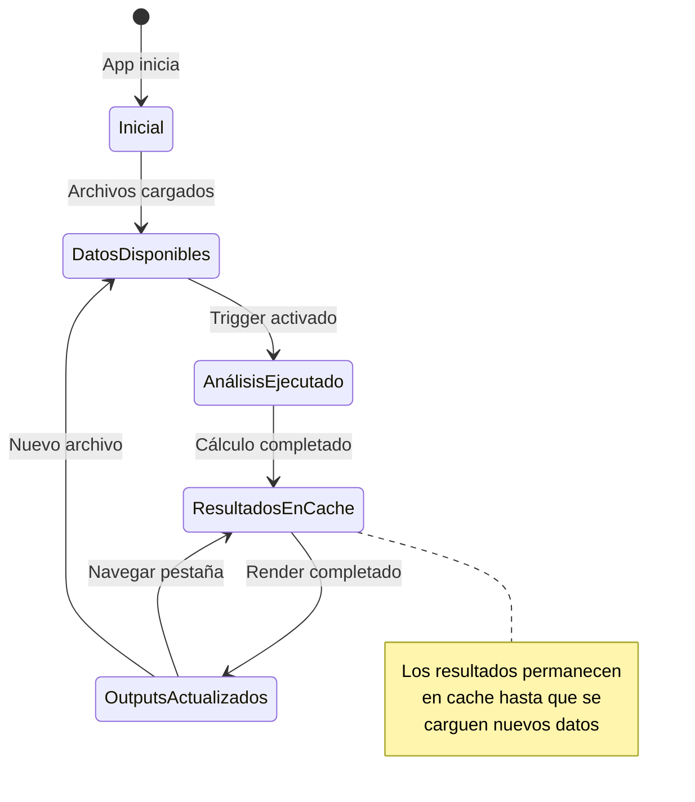

# Entregable 6.2: Dependencias Reactivas de la Aplicación

**Proyecto:** Aplicativo para Evaluación de Ensayos de Aptitud (PT App)  
**Organización:** Laboratorio CALAIRE - Universidad Nacional de Colombia  
**Fecha:** 2026-01-03

---

## 1. Introducción

Este documento mapea todas las dependencias reactivas de la aplicación, ilustrando cómo los cambios en los inputs se propagan a través del sistema hasta generar las salidas finales.

---

## 2. Grafo de Dependencias Global



---

## 3. Dependencias por Módulo

### 3.1. Módulo de Carga de Datos



**Dependencias:**
| Reactivo | Depende de | Actualiza |
|----------|-----------|-----------|
| `hom_data_full()` | `input$hom_file` | `pollutant` choices, `data_preview` |
| `stab_data_full()` | `input$stab_file` | — |
| `pt_prep_data()` | `input$summary_files` | `level` choices, `n_lab` choices |

### 3.2. Módulo de Homogeneidad



**Flujo de invalidación:**
1. Usuario cambia `pollutant` → No recalcula (aislado por trigger)
2. Usuario cambia `level` → No recalcula (aislado por trigger)
3. Usuario presiona botón → Incrementa `analysis_trigger()`
4. `analysis_trigger()` cambia → Recalcula `compute_homogeneity_metrics()`
5. Resultado se guarda en cache
6. Outputs se actualizan

### 3.3. Módulo del Algoritmo A



### 3.4. Módulo de Puntajes



---

## 4. Matriz de Dependencias

### 4.1. Inputs → Reactivos

| Input | hom_data_full | stab_data_full | pt_prep_data | analysis_trigger | algoA_trigger | scores_trigger |
|-------|:-------------:|:--------------:|:------------:|:----------------:|:-------------:|:--------------:|
| hom_file | ✓ | | | | | |
| stab_file | | ✓ | | | | |
| summary_files | | | ✓ | | | |
| run_hom_analysis | | | | ✓ | | |
| run_algo_a | | | | | ✓ | |
| calculate_scores | | | | | | ✓ |

### 4.2. Reactivos → Cálculos

| Reactivo | compute_hom | compute_stab | run_algo_a | compute_scores |
|----------|:-----------:|:------------:|:----------:|:--------------:|
| hom_data_full | ✓ | | | |
| stab_data_full | | ✓ | | |
| pt_prep_data | | | ✓ | ✓ |
| analysis_trigger | ✓ | ✓ | | |
| algoA_trigger | | | ✓ | |
| scores_trigger | | | | ✓ |
| algoA_cache | | | | ✓ |
| hom_results | | ✓ | | |

### 4.3. Cálculos → Outputs

| Cálculo | Tablas | Gráficos | Informe |
|---------|:------:|:--------:|:-------:|
| compute_homogeneity | hom_intermediate, hom_results | hom_boxplot | ✓ |
| compute_stability | stab_results | stab_plot | ✓ |
| run_algorithm_a | algo_summary, algo_iter | convergence_plot | ✓ |
| compute_scores | scores_table | scores_bar, heatmap | ✓ |

---

## 5. Propagación de Cambios

### 5.1. Escenario: Usuario Carga Nuevo Archivo de Homogeneidad



### 5.2. Escenario: Usuario Cambia Nivel de Concentración



### 5.3. Escenario: Usuario Descarga Informe



---

## 6. Aislamiento y Optimización

### 6.1. Uso de `isolate()`

```r
# Sin isolate - recalcula con CADA cambio de pollutant o level
bad_example <- reactive({
  compute_something(input$pollutant, input$level)  # ❌
})

# Con isolate - solo recalcula cuando trigger cambia
good_example <- eventReactive(analysis_trigger(), {
  pol <- isolate(input$pollutant)  # ✓
  lev <- isolate(input$level)      # ✓
  compute_something(pol, lev)
})
```

### 6.2. Patrón de Invalidación Controlada



---

## 7. Diagrama de Estados Reactivos



---

## 8. Resumen de Buenas Prácticas

| Práctica | Beneficio | Implementación |
|----------|-----------|----------------|
| Triggers manuales | Control de cuándo recalcular | `reactiveVal()` + `observeEvent()` |
| Cache de resultados | Evitar recálculos idénticos | `reactiveValues()` |
| `isolate()` | Leer sin crear dependencia | En `eventReactive()` |
| `req()` | Detener evaluación temprana | Al inicio de cada reactivo |
| Validación clara | Feedback al usuario | `validate(need(...))` |

---

**Archivos del Entregable E6:**
- `logica_negocio.md` — Flujo de datos y arquitectura
- `dependencias_reactivas.md` — Este documento
