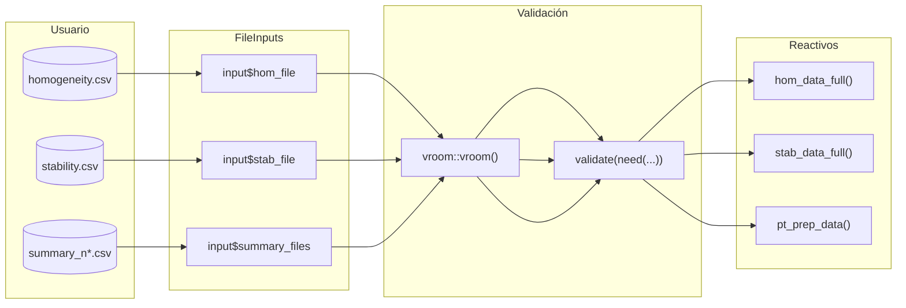
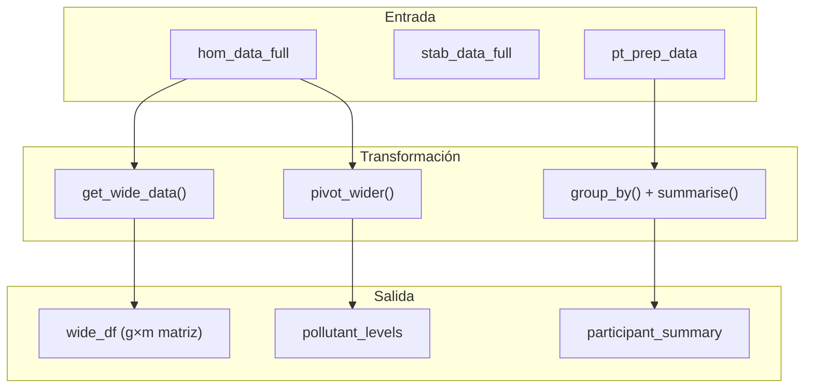
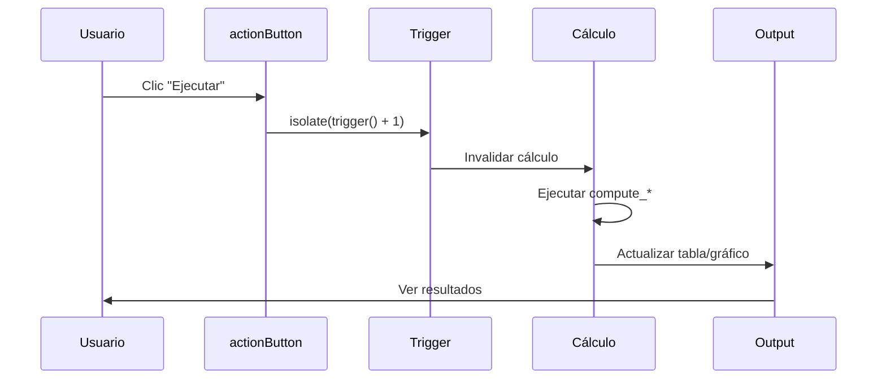
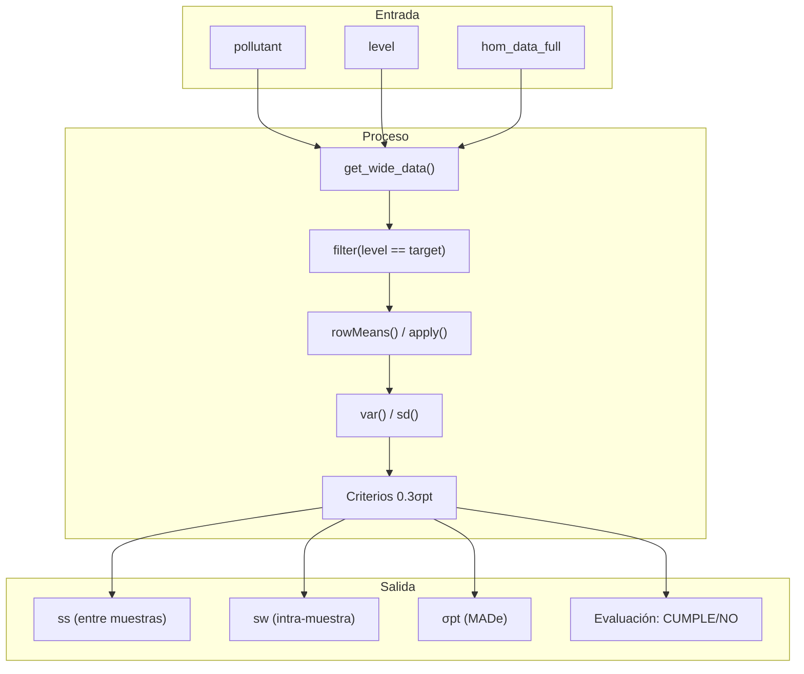
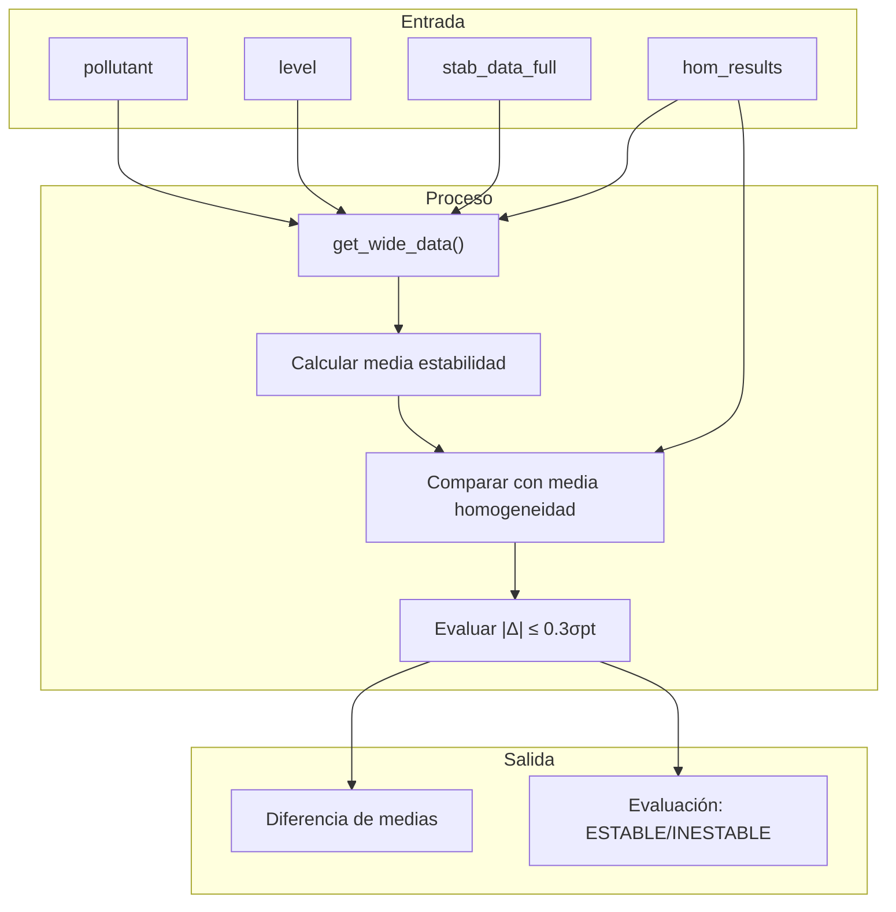
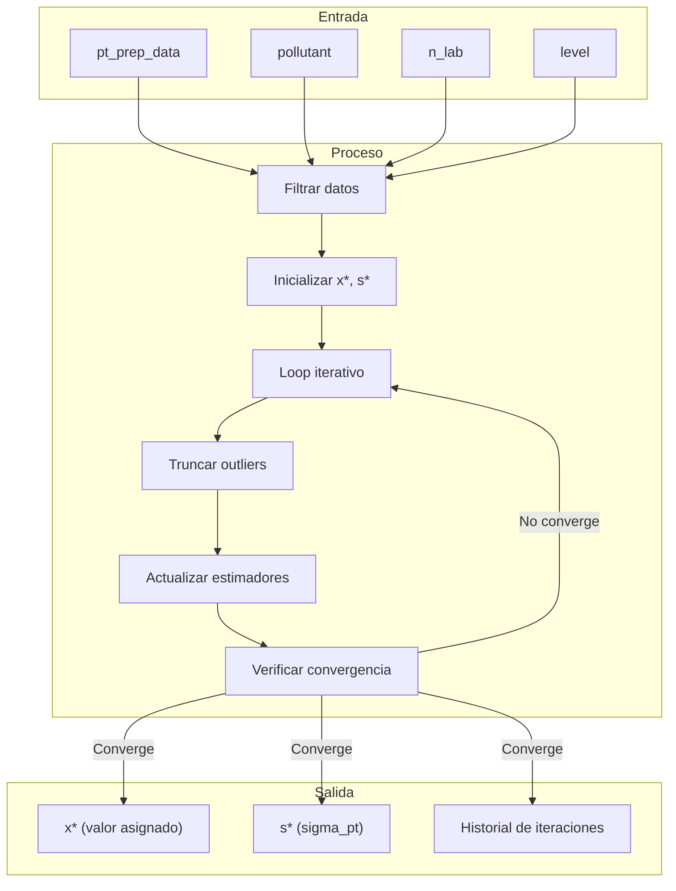
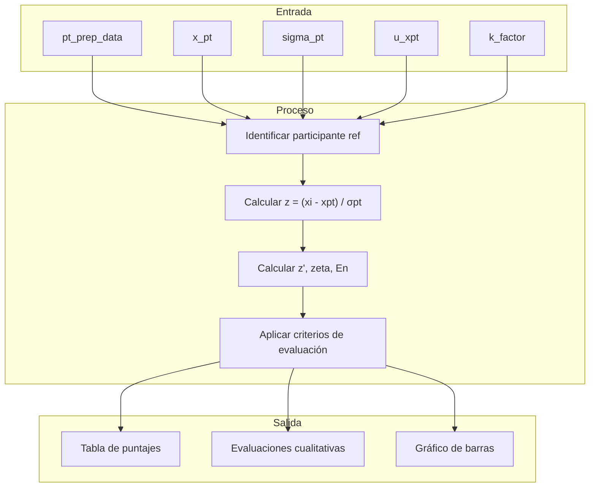
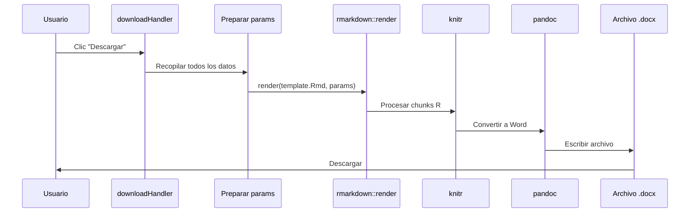

# Entregable 6.1: Lógica de Negocio y Flujo de Datos

**Proyecto:** Aplicativo para Evaluación de Ensayos de Aptitud (PT App)  
**Organización:** Laboratorio CALAIRE - Universidad Nacional de Colombia  
**Archivo Principal:** `app.R` (Server Logic: líneas 66-5428)  
**Fecha:** 2026-01-03

---

## 1. Introducción

La lógica de negocio del aplicativo PT implementa el procesamiento estadístico completo de un ejercicio de intercomparación según las normas ISO 17043 e ISO 13528. Este documento describe cómo fluyen los datos desde la entrada hasta la generación del informe final.

---

## 2. Arquitectura del Servidor Shiny

### 2.1. Estructura General

```
server <- function(input, output, session) {
    │
    ├── Reactivos de Datos Base
    │   ├── hom_data_full()
    │   ├── stab_data_full()
    │   └── pt_prep_data()
    │
    ├── Funciones de Cálculo
    │   ├── compute_homogeneity_metrics()
    │   ├── compute_stability_metrics()
    │   ├── run_algorithm_a()
    │   └── compute_scores_metrics()
    │
    ├── Triggers (Disparadores)
    │   ├── analysis_trigger()
    │   ├── algoA_trigger()
    │   └── scores_trigger()
    │
    ├── Caches de Resultados
    │   ├── hom_results_cache()
    │   ├── algoA_results_cache()
    │   └── scores_results_cache()
    │
    └── Observadores y Renderizadores
        ├── observeEvent()
        ├── renderDT()
        ├── renderPlotly()
        └── downloadHandler()
}
```

### 2.2. Tipos de Objetos Reactivos

| Tipo | Propósito | Ejemplo |
|------|-----------|---------|
| `reactive()` | Cálculo que se cachea automáticamente | `hom_data_full()` |
| `reactiveVal()` | Valor mutable por el servidor | `analysis_trigger()` |
| `reactiveValues()` | Objeto con múltiples valores mutables | `rv$results` |
| `eventReactive()` | Cálculo que solo se ejecuta con trigger | `algo_results()` |
| `observeEvent()` | Acción sin valor de retorno | Actualizar cache |

---

## 3. Flujo de Datos Completo

### 3.1. Etapa 1: Ingesta de Datos



### 3.2. Código de Carga de Datos

```r
# Reactivo para datos de homogeneidad
hom_data_full <- reactive({
  req(input$hom_file)  # Espera a que el archivo esté disponible
  
  df <- vroom::vroom(input$hom_file$datapath, show_col_types = FALSE)
  
  # Validación de estructura
  validate(
    need(
      all(c("value", "pollutant", "level") %in% names(df)),
      "Error: El archivo de homogeneidad debe contener las columnas 
       'value', 'pollutant' y 'level'. Verifique que ha subido el archivo correcto."
    )
  )
  
  df
})
```

### 3.3. Etapa 2: Preparación de Datos



### 3.4. Función `get_wide_data()`

```r
get_wide_data <- function(df, target_pollutant) {
  # Filtrar por analito
  filtered <- df %>% 
    filter(pollutant == target_pollutant)
  
  if (is.null(filtered) || nrow(filtered) == 0) return(NULL)
  
  # Transformar a formato wide
  filtered %>%
    select(-pollutant) %>%
    pivot_wider(
      names_from = replicate, 
      values_from = value, 
      names_prefix = "sample_"
    )
  # Resultado: tibble con columnas level, sample_1, sample_2, ...
}
```

---

## 4. Sistema de Triggers

### 4.1. Concepto

Los triggers son valores reactivos que controlan cuándo se ejecutan los cálculos costosos. Esto evita que la aplicación recalcule innecesariamente con cada cambio de input.



### 4.2. Implementación

```r
# Definición del trigger
analysis_trigger <- reactiveVal(0)

# Botón que incrementa el trigger
observeEvent(input$run_hom_analysis, {
  analysis_trigger(analysis_trigger() + 1)
})

# Cálculo que depende del trigger
hom_results <- eventReactive(analysis_trigger(), {
  req(analysis_trigger() > 0)  # No ejecutar al inicio
  
  compute_homogeneity_metrics(
    target_pollutant = input$pollutant,
    target_level = input$level
  )
})
```

### 4.3. Triggers Definidos en la Aplicación

| Trigger | Botón que lo dispara | Cálculos afectados |
|---------|---------------------|-------------------|
| `analysis_trigger()` | "Ejecutar Análisis" (Hom/Stab) | `compute_homogeneity_metrics`, `compute_stability_metrics` |
| `algoA_trigger()` | "Ejecutar Algoritmo A" | `run_algorithm_a` |
| `scores_trigger()` | "Calcular Puntajes" | `compute_scores_metrics` |
| `report_trigger()` | "Generar Informe" | `rmarkdown::render` |

---

## 5. Sistema de Cache

### 5.1. Propósito

Los caches almacenan resultados de cálculos costosos para evitar recálculos innecesarios cuando el usuario navega entre pestañas.

### 5.2. Estructura del Cache

```r
# Inicialización del cache
algoA_results_cache <- reactiveValues()

# Almacenar resultado en cache
observeEvent(algo_a_result(), {
  key <- paste(input$pollutant, input$level, input$n_lab, sep = "_")
  algoA_results_cache[[key]] <- algo_a_result()
})

# Recuperar del cache
get_cached_result <- function(pollutant, level, n_lab) {
  key <- paste(pollutant, level, n_lab, sep = "_")
  if (!is.null(algoA_results_cache[[key]])) {
    return(algoA_results_cache[[key]])
  }
  return(NULL)
}
```

### 5.3. Invalidación del Cache

```r
# Limpiar cache cuando cambian los datos de entrada
observeEvent(input$summary_files, {
  # Vaciar todos los resultados anteriores
  for (name in names(algoA_results_cache)) {
    algoA_results_cache[[name]] <- NULL
  }
  for (name in names(scores_results_cache)) {
    scores_results_cache[[name]] <- NULL
  }
})
```

---

## 6. Procesamiento por Módulo

### 6.1. Módulo de Homogeneidad



### 6.2. Módulo de Estabilidad



### 6.3. Módulo del Algoritmo A



### 6.4. Módulo de Puntajes



---

## 7. Manejo de Errores

### 7.1. Validación de Inputs

```r
# Validación en el cálculo
compute_homogeneity_metrics <- function(target_pollutant, target_level) {
  req(hom_data_full())  # Detener si no hay datos
  
  wide_df <- get_wide_data(hom_data_full(), target_pollutant)
  
  # Verificar que existen datos para el analito
  if (is.null(wide_df)) {
    return(list(error = sprintf(
      "No se encontraron datos de homogeneidad para el analito '%s'.",
      target_pollutant
    )))
  }
  
  # Verificar nivel
  if (!(target_level %in% unique(wide_df$level))) {
    return(list(error = sprintf(
      "El nivel '%s' no existe para el analito '%s'.",
      target_level, target_pollutant
    )))
  }
  
  # ... resto del cálculo
}
```

### 7.2. Manejo en la UI

```r
output$hom_results_table <- renderDT({
  res <- hom_results()
  
  # Verificar si hay error
  if (!is.null(res$error)) {
    return(datatable(
      data.frame(Error = res$error),
      options = list(dom = 't')
    ))
  }
  
  # Mostrar resultados normales
  datatable(res$summary_df)
})
```

---

## 8. Generación de Informes

### 8.1. Flujo del `downloadHandler`



### 8.2. Código del Download Handler

```r
output$download_report <- downloadHandler(
  filename = function() {
    paste0("Informe_EA_", Sys.Date(), ".docx")
  },
  content = function(file) {
    # Preparar lista de parámetros
    params <- list(
      summary_data = pt_prep_data(),
      hom_data = hom_data_full(),
      stab_data = stab_data_full(),
      metric = input$metric,
      method = input$method,
      pollutant = input$pollutant,
      level = input$level,
      n_lab = input$n_lab,
      sigma_pt = input$sigma_pt,
      u_xpt = input$u_xpt,
      k_factor = input$k_factor,
      xpt_summary = get_xpt_summary(),
      homogeneity_summary = get_hom_summary(),
      stability_summary = get_stab_summary(),
      score_summary = get_scores_summary(),
      heatmaps = get_heatmaps()
    )
    
    # Renderizar
    rmarkdown::render(
      input = "reports/report_template.Rmd",
      output_file = file,
      params = params,
      envir = new.env(parent = globalenv())
    )
  }
)
```

---

## 9. Optimizaciones de Rendimiento

### 9.1. Técnicas Implementadas

| Técnica | Propósito | Ubicación |
|---------|-----------|-----------|
| `req()` | Detener evaluación temprana | Todos los reactivos |
| `isolate()` | Leer sin crear dependencia | Actualizaciones de cache |
| Triggers manuales | Evitar recálculos automáticos | actionButtons |
| Cache de resultados | Reusar cálculos previos | reactiveValues |
| `vroom` en lugar de `read.csv` | Lectura rápida de CSV | Carga de datos |

### 9.2. Ejemplo de `isolate()`

```r
observeEvent(input$calculate_scores, {
  # Leer valores sin crear dependencia reactiva
  current_pollutant <- isolate(input$pollutant)
  current_level <- isolate(input$level)
  
  # El cálculo solo se ejecuta cuando se presiona el botón,
  # no cuando cambian pollutant o level
  result <- compute_scores_metrics(...)
  
  # Guardar en cache
  scores_results_cache[[paste(current_pollutant, current_level, sep = "_")]] <- result
})
```

---

**Siguiente documento:** E6.2 - Dependencias Reactivas
