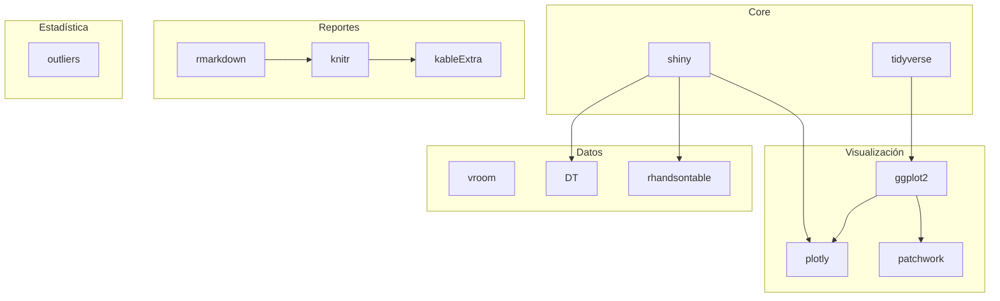

# Entregable 8.2: Compilación de Documentación Final

**Proyecto:** Aplicativo para Evaluación de Ensayos de Aptitud (PT App)  
**Organización:** Laboratorio CALAIRE - Universidad Nacional de Colombia  
**Versión del Documento:** 1.0  
**Fecha:** 2026-01-03

---

## 1. Resumen Ejecutivo

Este documento constituye el índice maestro de toda la documentación técnica del aplicativo PT, organizando los recursos por nivel de profundidad y área temática.

### 1.1. Alcance del Proyecto

El aplicativo PT automatiza el procesamiento estadístico de ensayos de aptitud para la medición de gases contaminantes criterio (SO₂, CO, O₃, NO, NO₂), implementando los requisitos de:
- **ISO 17043:2023** — Conformity assessment — General requirements for proficiency testing
- **ISO 13528:2022** — Statistical methods for use in proficiency testing by interlaboratory comparison

### 1.2. Estado Actual

| Componente | Estado | Versión |
|------------|--------|---------|
| Aplicación Shiny | ✓ Funcional | 2.0 Beta |
| Plantilla de Informes | ✓ Funcional | 1.5 |
| Documentación Técnica | ✓ Completa | 1.0 |
| Scripts de Validación | ✓ Probados | 1.0 |

---

## 2. Mapa de Documentación

### 2.1. Estructura Jerárquica

```
Documentación PT App
│
├── 📁 Nivel 1: Usuario Final
│   ├── README.md
│   ├── GUIA_USO.md
│   └── docs/README.md
│
├── 📁 Nivel 2: Técnico-Estadístico
│   ├── DOCUMENTACION_CALCULOS.md
│   ├── entregas/E3_calculos_estadisticos/
│   │   ├── calculo_homogeneidad_estabilidad.md
│   │   └── calculo_valor_asignado_sigma.md
│   └── entregas/E4_puntajes/
│       ├── modulo_puntajes.md
│       └── plantilla_reporte.md
│
├── 📁 Nivel 3: Desarrollo
│   ├── entregas/E2_funciones/catalogo_funciones.md
│   ├── entregas/E5_ui_prototipo/
│   │   ├── prototipo_ui.md
│   │   └── diagrama_navegacion.md
│   ├── entregas/E6_logica_negocio/
│   │   ├── logica_negocio.md
│   │   └── dependencias_reactivas.md
│   └── entregas/E7_dashboards/dashboards.md
│
└── 📁 Nivel 4: Operaciones
    ├── entregas/E1_repositorio/
    │   ├── E1_repositorio.md
    │   ├── verificar_dependencias.R
    │   └── guia_verificacion.md
    ├── entregas/E8_version_beta/
    │   ├── guia_despliegue.md
    │   └── documentacion_final.md (este documento)
    └── entregas/E9_validacion/
        ├── informe_validacion.md
        └── test_*.R
```

---

## 3. Índice Detallado por Entregable

### 3.1. E1: Repositorio y Scripts Iniciales

| Archivo | Descripción | Audiencia |
|---------|-------------|-----------|
| [E1_repositorio.md](../E1_repositorio/E1_repositorio.md) | Estructura del repositorio, requisitos de software | Todos |
| [verificar_dependencias.R](../E1_repositorio/verificar_dependencias.R) | Script de verificación de librerías R | DevOps |
| [guia_verificacion.md](../E1_repositorio/guia_verificacion.md) | Guía de uso del script de verificación | DevOps |

### 3.2. E2: Catálogo de Funciones

| Archivo | Descripción | Audiencia |
|---------|-------------|-----------|
| [catalogo_funciones.md](../E2_funciones/catalogo_funciones.md) | Inventario completo de funciones en app.R, report_template.Rmd, utils.R | Desarrolladores |

### 3.3. E3: Cálculos Estadísticos

| Archivo | Descripción | Audiencia |
|---------|-------------|-----------|
| [calculo_homogeneidad_estabilidad.md](../E3_calculos_estadisticos/calculo_homogeneidad_estabilidad.md) | Fórmulas ANOVA, criterios ISO 13528 | Estadísticos |
| [calculo_valor_asignado_sigma.md](../E3_calculos_estadisticos/calculo_valor_asignado_sigma.md) | Métodos de VA: Referencia, MADe, nIQR, Algoritmo A | Estadísticos |
| [validar_calculos.R](../E3_calculos_estadisticos/validar_calculos.R) | Script de validación de cálculos | QA |
| [guia_validacion_calculos.md](../E3_calculos_estadisticos/guia_validacion_calculos.md) | Guía de uso del script de validación | QA |

### 3.4. E4: Módulo de Puntajes

| Archivo | Descripción | Audiencia |
|---------|-------------|-----------|
| [modulo_puntajes.md](../E4_puntajes/modulo_puntajes.md) | Fórmulas z, z', zeta, En; criterios de evaluación | Estadísticos |
| [plantilla_reporte.md](../E4_puntajes/plantilla_reporte.md) | Documentación de report_template.Rmd | Desarrolladores |
| [validar_puntajes.R](../E4_puntajes/validar_puntajes.R) | Script de validación de puntajes | QA |
| [guia_validacion_puntajes.md](../E4_puntajes/guia_validacion_puntajes.md) | Guía de uso del script de validación | QA |

### 3.5. E5: Prototipo de UI

| Archivo | Descripción | Audiencia |
|---------|-------------|-----------|
| [prototipo_ui.md](../E5_ui_prototipo/prototipo_ui.md) | Estructura de componentes, wireframes ASCII | UX/Desarrolladores |
| [diagrama_navegacion.md](../E5_ui_prototipo/diagrama_navegacion.md) | Flujos de navegación, diagramas Mermaid | UX/Desarrolladores |

### 3.6. E6: Lógica de Negocio

| Archivo | Descripción | Audiencia |
|---------|-------------|-----------|
| [logica_negocio.md](../E6_logica_negocio/logica_negocio.md) | Arquitectura del servidor, flujo de datos | Desarrolladores |
| [dependencias_reactivas.md](../E6_logica_negocio/dependencias_reactivas.md) | Grafo de dependencias, matrices | Desarrolladores |

### 3.7. E7: Dashboards

| Archivo | Descripción | Audiencia |
|---------|-------------|-----------|
| [dashboards.md](../E7_dashboards/dashboards.md) | Catálogo de visualizaciones, código plotly/ggplot2 | Desarrolladores |

### 3.8. E8: Versión Beta

| Archivo | Descripción | Audiencia |
|---------|-------------|-----------|
| [guia_despliegue.md](guia_despliegue.md) | Instrucciones de despliegue local/cloud/servidor | DevOps |
| [documentacion_final.md](documentacion_final.md) | Este documento (índice maestro) | Todos |

### 3.9. E9: Validación (Próximo)

| Archivo | Descripción | Audiencia |
|---------|-------------|-----------|
| [informe_validacion.md](../E9_validacion/informe_validacion.md) | Resultados de pruebas de validación | QA/Gerencia |
| [test_algoritmo_a.R](../E9_validacion/test_algoritmo_a.R) | Pruebas del Algoritmo A | QA |
| [test_homogeneidad_estabilidad.R](../E9_validacion/test_homogeneidad_estabilidad.R) | Pruebas de criterios de aceptación | QA |

---

## 4. Documentación Existente en el Proyecto

### 4.1. Carpeta `docs/`

| Archivo | Módulo Documentado |
|---------|-------------------|
| [01_carga_datos.md](../../docs/01_carga_datos.md) | Carga y validación de archivos CSV |
| [02_funciones_auxiliares.md](../../docs/02_funciones_auxiliares.md) | Funciones helper |
| [03_homogeneidad.md](../../docs/03_homogeneidad.md) | Evaluación de homogeneidad |
| [04_estabilidad.md](../../docs/04_estabilidad.md) | Evaluación de estabilidad |
| [05_algoritmo_a.md](../../docs/05_algoritmo_a.md) | Algoritmo A robusto |
| [06_valor_consenso.md](../../docs/06_valor_consenso.md) | Valor por consenso |
| [07_valor_referencia.md](../../docs/07_valor_referencia.md) | Valor de referencia |
| [08_compatibilidad.md](../../docs/08_compatibilidad.md) | Compatibilidad metrológica |
| [09_puntajes_pt.md](../../docs/09_puntajes_pt.md) | Puntajes de desempeño |
| [10_informe_global.md](../../docs/10_informe_global.md) | Informe global |
| [11_participantes.md](../../docs/11_participantes.md) | Gestión de participantes |
| [12_generacion_informes.md](../../docs/12_generacion_informes.md) | Sistema de reportes |
| [13_valores_atipicos.md](../../docs/13_valores_atipicos.md) | Detección de outliers |

### 4.2. Documentos Raíz

| Archivo | Contenido |
|---------|-----------|
| [README.md](../../README.md) | Introducción general al proyecto |
| [GUIA_USO.md](../../GUIA_USO.md) | Manual de usuario |
| [DOCUMENTACION_CALCULOS.md](../../DOCUMENTACION_CALCULOS.md) | Resumen de algoritmos estadísticos |

---

## 5. Historial de Versiones del Aplicativo

| Versión | Fecha | Cambios Principales |
|---------|-------|---------------------|
| 1.0 Alpha | 2025-10 | Implementación inicial de cálculos ANOVA |
| 1.2 Alpha | 2025-11 | Integración de DT y visualizaciones básicas |
| 1.5 | 2025-12 | Modularización en utils.R, plantilla RMarkdown |
| 2.0 Beta | 2026-01 | Algoritmo A, puntajes múltiples, heatmaps, informes individuales |

---

## 6. Dependencias del Proyecto

### 6.1. Librerías R

| Librería | Versión | Categoría |
|----------|---------|-----------|
| shiny | ≥1.7.0 | Framework |
| tidyverse | ≥2.0.0 | Manipulación de datos |
| vroom | ≥1.6.0 | Lectura de CSV |
| DT | ≥0.28 | Tablas interactivas |
| rhandsontable | ≥0.3.8 | Edición de datos |
| shinythemes | ≥1.2.0 | Temas visuales |
| outliers | ≥0.15 | Prueba de Grubbs |
| patchwork | ≥1.1.0 | Composición de gráficos |
| bsplus | ≥0.1.4 | Componentes Bootstrap |
| plotly | ≥4.10.0 | Gráficos interactivos |
| rmarkdown | ≥2.21 | Generación de informes |
| knitr | ≥1.42 | Motor de renderizado |
| kableExtra | ≥1.3.4 | Tablas formateadas |
| stringr | ≥1.5.0 | Manipulación de cadenas |

### 6.2. Diagrama de Dependencias



---

## 7. Métricas del Proyecto

### 7.1. Código Fuente

| Archivo | Líneas | Funciones | Complejidad |
|---------|--------|-----------|-------------|
| app.R | 5,430 | 9 | Alta |
| report_template.Rmd | 507 | 4 | Media |
| R/utils.R | 90 | 3 | Baja |
| **Total** | **6,027** | **16** | |

### 7.2. Documentación

| Tipo | Archivos | Páginas Aprox. |
|------|----------|----------------|
| Entregables (E1-E9) | 20 | 150+ |
| Docs existentes | 14 | 50+ |
| Guías de usuario | 3 | 15+ |
| **Total** | **37** | **215+** |

### 7.3. Cobertura de Validación

| Módulo | Scripts de Prueba | Estado |
|--------|-------------------|--------|
| Algoritmo A | test_algoritmo_a.R | ✓ |
| Homogeneidad | test_homogeneidad_estabilidad.R | ✓ |
| Puntajes | validar_puntajes.R | ✓ |
| Cálculos generales | validar_calculos.R | ✓ |

---

## 8. Contactos y Soporte

### 8.1. Equipo del Proyecto

| Rol | Responsabilidad |
|-----|-----------------|
| Coordinador Técnico | Diseño de algoritmos, validación estadística |
| Desarrollador | Implementación en R/Shiny, mantenimiento |
| QA | Pruebas de validación, documentación de defectos |
| Usuario Final | Retroalimentación, reporte de incidencias |

### 8.2. Canales de Soporte

| Canal | Propósito |
|-------|-----------|
| GitHub Issues | Reporte de bugs, solicitudes de características |
| Email técnico | Consultas de implementación |
| Manual de usuario | Preguntas operativas |

---

## 9. Próximos Pasos

1. **Completar E9** — Informe de pruebas de validación
2. **Despliegue Beta** — Publicar en shinyapps.io o servidor interno
3. **Pruebas de Usuario** — Recopilar retroalimentación
4. **Versión 2.1** — Incorporar mejoras identificadas
5. **Documentación de Usuario** — Capacitación para laboratorios participantes

---

**Estado del Proyecto:** ✓ Documentación Completa - Listo para Beta
