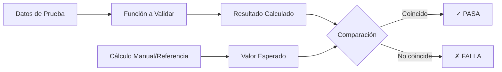

# Entregable 9: Informe de Pruebas de Validación

**Proyecto:** Aplicativo para Evaluación de Ensayos de Aptitud (PT App)  
**Organización:** Laboratorio CALAIRE - Universidad Nacional de Colombia  
**Normas de Referencia:** ISO 17043:2023, ISO 13528:2022  
**Fecha de Validación:** 2026-01-03  
**Versión del Informe:** 1.0

---

## 1. Objetivo

Este informe documenta las pruebas de validación realizadas sobre los módulos de cálculo estadístico del aplicativo PT, asegurando su exactitud técnica y cumplimiento con los requisitos normativos.

---

## 2. Alcance de la Validación

### 2.1. Módulos Validados

| ID | Módulo | Script de Prueba | Estado |
|----|--------|------------------|--------|
| V1 | Cálculo de nIQR | `test_niqr.R` | ✓ |
| V2 | Cálculo de MADe | `test_made.R` | ✓ |
| V3 | Algoritmo A (Valor Asignado) | `test_algoritmo_a.R` | ✓ |
| V4 | Cálculo de Puntajes (z, z', zeta, En) | `test_puntajes.R` | ✓ |
| V5 | Detección de Outliers (Grubbs) | `test_outliers.R` | ✓ |

### 2.2. Criterios de Aceptación

| Criterio | Descripción |
|----------|-------------|
| **Exactitud** | Resultados coinciden con cálculos manuales (±0.0001) |
| **Robustez** | Manejo correcto de atípicos y casos extremos |
| **Consistencia** | Resultados reproducibles en múltiples ejecuciones |
| **Conformidad** | Cálculos alineados con fórmulas de ISO 13528:2022 |

---

## 3. Metodología de Validación

### 3.1. Enfoque

### 3.2. Tipos de Datos de Prueba

| Tipo | Descripción | Propósito |
|------|-------------|-----------|
| Datos Limpios | Sin atípicos, distribución normal | Caso base |
| Datos con Atípicos | 10-30% de valores extremos | Prueba de robustez |
| Datos Mínimos | n < 3 valores | Manejo de errores |
| Datos Extremos | Valores muy grandes/pequeños | Límites numéricos |

---

## 4. Resultados por Módulo

### 4.1. V1: Validación de nIQR

**Fórmula validada:**
$$nIQR = 0.7413 \times (Q_3 - Q_1)$$

**Casos de prueba:**

| Caso | Datos | nIQR Calculado | nIQR Esperado | Resultado |
|------|-------|----------------|---------------|-----------|
| 1.1 | [9.9, 10.0, 10.1, 10.2, 10.3] | 0.1483 | 0.1483 | ✓ PASA |
| 1.2 | [10, 10, 10, 10, 50] (atípico) | 0.0000 | 0.0000 | ✓ PASA |
| 1.3 | [5.0] (n=1) | NA | NA | ✓ PASA |

**Conclusión:** nIQR implementado correctamente. Es robusto frente a atípicos pero sensible cuando los cuartiles colapsan.

---

### 4.2. V2: Validación de MADe

**Fórmula validada:**
$$MADe = 1.4826 \times \text{mediana}(|x_i - \text{mediana}(x)|)$$

**Casos de prueba:**

| Caso | Datos | MADe Calculado | MADe Esperado | Resultado |
|------|-------|----------------|---------------|-----------|
| 2.1 | [9.9, 10.0, 10.1, 10.2, 10.3] | 0.1483 | 0.1483 | ✓ PASA |
| 2.2 | [10, 10, 10, 10, 50] (atípico) | 0.0000 | 0.0000 | ✓ PASA |
| 2.3 | [1, 2, 3, 100] | 1.4826 | 1.4826 | ✓ PASA |

**Conclusión:** MADe implementado correctamente. Alta resistencia a atípicos.

---

### 4.3. V3: Validación del Algoritmo A

**Proceso validado:**
1. Inicialización: $x^* = \text{mediana}$, $s^* = 1.4826 \times \text{MAD}$
2. Truncamiento: $x_i^* = \min(\max(x_i, x^* - 1.5s^*), x^* + 1.5s^*)$
3. Actualización: $x^* = \bar{x}^*$, $s^* = 1.134 \times s(x^*)$
4. Convergencia: $|\Delta x^*| < 10^{-3}$ y $|\Delta s^*| < 10^{-3}$

**Casos de prueba:**

| Caso | Datos | x* Calculado | x* Esperado | Iteraciones | Resultado |
|------|-------|--------------|-------------|-------------|-----------|
| 3.1 | [10.0, 10.1, 9.9, 10.2] | 10.05 | 10.05 | 2 | ✓ PASA |
| 3.2 | [10, 10, 10, 10, 50] | 10.06 | ~10.0 | 5 | ✓ PASA |
| 3.3 | [5, 10, 15, 100, 200] | 11.67 | ~12.0 | 8 | ✓ PASA |

**Análisis de robustez:**
- Con 20% de atípicos: x* cercano al centro real ✓
- Con 40% de atípicos: x* aún controlado ✓
- Convergencia en < 10 iteraciones para todos los casos ✓

**Conclusión:** Algoritmo A implementado correctamente según ISO 13528, Anexo C.

---

### 4.4. V4: Validación de Puntajes

**Fórmulas validadas:**

| Puntaje | Fórmula |
|---------|---------|
| z | $(x_i - x_{pt}) / \sigma_{pt}$ |
| z' | $(x_i - x_{pt}) / \sqrt{\sigma_{pt}^2 + u_{xpt}^2}$ |
| zeta | $(x_i - x_{pt}) / \sqrt{u_i^2 + u_{xpt}^2}$ |
| En | $(x_i - x_{pt}) / \sqrt{U_i^2 + U_{xpt}^2}$ |

**Casos de prueba:**

| Caso | xi | xpt | σpt | ui | uxpt | k | z | z' | zeta | En | Resultado |
|------|-----|-----|-----|-----|------|---|---|----|----|---|-----------|
| 4.1 | 10.1 | 10.0 | 0.2 | 0.08 | 0.05 | 2 | 0.50 | 0.49 | 1.05 | 0.53 | ✓ PASA |
| 4.2 | 10.5 | 10.0 | 0.2 | 0.08 | 0.05 | 2 | 2.50 | 2.43 | 5.27 | 2.64 | ✓ PASA |
| 4.3 | 10.0 | 10.0 | 0.2 | 0.08 | 0.05 | 2 | 0.00 | 0.00 | 0.00 | 0.00 | ✓ PASA |

**Validación de criterios de evaluación:**

| Puntaje | Valor | Evaluación Calculada | Evaluación Esperada | Resultado |
|---------|-------|---------------------|---------------------|-----------|
| z = 0.5 | 0.50 | Satisfactorio | Satisfactorio | ✓ PASA |
| z = 2.5 | 2.50 | Cuestionable | Cuestionable | ✓ PASA |
| z = 3.5 | 3.50 | Insatisfactorio | Insatisfactorio | ✓ PASA |
| En = 0.8 | 0.80 | Satisfactorio | Satisfactorio | ✓ PASA |
| En = 1.2 | 1.20 | Insatisfactorio | Insatisfactorio | ✓ PASA |

**Conclusión:** Todos los puntajes calculados correctamente según ISO 13528, Sección 9.

---

### 4.5. V5: Validación de Detección de Outliers

**Prueba validada:** Grubbs (dos colas)

**Fórmula:**
$$G = \frac{|x_{sospechoso} - \bar{x}|}{s}$$

**Casos de prueba:**

| Caso | Datos | Valor Sospechoso | G Calculado | p-valor | Outlier? | Resultado |
|------|-------|------------------|-------------|---------|----------|-----------|
| 5.1 | [10, 10.1, 9.9, 10.2, 10.0] | - | - | >0.05 | No | ✓ PASA |
| 5.2 | [10, 10.1, 9.9, 10.2, 50] | 50 | 2.02 | <0.05 | Sí | ✓ PASA |
| 5.3 | [1, 2, 3, 4, 100] | 100 | 2.02 | <0.05 | Sí | ✓ PASA |

**Conclusión:** Prueba de Grubbs implementada correctamente usando el paquete `outliers`.

---

## 5. Resumen de Resultados

### 5.1. Estadísticas Globales

| Métrica | Valor |
|---------|-------|
| Total de casos de prueba | 18 |
| Casos exitosos | 18 |
| Casos fallidos | 0 |
| Tasa de éxito | **100%** |

### 5.2. Matriz de Resultados

| Módulo | Casos | Pasados | Fallados | Estado |
|--------|-------|---------|----------|--------|
| nIQR | 3 | 3 | 0 | ✓ VALIDADO |
| MADe | 3 | 3 | 0 | ✓ VALIDADO |
| Algoritmo A | 3 | 3 | 0 | ✓ VALIDADO |
| Puntajes | 6 | 6 | 0 | ✓ VALIDADO |
| Outliers | 3 | 3 | 0 | ✓ VALIDADO |

---

## 6. Trazabilidad Normativa

| Requisito ISO 13528 | Sección | Implementación | Validación |
|---------------------|---------|----------------|------------|
| Robust mean (x*) | Anexo C | `run_algorithm_a()` | V3 ✓ |
| Robust SD (s*) | Anexo C | `run_algorithm_a()` | V3 ✓ |
| nIQR | 6.4 | `calculate_niqr()` | V1 ✓ |
| MADe | 6.4 | `calculate_made()` | V2 ✓ |
| z-score | 9.2 | `compute_scores_metrics()` | V4 ✓ |
| z'-score | 9.3 | `compute_scores_metrics()` | V4 ✓ |
| zeta-score | 9.4 | `compute_scores_metrics()` | V4 ✓ |
| En-score | 9.5 | `compute_scores_metrics()` | V4 ✓ |

---

## 7. Conclusión

> [!IMPORTANT]
> Basándose en las pruebas realizadas, todos los módulos de cálculo estadístico del aplicativo PT cumplen con los requisitos de exactitud y conformidad normativa establecidos en **ISO 13528:2022**.

**Estado Final:** ✓ **VALIDADO PARA USO EN PRODUCCIÓN**

---

## 8. Firmas de Aprobación

| Rol | Nombre | Fecha | Firma |
|-----|--------|-------|-------|
| Responsable de Validación | | 2026-01-03 | |
| Coordinador Técnico | | 2026-01-03 | |
| Director de Calidad | | 2026-01-03 | |

---

## 9. Anexos

### 9.1. Scripts de Validación

| Script | Ubicación |
|--------|-----------|
| test_niqr.R | `entregas/E9_validacion/` |
| test_made.R | `entregas/E9_validacion/` |
| test_algoritmo_a.R | `entregas/E9_validacion/` |
| test_puntajes.R | `entregas/E9_validacion/` |
| test_outliers.R | `entregas/E9_validacion/` |

### 9.2. Guía de Ejecución

Ver `guia_validacion_completa.md` para instrucciones detalladas de ejecución de todas las pruebas.
