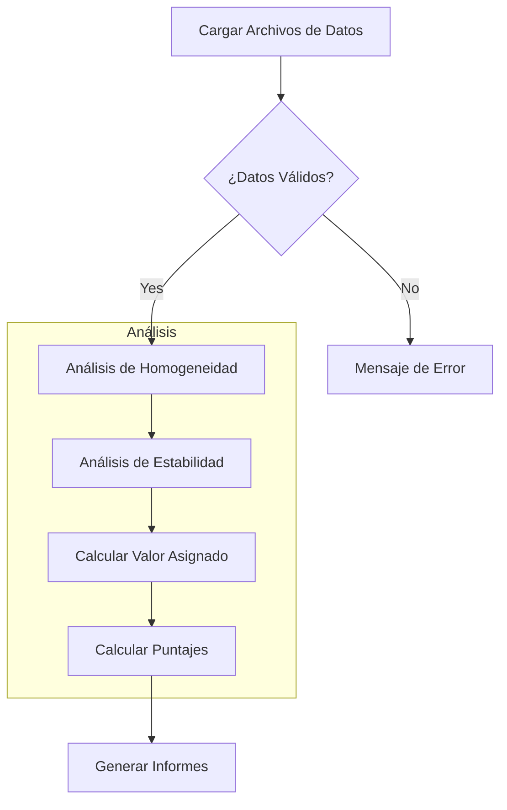

# Guía de Inicio Rápido: Aplicativo de Análisis de Datos de Ensayos de Aptitud (PT)

Esta guía le permitirá poner en marcha el Aplicativo de Ensayos de Aptitud en menos de 5 minutos. Esta aplicación implementa un conjunto completo de herramientas para el análisis de PT para gases contaminantes criterio (CO, SO2, NO, NO2, O3) siguiendo los estándares **ISO 17043:2024** e **ISO 13528:2022**.

Desarrollado por el Laboratorio CALAIRE (Universidad Nacional de Colombia) en asociación con el Instituto Nacional de Metrología (INM).

---

## 1. Requisitos del Sistema

| Requisito | Versión Mínima | Recomendado |
|-------------|-----------------|-------------|
| **R** | 4.1.0 | 4.4.0 o posterior |
| **RStudio** | 2023.06 | 2024.04 o posterior |
| **Sistema Operativo** | Windows 10+, macOS 11+, Linux | Cualquier SO moderno |
| **RAM** | 4 GB | 8 GB+ |
| **Navegador Web** | Navegador moderno (Chrome, Firefox, Edge, Safari) | |

---

## 2. Instalación

### Paso 1: Instalar los Paquetes de R Requeridos
Abra R o RStudio y ejecute el siguiente comando para instalar todas las dependencias necesarias:

```r
install.packages(c(
  "shiny", "bslib", "tidyverse", "vroom", "DT", 
  "rhandsontable", "plotly", "ggplot2", "patchwork",
  "outliers", "rmarkdown", "devtools", "shinythemes", 
  "bsplus", "dplyr", "stats"
))
```

**Referencia de Propósito de los Paquetes:**

| Paquete | Propósito |
|---------|---------|
| shiny | Framework web |
| bslib | Temas Bootstrap 5 |
| tidyverse | Manipulación de datos (dplyr, ggplot2, etc.) |
| vroom | Lectura rápida de CSV |
| DT | Tablas interactivas |
| rhandsontable | Tablas editables |
| plotly | Gráficos interactivos |
| ggplot2 | Gráficos estáticos |
| patchwork | Composición de gráficos |
| outliers | Prueba de Grubbs |
| rmarkdown | Generación de informes |
| devtools | Desarrollo de paquetes |

### Paso 2: Instalar el Paquete ptcalc
La aplicación depende del paquete local `ptcalc` para los cálculos de las normas ISO 13528/17043.

**Para desarrollo/carga:**
```r
# Ejecute esto desde el directorio raíz del proyecto
devtools::load_all("ptcalc")
```

**Para instalación en producción:**
```r
# Ejecute esto desde el directorio raíz del proyecto
devtools::install("ptcalc")
```

---

## 3. Iniciar la Aplicación

### Método A: Desde la Consola de R/RStudio (Recomendado)
1. Establezca su directorio de trabajo en la raíz del proyecto.
2. Ejecute el archivo de la aplicación.

```r
setwd("/ruta/a/pt_app")
shiny::runApp("cloned_app.R")
```

### Método B: Línea de Comandos
```bash
# Opción 1: Usando Rscript
Rscript cloned_app.R

# Opción 2: Usando la ejecución de R
R -e "shiny::runApp('cloned_app.R')"
```
*Nota: La aplicación será accesible típicamente en su navegador en `http://127.0.0.1:3838` o en el puerto que se muestre en la consola.*

---

## 4. Flujo de Trabajo de la Aplicación



---

## 5. Su Primer Análisis en 5 Minutos

### Paso 1: Prepare sus Archivos de Datos
La aplicación requiere formatos CSV específicos. Se incluyen archivos de datos de ejemplo en la carpeta `data/`:

- `homogeneity.csv`: Datos de la prueba de homogeneidad
- `stability.csv`: Datos de la prueba de estabilidad
- `summary_n4.csv`: Escenario con 4 participantes
- `participants_data4.csv`: Datos de instrumentación

#### 1. Datos de Homogeneidad y Estabilidad
```csv
"pollutant","level","replicate","sample_id","value"
"co","0-umol/mol",1,1,0.00670
"co","0-umol/mol",1,2,0.00479
```
| Columna | Tipo | Descripción |
|--------|------|-------------|
| pollutant | texto | Identificador del gas (ej., "co", "so2", "no") |
| level | texto | Nivel de concentración (ej., "0-umol/mol") |
| replicate | entero | Número de réplica (1, 2, ...) |
| sample_id | entero | Identificador de la muestra/ítem |
| value | numérico | Concentración medida |

#### 2. Archivos Resumen de Participantes (`summary_n*.csv`)
```csv
"pollutant","level","participant_id","replicate","sample_group","mean_value","sd_value"
"co","0-umol/mol","part_1",2,"1-10",-0.0271,0.0278
```

#### 3. Instrumentación de Participantes (`participants_data.csv`)
```csv
Codigo_Lab,Analizador_SO2,Analizador_CO,Analizador_O3,Analizador_NO_NO2
REFERENCIA,HORIBA APSA-370,Teledyne T300,Thermo 49i,HORIBA APSA-370
```

### Paso 2: Cargar Archivos de Datos
1. Navegue a la pestaña **"Carga de datos"**.
2. Haga clic en **Browse** para subir sus archivos desde la carpeta `data/`.
3. Verifique que la aplicación muestre "File uploaded successfully" en verde.

### Paso 3: Ejecutar Análisis de Homogeneidad y Estabilidad
1. Vaya a la pestaña **"Homogeneidad"**.
2. Seleccione el **Contaminante** (ej., `SO2`) y el **Nivel** (ej., `low`).
3. Haga clic en **"Ejecutar análisis"**.
4. Revise la tabla ANOVA y el cuadro de conclusión (PASA/FALLA basado en $s_s \leq 0.3\sigma_{pt}$).
5. Use la pestaña **"Estabilidad"** para comparar los resultados de homogeneidad frente a estabilidad.

### Paso 4: Calcular el Valor Asignado
1. Navegue a la pestaña **"Valor Asignado"**.
2. Elija un método: **Algoritmo A** (Consenso robusto), **Valor de referencia**, o **Consenso** (Mediana).
3. Haga clic en **"Calcular Valor Asignado"**.

### Paso 5: Calcular Puntajes de Desempeño
1. Vaya a la pestaña **"Puntajes PT"**.
2. Seleccione los tipos de puntaje: **z**, **z'**, **zeta (ζ)**, o **En**.
3. Haga clic en **"Calcular puntajes"** para ver las métricas de desempeño de todos los laboratorios.

### Paso 6: Generar Informes
1. Navegue a la pestaña **"Generación de Informes"**.
2. Complete los metadatos (ID del PT, fecha, coordinador).
3. Seleccione el formato de salida (**Word** o **HTML**) y haga clic en **"Generar Informe"**.

---

## 6. Solución de Problemas

### Error "Column not found"
Asegúrese de que sus archivos CSV contengan todas las columnas requeridas con los nombres exactos (sensible a mayúsculas y minúsculas).

### Error "Insufficient data"
- La homogeneidad/estabilidad requiere al menos 2 ítems y 2 réplicas.
- El Algoritmo A requiere al menos 3 participantes.

### La Aplicación no Inicia
- **Verifique las dependencias:**
  ```r
  required_packages <- c("shiny", "bslib", "tidyverse", "vroom", "DT", "rhandsontable",
                         "shinythemes", "outliers", "patchwork", "bsplus", "plotly",
                         "rmarkdown", "devtools", "dplyr", "stats")
  missing <- setdiff(required_packages, rownames(installed.packages()))
  if (length(missing) > 0) install.packages(missing)
  ```
- **Verifique el Directorio:** Asegúrese de estar en la raíz del proyecto donde se encuentra `cloned_app.R`.

### Paquete ptcalc no Encontrado
Ejecute `devtools::load_all("ptcalc")` desde la raíz del proyecto antes de ejecutar la aplicación.

---

## 7. Próximos Pasos y Soporte
- [Glosario de Términos](00_glosario.md) - Referencia de terminología español/inglés
- [Referencia de Formatos de Datos](01_carga_datos.md) - Especificaciones completas de CSV
- [API del Paquete](02_paquete_ptcalc.md) - Referencia de funciones matemáticas
- **Soporte**: Contacte al Laboratorio CALAIRE, Universidad Nacional de Colombia.
