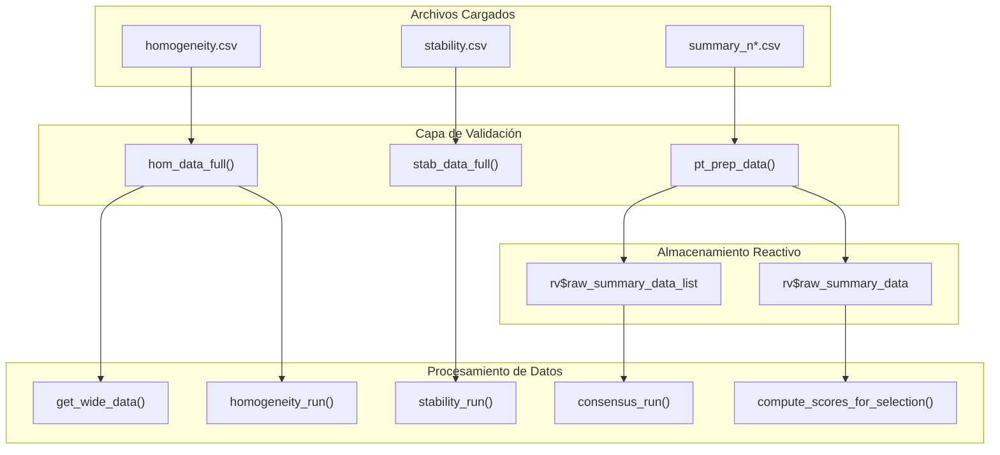

# Módulo: Carga de Datos (Data Loading)

## Descripción

Este módulo gestiona la carga y validación de los archivos CSV de entrada. Es el punto de partida para todos los análisis de la aplicación, asegurando la integridad de los datos antes de comenzar cualquier procesamiento estadístico. El sistema está diseñado para manejar datos de homogeneidad, estabilidad y resultados de participantes de múltiples rondas de ensayos de aptitud (PT).

---

## Ubicación en el Código

| Elemento | Valor |
|----------|-------|
| **Archivo** | `app.R` |
| **Líneas (Server)** | 79 - 156 |
| **Pestaña UI** | `tabPanel("Carga de datos")` (Líneas 762-806) |
| **Dependencias** | `vroom`, `stringr`, `dplyr`, `shiny` |

---

## Arquitectura y Flujo de Datos

El proceso de carga de datos activa una cadena de expresiones reactivas que validan, almacenan y transforman los datos para su uso en módulos posteriores.

### Diagrama de Flujo (Mermaid)



---

## Reactives Principales

### `hom_data_full()`
Carga y valida el archivo de homogeneidad.

| Propiedad | Valor |
|-----------|-------|
| **Descripción** | Carga y valida el archivo CSV de homogeneidad |
| **Depende de** | `input$hom_file` |
| **Retorna** | DataFrame con columnas `value`, `pollutant`, `level` |
| **Validación** | Requiere columnas exactas: `value`, `pollutant`, `level` |

**Implementación:**
```r
hom_data_full <- reactive({
  req(input$hom_file)
  df <- vroom::vroom(input$hom_file$datapath, show_col_types = FALSE)
  validate(
    need(
      all(c("value", "pollutant", "level") %in% names(df)),
      "Error: El archivo de homogeneidad debe contener las columnas 'value', 'pollutant' y 'level'."
    )
  )
  df
})
```

### `stab_data_full()`
Carga y valida el archivo de estabilidad.

| Propiedad | Valor |
|-----------|-------|
| **Descripción** | Carga y valida el archivo CSV de estabilidad |
| **Depende de** | `input$stab_file` |
| **Retorna** | DataFrame con columnas `value`, `pollutant`, `level` |

**Implementación:**
```r
stab_data_full <- reactive({
  req(input$stab_file)
  df <- vroom::vroom(input$stab_file$datapath, show_col_types = FALSE)
  validate(
    need(
      all(c("value", "pollutant", "level") %in% names(df)),
      "Error: El archivo de estabilidad debe contener las columnas 'value', 'pollutant' y 'level'."
    )
  )
  df
})
```

### `pt_prep_data()`
Consolida múltiples archivos resumen de participantes, extrae el identificador de ronda (`n_lab`) y agrega los datos.

| Propiedad | Valor |
|-----------|-------|
| **Descripción** | Consolida archivos resumen, extrae `n_lab` y agrega datos |
| **Depende de** | `input$summary_files` |
| **Efectos Secundarios** | Puebla `rv$raw_summary_data` y `rv$raw_summary_data_list` |
| **Retorna** | DataFrame agrupado por `participant_id`, `pollutant`, `level`, `n_lab` |

**Implementación:**
```r
pt_prep_data <- reactive({
  req(input$summary_files)

  data_list <- lapply(seq_len(nrow(input$summary_files)), function(i) {
    df <- vroom::vroom(input$summary_files$datapath[i], show_col_types = FALSE)
    # n_lab extraction logic
    n <- as.integer(stringr::str_extract(input$summary_files$name[i], "\\d+"))
    df$n_lab <- n
    return(df)
  })

  if (length(data_list) == 0) return(NULL)

  raw_data <- do.call(rbind, data_list)
  if (is.null(raw_data) || nrow(raw_data) == 0) return(NULL)

  validate(
    need(
      all(c("participant_id", "pollutant", "level", "mean_value", "sd_value") %in% names(raw_data)),
      "Error: Los archivos resumen deben contener las columnas 'participant_id', 'pollutant', 'level', 'mean_value' y 'sd_value'."
    )
  )

  rv$raw_summary_data <- raw_data
  # Store original list for consensus calculations
  rv$raw_summary_data_list <- lapply(seq_len(nrow(input$summary_files)), function(i) {
    vroom::vroom(input$summary_files$datapath[i], show_col_types = FALSE)
  })

  raw_data %>%
    group_by(participant_id, pollutant, level, n_lab) %>%
    summarise(
      mean_value = mean(mean_value, na.rm = TRUE),
      sd_value = mean(sd_value, na.rm = TRUE),
      .groups = "drop"
    )
})
```

---

## Formatos de Archivos de Entrada

La aplicación espera tres tipos de archivos CSV. Los nombres de las columnas son sensibles a mayúsculas y minúsculas (preferiblemente minúsculas).

### 1. Datos de Homogeneidad (`homogeneity.csv`)
Contiene mediciones por duplicado para cada combinación de contaminante/nivel en múltiples ítems (muestras).

```csv
"pollutant","run","level","replicate","sample_id","value"
"co","corrida_1","2-umol/mol",1,1,2.0115
"co","corrida_1","2-umol/mol",2,1,2.0162
"so2","corrida_2","20-nmol/mol",1,1,19.70
"so2","corrida_2","20-nmol/mol",2,1,19.68
```

**Estructura Clave:**
- **run**: Identificador de la corrida/ronda (ej. `corrida_1`, `corrida_2`).
- **replicate**: Número de réplica (usualmente 1 o 2).
- **sample_id**: Identificador del ítem físico.
- **Formato**: Formato largo (long format).

### 2. Datos de Estabilidad (`stability.csv`)
Misma estructura que el archivo de homogeneidad, pero representa las mediciones al final del periodo del PT.

```csv
"pollutant","run","level","replicate","sample_id","value"
"co","corrida_1","2-umol/mol",1,1,2.0100
"co","corrida_1","2-umol/mol",2,1,2.0150
"so2","corrida_2","20-nmol/mol",1,1,19.65
"so2","corrida_2","20-nmol/mol",2,1,19.67
```

### 3. Resumen de Participantes (`summary_n*.csv`)
Contiene resultados agregados de cada laboratorio participante.

**Patrón de nombre**: `summary_n(\d+).csv`. El número se extrae como `n_lab` (ej. `summary_n04.csv` -> `n_lab = 4`).

```csv
"pollutant","run","level","participant_id","replicate","sample_group","mean_value","sd_value"
"co","corrida_1","2-umol/mol","part_1",2,"1-10",2.025,0.012
"co","corrida_1","2-umol/mol","ref",1,"1-10",2.015,0.005
"so2","corrida_2","20-nmol/mol","part_2",1,"1-5",19.72,0.08
```

**Notas:**
- `participant_id = "ref"` designa al laboratorio de referencia.
- `mean_value` y `sd_value` son obligatorios.

---

## Reglas de Validación

| Validación | Regla | Mensaje de Error / Comportamiento |
|------------|-------|-----------------------------------|
| **Columnas (H/E)** | `value`, `pollutant`, `level`, `run` | "El archivo de [homogeneidad/estabilidad] debe contener las columnas..." |
| **Columnas (Resumen)** | `participant_id`, `pollutant`, `level`, `run`, `mean_value`, `sd_value` | "Los archivos resumen deben contener las columnas..." |
| **Tipos de Datos** | `value`, `mean_value`, `sd_value` deben ser numéricos | Error de vroom o validación de R |
| **Nombre de Archivo** | Los archivos resumen deben contener un número | `n_lab` se vuelve `NA` si no hay número |
| **Columna run** | `run` debe ser tipo caracter (string) con identificador de corrida | Valores como `"corrida_1"`, `"corrida_2"` |
| **Presencia de Archivo** | `req(input$file)` | Silencioso hasta que se sube el archivo |

---

## Convenciones de Nomenclatura

### Analitos (Pollutants)
Se recomienda el uso de códigos en minúsculas para consistencia.

| Analito | Correcto | Incorrecto |
|-----------|---------|------------|
| Dióxido de Azufre | `so2` | `SO2`, `Sulfur` |
| Monóxido de Carbono | `co` | `CO` |
| Ozono | `o3` | `O3`, `Ozone` |
| Óxido Nítrico | `no` | `NO` |
| Dióxido de Nitrógeno | `no2` | `NO2` |

### Niveles (Levels)
Formato recomendado: `{valor}-{unidad}`.

| Ejemplo | Correcto | Incorrecto |
|---------|---------|------------|
| Nivel Cero | `0-nmol/mol` | `0`, `zero`, `blank` |
| Conc. Baja | `20-nmol/mol` | `20`, `low` |
| Unidades Micro | `2-μmol/mol` | `2-umol/mol`, `2uM` |

---

## Mensajes de Error y Soluciones (Troubleshooting)

| Mensaje de Error | Causa | Solución |
|------------------|-------|----------|
| "El archivo de homogeneidad debe contener las columnas 'value', 'pollutant' y 'level'" | Faltan cabeceras requeridas o hay error de mayúsculas. | Renombrar columnas a minúsculas exactas. |
| "No se encontraron datos para el analito" | El filtro de analito devolvió un resultado vacío. | Verificar que el nombre del analito en el archivo coincida con el selector de la app. |
| La aplicación muestra tablas vacías tras la carga | El archivo tiene cabeceras pero no filas de datos, o codificación incorrecta. | Verificar que el archivo tenga datos y esté codificado en UTF-8. |
| Los datos de participantes no aparecen | Desajuste entre `participant_id` o `pollutant` entre archivos. | Asegurar consistencia total de nombres entre todos los archivos subidos. |

---

## Detalles Técnicos Avanzados

### Invalidaicón de Caché
Cuando se sube un nuevo archivo en `input$summary_files`, se limpian todos los resultados cacheados para evitar persistencia de datos antiguos:

```r
observeEvent(input$summary_files, {
  algoA_results_cache(NULL)
  consensus_results_cache(NULL)
  scores_results_cache(NULL)
  # ... otros triggers
}, ignoreNULL = FALSE)
```

### Función Auxiliar: `get_wide_data()`
Transforma los datos de formato largo a ancho para el análisis ANOVA.

```r
get_wide_data <- function(df, target_pollutant) {
  filtered <- df %>% filter(pollutant == target_pollutant)
  if (is.null(filtered) || nrow(filtered) == 0) return(NULL)
  
  filtered %>%
    select(-pollutant) %>%
    pivot_wider(names_from = replicate, values_from = value, names_prefix = "sample_")
}
```

---

## Componentes de la Interfaz (UI)

| Elemento UI | ID de Entrada | Tipo | Propósito |
|-------------|---------------|------|-----------|
| Carga Homogeneidad | `hom_file` | `fileInput` | Subir `homogeneity.csv` |
| Carga Estabilidad | `stab_file` | `fileInput` | Subir `stability.csv` |
| Carga Resúmenes | `summary_files` | `fileInput` (multiple) | Subir archivos `summary_n*.csv` |
| Estado de Carga | `data_upload_status` | `verbatimTextOutput` | Muestra el estado de la carga de archivos |

---

### Diseño Moderno de Carga de Archivos (shadcn Cards)

La interfaz de carga de datos utiliza componentes inspirados en shadcn para una experiencia de usuario moderna.

#### Estructura de Grid

El panel de carga está organizado en un grid de 3 columnas en pantallas de escritorio (responsive):

```r
shiny::column(
  width = 4,  # Desktop: 3-column layout
  div(class = "shadcn-card",
    div(class = "shadcn-card-header",
      h4("Homogeneidad")
    ),
    div(class = "shadcn-card-content",
      fileInput("hom_file", ...)
    )
  )
)
```

#### Estilos de Input de Archivos

Los inputs de archivo utilizan bordes punteados modernos e iconos mejorados:

```css
.custom-file-upload {
  border: 2px dashed #e5e7eb;
  border-radius: var(--radius-lg);
  padding: var(--space-lg);
  text-align: center;
  transition: border-color 0.2s;
}
.custom-file-upload:hover {
  border-color: var(--pt-primary);
}
```

#### Elementos de la UI

| Clase CSS | Propósito |
|-----------|-----------|
| `.upload-grid` | Contenedor del grid de 3 columnas |
| `.shadcn-card` | Tarjeta individual para cada tipo de archivo |
| `.shadcn-card-header` | Encabezado de la tarjeta con título |
| `.shadcn-card-content` | Contenido de la tarjeta (input) |
| `.custom-file-upload` | Estilo de borde punteado para inputs |

---

---

## Referencias Normativas

> **📸 Screenshot Update Needed**: Screenshots should reflect the current UI with:
> - shadcn-inspired upload cards with modern file input styling
> - Three-column grid layout for file uploads
> - Dashed border styling for file input areas
> - Icon-enhanced upload labels
> - Modern color scheme (primary yellow #FDB913)

## Referencias Normativas

| Estándar | Sección | Aplicación |
|----------|---------|-------------|
| **ISO 13528:2022** | 7.2 / 7.3 | Requerimientos para ensayos de homogeneidad y estabilidad. |
| **ISO 17043:2024** | 5.4 | Requerimientos de gestión de datos para proveedores de PT. |

---

## Referencias Cruzadas
- **Formatos de Datos**: Ver [01a_formatos_datos.md](01a_formatos_datos.md) para esquemas detallados.
- **Análisis de Homogeneidad**: Ver [04_homogeneidad_pt.md](04_homogeneidad_pt.md).
- **Cálculo de Puntuaciones**: Ver [05_puntajes_pt.md](05_puntajes_pt.md).
- **Glosario**: Ver [00_glosario.md](00_glosario.md).
