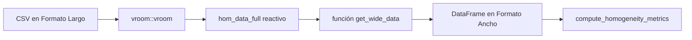
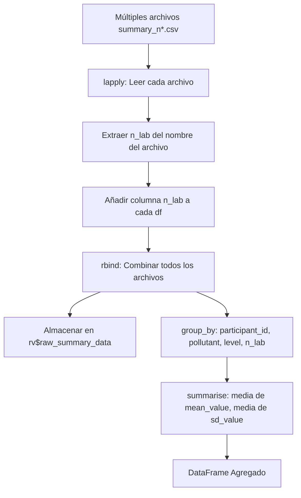
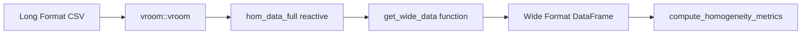
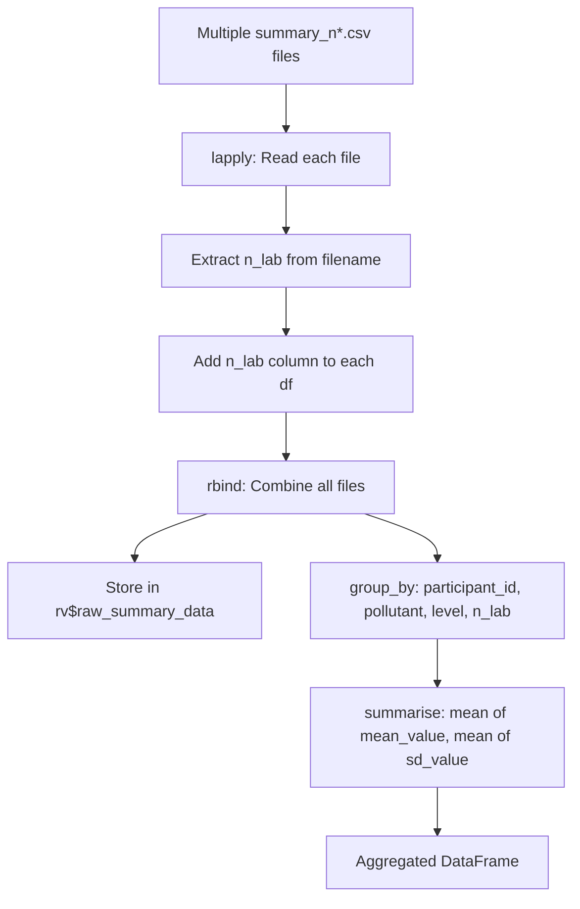

# Referencia de Formatos de Datos y Transformación

Este documento proporciona una especificación completa para todos los formatos de datos aceptados por la aplicación y explica la lógica de transformación interna utilizada para preparar los datos para el análisis estadístico según ISO 13528/17043.

---

## 1. Descripción General

La aplicación utiliza tres tipos principales de archivos CSV para realizar el análisis de los ensayos de aptitud:

1.  **Archivo de homogeneidad** (`homogeneity.csv`) - Se utiliza para probar la uniformidad de la muestra dentro de un lote.
2.  **Archivo de estabilidad** (`stability.csv`) - Se utiliza para probar la consistencia de la muestra a lo largo del tiempo.
3.  **Archivos resumen** (`summary_n*.csv`) - Contienen los resultados de medición agregados de los participantes del PT.

Todos los archivos deben utilizar la **codificación UTF-8** y el formato de **valores separados por comas (CSV)**.

### 1.1 Resumen del Formato de Archivo

| Tipo de Archivo | Formato | Columnas Requeridas | Columnas Opcionales/Contextuales |
|-----------|--------|------------------|------------------|
| Homogeneidad | Largo | `pollutant`, `level`, `value`, `run` | `replicate`, `sample_id`, `date` |
| Estabilidad | Largo | `pollutant`, `level`, `value`, `run` | `replicate`, `sample_id`, `date` |
| Resumen | Agregado | `pollutant`, `level`, `participant_id`, `mean_value`, `sd_value` | `replicate`, `sample_group`, `run` |

---

## 2. Referencia Completa del Esquema CSV

### 2.1 Datos de Homogeneidad y Estabilidad

Se utiliza para `homogeneity.csv` y `stability.csv`. Este formato representa datos en **Formato Largo** donde cada fila es una única medición.

| Columna | Requerida | Tipo | Descripción | Valores de Ejemplo |
|:-------|:--------:|:-----|:------------|:---------------|
| `pollutant` | **Sí** | Cadena | Identificador del analito (sensible a mayúsculas, minúsculas preferiblemente) | `co`, `no`, `so2`, `o3`, `no2` |
| `run` | **Sí** | Cadena | Identificador de la corrida/ronda | `corrida_1`, `corrida_2`, `corrida_3` |
| `level` | **Sí** | Cadena | Nivel de concentración con unidades | `0-umol/mol`, `20-nmol/mol`, `121-nmol/mol` |
| `replicate` | No* | Entero | Número de réplica (típicamente 1 o 2) | `1`, `2` |
| `sample_id` | No | Entero | Identificador del ítem/muestra | `1`, `2`, `3`, ... `10` |
| `value` | **Sí** | Flotante | Valor de concentración medido | `0.00670`, `2.01153`, `-0.04928` |
| `date` | No | Fecha | Fecha de medición (si se registra) | `2023-10-01` |

> **\*Nota sobre `replicate`:** Aunque el validador no impone estrictamente la presencia de la columna `replicate`, es **esencial** para la transformación `pivot_wider` en `get_wide_data()`. Sin ella, la conversión al formato ancho (requerido para ANOVA) fallará o producirá resultados inesperados.

#### Ejemplo de Datos Reales
```csv
"pollutant","run","level","replicate","sample_id","value"
"co","corrida_1","0-μmol/mol",1,1,0.00670
"co","corrida_1","0-μmol/mol",1,2,-0.04796
"so2","corrida_1","20-nmol/mol",1,1,19.70235
"so2","corrida_1","20-nmol/mol",1,2,19.72471
"so2","corrida_2","20-nmol/mol",2,1,19.67882
"so2","corrida_2","20-nmol/mol",2,2,19.67765
"co","corrida_2","2-umol/mol",1,1,2.01154
"co","corrida_2","2-umol/mol",1,2,2.01617
```

---

### 2.2 Datos de Resumen de Participantes

Se utiliza para los archivos `summary_n*.csv`. Contiene resultados agregados de los participantes del PT.

| Columna | Requerida | Tipo | Descripción | Valores de Ejemplo |
|:-------|:--------:|:-----|:------------|:---------------|
| `pollutant` | **Sí** | Cadena | Identificador del analito | `co`, `no`, `so2` |
| `run` | **Sí** | Cadena | Identificador de la corrida/ronda | `corrida_1`, `corrida_2` |
| `level` | **Sí** | Cadena | Nivel de concentración | `0-umol/mol`, `20-nmol/mol` |
| `participant_id` | **Sí** | Cadena | Identificador único del laboratorio | `part_1`, `LAB_01`, `ref` |
| `mean_value` | **Sí** | Flotante | Media reportada por el participante | `2.0121508274` |
| `sd_value` | **Sí** | Flotante | Desviación estándar reportada por el participante | `0.0035971898` |
| `replicate` | No | Entero | Número de réplicas utilizadas por el laboratorio | `2`, `3`, `4` |
| `sample_group` | No | Cadena | Identificador del grupo de muestras | `1-10`, `11-20`, `21-30` |

#### Identificadores Especiales de Participantes

| ID | Significado |
|:---|:---|
| `ref` | **Laboratorio de Referencia**. Se utiliza como el valor asignado ($x_{pt}$) si se selecciona el método del Laboratorio de Referencia. Se excluye automáticamente de algunos cálculos de puntajes de PT pero se incluye en el consenso. |
| `part_N` | Identificador de participante estándar (ej., `part_1`, `part_2`). |

#### Convención de Nombre de Archivo

Los archivos resumen siguen una convención de nomenclatura específica para permitir que la aplicación identifique el esquema/ronda de PT automáticamente:

| Patrón | Regex | Ejemplo | `n_lab` Extraído |
|:---|:---|:---|:---|
| `summary_n[Número].csv` | `\d+` | `summary_n4.csv` | `4` |
| `summary_[Número]_[Sufijo].csv` | `\d+` | `summary_123_final.csv` | `123` |

---

## 3. Especificaciones de Contaminantes y Niveles

### 3.1 Contaminantes Soportados

| Código | Nombre en Inglés | Fórmula Química | Unidades Típicas |
|:---|:---|:---|:---|
| `so2` | Dióxido de azufre | SO₂ | nmol/mol, μmol/mol |
| `co` | Monóxido de carbono | CO | μmol/mol |
| `o3` | Ozono | O₃ | nmol/mol |
| `no` | Óxido nítrico | NO | nmol/mol |
| `no2` | Dióxido de nitrógeno | NO₂ | nmol/mol |

**Crítico:** Utilice únicamente códigos en **minúsculas**. La aplicación es sensible a mayúsculas y minúsculas para el filtrado de contaminantes y la coincidencia de datos.

### 3.2 Formatos de Nivel Típicos

| Contaminante | Formato de Ejemplo | Rangos Típicos |
|:---|:---|:---|
| SO2 | `20-nmol/mol` | 0, 20, 60, 61, 100, 140, 180 |
| CO | `2-umol/mol` | 0, 2, 4, 6, 8 |
| O3 | `120-nmol/mol` | 0, 40, 80, 120, 180 |
| NO | `121-nmol/mol` | 0, 42, 81, 82, 121, 122, 180, 181, 182 |
| NO2 | `90-nmol/mol` | 0, 30, 60, 90, 120 |

---

## 4. Pipeline de Transformación de Datos

La aplicación almacena los datos cargados en **Formato Largo** pero requiere el **Formato Ancho** para los cálculos de homogeneidad y estabilidad basados en ANOVA (ISO 13528).

### 4.1 Flujo de Transformación (Homogeneidad/Estabilidad)



### 4.2 La Función `get_wide_data()`

**Ubicación de la fuente:** `app.R` (líneas 227-238)

Esta función filtra los datos por contaminante y los pivota de formato largo a ancho. La columna `run` se preserva durante la transformación para mantener la trazabilidad de la corrida de medición.

```r
get_wide_data <- function(df, target_pollutant) {
  # Paso 1: Filtrar por contaminante
  filtered <- df %>% filter(pollutant == target_pollutant)
  
  # Paso 2: Retornar NULL si no se encuentran datos
  if (is.null(filtered) || nrow(filtered) == 0) {
    return(NULL)
  }
  
  # Paso 3: Retornar NULL si falta una columna crítica
  if (!"value" %in% names(filtered)) {
    return(NULL)
  }
  
  # Paso 4: Pivotar al Formato Ancho (run se preserva como columna de agrupación)
  filtered %>%
    select(-pollutant) %>%
    pivot_wider(
      names_from = replicate, 
      values_from = value, 
      names_prefix = "sample_"
    )
}
```

#### Ejemplo Paso a Paso

**Datos de Entrada (`df`):**
```r
df <- tribble(
  ~pollutant, ~run,        ~level,           ~replicate, ~value,
  "so2",      "corrida_1", "20-nmol/mol",    1,          19.70,
  "so2",      "corrida_1", "20-nmol/mol",    2,          19.68,
  "so2",      "corrida_2", "20-nmol/mol",    1,          19.72,
  "so2",      "corrida_2", "20-nmol/mol",    2,          19.69,
  "co",       "corrida_1", "2-umol/mol",     1,          2.01
)
```

**Operación:** `get_wide_data(df, "so2")`

**Salida (Formato Ancho):**
| run | level | sample_1 | sample_2 |
|:---|:---|:---|:---|
| corrida_1 | 20-nmol/mol | 19.70 | 19.68 |
| corrida_2 | 20-nmol/mol | 19.72 | 19.69 |

---

### 4.3 Pipeline de Agregación `pt_prep_data()`

Los datos de resumen de los participantes de múltiples archivos se combinan y agregan antes de su uso en los cálculos de puntajes.

#### Flujo de Agregación


#### Código de Implementación
```r
pt_prep_data <- reactive({
  req(input$summary_files)

  # Leer cada archivo y añadir n_lab
  data_list <- lapply(seq_len(nrow(input$summary_files)), function(i) {
    df <- vroom::vroom(input$summary_files$datapath[i], show_col_types = FALSE)
    n <- as.integer(stringr::str_extract(input$summary_files$name[i], "\\d+"))
    df$n_lab <- n
    return(df)
  })

  raw_data <- do.call(rbind, data_list)
  
  # Almacenar datos brutos para otros cálculos
  rv$raw_summary_data <- raw_data

  # Agregar: un valor por participante/contaminante/nivel/n_lab
  raw_data %>%
    group_by(participant_id, pollutant, level, n_lab) %>%
    summarise(
      mean_value = mean(mean_value, na.rm = TRUE),
      sd_value = mean(sd_value, na.rm = TRUE),
      .groups = "drop"
    )
})
```

---

## 5. Script Generador de Datos de Ejemplo

Utilice este script de R para generar datos sintéticos válidos para probar todos los aspectos de la aplicación.

```r
# ============================================================================
# Generador de Datos de Ejemplo para el Aplicativo PT
# ============================================================================
library(tidyverse)

set.seed(42)

# Configuración
n_samples <- 10          # Número de muestras por réplica
n_replicates <- 2       # Número de réplicas
n_participants <- 4     # Total de participantes (incluyendo ref)
n_groups <- 3           # Grupos de muestras para el archivo resumen
n_runs <- 3             # Número de corridas

pollutants <- list(
  so2 = list(levels = c("0-nmol/mol", "20-nmol/mol", "180-nmol/mol"), target = c(0, 20, 180), noise = 0.05),
  co  = list(levels = c("0-umol/mol", "2-umol/mol", "8-umol/mol"),   target = c(0, 2, 8),     noise = 0.005),
  o3  = list(levels = c("0-nmol/mol", "120-nmol/mol", "180-nmol/mol"), target = c(0, 120, 180), noise = 0.06)
)

# 1. Generar Datos de Homogeneidad/Estabilidad (con columna run)
generate_homogeneity <- function(pols) {
  runs <- paste0("corrida_", 1:n_runs)
  map_df(names(pols), ~{
    pol_name <- .x
    p <- pols[[pol_name]]
    expand.grid(
      pollutant = pol_name,
      run = runs,
      level = p$levels, 
      replicate = 1:n_replicates, 
      sample_id = 1:n_samples
    ) %>%
      mutate(value = map_dbl(level, ~{
        target <- p$target[which(p$levels == .x)]
        target + rnorm(1, 0, p$noise * (target + 0.1))
      }))
  })
}

hom_data <- generate_homogeneity(pollutants)
write_csv(hom_data, "homogeneity_test.csv")

# 2. Generar Datos de Resumen de Participantes (con columna run)
generate_summary <- function(pols, n_parts) {
  parts <- c("ref", paste0("part_", 1:(n_parts-1)))
  runs <- paste0("corrida_", 1:n_runs)
  map_df(names(pols), ~{
    pol_name <- .x
    p <- pols[[pol_name]]
    expand.grid(
      pollutant = pol_name,
      run = runs,
      level = p$levels, 
      participant_id = parts, 
      group = 1:n_groups
    ) %>%
      mutate(
        replicate = sample(1:4, n(), replace = TRUE),
        sample_group = case_when(group == 1 ~ "1-10", group == 2 ~ "11-20", TRUE ~ "21-30"),
        mean_value = map_dbl(level, ~{
          target <- p$target[which(p$levels == .x)]
          target + rnorm(1, 0, p$noise * 2 * (target + 0.1))
        }),
        sd_value = p$noise * 0.5 * (target + 0.1) # simplificado
      ) %>%
        select(-group)
  })
}
# Nota: El script anterior es con fines ilustrativos. 
# Ver es/03_estadisticas_robustas_pt.md para el script de producción completo.
```

---

## 6. Lista de Verificación de Validación de Datos

### Archivos de Homogeneidad y Estabilidad
- [ ] **Codificación:** Guardado como CSV UTF-8.
- [ ] **Encabezados:** Las columnas coinciden exactamente con `pollutant`, `run`, `level`, `value`, `replicate`.
- [ ] **Columna Run:** La columna `run` está presente con identificadores de corrida válidos (ej., `corrida_1`, `corrida_2`).
- [ ] **Sensibilidad a Mayúsculas:** Los códigos de contaminantes están en minúsculas (`so2`, no `SO2`).
- [ ] **Formato de Nivel:** Coincide con el patrón `valor-unidad` (ej., `2-umol/mol`).
- [ ] **Tipo de Dato:** La columna `value` es puramente numérica.
- [ ] **Estructura:** Al menos 2 réplicas y 2 muestras por nivel.

### Archivos Resumen de Participantes
- [ ] **Nombre de Archivo:** Contiene un número (ej., `summary_n4.csv`) para identificar el tamaño del esquema.
- [ ] **Columnas Requeridas:** `participant_id`, `pollutant`, `run`, `level`, `mean_value`, `sd_value`.
- [ ] **Columna Run:** La columna `run` está presente para identificar la corrida de medición.
- [ ] **Laboratorio de Referencia:** Contiene al menos una fila con `participant_id == "ref"`.
- [ ] **Seguridad Numérica:** `sd_value` no es negativo.
- [ ] **Consistencia:** Los nombres de contaminante, corrida y nivel coinciden con los de los archivos de homogeneidad.

---

## 7. Problemas Comunes de Formato de Datos

| Problema | Síntoma | Solución |
|:---|:---|:---|
| **Discrepancia en nombres de columna** | Error "must contain columns..." | Utilice nombres exactos en minúsculas. |
| **Falta columna `run`** | Error de validación o datos incompletos | Añada la columna `run` con identificadores de corrida (ej., `corrida_1`). |
| **Falta `replicate`** | El formato ancho tiene una estructura incorrecta | Añada la columna de réplica (1, 2). |
| **Espacios en blanco adicionales** | Los filtros no coinciden con los valores | Recorte los espacios en blanco en CSV/Excel. |
| **Contaminantes con mayúsculas/minúsculas mezcladas** | "No data found for pollutant" | Estandarice a minúsculas. |
| **Sin participante `ref`** | El cálculo de puntajes falla | Añada el laboratorio de referencia con ID `ref`. |
| **`value` no numérico** | Errores de análisis de `vroom` | Elimine entradas de texto/unidades de la columna de valor. |
| **Codificación UTF-8** | Caracteres especiales (μ, ²) corruptos | Vuelva a guardar el archivo con codificación UTF-8. |

---

## 8. Referencias Cruzadas

- **Módulo de Carga de Datos:** [01_carga_datos.md](01_carga_datos.md)
- **Cálculos de Homogeneidad:** [04_homogeneidad_pt.md](04_homogeneidad_pt.md)
- **Guía de Inicio Rápido:** [00_inicio_rapido.md](00_inicio_rapido.md)
- **Glosario de Términos:** [00_glosario.md](00_glosario.md)
- **Archivos de Datos de Ejemplo:** Ubicados en el directorio `data/`

---
---

# Data Formats & Transformation Reference (Original English)

This document provides a complete specification for all data formats accepted by the application and explains the internal transformation logic used to prepare data for ISO 13528/17043 statistical analysis.

---

## 1. Overview

The application uses three primary types of CSV files to conduct proficiency testing analysis:

1.  **Homogeneity file** (`homogeneity.csv`) - Used to test sample uniformity within a batch.
2.  **Stability file** (`stability.csv`) - Used to test sample consistency over time.
3.  **Summary files** (`summary_n*.csv`) - Contains aggregated measurement results from PT participants.

All files must use **UTF-8 encoding** and the **comma-separated values (CSV)** format.

### 1.1 File Format Summary

| File Type | Format | Required Columns | Optional/Contextual Columns |
|-----------|--------|------------------|------------------|
| Homogeneity | Long | `pollutant`, `level`, `value`, `run` | `replicate`, `sample_id`, `date` |
| Stability | Long | `pollutant`, `level`, `value`, `run` | `replicate`, `sample_id`, `date` |
| Summary | Aggregated | `pollutant`, `level`, `participant_id`, `mean_value`, `sd_value` | `replicate`, `sample_group`, `run` |

---

## 2. Complete CSV Schema Reference

### 2.1 Homogeneity & Stability Data

Used for `homogeneity.csv` and `stability.csv`. This format represents **Long Format** data where each row is a single measurement.

| Column | Required | Type | Description | Example Values |
|:-------|:--------:|:-----|:------------|:---------------|
| `pollutant` | **Yes** | String | Analyte identifier (case-sensitive, lowercase) | `co`, `no`, `so2`, `o3`, `no2` |
| `run` | **Yes** | String | Run/corrida identifier | `corrida_1`, `corrida_2`, `corrida_3` |
| `level` | **Yes** | String | Concentration level with units | `0-umol/mol`, `20-nmol/mol`, `121-nmol/mol` |
| `replicate` | No* | Integer | Replicate number (typically 1 or 2) | `1`, `2` |
| `sample_id` | No | Integer | Item/sample identifier | `1`, `2`, `3`, ... `10` |
| `value` | **Yes** | Float | Measured concentration value | `0.00670`, `2.01153`, `-0.04928` |
| `date` | No | Date | Measurement date (if tracked) | `2023-10-01` |

> **\*Note on `replicate`:** While the validator does not strictly enforce the presence of the `replicate` column, it is **essential** for the `pivot_wider` transformation in `get_wide_data()`. Without it, the conversion to wide format (required for ANOVA) will fail or produce unexpected results.

#### Actual Data Example
```csv
"pollutant","run","level","replicate","sample_id","value"
"co","corrida_1","0-μmol/mol",1,1,0.00670
"co","corrida_1","0-μmol/mol",1,2,-0.04796
"so2","corrida_1","20-nmol/mol",1,1,19.70235
"so2","corrida_1","20-nmol/mol",1,2,19.72471
"so2","corrida_2","20-nmol/mol",2,1,19.67882
"so2","corrida_2","20-nmol/mol",2,2,19.67765
"co","corrida_2","2-umol/mol",1,1,2.01154
"co","corrida_2","2-umol/mol",1,2,2.01617
```

---

### 2.2 Participant Summary Data

Used for `summary_n*.csv` files. Contains aggregated results from PT participants.

| Column | Required | Type | Description | Example Values |
|:-------|:--------:|:-----|:------------|:---------------|
| `pollutant` | **Yes** | String | Analyte identifier | `co`, `no`, `so2` |
| `run` | **Yes** | String | Run/corrida identifier | `corrida_1`, `corrida_2` |
| `level` | **Yes** | String | Concentration level | `0-umol/mol`, `20-nmol/mol` |
| `participant_id` | **Yes** | String | Unique laboratory identifier | `part_1`, `LAB_01`, `ref` |
| `mean_value` | **Yes** | Float | Participant's reported mean | `2.0121508274` |
| `sd_value` | **Yes** | Float | Participant's reported standard deviation | `0.0035971898` |
| `replicate` | No | Integer | Number of replicates used by the lab | `2`, `3`, `4` |
| `sample_group` | No | String | Sample grouping identifier | `1-10`, `11-20`, `21-30` |

#### Special Participant IDs

| ID | Meaning |
|:---|:---|
| `ref` | **Reference Laboratory**. Used as the assigned value ($x_{pt}$) if the Reference Lab method is selected. Automatically excluded from some PT score calculations but included in consensus. |
| `part_N` | Standard participant identifier (e.g., `part_1`, `part_2`). |

#### Filename Convention

Summary files follow a specific naming convention to allow the application to identify the PT scheme/round automatically:

| Pattern | Regex | Example | Extracted `n_lab` |
|:---|:---|:---|:---|
| `summary_n[Number].csv` | `\d+` | `summary_n4.csv` | `4` |
| `summary_[Number]_[Suffix].csv` | `\d+` | `summary_123_final.csv` | `123` |

---

## 3. Pollutant & Level Specifications

### 3.1 Supported Pollutants

| Code | English Name | Chemical Formula | Typical Units |
|:---|:---|:---|:---|
| `so2` | Sulfur dioxide | SO₂ | nmol/mol, μmol/mol |
| `co` | Carbon monoxide | CO | μmol/mol |
| `o3` | Ozone | O₃ | nmol/mol |
| `no` | Nitric oxide | NO | nmol/mol |
| `no2` | Nitrogen dioxide | NO₂ | nmol/mol |

**Critical:** Use **lowercase** codes only. The application is case-sensitive for pollutant filtering and data matching.

### 3.2 Typical Level Formats

| Pollutant | Example Format | Typical Ranges |
|:---|:---|:---|
| SO2 | `20-nmol/mol` | 0, 20, 60, 61, 100, 140, 180 |
| CO | `2-umol/mol` | 0, 2, 4, 6, 8 |
| O3 | `120-nmol/mol` | 0, 40, 80, 120, 180 |
| NO | `121-nmol/mol` | 0, 42, 81, 82, 121, 122, 180, 181, 182 |
| NO2 | `90-nmol/mol` | 0, 30, 60, 90, 120 |

---

## 4. Data Transformation Pipeline

The application stores uploaded data in **Long Format** but requires **Wide Format** for ANOVA-based homogeneity and stability calculations (ISO 13528).

### 4.1 Transformation Flow (Homogeneity/Stability)



### 4.2 The `get_wide_data()` Function

**Source Location:** `app.R` (lines 227-238)

This function filters data by pollutant and pivots from long to wide format. The `run` column is preserved during transformation to maintain measurement run traceability.

```r
get_wide_data <- function(df, target_pollutant) {
  # Step 1: Filter by pollutant
  filtered <- df %>% filter(pollutant == target_pollutant)
  
  # Step 2: Return NULL if no data found
  if (is.null(filtered) || nrow(filtered) == 0) {
    return(NULL)
  }
  
  # Step 3: Return NULL if critical column missing
  if (!"value" %in% names(filtered)) {
    return(NULL)
  }
  
  # Step 4: Pivot to Wide Format (run is preserved as grouping column)
  filtered %>%
    select(-pollutant) %>%
    pivot_wider(
      names_from = replicate, 
      values_from = value, 
      names_prefix = "sample_"
    )
}
```

#### Step-by-Step Example

**Input Data (`df`):**
```r
df <- tribble(
  ~pollutant, ~run,        ~level,           ~replicate, ~value,
  "so2",      "corrida_1", "20-nmol/mol",    1,          19.70,
  "so2",      "corrida_1", "20-nmol/mol",    2,          19.68,
  "so2",      "corrida_2", "20-nmol/mol",    1,          19.72,
  "so2",      "corrida_2", "20-nmol/mol",    2,          19.69,
  "co",       "corrida_1", "2-umol/mol",     1,          2.01
)
```

**Operation:** `get_wide_data(df, "so2")`

**Output (Wide Format):**
| run | level | sample_1 | sample_2 |
|:---|:---|:---|:---|
| corrida_1 | 20-nmol/mol | 19.70 | 19.68 |
| corrida_2 | 20-nmol/mol | 19.72 | 19.69 |

---

### 4.3 `pt_prep_data()` Aggregation Pipeline

Participant summary data from multiple files is combined and aggregated before use in score calculations.

#### Aggregation Flow


#### Implementation Code
```r
pt_prep_data <- reactive({
  req(input$summary_files)

  # Read each file and add n_lab
  data_list <- lapply(seq_len(nrow(input$summary_files)), function(i) {
    df <- vroom::vroom(input$summary_files$datapath[i], show_col_types = FALSE)
    n <- as.integer(stringr::str_extract(input$summary_files$name[i], "\\d+"))
    df$n_lab <- n
    return(df)
  })

  raw_data <- do.call(rbind, data_list)
  
  # Store raw data for other calculations
  rv$raw_summary_data <- raw_data

  # Aggregate: one value per participant/pollutant/level/n_lab
  raw_data %>%
    group_by(participant_id, pollutant, level, n_lab) %>%
    summarise(
      mean_value = mean(mean_value, na.rm = TRUE),
      sd_value = mean(sd_value, na.rm = TRUE),
      .groups = "drop"
    )
})
```

---

## 5. Sample Data Generator Script

Use this R script to generate valid synthetic data for testing all aspects of the application.

```r
# ============================================================================
# Sample Data Generator for PT Application
# ============================================================================
library(tidyverse)

set.seed(42)

# Configuration
n_samples <- 10          # Number of samples per replicate
n_replicates <- 2       # Number of replicates
n_participants <- 4     # Total participants (including ref)
n_groups <- 3           # Sample groups for summary file
n_runs <- 3             # Number of runs/corridas

pollutants <- list(
  so2 = list(levels = c("0-nmol/mol", "20-nmol/mol", "180-nmol/mol"), target = c(0, 20, 180), noise = 0.05),
  co  = list(levels = c("0-umol/mol", "2-umol/mol", "8-umol/mol"),   target = c(0, 2, 8),     noise = 0.005),
  o3  = list(levels = c("0-nmol/mol", "120-nmol/mol", "180-nmol/mol"), target = c(0, 120, 180), noise = 0.06)
)

# 1. Generate Homogeneity/Stability Data (with run column)
generate_homogeneity <- function(pols) {
  runs <- paste0("corrida_", 1:n_runs)
  map_df(names(pols), ~{
    pol_name <- .x
    p <- pols[[pol_name]]
    expand.grid(
      pollutant = pol_name,
      run = runs,
      level = p$levels, 
      replicate = 1:n_replicates, 
      sample_id = 1:n_samples
    ) %>%
      mutate(value = map_dbl(level, ~{
        target <- p$target[which(p$levels == .x)]
        target + rnorm(1, 0, p$noise * (target + 0.1))
      }))
  })
}

hom_data <- generate_homogeneity(pollutants)
write_csv(hom_data, "homogeneity_test.csv")

# 2. Generate Participant Summary Data (with run column)
generate_summary <- function(pols, n_parts) {
  parts <- c("ref", paste0("part_", 1:(n_parts-1)))
  runs <- paste0("corrida_", 1:n_runs)
  map_df(names(pols), ~{
    pol_name <- .x
    p <- pols[[pol_name]]
    expand.grid(
      pollutant = pol_name,
      run = runs,
      level = p$levels, 
      participant_id = parts, 
      group = 1:n_groups
    ) %>%
      mutate(
        replicate = sample(1:4, n(), replace = TRUE),
        sample_group = case_when(group == 1 ~ "1-10", group == 2 ~ "11-20", TRUE ~ "21-30"),
        mean_value = map_dbl(level, ~{
          target <- p$target[which(p$levels == .x)]
          target + rnorm(1, 0, p$noise * 2 * (target + 0.1))
        }),
        sd_value = p$noise * 0.5 * (target + 0.1) # simplified
      ) %>%
      select(-group)
  })
}
# Note: Above script is for illustrative purposes. 
# See documentation/03_pt_robust_stats.md for full production script.
```

---

## 6. Data Validation Checklist

### Homogeneity & Stability Files
- [ ] **Encoding:** Saved as UTF-8 CSV.
- [ ] **Headers:** Columns exactly match `pollutant`, `run`, `level`, `value`, `replicate`.
- [ ] **Run Column:** The `run` column is present with valid run identifiers (e.g., `corrida_1`, `corrida_2`).
- [ ] **Case Sensitivity:** Pollutant codes are lowercase (`so2`, not `SO2`).
- [ ] **Level Format:** Matches `value-unit` pattern (e.g., `2-umol/mol`).
- [ ] **Data Type:** `value` column is purely numeric.
- [ ] **Structure:** At least 2 replicates and 2 samples per level.

### Participant Summary Files
- [ ] **Filename:** Contains a number (e.g., `summary_n4.csv`) to identify scheme size.
- [ ] **Required Columns:** `participant_id`, `pollutant`, `run`, `level`, `mean_value`, `sd_value`.
- [ ] **Run Column:** The `run` column is present to identify the measurement run.
- [ ] **Reference Lab:** Contains at least one row with `participant_id == "ref"`.
- [ ] **Numeric Safety:** `sd_value` is non-negative.
- [ ] **Consistency:** Pollutant, run, and level names match those in homogeneity files.

---

## 7. Common Data Format Issues

| Issue | Symptom | Fix |
|:---|:---|:---|
| **Column name mismatch** | "must contain columns..." error | Use exact lowercase names. |
| **Missing `run` column** | Validation error or incomplete data | Add the `run` column with run identifiers (e.g., `corrida_1`). |
| **Missing `replicate`** | Wide format has wrong structure | Add replicate column (1, 2). |
| **Extra whitespace** | Filters don't match values | Trim whitespace in CSV/Excel. |
| **Mixed case pollutants** | "No data found for pollutant" | Standardize to lowercase. |
| **No `ref` participant** | Score calculation fails | Add reference lab with ID `ref`. |
| **Non-numeric `value`** | `vroom` parsing errors | Remove text entries/units from value column. |
| **UTF-8 encoding** | Special characters (μ, ²) corrupted | Re-save file with UTF-8 encoding. |

---

## 8. Cross-References

- **Data Loading Module:** [01_carga_datos.md](01_carga_datos.md)
- **Homogeneity Calculations:** [04_homogeneidad_pt.md](04_homogeneidad_pt.md)
- **Quick Start Guide:** [00_inicio_rapido.md](00_inicio_rapido.md)
- **Glossary of Terms:** [00_glosario.md](00_glosario.md)
- **Example Data Files:** Located in `data/` directory
