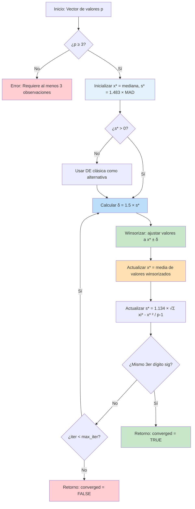
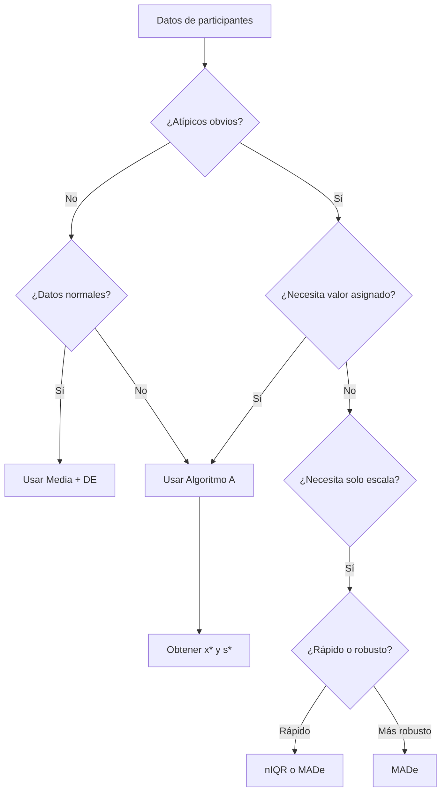

# Métodos Estadísticos Robustos (ISO 13528)

## 1. Descripción General

Este módulo (`pt_robust_stats.R`) implementa estimadores estadísticos robustos utilizados para calcular valores asignados ($x_{pt}$) y desviaciones estándar ($\sigma_{pt}$) resistentes a valores atípicos, siguiendo los métodos descritos en la norma **ISO 13528:2022**.

Las estadísticas robustas proporcionan estimaciones de ubicación (media) y escala (desviación estándar) que son resistentes a los valores atípicos y a las distribuciones no normales. Estos métodos son fundamentales para el análisis de los ensayos de aptitud, asegurando que los valores extremos no distorsionen la evaluación del desempeño del grupo.

### Ubicación en el Código
| Elemento | Valor |
|----------|-------|
| Archivo | `ptcalc/R/pt_robust_stats.R` |
| Líneas | 1 - 247 |

---

## 2. Estimadores Robustos Clave

Este módulo implementa tres estimadores robustos clave utilizados en diferentes etapas del análisis de PT:

1.  **MADe** (Desviación Absoluta Mediana Escalada): El estimador de escala simple más robusto.
2.  **nIQR** (Rango Intercuartílico Normalizado): Una escala robusta alternativa basada en cuartiles.
3.  **Algoritmo A** (Media/DE robusta ISO 13528): El método iterativo principal para calcular valores de consenso.

---

## 3. Algoritmo A (ISO 13528 Anexo C)

El Algoritmo A es un procedimiento iterativo utilizado para calcular una media robusta ($x^*$) y una desviación estándar robusta ($s^*$). Es el método principal utilizado en esta aplicación cuando se selecciona la opción "Consenso (Algoritmo A)".

### 3.1 Flujo Visual del Algoritmo



### 3.2 Procedimiento Paso a Paso

1.  **Inicialización**:
    - Eliminar valores no finitos (`NA`, `Inf`, `-Inf`).
    - Verificar que $p \ge 3$.
    - Establecer estimaciones iniciales: $x^* = \text{mediana}(x)$ y $s^* = 1.483 \times \text{MAD}(x)$.
    - Si $s^* \approx 0$, utilizar la desviación estándar (DE) clásica como alternativa (NOTA 2 de la ISO).
2.  **Calcular el Límite de Winsorización ($\delta$)**:
    $$\delta = 1.5 \times s^*$$
3.  **Winsorizar los Valores**:
    $$x_i^* = \begin{cases} x^* - \delta & \text{si } x_i < x^* - \delta \\ x^* + \delta & \text{si } x_i > x^* + \delta \\ x_i & \text{de lo contrario} \end{cases}$$
4.  **Actualizar Estimaciones**:
    $$x^*_{nuevo} = \frac{1}{p} \sum_{i=1}^{p} x_i^*$$
    $$s^*_{nuevo} = 1.134 \times \sqrt{\frac{\sum_{i=1}^{p} (x_i^* - x^*_{nuevo})^2}{p-1}}$$
5.  **Verificar Convergencia**:
    Se considera convergido si $x^*$ y $s^*$ no muestran cambios en la tercera cifra significativa. Si no ha convergido, repetir desde el paso 2 hasta llegar a `max_iter`.

---

## 4. Ejemplos Numéricos

### 4.1 Ejemplo 1: Conjunto de Datos PT Estándar con un Valor Atípico
**Datos:** `[10.1, 10.2, 9.9, 10.0, 10.3, 50.0]`

#### Iteración 0: Inicialización
- Mediana: 10.05
- MAD: 0.15
- $s^*$ inicial: $1.483 \times 0.15 = 0.222$
- $\delta = 1.5 \times 0.222 = 0.333$

#### Iteración 1: Winsorización
| Participante | Original | Límite Inferior | Límite Superior | Winsorizado |
|-------------|----------|-------------|-------------|------------|
| 1 | 10.1 | 9.717 | 10.383 | 10.1 |
| 2 | 10.2 | 9.717 | 10.383 | 10.2 |
| 3 | 9.9 | 9.717 | 10.383 | 9.9 |
| 4 | 10.0 | 9.717 | 10.383 | 10.0 |
| 5 | 10.3 | 9.717 | 10.383 | 10.3 |
| 6 | **50.0** | 9.717 | 10.383 | **10.383** |

- **Actualización**: $x^*_{new} = 10.147$, $s^*_{new} = 1.134 \times 0.176 = 0.200$.
- **Convergencia**: La 3ra cifra significativa cambió. Continúa.

#### Resultado Final (tras convergencia)
- **Media robusta (x*)**: 10.19
- **DE robusta (s*)**: 0.29
- El valor atípico (50.0) fue winsorizado a ~10.62

### 4.2 Ejemplo 2: Conjunto de Datos Pequeño con Gran Valor Atípico
**Datos:** `[10.1, 10.2, 10.3, 10.2, 25.0]`
- Mediana Inicial: 10.2
- $s^*$ Inicial: 0.1483, $\delta = 0.222$
- El valor atípico (25.0) se winsoriza a ~10.42 en la primera iteración
- Resultado: Converge rápidamente a x* ≈ 10.2, s* ≈ 0.15

### 4.3 Comparación con Estadísticas Clásicas
| Estimador | Valor Ejemplo 1 | Interpretación |
|-----------|--------|----------------|
| **Media aritmética** | 16.75 | **Sesgada hacia arriba** por el valor atípico |
| **Mediana** | 10.05 | Buena estimación de ubicación |
| **Media robusta (x*)** | 10.19 | Mejor estimación de ubicación (ISO 13528) |
| **DE clásica** | 16.23 | **Inflada** por el valor atípico |
| **MADe** | 0.222 | Buena estimación de escala |
| **nIQR** | 0.185 | Estimación de escala alternativa |
| **DE robusta (s*)** | 0.29 | Mejor estimación de escala (ISO 13528) |

---

## 5. Comportamiento de Convergencia

### 5.1 Patrones Típicos
El Algoritmo A típicamente converge en 3-8 iteraciones dependiendo de:
1. **Proporción de valores atípicos**: Más valores atípicos = más iteraciones.
2. **Magnitud de los valores atípicos**: Los valores atípicos extremos se ajustan agresivamente, acelerando la convergencia.
3. **Dispersión inicial**: Datos más dispersos = más iteraciones.

#### Ejemplo de Gráfico de Convergencia
```mermaid
xychart-beta
    title "Ejemplo de Convergencia del Algoritmo A"
    x-axis "Iteración" [1, 2, 3, 4, 5]
    y-axis "Estimación" [9.5, 10.5]
    line [10.05, 10.10, 10.10, 10.10, 10.10]
```

| % Valores Atípicos | Iteraciones Promedio |
|-------------|-------------------|
| 0% | 2-3 |
| 10% | 4-5 |
| 20% | 5-7 |
| 40% | 8-12 |

### 5.2 Efecto del Límite de Winsorización
El factor 1.5 en $\delta = 1.5 \times s^*$ controla la sensibilidad:
- **1.0**: Límites más estrictos, ajuste más agresivo, menor eficiencia con datos normales.
- **1.5**: Valor estándar de la ISO 13528; robustez y eficiencia equilibradas.
- **2.0**: Límites más amplios, más tolerante con valores atípicos moderados.

---

## 6. Casos Límite

| Escenario | Comportamiento |
|:---|:---|
| **< 3 Participantes** | Devuelve `NA`. El Algoritmo A requiere al menos 3 observaciones válidas para ser estadísticamente significativo. |
| **Dispersión Cero** | Si todos los valores son idénticos, $s^* = 0$. El algoritmo utiliza la DE clásica como alternativa. Si esta también es 0, devuelve 0. |
| **Valores No Finitos** | `NA`, `Inf`, `-Inf` se filtran automáticamente antes del cálculo. |
| **Alta Proporción de Atípicos** | El punto de ruptura es del ~50%. Si más del 50% de los datos son valores atípicos, los "atípicos" se convierten en el consenso. |

---

## 7. Comparación de Estimadores de Escala

| Característica | MADe | nIQR | Algoritmo A |
|----------------|-------|-------|-------------|
| **Fórmula** | $1.483 \times \text{median}(\|x_i - \tilde{x}\|)$ | $0.7413 \times (Q_3 - Q_1)$ | Winsorización Iterativa |
| **Punto de Ruptura** | 50% | 25% | ~50% |
| **Eficiencia (normal)** | 37% | 37% | ~95% |
| **Iterativo** | No | No | Sí |
| **Mejor Uso** | Inicialización; solo escala | Distribuciones asimétricas | **Valor de consenso principal** |

---

## 8. Cuándo usar cada estimador



---

## 9. Ejemplos de Implementación (R)

### Uso Básico
```r
valores <- c(10.1, 10.2, 9.9, 10.0, 10.3, 50.0)

# Estimadores de escala robustos
made <- calculate_mad_e(valores)  # 0.222
niqr <- calculate_niqr(valores)   # 0.185

# Algoritmo A
resultado <- run_algorithm_a(valores)
resultado$assigned_value  # 10.10
resultado$robust_sd       # 0.14
```

### Inspección de Valores Winsorizados e Historial
```r
# Valores winsorizados por participante
resultado$winsorized_values
#   id original winsorized
# 1  1     10.1      10.10
# 6  6     50.0      10.62

# Historial de convergencia
resultado$iterations
#   iteration  x_star   s_star
# 1         1   10.15     0.20
# 2         2   10.19     0.29
```

---

## 10. Derivaciones Matemáticas

- **Constante MADe (1.483)**: Derivada de $1/\Phi^{-1}(0.75)$ para asegurar la consistencia con la DE bajo normalidad.
- **Constante nIQR (0.7413)**: Derivada de $1/(\Phi^{-1}(0.75) - \Phi^{-1}(0.25))$ para coincidir con la DE para datos normales.

---

## Referencias
- **ISO 13528:2022** Sección 9.4 y Anexo C.
- Huber, P.J. (1981). *Robust Statistics*. Wiley.

## Referencias Cruzadas
- [04_homogeneidad_pt.md](04_homogeneidad_pt.md) - Utiliza estadísticas robustas para métricas de calidad.
- [07_valor_asignado.md](07_valor_asignado.md) - Detalles sobre la asignación del valor de consenso.
